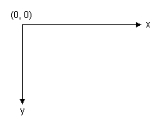
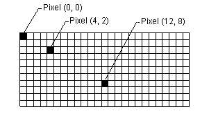

# Overview of Vector Graphics

Windows GDI+ draws lines, rectangles, and other figures on a coordinate system. You can choose from a variety of coordinate systems, but the default coordinate system has the origin in the upper left corner with the x-axis pointing to the right and the y-axis pointing down. The unit of measure in the default coordinate system is the pixel.



A computer monitor creates its display on a rectangular array of dots called picture elements or pixels. The number of pixels appearing on the screen varies from one monitor to the next, and the number of pixels appearing on an individual monitor can usually be configured to some extent by the user.



When you use GDI+ to draw a line, rectangle, or curve, you provide certain key information about the item to be drawn. For example, you can specify a line by providing two points, and you can specify a rectangle by providing a point, a height, and a width. GDI+ works in conjunction with the display driver software to determine which pixels must be turned on to show the line, rectangle, or curve. The following illustration shows the pixels that are turned on to display a line from the point (4, 2) to the point (12, 8).


Over time, certain basic building blocks have proven to be the most useful for creating two-dimensional pictures. These building blocks, which are all supported by GDI+, are given in the following list:

-   Lines
-   Rectangles
-   Ellipses
-   Arcs
-   Polygons
-   Cardinal splines
-   Bézier splines

The [**Graphics**](-gdiplus-class-graphics-class.md) class in GDI+ provides the following methods for drawing the items in the previous list: [DrawLine](-gdiplus-class-graphics-drawline-methods.md), [DrawRectangle](-gdiplus-class-graphics-drawrectangle-methods.md), [DrawEllipse](-gdiplus-class-graphics-drawellipse-methods.md), [DrawPolygon](-gdiplus-class-graphics-drawpolygon-methods.md), [DrawArc](-gdiplus-class-graphics-drawarc-methods.md), [DrawCurve](-gdiplus-class-graphics-drawcurve-methods.md) (for cardinal splines), and [DrawBezier](-gdiplus-class-graphics-drawbezier-methods.md). Each of these methods is overloaded; that is, each method comes in several variations with different parameter lists. For example, one variation of the DrawLine method receives the address of a [**Pen**](-gdiplus-class-pen-class.md) object and four integers, while another variation of the DrawLine method receives the address of a **Pen** object and two [**Point**](-gdiplus-class-point-class.md) object references.

The methods for drawing lines, rectangles, and Bézier splines have plural companion methods that draw several items in a single call: [DrawLines](-gdiplus-class-graphics-drawlines-methods.md), [DrawRectangles](-gdiplus-class-graphics-drawrectangles-methods.md), and [DrawBeziers](-gdiplus-class-graphics-drawbeziers-methods.md). Also, the [DrawCurve](-gdiplus-class-graphics-drawcurve-methods.md) method has a companion method, [DrawClosedCurve](-gdiplus-class-graphics-drawclosedcurve-methods.md), that closes a curve by connecting the ending point of the curve to the starting point.

All the drawing methods of the [**Graphics**](-gdiplus-class-graphics-class.md) class work in conjunction with a [**Pen**](-gdiplus-class-pen-class.md) object. Thus, in order to draw anything, you must create at least two objects: a **Graphics** object and a **Pen** object. The **Pen** object stores attributes of the item to be drawn, such as line width and color. The address of the **Pen** object is passed as one of the arguments to the drawing method. For example, one variation of the [DrawRectangle](-gdiplus-class-graphics-drawrectangle-methods.md) method receives the address of a **Pen** object and four integers as shown in the following code, which draws a rectangle with a width of 100, a height of 50 and an upper-left corner of (20, 10).


```
myGraphics.DrawRectangle(&amp;myPen, 20, 10, 100, 50);
```


 

 


