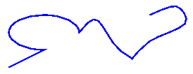

# Paths (GDI+)

Paths are formed by combining lines, rectangles, and simple curves. Recall from the [Overview of Vector Graphics](-gdiplus-overview-of-vector-graphics-about.md) that the following basic building blocks have proven to be the most useful for drawing pictures.

-   Lines
-   Rectangles
-   Ellipses
-   Arcs
-   Polygons
-   Cardinal splines
-   Bézier splines

In Windows GDI+, the [**GraphicsPath**](/windows/win32/api/gdipluspath/nl-gdipluspath-graphicspath) object allows you to collect a sequence of these building blocks into a single unit. The entire sequence of lines, rectangles, polygons, and curves can then be drawn with one call to the [**Graphics::DrawPath**](/windows/win32/api/Gdiplusgraphics/nf-gdiplusgraphics-graphics-drawpath) method of the [**Graphics**](/windows/win32/api/gdiplusgraphics/nl-gdiplusgraphics-graphics) class. The following illustration shows a path created by combining a line, an arc, a Bézier spline, and a cardinal spline.



The [**GraphicsPath**](/windows/win32/api/gdipluspath/nl-gdipluspath-graphicspath) class provides the following methods for creating a sequence of items to be drawn: [AddLine](/windows/win32/api/gdipluspath/nf-gdipluspath-graphicspath-addline(inint_inint_inint_inint)), [AddRectangle](/windows/win32/api/gdipluspath/nf-gdipluspath-graphicspath-addrectangle(inconstrectf_)), [AddEllipse](/windows/win32/api/gdipluspath/nf-gdipluspath-graphicspath-addellipse(inint_inint_inint_inint)), [AddArc](/windows/win32/api/gdipluspath/nf-gdipluspath-graphicspath-addarc(inint_inint_inint_inint_inreal_inreal)), [AddPolygon](/windows/win32/api/gdipluspath/nf-gdipluspath-graphicspath-addpolygon(inconstpointf_inint)), [AddCurve](/windows/win32/api/gdipluspath/nf-gdipluspath-graphicspath-addcurve(inconstpoint_inint)) (for cardinal splines), and [AddBezier](/windows/win32/api/gdipluspath/nf-gdipluspath-graphicspath-addbezier(inint_inint_inint_inint_inint_inint_inint_inint)). Each of these methods is overloaded; that is, each method comes in several variations with different parameter lists. For example, one variation of the AddLine method receives four integers, and another variation of the AddLine method receives two [**Point**](/windows/win32/api/gdiplustypes/nl-gdiplustypes-point) objects.

The methods for adding lines, rectangles, and Bézier splines to a path have plural companion methods that add several items to the path in a single call: [AddLines](/windows/win32/api/gdipluspath/nf-gdipluspath-graphicspath-addlines(inconstpoint_inint)), [AddRectangles](/windows/win32/api/gdipluspath/nf-gdipluspath-graphicspath-addrectangles(inconstrectf_inint)), and [AddBeziers](/windows/win32/api/gdipluspath/nf-gdipluspath-graphicspath-addbeziers(inconstpointf_inint)). Also, the [AddCurve](/windows/win32/api/gdipluspath/nf-gdipluspath-graphicspath-addcurve(inconstpoint_inint)) method has a companion method, [AddClosedCurve](/windows/win32/api/gdipluspath/nf-gdipluspath-graphicspath-addclosedcurve(inconstpointf_inint)), that adds a closed curve to the path.

To draw a path, you need a [**Graphics**](/windows/win32/api/gdiplusgraphics/nl-gdiplusgraphics-graphics) object, a [**Pen**](/windows/win32/api/gdipluspen/nl-gdipluspen-pen) object, and a [**GraphicsPath**](/windows/win32/api/gdipluspath/nl-gdipluspath-graphicspath) object. The **Graphics** object provides the [**Graphics::DrawPath**](/windows/win32/api/Gdiplusgraphics/nf-gdiplusgraphics-graphics-drawpath) method, and the **Pen** object stores attributes of the path, such as line width and color. The **GraphicsPath** object stores the sequence of lines, rectangles, and curves that make up the path. The addresses of the **Pen** object and the **GraphicsPath** object are passed as arguments to the **Graphics::DrawPath** method. The following example draws a path that consists of a line, an ellipse, and a Bézier spline.


```
myGraphicsPath.AddLine(0, 0, 30, 20);
myGraphicsPath.AddEllipse(20, 20, 20, 40);
myGraphicsPath.AddBezier(30, 60, 70, 60, 50, 30, 100, 10);
myGraphics.DrawPath(&myPen, &myGraphicsPath);
```


The following illustration shows the path.


In addition to adding lines, rectangles, and curves to a path, you can add paths to a path. This allows you to combine existing paths to form large, complex paths. The following code adds **graphicsPath1** and **graphicsPath2** to **myGraphicsPath**. The second parameter of the [**GraphicsPath::AddPath**](/windows/win32/api/Gdipluspath/nf-gdipluspath-graphicspath-addpath) method specifies whether the added path is connected to the existing path.


```
myGraphicsPath.AddPath(&graphicsPath1, FALSE);
myGraphicsPath.AddPath(&graphicsPath2, TRUE);
```


There are two other items you can add to a path: strings and pies. A pie is a portion of the interior of an ellipse. The following example creates a path from an arc, a cardinal spline, a string, and a pie.


```
myGraphicsPath.AddArc(0, 0, 30, 20, -90, 180);
myGraphicsPath.AddCurve(myPointArray, 3);
myGraphicsPath.AddString(L"a string in a path", 18, &myFontFamily, 
   0, 24, myPointF, &myStringFormat);
myGraphicsPath.AddPie(230, 10, 40, 40, 40, 110);
myGraphics.DrawPath(&myPen, &myGraphicsPath);
```


The following illustration shows the path. Note that a path does not have to be connected; the arc, cardinal spline, string, and pie are separated.


 

 


