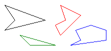
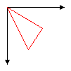

# Polygons

A polygon is a closed figure with three or more straight sides. For example, a triangle is a polygon with three sides, a rectangle is a polygon with four sides, and a pentagon is a polygon with five sides. The following illustration shows several polygons.



To draw a polygon, you need a [**Graphics**](/windows/win32/gdiplusgraphics/nl-gdiplusgraphics-graphics?branch=master) object, a [**Pen**](/windows/win32/gdipluspen/nl-gdipluspen-pen?branch=master) object, and an array of [**Point**](/windows/win32/gdiplustypes/nl-gdiplustypes-point?branch=master) (or [**PointF**](/windows/win32/gdiplustypes/nl-gdiplustypes-pointf?branch=master)) objects. The **Graphics** object provides the [DrawPolygon](/windows/win32/gdiplusgraphics/nf-gdiplusgraphics-graphics-drawpolygon(in const pen,in const point,in int)?branch=master) method. The **Pen** object stores attributes of the polygon, such as line width and color, and the array of **Point** objects stores the points to be connected by straight lines. The addresses of the **Pen** object and the array of **Point** objects are passed as arguments to the DrawPolygon method. The following example draws a three-sided polygon. Note that there are only three points in **myPointArray**: (0, 0), (50, 30), and (30, 60). The DrawPolygon method automatically closes the polygon by drawing a line from (30, 60) back to the starting point (0, 0);


```
Point myPointArray[] =
   {Point(0, 0), Point(50, 30), Point(30, 60)};
myGraphics.DrawPolygon(&amp;myPen, myPointArray, 3);
```


The following illustration shows the polygon.



 

 


