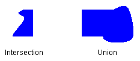
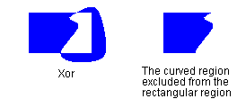

# Regions (GDI+)

A region is a portion of the display surface. Regions can be simple (a single rectangle) or complex (a combination of polygons and closed curves). The following illustration shows two regions: one constructed from a rectangle, and the other constructed from a path.


Regions are often used for clipping and hit testing. Clipping involves restricting drawing to a certain region of the screen, usually the portion of the screen that needs to be updated. Hit testing involves checking to see whether the cursor is in a certain region of the screen when a mouse button is pressed.

You can construct a region from a rectangle or from a path. You can also create complex regions by combining existing regions. The [**Region**](/windows/win32/api/gdiplusheaders/nl-gdiplusheaders-region) class provides the following methods for combining regions: [Intersect](/windows/win32/api/gdiplusheaders/nf-gdiplusheaders-region-intersect(inconstregion)), [Union](/windows/win32/api/gdiplusheaders/nf-gdiplusheaders-region-union(inconstregion)), [Xor](/windows/win32/api/gdiplusheaders/nf-gdiplusheaders-region-xor(inconstrect_)), [Exclude](/windows/win32/api/gdiplusheaders/nf-gdiplusheaders-region-exclude(inconstregion)), and [**Region::Complement**](/windows/win32/api/gdiplusheaders/nf-gdiplusheaders-region-complement(inconstgraphicspath)).

The intersection of two regions is the set of all points belonging to both regions. The union is the set of all points belonging to one or the other or both regions. The complement of a region is the set of all points that are not in the region. The following illustration shows the intersection and union of the two regions in the previous figure.



The [Xor](/windows/win32/api/gdiplusheaders/nf-gdiplusheaders-region-xor(inconstrect_)) method, applied to a pair of regions, produces a region that contains all points that belong to one region or the other, but not both. The [Exclude](/windows/win32/api/gdiplusheaders/nf-gdiplusheaders-region-exclude(inconstregion)) method, applied to a pair of regions, produces a region that contains all points in the first region that are not in the second region. The following illustration shows the regions that result from applying the Xor and Exclude methods to the two regions shown at the beginning of this topic.



To fill a region, you need a [**Graphics**](/windows/win32/api/gdiplusgraphics/nl-gdiplusgraphics-graphics) object, a [**Brush**](/windows/win32/api/gdiplusbrush/nl-gdiplusbrush-brush) object, and a [**Region**](/windows/win32/api/gdiplusheaders/nl-gdiplusheaders-region) object. The **Graphics** object provides the [**Graphics::FillRegion**](/windows/win32/api/Gdiplusgraphics/nf-gdiplusgraphics-graphics-fillregion) method, and the **Brush** object stores attributes of the fill, such as color or pattern. The following example fills a region with a solid color.


```
myGraphics.FillRegion(&mySolidBrush, &myRegion);
```


 

 
