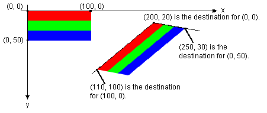
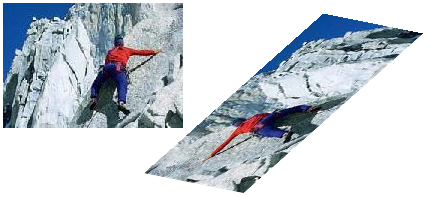
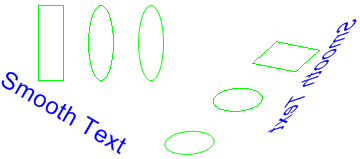

# Rotating, Reflecting, and Skewing Images

You can rotate, reflect, and skew an image by specifying destination points for the upper-left, upper-right, and lower-left corners of the original image. The three destination points determine an affine transformation that maps the original rectangular image to a parallelogram. (The lower-right corner of the original image is mapped to the fourth corner of the parallelogram, which is calculated from the three specified destination points.)

For example, suppose the original image is a rectangle with upper-left corner at (0, 0), upper-right corner at (100, 0), and lower-left corner at (0, 50). Now suppose we map those three points to destination points as follows.


| Original point       | Destination point |
|----------------------|-------------------|
| Upper-left (0, 0)    | (200, 20)         |
| Upper-right (100, 0) | (110, 100)        |
| Lower-left (0, 50)   | (250, 30)         |


 

The following illustration shows the original image and the image mapped to the parallelogram. The original image has been skewed, reflected, rotated, and translated. The x-axis along the top edge of the original image is mapped to the line that runs through (200, 20) and (110, 100). The y-axis along the left edge of the original image is mapped to the line that runs through (200, 20) and (250, 30).



The following example produces the images shown in the preceding illustration.


```
Point destinationPoints[] = {
   Point(200, 20),   // destination for upper-left point of original
   Point(110, 100),  // destination for upper-right point of original
   Point(250, 30)};  // destination for lower-left point of original
Image image(L"Stripes.bmp");
// Draw the image unaltered with its upper-left corner at (0, 0).
graphics.DrawImage(&image, 0, 0);
// Draw the image mapped to the parallelogram.
graphics.DrawImage(&image, destinationPoints, 3); 
```


The following illustration shows a similar transformation applied to a photographic image.



The following illustration shows a similar transformation applied to a metafile.



 

 


