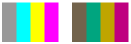

# Scaling Colors

A scaling transformation multiplies one or more of the four color components by a number. The color matrix entries that represent scaling are given in the following table.


| Component to be scaled | Matrix entry |
|------------------------|--------------|
| Red                    | \[0\]\[0\]   |
| Green                  | \[1\]\[1\]   |
| Blue                   | \[2\]\[2\]   |
| Alpha                  | \[3\]\[3\]   |


 

The following example constructs an [**Image**](/windows/desktop/api/gdiplusheaders/nl-gdiplusheaders-image) object from the file ColorBars2.bmp. Then the code scales the blue component of each pixel in the image by a factor of 2. The original image is drawn alongside the transformed image.


```
Image            image(L"ColorBars2.bmp");
ImageAttributes  imageAttributes;
UINT             width = image.GetWidth();
UINT             height = image.GetHeight();

ColorMatrix colorMatrix = {
   1.0f, 0.0f, 0.0f, 0.0f, 0.0f,
   0.0f, 1.0f, 0.0f, 0.0f, 0.0f,
   0.0f, 0.0f, 2.0f, 0.0f, 0.0f,
   0.0f, 0.0f, 0.0f, 1.0f, 0.0f,
   0.0f, 0.0f, 0.0f, 0.0f, 1.0f};
   
imageAttributes.SetColorMatrix(
   &colorMatrix, 
   ColorMatrixFlagsDefault,
   ColorAdjustTypeBitmap);
   
graphics.DrawImage(&image, 10, 10, width, height);

graphics.DrawImage(
   &image, 
   Rect(150, 10, width, height),  // destination rectangle 
   0, 0,        // upper-left corner of source rectangle 
   width,       // width of source rectangle
   height,      // height of source rectangle
   UnitPixel,
   &imageAttributes);
```


The following illustration shows the original image on the left and the scaled image on the right.


The following table shows the color vectors for the four bars before and after the blue scaling. Note that the blue component in the fourth color bar went from 0.8 to 0.6. That is because GDI+ retains only the fractional part of the result. For example, (2)(0.8) = 1.6, and the fractional part of 1.6 is 0.6. Retaining only the fractional part ensures that the result is always in the interval \[0, 1\].


| Original           | Scaled             |
|--------------------|--------------------|
| (0.4, 0.4, 0.4, 1) | (0.4, 0.4, 0.8, 1) |
| (0.4, 0.2, 0.2, 1) | (0.4, 0.2, 0.4, 1) |
| (0.2, 0.4, 0.2, 1) | (0.2, 0.4, 0.4, 1) |
| (0.4, 0.4, 0.8, 1) | (0.4, 0.4, 0.6, 1) |


 

The following example constructs an [**Image**](/windows/desktop/api/gdiplusheaders/nl-gdiplusheaders-image) object from the file ColorBars2.bmp. Then the code scales the red, green, and blue components of each pixel in the image. The red components are scaled down 25 percent, the green components are scaled down 35 percent, and the blue components are scaled down 50 percent.


```
Image            image(L"ColorBars.bmp");
ImageAttributes  imageAttributes;
UINT             width = image.GetWidth();
UINT             height = image.GetHeight();

ColorMatrix colorMatrix = {
   0.75f, 0.0f,  0.0f, 0.0f, 0.0f,
   0.0f,  0.65f, 0.0f, 0.0f, 0.0f,
   0.0f,  0.0f,  0.5f, 0.0f, 0.0f,
   0.0f,  0.0f,  0.0f, 1.0f, 0.0f,
   0.0f,  0.0f,  0.0f, 0.0f, 1.0f};
   
imageAttributes.SetColorMatrix(
   &colorMatrix, 
   ColorMatrixFlagsDefault,
   ColorAdjustTypeBitmap);
   
graphics.DrawImage(&image, 10, 10, width, height);

graphics.DrawImage(
   &image, 
   Rect(150, 10, width, height),  // destination rectangle 
   0, 0,        // upper-left corner of source rectangle 
   width,       // width of source rectangle
   height,      // height of source rectangle
   UnitPixel,
   &imageAttributes);
```


The following illustration shows the original image on the left and the scaled image on the right.



The following table shows the color vectors for the four bars before and after the red, green and blue scaling.


| Original           | Scaled               |
|--------------------|----------------------|
| (0.6, 0.6, 0.6, 1) | (0.45, 0.39, 0.3, 1) |
| (0, 1, 1, 1)       | (0, 0.65, 0.5, 1)    |
| (1, 1, 0, 1)       | (0.75, 0.65, 0, 1)   |
| (1, 0, 1, 1)       | (0.75, 0, 0.5, 1)    |


 

 

 


