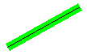
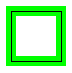
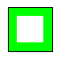

# Setting Pen Width and Alignment

When you create a [**Pen**](/windows/desktop/api/gdipluspen/nl-gdipluspen-pen) object, you can supply the pen width as one of the arguments to the constructor. You can also change the pen width by using the [**Pen::SetWidth**](/windows/desktop/api/Gdipluspen/nf-gdipluspen-pen-setwidth) method.

A theoretical line has a width of zero. When you draw a line, the pixels are centered on the theoretical line. The following example draws a specified line twice: once with a black pen of width 1 and once with a green pen of width 10.


```
Pen blackPen(Color(255, 0, 0, 0), 1);
Pen greenPen(Color(255, 0, 255, 0), 10);
stat = greenPen.SetAlignment(PenAlignmentCenter);

// Draw the line with the wide green pen.
stat = graphics.DrawLine(&greenPen, 10, 100, 100, 50);

// Draw the same line with the thin black pen.
stat = graphics.DrawLine(&blackPen, 10, 100, 100, 50);
```


The following illustration shows the output of the preceding code. The green pixels and the black pixels are centered on the theoretical line.



The following example draws a specified rectangle twice: once with a black pen of width 1 and once with a green pen of width 10. The code passes the value **PenAlignmentCenter** (an element of the [**PenAlignment**](/windows/desktop/api/Gdiplusenums/ne-gdiplusenums-penalignment) enumeration) to the [**Pen::SetAlignment**](/windows/desktop/api/Gdipluspen/nf-gdipluspen-pen-setalignment) method to specify that the pixels drawn with the green pen are centered on the boundary of the rectangle.


```
Pen blackPen(Color(255, 0, 0, 0), 1);
Pen greenPen(Color(255, 0, 255, 0), 10);
stat = greenPen.SetAlignment(PenAlignmentCenter);

// Draw the rectangle with the wide green pen.
stat = graphics.DrawRectangle(&greenPen, 10, 100, 50, 50);

// Draw the same rectangle with the thin black pen.
stat = graphics.DrawRectangle(&blackPen, 10, 100, 50, 50);
```


The following illustration shows the output of the preceding code. The green pixels are centered on the theoretical rectangle, which is represented by the black pixels.



You can change the green pen's alignment by modifying the third statement in the preceding example as follows:


```
stat = greenPen.SetAlignment(PenAlignmentInset);
```


Now the pixels in the wide green line appear on the inside of the rectangle as shown in the following illustration.



 

 


