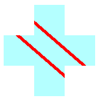

# The State of a Graphics Object

The [**Graphics**](-gdiplus-class-graphics-class.md) class is at the heart of Windows GDI+. To draw anything, you create a **Graphics** object, set its properties, and call its methods ( [DrawLine](-gdiplus-class-graphics-drawline-methods.md), [DrawImage](-gdiplus-class-graphics-drawimage-methods.md), [DrawString](-gdiplus-class-graphics-drawstring-methods.md), and the like).

The following example constructs a [**Graphics**](-gdiplus-class-graphics-class.md) object and a [**Pen**](-gdiplus-class-pen-class.md) object and then calls the [**Graphics::DrawRectangle**](-gdiplus-class-graphics-drawrectangle-pen-pen-int-x-int-y-int-width-int-height-.md) method of the **Graphics** object:


```
HDC          hdc;
PAINTSTRUCT  ps;

hdc = BeginPaint(hWnd, &amp;ps);
{
   Graphics graphics(hdc);
   Pen pen(Color(255, 0, 0, 255));  // opaque blue
   graphics.DrawRectangle(&amp;pen, 10, 10, 200, 100);
}
EndPaint(hWnd, &amp;ps);
```


In the preceding code, the [BeginPaint](http://msdn.microsoft.com/library/en-us/gdi/pantdraw_7b78.asp) method returns a handle to a device context, and that handle is passed to the [**Graphics**](-gdiplus-class-graphics-class.md) constructor. A device context is a structure (maintained by Windows) that holds information about the particular display device being used.

## Graphics State

A [**Graphics**](-gdiplus-class-graphics-class.md) object does more than provide drawing methods, such as [DrawLine](-gdiplus-class-graphics-drawline-methods.md) and [DrawRectangle](-gdiplus-class-graphics-drawrectangle-methods.md). A **Graphics** object also maintains graphics state, which can be divided into the following categories:

-   A link to a device context
-   Quality settings
-   Transformations
-   A clipping region

### Device Context

As an application programmer, you don't have to think about the interaction between a [**Graphics**](-gdiplus-class-graphics-class.md) object and its device context. This interaction is handled by GDI+ behind the scenes.

### Quality Settings

A [**Graphics**](-gdiplus-class-graphics-class.md) object has several properties that influence the quality of the items that are drawn on the screen. You can view and manipulate these properties by calling get and set methods. For example, you can call the [**Graphics::SetTextRenderingHint**](-gdiplus-class-graphics-settextrenderinghint-newmode-.md) method to specify the type of antialiasing (if any) applied to text. Other set methods that influence quality are [**Graphics::SetSmoothingMode**](-gdiplus-class-graphics-setsmoothingmode-smoothingmode-.md), [**Graphics::SetCompositingMode**](-gdiplus-class-graphics-setcompositingmode-compositingmode-.md), [**Graphics::SetCompositingQuality**](-gdiplus-class-graphics-setcompositingquality-compositingquality-.md), and [**Graphics::SetInterpolationMode**](-gdiplus-class-graphics-setinterpolationmode-interpolationmode-.md).

The following example draws two ellipses, one with the smoothing mode set to [****SmoothingModeAntiAlias****](-gdiplus-enum-smoothingmode.md) and one with the smoothing mode set to [****SmoothingModeHighSpeed****](-gdiplus-enum-smoothingmode.md):


```
Graphics graphics(hdc);
Pen pen(Color(255, 0, 255, 0));  // opaque green

graphics.SetSmoothingMode(SmoothingModeAntiAlias);
graphics.DrawEllipse(&amp;pen, 0, 0, 200, 100);
graphics.SetSmoothingMode(SmoothingModeHighSpeed);
graphics.DrawEllipse(&amp;pen, 0, 150, 200, 100);
```


### Transformations

A [**Graphics**](-gdiplus-class-graphics-class.md) object maintains two transformations (world and page) that are applied to all items drawn by that **Graphics** object. Any affine transformation can be stored in the world transformation. Affine transformations include scaling, rotating, reflecting, skewing, and translating. The page transformation can be used for scaling and for changing units (for example, pixels to inches). For more information on transformations, see [Coordinate Systems and Transformations](-gdiplus-coordinate-systems-and-transformations-about.md).

The following example sets the world and page transformations of a [**Graphics**](-gdiplus-class-graphics-class.md) object. The world transformation is set to a 30-degree rotation. The page transformation is set so that the coordinates passed to the second [**Graphics::DrawEllipse**](-gdiplus-class-graphics-drawellipse-pen-pen-int-x-int-y-int-width-int-height-.md) will be treated as millimeters instead of pixels. The code makes two identical calls to the **Graphics::DrawEllipse** method. The world transformation is applied to the first **Graphics::DrawEllipse** call, and both transformations (world and page) are applied to the second **Graphics::DrawEllipse** call.


```
Graphics graphics(hdc);
Pen pen(Color(255, 255, 0, 0));

graphics.ResetTransform();
graphics.RotateTransform(30.0f);            // World transformation
graphics.DrawEllipse(&amp;pen, 30, 0, 50, 25);
graphics.SetPageUnit(UnitMillimeter);       // Page transformation
graphics.DrawEllipse(&amp;pen, 30, 0, 50, 25);
```


The following illustration shows the two ellipses. Note that the 30-degree rotation is about the origin of the coordinate system (upper-left corner of the client area), not about the centers of the ellipses. Also note that the pen width of 1 means 1 pixel for the first ellipse and 1 millimeter for the second ellipse.


 

### Clipping Region

A [**Graphics**](-gdiplus-class-graphics-class.md) object maintains a clipping region that applies to all items drawn by that **Graphics** object. You can set the clipping region by calling the [SetClip](-gdiplus-class-graphics-setclip-methods.md) method.

The following example creates a plus-shaped region by forming the union of two rectangles. That region is designated as the clipping region of a [**Graphics**](-gdiplus-class-graphics-class.md) object. Then the code draws two lines that are restricted to the interior of the clipping region.


```
Graphics graphics(hdc);
Pen pen(Color(255, 255, 0, 0), 5);  // opaque red, width 5
SolidBrush brush(Color(255, 180, 255, 255));  // opaque aqua

// Create a plus-shaped region by forming the union of two rectangles.
Region region(Rect(50, 0, 50, 150));
region.Union(Rect(0, 50, 150, 50));
graphics.FillRegion(&amp;brush, &amp;region);

// Set the clipping region.
graphics.SetClip(&amp;region);

// Draw two clipped lines.
graphics.DrawLine(&amp;pen, 0, 30, 150, 160);
graphics.DrawLine(&amp;pen, 40, 20, 190, 150);
```


The following illustration shows the clipped lines.



 

 


