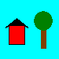
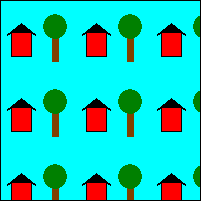
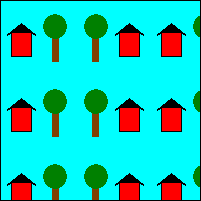
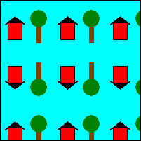
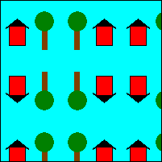

# Tiling a Shape with an Image

Just as tiles can be placed next to each other to cover a floor, rectangular images can be placed next to each other to fill (tile) a shape. To tile the interior of a shape, use a texture brush. When you construct a [**TextureBrush**](/windows/desktop/api/gdiplusbrush/nl-gdiplusbrush-texturebrush) object, one of the arguments you pass to the constructor is the address of an [**Image**](/windows/desktop/api/gdiplusheaders/nl-gdiplusheaders-image) object. When you use the texture brush to paint the interior of a shape, the shape is filled with repeated copies of this image.

The wrap mode property of the [**TextureBrush**](/windows/desktop/api/gdiplusbrush/nl-gdiplusbrush-texturebrush) object determines how the image is oriented as it is repeated in a rectangular grid. You can make all the tiles in the grid have the same orientation, or you can make the image flip from one grid position to the next. The flipping can be horizontal, vertical, or both. The following examples demonstrate tiling with different types of flipping.

## Tiling an Image

This example uses the following 75 ×75 image to tile a 200 ×200 rectangle:




```
Image image(L"HouseAndTree.png");
TextureBrush tBrush(&image);
Pen blackPen(Color(255, 0, 0, 0));
stat = graphics.FillRectangle(&tBrush, Rect(0, 0, 200, 200));
stat = graphics.DrawRectangle(&blackPen, Rect(0, 0, 200, 200));
```


The following illustration shows how the rectangle is tiled with the image. Note that all tiles have the same orientation; there is no flipping.



 

## Flipping an Image Horizontally While Tiling

This example uses a 75 ×75 image to fill a 200 ×200 rectangle. The wrap mode is set to flip the image horizontally.


```
Image image(L"HouseAndTree.png");
TextureBrush tBrush(&image);
Pen blackPen(Color(255, 0, 0, 0));
stat = tBrush.SetWrapMode(WrapModeTileFlipX);
stat = graphics.FillRectangle(&tBrush, Rect(0, 0, 200, 200));
stat = graphics.DrawRectangle(&blackPen, Rect(0, 0, 200, 200));
```


The following illustration shows how the rectangle is tiled with the image. Note that as you move from one tile to the next in a given row, the image is flipped horizontally.



 

## Flipping an Image Vertically While Tiling

This example uses a 75 ×75 image to fill a 200 ×200 rectangle. The wrap mode is set to flip the image vertically.


```
Image image(L"HouseAndTree.png");
TextureBrush tBrush(&image);
Pen blackPen(Color(255, 0, 0, 0));
stat = tBrush.SetWrapMode(WrapModeTileFlipY);
stat = graphics.FillRectangle(&tBrush, Rect(0, 0, 200, 200));
stat = graphics.DrawRectangle(&blackPen, Rect(0, 0, 200, 200));
```


The following illustration shows how the rectangle is tiled with the image. Note that as you move from one tile to the next in a given column, the image is flipped vertically.



 

## Flipping an Image Horizontally and Vertically While Tiling

This example uses a 75 ×75 image to tile a 200 ×200 rectangle. The wrap mode is set to flip the image both horizontally and vertically.


```
Image image(L"HouseAndTree.png");
TextureBrush tBrush(&image);
Pen blackPen(Color(255, 0, 0, 0));
stat = tBrush.SetWrapMode(WrapModeTileFlipXY);
stat = graphics.FillRectangle(&tBrush, Rect(0, 0, 200, 200));
stat = graphics.DrawRectangle(&blackPen, Rect(0, 0, 200, 200));
```


The following illustration shows how the rectangle is tiled by the image. Note that as you move from one tile to the next in a given row, the image is flipped horizontally, and as you move from one tile to the next in a given column, the image is flipped vertically.



 

 


