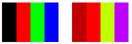

# Translating Colors

A translation adds a value to one or more of the four color components. The color matrix entries that represent translations are given in the following table.


| Component to be translated | Matrix entry |
|----------------------------|--------------|
| Red                        | \[4\]\[0\]   |
| Green                      | \[4\]\[1\]   |
| Blue                       | \[4\]\[2\]   |
| Alpha                      | \[4\]\[3\]   |


 

The following example constructs an [**Image**](/windows/desktop/api/gdiplusheaders/nl-gdiplusheaders-image) object from the file ColorBars.bmp. Then the code adds 0.75 to the red component of each pixel in the image. The original image is drawn alongside the transformed image.


```
Image            image(L"ColorBars.bmp");
ImageAttributes  imageAttributes;
UINT             width = image.GetWidth();
UINT             height = image.GetHeight();

ColorMatrix colorMatrix = {
   1.0f,  0.0f, 0.0f, 0.0f, 0.0f,
   0.0f,  1.0f, 0.0f, 0.0f, 0.0f,
   0.0f,  0.0f, 1.0f, 0.0f, 0.0f,
   0.0f,  0.0f, 0.0f, 1.0f, 0.0f,
   0.75f, 0.0f, 0.0f, 0.0f, 1.0f};
   
imageAttributes.SetColorMatrix(
   &colorMatrix, 
   ColorMatrixFlagsDefault,
   ColorAdjustTypeBitmap);
   
graphics.DrawImage(&image, 10, 10, width, height);

graphics.DrawImage(
   &image, 
   Rect(150, 10, width, height),  // destination rectangle 
   0, 0,        // upper-left corner of source rectangle 
   width,       // width of source rectangle
   height,      // height of source rectangle
   UnitPixel,
   &imageAttributes);
```


The following illustration shows the original image on the left and the transformed image on the right.



The following table lists the color vectors for the four bars before and after the red translation. Note that because the maximum value for a color component is 1, the red component in the second row does not change. (Similarly, the minimum value for a color component is 0.)


| Original           | Translated      |
|--------------------|-----------------|
| Black (0, 0, 0, 1) | (0.75, 0, 0, 1) |
| Red (1, 0, 0, 1)   | (1, 0, 0, 1)    |
| Green (0, 1, 0, 1) | (0.75, 1, 0, 1) |
| Blue (0, 0, 1, 1)  | (0.75, 0, 1, 1) |


 

 

 


