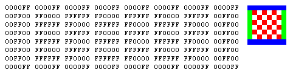
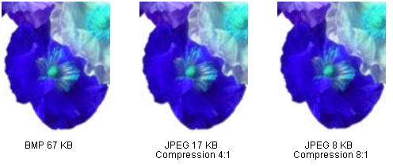
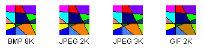

# Types of Bitmaps

A bitmap is an array of bits that specifies the color of each pixel in a rectangular array of pixels. The number of bits devoted to an individual pixel determines the number of colors that can be assigned to that pixel. For example, if each pixel is represented by 4 bits, then a given pixel can be assigned one of 16 different colors (2^4 = 16). The following table shows a few examples of the number of colors that can be assigned to a pixel represented by a given number of bits.

| Bits per pixel | Number of colors that can be assigned to a pixel |
|----------------|--------------------------------------------------|
| 1              | 2^1 = 2                                          |
| 2              | 2^2 = 4                                          |
| 4              | 2^4 = 16                                         |
| 8              | 2^8 = 256                                        |
| 16             | 2^16 = 65,536                                    |
| 24             | 2^24 = 16, 777, 216                              |

 

Disk files that store bitmaps usually contain one or more information blocks that store information such as number of bits per pixel, number of pixels in each row, and number of rows in the array. Such a file might also contain a color table (sometimes called a color palette). A color table maps numbers in the bitmap to specific colors. The following illustration shows an enlarged image along with its bitmap and color table. Each pixel is represented by a 4-bit number, so there are 2^4 = 16 colors in the color table. Each color in the table is represented by a 24-bit number: 8 bits for red, 8 bits for green, and 8 bits for blue. The numbers are shown in hexadecimal (base 16) form: A = 10, B = 11, C = 12, D = 13, E = 14, F = 15.

Look at the pixel in row 3, column 5 of the image. The corresponding number in the bitmap is 1. The color table tells us that 1 represents the color red, so the pixel is red. All the entries in the top row of the bitmap are 3. The color table tells us that 3 represents blue, so all the pixels in the top row of the image are blue.

> [!Note]  
> Some bitmaps are stored in bottom-up format; the numbers in the first row of the bitmap correspond to the pixels in the bottom row of the image.

 

A bitmap that stores indexes into a color table is called a *palette-indexed* bitmap. Some bitmaps have no need for a color table. For example, if a bitmap uses 24 bits per pixel, that bitmap can store the colors themselves rather than indexes into a color table. The following illustration shows a bitmap that stores colors directly (24 bits per pixel) rather than using a color table. The illustration also shows an enlarged view of the corresponding image. In the bitmap, FFFFFF represents white, FF0000 represents red, 00FF00 represents green, and 0000FF represents blue.

 

## Graphics File Formats

There are many standard formats for saving bitmaps in files. Windows GDI+ supports the graphics file formats described in the following paragraphs.

**Bitmap (BMP)**

BMP is a standard format used by Windows to store device-independent and application-independent images. The number of bits per pixel (1, 4, 8, 15, 24, 32, or 64) for a given BMP file is specified in a file header. BMP files with 24 bits per pixel are common.

**Graphics Interchange Format (GIF)**

GIF is a common format for images that appear on Web pages. GIFs work well for line drawings, pictures with blocks of solid color, and pictures with sharp boundaries between colors. GIFs are compressed, but no information is lost in the compression process; a decompressed image is exactly the same as the original. One color in a GIF can be designated as transparent, so that the image will have the background color of any Web page that displays it. A sequence of GIF images can be stored in a single file to form an animated GIF. GIFs store at most 8 bits per pixel, so they are limited to 256 colors.

**Joint Photographic Experts Group (JPEG)**

JPEG is a compression scheme that works well for natural scenes, such as scanned photographs. Some information is lost in the compression process, but often the loss is imperceptible to the human eye. Color JPEG images store 24 bits per pixel, so they are capable of displaying more than 16 million colors. There is also a grayscale JPEG format that stores 8 bits per pixel. JPEGs do not support transparency or animation.

The level of compression in JPEG images is configurable, but higher compression levels (smaller files) result in more loss of information. A 20:1 compression ratio often produces an image that the human eye finds difficult to distinguish from the original. The following illustration shows a BMP image and two JPEG images that were compressed from that BMP image. The first JPEG has a compression ratio of 4:1 and the second JPEG has a compression ratio of about 8:1.

JPEG compression does not work well for line drawings, blocks of solid color, and sharp boundaries. The following illustration shows a BMP along with two JPEGs and a GIF. The JPEGs and the GIF were compressed from the BMP. The compression ratio is 4:1 for the GIF, 4:1 for the smaller JPEG, and 8:3 for the larger JPEG. Note that the GIF maintains the sharp boundaries along the lines, but the JPEGs tends to blur the boundaries.

JPEG is a compression scheme, not a file format. JPEG File Interchange Format (JFIF) is a file format commonly used for storing and transferring images that have been compressed according to the JPEG scheme. JFIF files displayed by Web browsers use the .jpg extension.

**Exchangeable Image File (Exif)**

Exif is a file format used for photographs captured by digital cameras. An Exif file contains an image that is compressed according to the JPEG specification. An Exif file also contains information about the photograph (date taken, shutter speed, exposure time, and so on) and information about the camera (manufacturer, model, and so on).

**Portable Network Graphics (PNG)**

The PNG format retains many of the advantages of the GIF format but also provides capabilities beyond those of GIF. Like GIF files, PNG files are compressed with no loss of information. PNG files can store colors with 8, 24, or 48 bits per pixel and gray scales with 1, 2, 4, 8, or 16 bits per pixel. In contrast, GIF files can use only 1, 2, 4, or 8 bits per pixel. A PNG file can also store an alpha value for each pixel, which specifies the degree to which the color of that pixel is blended with the background color.

PNG improves on GIF in its ability to progressively display an image; that is, to display better and better approximations of the image as it arrives over a network connection. PNG files can contain gamma correction and color correction information so that the images can be accurately rendered on a variety of display devices.

**Tag Image File Format (TIFF)**

TIFF is a flexible and extendable format that is supported by a wide variety of platforms and image-processing applications. TIFF files can store images with an arbitrary number of bits per pixel and can employ a variety of compression algorithms. Several images can be stored in a single, multiple-page TIFF file. Information related to the image (scanner make, host computer, type of compression, orientation, samples per pixel, and so on) can be stored in the file and arranged through the use of tags. The TIFF format can be extended as needed by the approval and addition of new tags.

 

 

