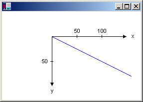
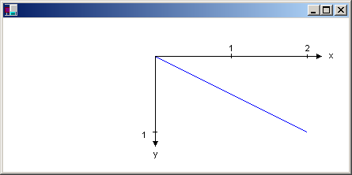

# Types of Coordinate Systems

Windows GDI+ uses three coordinate spaces: world, page, and device. When you make the call `myGraphics.DrawLine(&myPen, 0, 0, 160, 80)`, the points that you pass to the [**Graphics::DrawLine**](/windows/win32/api/gdiplusgraphics/nf-gdiplusgraphics-graphics-drawline(inconstpen_inconstpoint__inconstpoint_)) method — (0, 0) and (160, 80) — are in the world coordinate space. Before GDI+ can draw the line on the screen, the coordinates pass through a sequence of transformations. One transformation converts world coordinates to page coordinates, and another transformation converts page coordinates to device coordinates.

Suppose you want to work with a coordinate system that has its origin in the body of the client area rather than the upper-left corner. Say, for example, that you want the origin to be 100 pixels from the left edge of the client area and 50 pixels from the top of the client area. The following illustration shows such a coordinate system.


When you make the call `myGraphics.DrawLine(&myPen, 0, 0, 160, 80)`, you get the line shown in the following illustration.



The coordinates of the endpoints of your line in the three coordinate spaces are as follows:


| Space       |  Endpoint coordinates                       |
|--------|-------------------------|
| World  | (0, 0) to (160, 80)     |
| Page   | (100, 50) to (260, 130) |
| Device | (100, 50) to (260, 130) |


 

Note that the page coordinate space has its origin at the upper-left corner of the client area; this will always be the case. Also note that because the unit of measure is the pixel, the device coordinates are the same as the page coordinates. If you set the unit of measure to something other than pixels (for example, inches), then the device coordinates will be different from the page coordinates.

The transformation that maps world coordinates to page coordinates is called the *world transformation* and is maintained by a [**Graphics**](/windows/desktop/api/gdiplusgraphics/nl-gdiplusgraphics-graphics) object. In the previous example, the world transformation is a translation 100 units in the x direction and 50 units in the y direction. The following example sets the world transformation of a **Graphics** object and then uses that **Graphics** object to draw the line shown in the previous figure.


```
myGraphics.TranslateTransform(100.0f, 50.0f);

myGraphics.DrawLine(&myPen, 0, 0, 160, 80);
```


The transformation that maps page coordinates to device coordinates is called the *page transformation*. The [**Graphics**](/windows/desktop/api/gdiplusgraphics/nl-gdiplusgraphics-graphics) class provides four methods for manipulating and inspecting the page transformation: [**Graphics::SetPageUnit**](/windows/desktop/api/Gdiplusgraphics/nf-gdiplusgraphics-graphics-setpageunit), [**Graphics::GetPageUnit**](/windows/desktop/api/Gdiplusgraphics/nf-gdiplusgraphics-graphics-getpageunit), [**Graphics::SetPageScale**](/windows/desktop/api/Gdiplusgraphics/nf-gdiplusgraphics-graphics-setpagescale), and [**Graphics::GetPageScale**](/windows/desktop/api/Gdiplusgraphics/nf-gdiplusgraphics-graphics-getpagescale). The **Graphics** class also provides two methods, [**Graphics::GetDpiX**](/windows/desktop/api/Gdiplusgraphics/nf-gdiplusgraphics-graphics-getdpix) and [**Graphics::GetDpiY**](/windows/desktop/api/Gdiplusgraphics/nf-gdiplusgraphics-graphics-getdpiy), for examining the horizontal and vertical dots per inch of the display device.

You can use the [**Graphics::SetPageUnit**](/windows/desktop/api/Gdiplusgraphics/nf-gdiplusgraphics-graphics-setpageunit) method of the [**Graphics**](/windows/desktop/api/gdiplusgraphics/nl-gdiplusgraphics-graphics) class to specify a unit of measure. The following example draws a line from (0, 0) to (2, 1) where the point (2, 1) is 2 inches to the right and 1 inch down from the point (0, 0).


```
myGraphics.SetPageUnit(UnitInch);

myGraphics.DrawLine(&myPen, 0, 0, 2, 1);
```


> [!Note]
> If you don't specify a pen width when you construct your pen, the previous example will draw a line that is one inch wide. You can specify the pen width in the second argument to the [**Pen**](/windows/desktop/api/gdipluspen/nl-gdipluspen-pen) constructor:
> <br/><br/>
> `Pen myPen(Color(255, 0, 0, 0), 1/myGraphics.GetDpiX())`.

 

If we assume that the display device has 96 dots per inch in the horizontal direction and 96 dots per inch in the vertical direction, the endpoints of the line in the previous example have the following coordinates in the three coordinate spaces:


| Space       | Endpoint coordinates                    |
|--------|---------------------|
| World  | (0, 0) to (2, 1)    |
| Page   | (0, 0) to (2, 1)    |
| Device | (0, 0, to (192, 96) |


 

You can combine the world and page transformations to achieve a variety of effects. For example, suppose you want to use inches as the unit of measure and you want the origin of your coordinate system to be 2 inches from the left edge of the client area and 1/2 inch from the top of the client area. The following example sets the world and page transformations of a [**Graphics**](/windows/desktop/api/gdiplusgraphics/nl-gdiplusgraphics-graphics) object and then draws a line from (0, 0) to (2, 1).


```
myGraphics.TranslateTransform(2.0f, 0.5f);
myGraphics.SetPageUnit(UnitInch);
myGraphics.DrawLine(&myPen, 0, 0, 2, 1);
```


The following illustration shows the line and coordinate system.



If we assume that the display device has 96 dots per inch in the horizontal direction and 96 dots per inch in the vertical direction, the endpoints of the line in the previous example have the following coordinates in the three coordinate spaces:


| Space       | Endpoint coordinates                        |
|--------|-------------------------|
| World  | (0, 0) to (2, 1)        |
| Page   | (2, 0.5) to (4, 1.5)    |
| Device | (192, 48) to (384, 144) |


 

 

 
