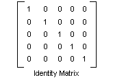

# Using a Color Matrix to Transform a Single Color

Windows GDI+ provides the [**Image**](/windows/win32/api/gdiplusheaders/nl-gdiplusheaders-image) and [**Bitmap**](/windows/win32/api/gdiplusheaders/nl-gdiplusheaders-bitmap) classes for storing and manipulating images. **Image** and **Bitmap** objects store the color of each pixel as a 32-bit number: 8 bits each for red, green, blue, and alpha. Each of the four components is a number from 0 through 255, with 0 representing no intensity and 255 representing full intensity. The alpha component specifies the transparency of the color: 0 is fully transparent, and 255 is fully opaque.

A color vector is a 4-tuple of the form (red, green, blue, alpha). For example, the color vector (0, 255, 0, 255) represents an opaque color that has no red or blue, but has green at full intensity.

Another convention for representing colors uses the number 1 for maximum intensity and the number 0 for minimum intensity. Using that convention, the color described in the preceding paragraph would be represented by the vector (0, 1, 0, 1). GDI+ uses the convention of 1 as full intensity when it performs color transformations.

You can apply linear transformations (rotation, scaling, and the like) to color vectors by multiplying by a 4 ×4 matrix. However, you cannot use a 4 ×4 matrix to perform a translation (nonlinear). If you add a dummy fifth coordinate (for example, the number 1) to each of the color vectors, you can use a 5 ×5 matrix to apply any combination of linear transformations and translations. A transformation consisting of a linear transformation followed by a translation is called an affine transformation. A 5 ×5 matrix that represents an affine transformation is called a homogeneous matrix for a 4-space transformation. The element in the fifth row and fifth column of a 5 ×5 homogeneous matrix must be 1, and all of the other entries in the fifth column must be 0.

For example, suppose you want to start with the color (0.2, 0.0, 0.4, 1.0) and apply the following transformations:

1.  Double the red component
2.  Add 0.2 to the red, green, and blue components

The following matrix multiplication will perform the pair of transformations in the order listed.


The elements of a color matrix are indexed (zero-based) by row and then column. For example, the entry in the fifth row and third column of matrix M is denoted by M\[4\]\[2\].

The 5 ×5 identity matrix (shown in the following illustration) has 1s on the diagonal and 0s everywhere else. If you multiply a color vector by the identity matrix, the color vector does not change. A convenient way to form the matrix of a color transformation is to start with the identity matrix and make a small change that produces the desired transformation.



For a more detailed discussion of matrices and transformations, see [Coordinate Systems and Transformations](-gdiplus-coordinate-systems-and-transformations-about.md).

The following example takes an image that is all one color (0.2, 0.0, 0.4, 1.0) and applies the transformation described in the preceding paragraphs.


```
Image            image(L"InputColor.bmp");
ImageAttributes  imageAttributes;
UINT             width = image.GetWidth();
UINT             height = image.GetHeight();

ColorMatrix colorMatrix = {
   2.0f, 0.0f, 0.0f, 0.0f, 0.0f,
   0.0f, 1.0f, 0.0f, 0.0f, 0.0f,
   0.0f, 0.0f, 1.0f, 0.0f, 0.0f,
   0.0f, 0.0f, 0.0f, 1.0f, 0.0f,
   0.2f, 0.2f, 0.2f, 0.0f, 1.0f};
   
imageAttributes.SetColorMatrix(
   &colorMatrix, 
   ColorMatrixFlagsDefault,
   ColorAdjustTypeBitmap);
   
graphics.DrawImage(&image, 10, 10);

graphics.DrawImage(
   &image, 
   Rect(120, 10, width, height),  // destination rectangle 
   0, 0,        // upper-left corner of source rectangle 
   width,       // width of source rectangle
   height,      // height of source rectangle
   UnitPixel,
   &imageAttributes);
```


The following illustration shows the original image on the left and the transformed image on the right.


The code in the preceding example uses the following steps to perform the recoloring:

1.  Initialize a [**ColorMatrix**](/windows/win32/api/Gdipluscolormatrix/ns-gdipluscolormatrix-colormatrix) structure.
2.  Create an [**ImageAttributes**](/windows/win32/api/gdiplusimageattributes/nl-gdiplusimageattributes-imageattributes) object and pass the address of the [**ColorMatrix**](/windows/win32/api/Gdipluscolormatrix/ns-gdipluscolormatrix-colormatrix) structure to the [**ImageAttributes::SetColorMatrix**](/windows/win32/api/Gdiplusimageattributes/nf-gdiplusimageattributes-imageattributes-setcolormatrix) method of the **ImageAttributes** object.
3.  Pass the address of the [**ImageAttributes**](/windows/win32/api/gdiplusimageattributes/nl-gdiplusimageattributes-imageattributes) object to the [DrawImage Methods](/windows/win32/api/gdiplusgraphics/nf-gdiplusgraphics-graphics-drawimage(inimage_inconstpointf_inint)) method of a [**Graphics**](/windows/win32/api/gdiplusgraphics/nl-gdiplusgraphics-graphics) object.

 

 


