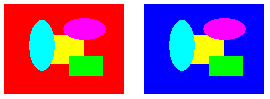

# Using a Color Remap Table

Remapping is the process of converting the colors in an image according to a color remap table. The color remap table is an array of [**ColorMap**](-gdiplus-struc-colormap.md) structures. Each **ColorMap** structure in the array has an **oldColor** member and a **newColor** member.

When GDI+ draws an image, each pixel of the image is compared to the array of old colors. If a pixel's color matches an old color, its color is changed to the corresponding new color. The colors are changed only for rendering — the color values of the image itself (stored in an [**Image**](-gdiplus-class-image-class.md) or [**Bitmap**](-gdiplus-class-bitmap-class.md) object) are not changed.

To draw a remapped image, initialize an array of [**ColorMap**](-gdiplus-struc-colormap.md) structures. Pass the address of that array to the [**ImageAttributes::SetRemapTable**](-gdiplus-class-imageattributes-setremaptable-mapsize-map-type-.md) method of an [**ImageAttributes**](-gdiplus-class-imageattributes-class.md) object, and then pass the address of the **ImageAttributes** object to the [DrawImage Methods](-gdiplus-class-graphics-drawimage-methods.md) method of a [**Graphics**](-gdiplus-class-graphics-class.md) object.

The following example creates an [**Image**](-gdiplus-class-image-class.md) object from the file RemapInput.bmp. The code creates a color remap table that consists of a single [**ColorMap**](-gdiplus-struc-colormap.md) structure. The **oldColor** member of the **ColorMap** structure is red, and the **newColor** member is blue. The image is drawn once without remapping and once with remapping. The remapping process changes all the red pixels to blue.


```
Image            image(L"RemapInput.bmp");
ImageAttributes  imageAttributes;
UINT             width = image.GetWidth();
UINT             height = image.GetHeight();
ColorMap         colorMap[1];

colorMap[0].oldColor = Color(255, 255, 0, 0);  // opaque red
colorMap[0].newColor = Color(255, 0, 0, 255);  // opaque blue

imageAttributes.SetRemapTable(1, colorMap, ColorAdjustTypeBitmap);

graphics.DrawImage(&amp;image, 10, 10, width, height);

graphics.DrawImage(
   &amp;image, 
   Rect(150, 10, width, height),  // destination rectangle 
   0, 0,        // upper-left corner of source rectangle 
   width,       // width of source rectangle
   height,      // height of source rectangle
   UnitPixel,
   &amp;imageAttributes);
```


The following illustration shows the original image on the left and the remapped image on the right.



 

 


