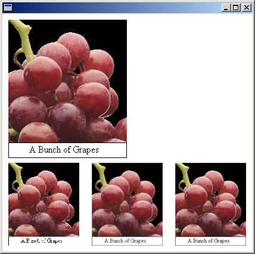

# Using Interpolation Mode to Control Image Quality During Scaling

The interpolation mode of a [**Graphics**](-gdiplus-class-graphics-class.md) object influences the way Windows GDI+ scales (stretches and shrinks) images. The [**InterpolationMode**](-gdiplus-enum-interpolationmode.md) enumeration in Gdiplusenums.h defines several interpolation modes, some of which are shown in the following list:

-   InterpolationModeNearestNeighbor
-   InterpolationModeBilinear
-   InterpolationModeHighQualityBilinear
-   InterpolationModeBicubic
-   InterpolationModeHighQualityBicubic

To stretch an image, each pixel in the original image must be mapped to a group of pixels in the larger image. To shrink an image, groups of pixels in the original image must be mapped to single pixels in the smaller image. The effectiveness of the algorithms that perform these mappings determines the quality of a scaled image. Algorithms that produce higher-quality scaled images tend to require more processing time. In the preceding list, InterpolationModeNearestNeighbor is the lowest-quality mode and InterpolationModeHighQualityBicubic is the highest-quality mode.

To set the interpolation mode, pass one of the members of the [**InterpolationMode**](-gdiplus-enum-interpolationmode.md) enumeration to the **SetInterpolationMode** method of a [**Graphics**](-gdiplus-class-graphics-class.md) object.

The following example draws an image and then shrinks the image with three different interpolation modes:


```
Image image(L"GrapeBunch.bmp");
UINT width = image.GetWidth();
UINT height = image.GetHeight();
// Draw the image with no shrinking or stretching.
graphics.DrawImage(
   &amp;image,
   Rect(10, 10, width, height),  // destination rectangle  
   0, 0,        // upper-left corner of source rectangle
   width,       // width of source rectangle
   height,      // height of source rectangle
   UnitPixel);
// Shrink the image using low-quality interpolation. 
graphics.SetInterpolationMode(InterpolationModeNearestNeighbor);
graphics.DrawImage(
   &amp;image,
   Rect(10, 250, 0.6*width, 0.6*height),  // destination rectangle 
   0, 0,        // upper-left corner of source rectangle
   width,       // width of source rectangle
   height,      // height of source rectangle
   UnitPixel);
// Shrink the image using medium-quality interpolation.
graphics.SetInterpolationMode(InterpolationModeHighQualityBilinear);
graphics.DrawImage(
   &amp;image,
   Rect(150, 250, 0.6 * width, 0.6 * height),  // destination rectangle 
   0, 0,        // upper-left corner of source rectangle
   width,       // width of source rectangle
   height,      // height of source rectangle
   UnitPixel);
// Shrink the image using high-quality interpolation.
graphics.SetInterpolationMode(InterpolationModeHighQualityBicubic);
graphics.DrawImage(
   &amp;image,
   Rect(290, 250, 0.6 * width, 0.6 * height),  // destination rectangle 
   0, 0,        // upper-left corner of source rectangle
   width,       // width of source rectangle
   height,      // height of source rectangle
   UnitPixel);
```


The following illustration shows the original image and the three smaller images.



 

 


