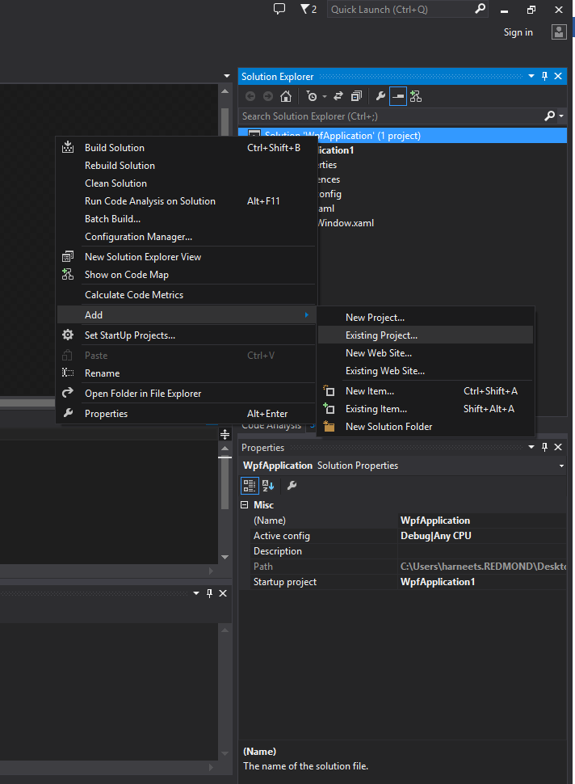
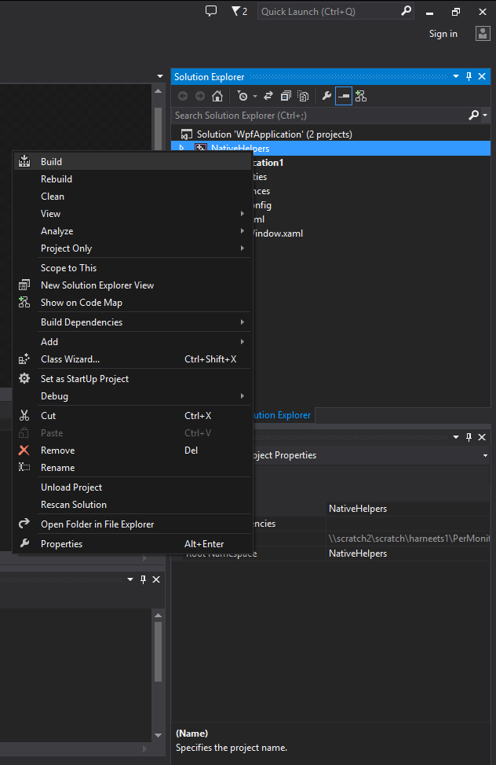
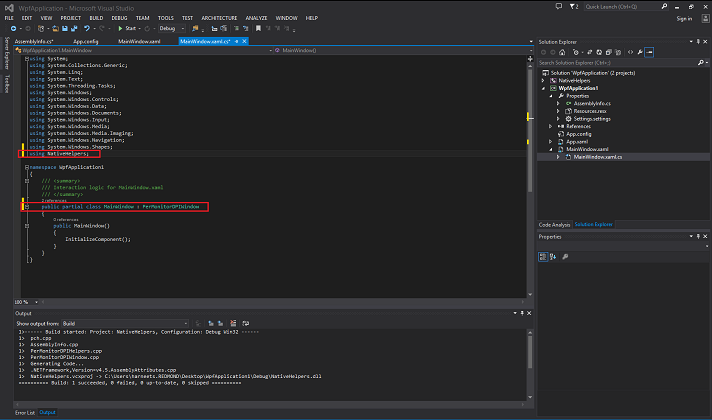
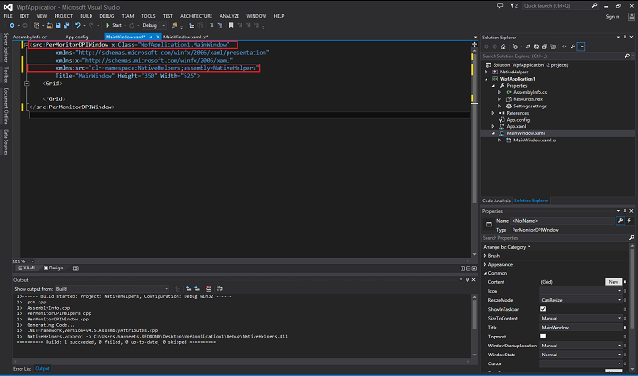

# Developing a Per-Monitor DPI-Aware WPF Application

**Important APIs**

-   [**SetProcessDpiAwareness**](/windows/desktop/api/ShellScalingAPI/nf-shellscalingapi-setprocessdpiawareness)
-   [**GetProcessDpiAwareness**](/windows/desktop/api/ShellScalingAPI/nf-shellscalingapi-getprocessdpiawareness)
-   [**GetDpiForMonitor**](/windows/desktop/api/ShellScalingAPI/nf-shellscalingapi-getdpiformonitor)

> [!Note]  
> **This page covers legacy WPF development for Windows 8.1.** If you are developing WPF applications for Windows 10, please see the <a href="https://github.com/microsoft/WPF-Samples/blob/main/PerMonitorDPI/readme.md">latest documentation on GitHub.</a>

 

Windows 8.1 gives developers new functionality to create desktop applications that are per-monitor DPI-aware. In order to take advantage of this functionality, a per monitor DPI-aware application must do the following:

-   Change window dimensions to maintain a physical size that appears consistent on any display
-   Re-layout and re-render graphics for the new window size
-   Select fonts that are scaled appropriately for the DPI level
-   Select and load bitmap assets that are tailored for the DPI level

To facilitate making a per-monitor DPI-aware application, Windows 8.1 provides the following Microsoft Win32APIs:

-   [**SetProcessDpiAwareness**](/windows/desktop/api/ShellScalingAPI/nf-shellscalingapi-setprocessdpiawareness) (or DPI manifest entry) sets the process to a specified DPI awareness level, which then determines how Windows scales the UI. This supersedes [**SetProcessDPIAware**](/windows/desktop/api/winuser/nf-winuser-setprocessdpiaware).
-   [**GetProcessDpiAwareness**](/windows/desktop/api/ShellScalingAPI/nf-shellscalingapi-getprocessdpiawareness) returns the DPI awareness level. This supersedes [**IsProcessDPIAware**](/windows/desktop/api/winuser/nf-winuser-isprocessdpiaware).
-   [**GetDpiForMonitor**](/windows/desktop/api/ShellScalingAPI/nf-shellscalingapi-getdpiformonitor) returns the DPI for a monitor.
-   The [**WM\_DPICHANGED**](wm-dpichanged.md) window notification is sent to per-monitor DPI-aware applications when a window’s position changes such that most of its area intersects a monitor with a DPI that is different from the DPI before the position change or when the user moves the display slider. To create an application that resizes and re-renders itself when a user moves it to a different display, use this notification.

For more details on various DPI awareness levels supported for desktop applications in Windows 8.1 see the topic [Writing DPI-Aware Desktop and Win32 Applications](https://msdn.microsoft.com/library/windows/desktop/mt843498(v=vs.85).aspx(d=robot)).

## DPI Scaling and WPF

Windows Presentation Foundation (WPF) applications are by default system DPI-aware. For definitions of the different DPI awareness levels see the topic [Writing DPI-Aware Desktop and Win32 Applications](https://msdn.microsoft.com/library/windows/desktop/mt843498(v=vs.85).aspx(d=robot)). The WPF graphics system uses device-independent units to enable resolution and device independence. WPF scales each device independent pixel automatically based on current system DPI. This allows WPF applications to scale automatically when the DPI of the monitor the window is on is same system DPI. However, since WPF applications are system dpi-aware, the application will be scaled by the OS when the application is moved to a monitor with a different DPI or when the slider in the control panel is used to change the DPI. Scaling in the OS may result in WPF applications to appear blurry especially when the scaling is non-integral. In order to avoid scaling WPF applications, they need to be updated to be per-monitor DPI-aware.

## Per Monitor Aware WPF Sample Walkthrough

The [Per Monitor Aware WPF sample](https://github.com/microsoft/Windows-classic-samples/tree/master/Samples/PerMonitorDPIAware) is a sample WPF application updated to be per-monitor DPI-aware. The sample consists of two projects:

-   NativeHelpers.vcxproj: This is a native helper project that implements the core functionality to make a WPF application as per-monitor DPI-aware utilizing the Win32APIs above. The project contains two classes:
    -   PerMonDPIHelpers: A class that provides helper functions for DPI related operations like retrieving the current DPI of the active monitor, setting a process to be per-monitor DPI-aware, etc.
    -   PerMonitorDPIWindow: A base class derived from **System.Windows.Window** that implements functionality to make a WPF application window to be per-monitor dpi-aware. Adjusts window size, graphics rendering size and font size based on the DPI of the monitor rather than the system DPI.
-   WPFApplication.csproj: Sample WPF application that consumes the PerMonitorDPIWindow (PerMonitorDPIWindow), and showcases how the application window and rendering resizes when the window is moved to a monitor with a different DPI or when the slider in the Display control panel is used to change the DPI.

To run the sample follow the steps below:

1.  Download and unzip the [Per Monitor Aware WPF sample](https://github.com/microsoft/Windows-classic-samples/tree/master/Samples/PerMonitorDPIAware)
2.  Start Microsoft Visual Studio and select **File > Open > Project/Solution**
3.  Browse to the directory that contains the unzipped sample. Go to the directory named for the sample, and double-click the Visual Studio Solution (.sln) file
4.  Press F7 or use **Build > Build Solution** to build the sample
5.  Press Ctrl+F5 or use **Debug > Start Without Debugging** to run the sample

To see the impact of changing DPI on a WPF application that is updated to be per-monitor DPI-aware using the base class in the sample, move the application window to and from displays that have different DPIs. As the window is moved between monitors, the window size and the UI scale is updated based on the DPI of the display by using WPF’s scalable graphics system, rather than being scaled by the OS. The application’s UI is rendered natively and does not appear blurry. If you don’t have two displays with different DPI, change the DPI by changing the slider in the Display control panel. Changing the slider and clicking **Apply** will resize the application’s window and update the UI scale automatically.

## Updating an existing WPF Application to be per-monitor dpi-aware using helper project in the WPF Sample

If you have an existing WPF application and wish to leverage the DPI helper project from the sample to make it DPI aware, follow these steps.

1.  Download and unzip the Per Monitor Aware WPF sample
2.  Start Visual Studio and select **File > Open > Project/Solution**
3.  Browse to the directory which contains an existing WPF application and double-click the Visual Studio Solution (.sln) file
4.  Right click on **Solution > Add > Existing Project**
5.  In the file selection dialogue browse to the directory that contains the unzipped sample. Open to the directory named for the sample, browse to the folder "NativeHelpers", select the Visual C++ project file "NativeHelpers.vcxproj” and click **OK**
6.  Right click on the project NativeHelpers and select **Build**. This will generate NativeHelpers.dll that will be added as a reference to the WPF Application in the next step
7.  Add a reference to NativeHelpers.dll from your WPF Application. Expand your WPF application project, right click on **References** and click on **Add Reference...**
8.  In the resulting dialogue, expand the **Solution** section. Under **Projects**, select NativeHelpers, and click **OK**
9.  Expand your WPF application project, expand **Properties**, and open **AssemblyInfo.cs**. Make the following additions to AssemblyInfo.cs
    -   Add reference to System.Windows.Media in the reference section (using System.Windows.Media;)
    -   Add the DisableDpiAwareness attribute (`[assembly: DisableDpiAwareness]`)

    
10. Inherit the main WPF window class from PerMonitorDPIWindow base class
    -   Update the .cs file of the main WPF window to inherit from the PerMonitorDPIWindow base class
        -   Add a reference to NativeHelpers in the reference section by adding the line `using NativeHelpers;`
        -   Inherit the main window class from PerMonitorDPIWindow class

        
    -   Update the .xaml file of the main WPF window to inherit from PerMonitorDPIWindow base class
        -   Add a reference to NativeHelpers in the reference section by adding the line `xmlns:src="clr-namespace:NativeHelpers;assembly=NativeHelpers"`
        -   Inherit the main window class from PerMonitorDPIWindow class

        
11. Press F7 or use **Build > Build Solution** to build the sample
12. Press Ctrl+F5 or use **Debug > Start Without Debugging** to run the sample

The [Per Monitor Aware WPF sample](https://github.com/microsoft/Windows-classic-samples/tree/master/Samples/PerMonitorDPIAware) application illustrates how a WPF application can be updated to be per-monitor DPI-aware by responding to the [**WM\_DPICHANGED**](wm-dpichanged.md) window notification. In response to the window notification, the sample updates the scale transform used by WPF based on the current DPI of the monitor the window is on. The *wParam* of the window notification contains the new DPI in the *wParam*. The *lParam* contains a rectangle that has the size and position of the new suggested window, scaled for the new DPI.

Note:

> [!Note]  
> Since this sample overwrites the window size and the scale transform of the root node of the WPF window, further work may be required by application developer if:
>
> -   The size of the window impacts other portions of the application like this WPF Window being hosted inside another application.
> -   The WPF application that is extending this class is setting some other transform on the root visual; the sample may overwrite some other transform that is being applied by the WPF application itself.

 

## Overview of the helper project in the WPF sample

In order to make an existing WPF application per-monitor DPI-aware the NativeHelpers library provides following functionality:

-   **Marks the WPF application as per-ponitor DPI-aware:** The WPF application is marked as per-monitor DPI-aware by calling [**SetProcessDpiAwareness**](/windows/desktop/api/ShellScalingAPI/nf-shellscalingapi-setprocessdpiawareness) for the current process. Marking the application as per-monitor DPI-aware will ensure that

    -   The OS does not scale the application when the system DPI does not match the current DPI of the monitor the application window is on
    -   The [**WM\_DPICHANGED**](wm-dpichanged.md) message is sent whenever the DPI of the window changes

-   **Adjusts the window dimension, re-layout and re-render graphics content and select fonts based on initial DPI of the monitor the window is on:** Once the application is marked as per-monitor DPI-aware, WPF will still scale the window size, graphics and font size based on the system DPI. Since, at app launch, the system DPI is not guaranteed to be the same as the DPI of the monitor the window is launched on, the library adjust these values once the window is loaded. The base class **PerMonitorDPIWindow** updates these in the **OnLoaded()** handler.

    The Window size is updated by changing the **Width** and **Height** properties of the Window. The layout and size are updated by applying an appropriate scale transform to the root node of the WPF window.

    ```C++
    void PerMonitorDPIWindow::OnLoaded(Object^ , RoutedEventArgs^ ) 
    {   
    if (m_perMonitorEnabled)
        {
        m_source = (HwndSource^) PresentationSource::FromVisual((Visual^) this);
        HwndSourceHook^ hook = gcnew HwndSourceHook(this, &PerMonitorDPIWindow::HandleMessages);
        m_source->AddHook(hook); 
                
        //Calculate the DPI used by WPF.                    
        m_wpfDPI = 96.0 *  m_source->CompositionTarget->TransformToDevice.M11; 

        //Get the Current DPI of the monitor of the window. 
        m_currentDPI = NativeHelpers::PerMonitorDPIHelper::GetDpiForWindow(m_source->Handle);

        //Calculate the scale factor used to modify window size, graphics and text
        m_scaleFactor = m_currentDPI / m_wpfDPI; 
            
        //Update Width and Height based on the on the current DPI of the monitor
        Width = Width * m_scaleFactor;
        Height = Height * m_scaleFactor;

        //Update graphics and text based on the current DPI of the monitor
    UpdateLayoutTransform(m_scaleFactor);
        }
    }

    void PerMonitorDPIWindow::UpdateLayoutTransform(double scaleFactor)
    {
    // Adjust the rendering graphics and text size by applying the scale transform to the top         
    level visual node of the Window     

    if (m_perMonitorEnabled) 
        {       
            auto child = GetVisualChild(0);
            if (m_scaleFactor != 1.0) 
           {
            ScaleTransform^ dpiScale = gcnew ScaleTransform(scaleFactor, scaleFactor);
            child->SetValue(Window::LayoutTransformProperty, dpiScale);
            }
            else 
            {
            child->SetValue(Window::LayoutTransformProperty, nullptr);
            }           
        }
    }
    ```

    

-   **Responds to WM\_DPICHANGED window notification:** Update the window size, graphics and font size based on the DPI passed in the window notification. The base class **PerMonitorDPIWindow** handles the window notification in the **HandleMessages()** method.

    The Window size is updated by calling **SetWindowPos** using the information passed in the *lparam* of the window message. The layout and graphics size are updated by applying an appropriate scale transform to the root node of the WPF window. The scale factor is calculated by using the DPI passed in the *wparam* of the window message.

    ```C++
    IntPtr PerMonitorDPIWindow::HandleMessages(IntPtr hwnd, int msg, IntPtr wParam, IntPtr lParam, bool% )
    {
    double oldDpi;
    switch (msg)
        {
        case WM_DPICHANGED:
        LPRECT lprNewRect = (LPRECT)lParam.ToPointer();
        SetWindowPos(static_cast<HWND>(hwnd.ToPointer()), 0, lprNewRect->left, lprNewRect-
            >top, lprNewRect->right - lprNewRect->left, lprNewRect->bottom - lprNewRect->top, 
           SWP_NOZORDER | SWP_NOOWNERZORDER | SWP_NOACTIVATE);
        oldDpi = m_currentDPI;
        m_currentDPI = static_cast<int>(LOWORD(wParam.ToPointer()));
        if (oldDpi != m_currentDPI) 
            {
            OnDPIChanged();
            }
        break;
        }
    return IntPtr::Zero;
    }

    void PerMonitorDPIWindow::OnDPIChanged() 
    {
    m_scaleFactor = m_currentDPI / m_wpfDPI;
    UpdateLayoutTransform(m_scaleFactor);
    DPIChanged(this, EventArgs::Empty);
    }

    void PerMonitorDPIWindow::UpdateLayoutTransform(double scaleFactor)
    {
    // Adjust the rendering graphics and text size by applying the scale transform to the top         
    level visual node of the Window     

    if (m_perMonitorEnabled) 
        {       
            auto child = GetVisualChild(0);
            if (m_scaleFactor != 1.0) 
           {
            ScaleTransform^ dpiScale = gcnew ScaleTransform(scaleFactor, scaleFactor);
            child->SetValue(Window::LayoutTransformProperty, dpiScale);
            }
            else 
            {
            child->SetValue(Window::LayoutTransformProperty, nullptr);
            }           
        }
    }
    ```

    

## Handling DPI change for assets like images

In order to update graphics content, the sample WPF application applies a scale transform to the root node of the WPF application. While this works well for content that is rendered natively by WPF (rectangle, text etc.), this implies that bitmap assets like images are scaled by WPF.

In order to avoid blurred bitmaps caused by scaling, the WPF application developer can write a custom DPI image control that selects a different asset based on the current DPI of the monitor the window is on. The image control can rely on the **DPIChanged()** event fired for the WPF window that consumes from the **PerMonitorDPIWindow**, when the DPI changes.

> [!Note]  
> The image control should also select the right control during app launch in the **Loaded()** WPF window event handler.

 

 

 