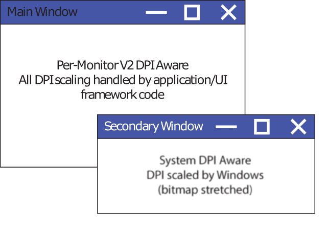

# High DPI Desktop Application Development on Windows

This content is targeted at developers who are looking to update desktop applications to handle display scale factor (dots per inch, or DPI) changes dynamically, allowing their applications to be crisp on any display they're rendered on.

To start, if you're creating a new Windows app from scratch, it is highly recommended that you create a [Universal Windows Platform (UWP)](/windows/uwp/get-started/whats-a-uwp) application. UWP applications automatically&mdash;and dynamically&mdash;scale for each display that they're running on.

Desktop applications using older Windows programming technologies (raw Win32 programming, Windows Forms, Windows Presentation Framework (WPF), etc.) are unable to automatically handle DPI scaling without additional developer work. Without such work, applications will appear blurry or incorrectly-sized in many common usage scenarios. This document provides context and information about what is involved in updating a desktop application to render correctly.

## Display Scale Factor & DPI

As display technology has progressed, display panel manufacturers have packed an increasing number of pixels into each unit of physical space on their panels. This has resulted in the dots per inch (DPI) of modern display panels being much higher than they have historically been. In the past, most displays had 96 pixels per linear inch of physical space (96 DPI); in 2017, displays with nearly 300 DPI or higher are readily available.

Most legacy desktop UI frameworks have built-in assumptions that the display DPI will not change during the lifetime of the process.  This assumption no longer holds true, with display DPIs commonly changing several times throughout an application process's lifetime. Some common scenarios where the display scale factor/DPI changes are:

-   Multiple-monitor setups where each display has a different scale factor and the application is moved from one display to another (such as a 4K and a 1080p display)
-   Docking and undocking a high DPI laptop with a low-DPI external display (or vice versa)
-   Connecting via Remote Desktop from a high DPI laptop/tablet to a low-DPI device (or vice versa)
-   Making a display-scale-factor settings change while applications are running

In these scenarios, UWP applications redraw themselves for the new DPI automatically. By default, and without additional developer work, desktop applications do not. Desktop applications that don't do this extra work to respond to DPI changes may appear blurry or incorrectly-sized to the user.

## DPI Awareness Mode

Desktop applications must tell Windows if they support DPI scaling. By default, the system considers desktop applications DPI unaware and bitmap-stretches their windows. By setting one of the following available DPI awareness modes, applications can explicitly tell Windows how they wish to handle DPI scaling:

### DPI Unaware

DPI unaware applications render at a fixed DPI value of 96 (100%). Whenever these applications are run on a screen with a display scale greater than 96 DPI, Windows will stretch the application bitmap to the expected physical size. This results in the application appearing blurry.

### System DPI Awareness

Desktop applications that are system DPI aware typically receive the DPI of the primary connected monitor as of the time of user sign-in. During initialization, they lay out their UI appropriately (sizing controls, choosing font sizes, loading assets, etc.) using that System DPI value. As such, System DPI-aware applications are not DPI scaled (bitmap stretched) by Windows on displays rendering at that single DPI. When the application is moved to a display with a different scale factor, or if the display scale factor otherwise changes, Windows will bitmap scale the application's windows, making them appear blurry. Effectively, System DPI-aware desktop applications only render crisply at a single display scale factor, becoming blurry whenever the DPI changes.

### Per-Monitor and Per-Monitor (V2) DPI Awareness

It is recommended that desktop applications be updated to use per-monitor DPI awareness mode, allowing them to immediately render correctly whenever the DPI changes. When an application reports to Windows that it wants to run in this mode, Windows will not bitmap stretch the application when the DPI changes, instead sending [WM\_DPICHANGED](wm-dpichanged.md) to the application window. It is then the complete responsibility of the application to handle resizing itself for the new DPI. Most UI frameworks used by desktop applications (Windows common controls (comctl32), Windows Forms, Windows Presentation Framework, etc.) do not support automatic DPI scaling, requiring developers to resize and reposition the contents of their windows themselves.

There are two versions of Per-Monitor awareness that an application can register itself as: version 1 and version 2 (PMv2). Registering a process as running in PMv2 awareness mode results in:

1.  The application being notified when the DPI changes (both the top-level and child HWNDs)
2.  The application seeing the raw pixels of each display
3.  The application never being bitmap scaled by Windows
4.  Automatic non-client area (window caption, scroll bars, etc.) DPI scaling by Windows
5.  Win32 dialogs (from [CreateDialog](/windows/desktop/api/winuser/nf-winuser-createdialogw)) automatically DPI scaled by Windows
6.  Theme-drawn bitmap assets in common controls (checkboxes, button backgrounds, etc.) being automatically rendered at the appropriate DPI scale factor

When running in Per-Monitor v2 Awareness mode, applications are notified when their DPI has changed. If an application does not resize itself for the new DPI, the application UI will appear too small or too large (depending on the difference in the previous and new DPI values).

> [!Note]  
> Per-Monitor V1 (PMv1) awareness is very limited. It is recommended that applications use PMv2.

The following table shows how applications will render under different scenarios:


| DPI Awareness Mode | Windows Version Introduced | Application's view of DPI | Behavior on DPI change | 
|--------------------|----------------------------|---------------------------|------------------------|
| Unaware | N/A | All displays are 96 DPI | Bitmap-stretching (blurry) | 
| System | Vista | All displays have the same DPI (the DPI of the primary display at the time the current user session was started) | Bitmap-stretching (blurry) | 
| Per-Monitor | 8.1 | The DPI of the display that the application window is primarily located on | <ul><li>Top-level HWND is notified of DPI change</li><li>No DPI scaling of any UI elements.</li></ul><br /> | 
| Per-Monitor V2 | Windows 10 Creators Update (1703) | The DPI of the display that the application window is primarily located on | <ul><li>Top-level <span class="underline">and</span> child HWNDs are notified of DPI change</li></ul><br /><span class="underline">Automatic DPI scaling of:</span><ul><li>Non-client area</li><li>Theme-drawn bitmaps in common controls (comctl32 V6)</li><li>Dialogs (<a href="/windows/desktop/api/winuser/nf-winuser-createdialogw">CreateDialog</a>)</li></ul><br /> | 


### Per Monitor (V1) DPI Awareness

Per-Monitor V1 DPI awareness mode (PMv1) was introduced with Windows 8.1. This DPI awareness mode is very limited and only offers the functionality listed below. It is recommended that desktop applications use Per-Monitor v2 awareness mode, supported on Windows 10 1703 or above.

The initial support for per-monitor awareness only offered applications the following:

1.  Top-level HWNDs are notified of a DPI change and provided a new suggested size
2.  Windows will not bitmap stretch the application UI
3.  The application sees all displays in physical pixels (see virtualization)

On Windows 10 1607 or above, PMv1 applications may also call [EnableNonClientDpiScaling](/windows/desktop/api/winuser/nf-winuser-enablenonclientdpiscaling) during WM\_NCCREATE to request that Windows correctly scale the window's non-client area.

## Per Monitor DPI Scaling Support by UI Framework / Technology

The table below shows the level of per-monitor DPI awareness support offered by various Windows UI frameworks as of Windows 10 1703:


| Framework / Technology | Support | OS Version | DPI Scaling handled by | Further Reading | 
|------------------------|---------|------------|------------------------|-----------------|
| Universal Windows Platform (UWP) | Full | 1607 | UI framework | <a href="/windows/uwp/get-started/whats-a-uwp">Universal Windows Platform (UWP)</a> | 
| Raw Win32/Common Controls V6 (comctl32.dll) | <ul><li>DPI change notification messages sent to all HWNDs</li><li>Theme-drawn assets render correctly in common controls</li><li>Automatic DPI scaling for dialogs</li></ul> | 1703 | Application | <a href="https://github.com/Microsoft/Windows-classic-samples/tree/master/Samples/DPIAwarenessPerWindow">GitHub Sample</a> | 
| Windows Forms | Limited automatic per-monitor DPI scaling for some controls | 1703 | UI framework | <a href="/dotnet/framework/winforms/high-dpi-support-in-windows-forms">High DPI Support in Windows Forms</a> | 
| Windows Presentation Framework (WPF) | Native WPF applications will DPI scale WPF hosted in other frameworks and other frameworks hosted in WPF do not automatically scale | 1607 | UI framework | <a href="https://github.com/Microsoft/WPF-Samples/tree/master/PerMonitorDPI">GitHub Sample</a> | 
| GDI | None | N/A | Application | See <a href="https://blogs.windows.com/buildingapps/2017/05/19/improving-high-dpi-experience-gdi-based-desktop-apps/">GDI High-DPI Scaling</a> | 
| GDI+ | None | N/A | Application | See <a href="https://blogs.windows.com/buildingapps/2017/05/19/improving-high-dpi-experience-gdi-based-desktop-apps/">GDI High-DPI Scaling</a> | 
| MFC | None | N/A | Application | N/A | 


 

## Updating Existing Applications

In order to update an existing desktop application to handle DPI scaling properly, it needs to be updated such that, at a minimum, the important parts of its UI are updated to respond to DPI changes.

Most desktop applications run under system DPI awareness mode. System-DPI-aware applications typically scale to the DPI of the primary display (the display that the system tray was located on at the time the Windows session was started). When the DPI changes, Windows will bitmap stretch the UI of these applications, which often results in them being blurry. When updating a System DPI-aware application to become per-monitor-DPI aware, the code which handles UI layout needs to be updated such that it is performed not only during application initialization, but also whenever a DPI change notification ([WM\_DPICHANGED](wm-dpichanged.md) in the case of Win32) is received. This typically involves revisiting any assumptions in the code that the UI only needs to be scaled once.

Also, in the case of Win32 programming, many Win32 APIs do not have any DPI or display context so they will only return values relative to the System DPI. It can be useful to grep through your code to look for some of these APIs and replace them with DPI-aware variants. Some of the common APIs that have DPI-aware variants are:


| Single DPI version   | Per-Monitor version        |
|----------------------|----------------------------|
| GetSystemMetrics     | GetSystemMetricsForDpi     |
| AdjustWindowRectEx   | AdjustWindowRectExForDpi   |
| SystemParametersInfo | SystemParametersInfoForDpi |
| GetDpiForMonitor     | GetDpiForWindow            |


 

It is also a good idea to search for hard-coded sizes in your codebase that assume a constant DPI, replacing them with code that correctly accounts for DPI scaling. Below is an example that incorporates all of these suggestions:

### Example:

The example below shows a simplified Win32 case of creating a child HWND. The call to CreateWindow assumes that the application is running at 96 DPI, and neither the button's size nor position will be correct at higher DPIs:


```
case WM_CREATE: 
{ 
    // Add a button 
    HWND hWndChild = CreateWindow(L"BUTTON", L"Click Me",  
        WS_CHILD|WS_VISIBLE|BS_PUSHBUTTON,  
        50,  
        50,  
        100,  
        50,  
        hWnd, (HMENU)NULL, NULL, NULL); 
} 
```


The updated code below shows:

1.  The window-creation code DPI scaling the position and size of the child HWND for the DPI of its parent window
2.  Responding to DPI change by repositioning and resizing the child HWND
3.  Hard-coded sizes removed and replaced with code that responds to DPI changes


```
#define INITIALX_96DPI 50 
#define INITIALY_96DPI 50 
#define INITIALWIDTH_96DPI 100 
#define INITIALHEIGHT_96DPI 50 
 
 
// DPI scale the position and size of the button control 
void UpdateButtonLayoutForDpi(HWND hWnd) 
{ 
    int iDpi = GetDpiForWindow(hWnd); 
    int dpiScaledX = MulDiv(INITIALX_96DPI, iDpi, 96); 
    int dpiScaledY = MulDiv(INITIALY_96DPI, iDpi, 96); 
    int dpiScaledWidth = MulDiv(INITIALWIDTH_96DPI, iDpi, 96); 
    int dpiScaledHeight = MulDiv(INITIALHEIGHT_96DPI, iDpi, 96); 
    SetWindowPos(hWnd, hWnd, dpiScaledX, dpiScaledY, dpiScaledWidth, dpiScaledHeight, SWP_NOZORDER | SWP_NOACTIVATE); 
} 
 
... 
 
case WM_CREATE: 
{ 
    // Add a button 
    HWND hWndChild = CreateWindow(L"BUTTON", L"Click Me",  
        WS_CHILD|WS_VISIBLE|BS_PUSHBUTTON, 
        0, 
        0, 
        0, 
        0, 
        hWnd, (HMENU)NULL, NULL, NULL); 
    if (hWndChild != NULL) 
    { 
        UpdateButtonLayoutForDpi(hWndChild); 
    } 
} 
break; 
 
case WM_DPICHANGED: 
{ 
    // Find the button and resize it 
    HWND hWndButton = FindWindowEx(hWnd, NULL, NULL, NULL); 
    if (hWndButton != NULL) 
    { 
        UpdateButtonLayoutForDpi(hWndButton); 
    } 
} 
break; 
```


When updating a System DPI-aware application, some common steps to follow are:

1.  Mark the process as per-monitor DPI aware (V2) using an application manifest (or other method, depending on the UI framework(s) used).
2.  Make UI layout logic reusable and move it out of application-initialization code such that it can be reused when a DPI change occurs (WM\_DPICHANGED in the case of Windows (Win32) programming).
3.  Invalidate any code that assumes that DPI-sensitive data (DPI/fonts/sizes/etc.) never need to be updated. It is a very common practice to cache font sizes and DPI values at process initialization. When updating an application to become per-monitor DPI aware, DPI-sensitive data must be reevaluated whenever a new DPI is encountered.
4.  When a DPI change occurs, reload (or re-rasterize) any bitmap assets for the new DPI or, optionally, bitmap stretch the currently loaded assets to the correct size.
5.  Grep for APIs that are not Per-Monitor DPI aware and replace them with Per-Monitor DPI-aware APIs (where applicable). Example: replace GetSystemMetrics with GetSystemMetricsForDpi.
6.  Test your application on a multiple-display/multi-DPI system.
7.  For any top-level windows in your application that you are unable to update to properly DPI scale, use mixed-mode DPI scaling (described below) to allow bitmap stretching of these top-level windows by the system.

## Mixed-Mode DPI Scaling (Sub-Process DPI Scaling)

When updating an application to support per-monitor DPI awareness, it can sometimes become impractical or impossible to update every window in the application in one go. This can simply be due to the time and effort required to update and test all UI, or because you do not own all of the UI code that you need to run (if your application perhaps loads third-party UI). In these situations, Windows offers a way to ease into the world of per-monitor awareness by letting you run some of your application windows (top-level only) in their original DPI-awareness mode while you focus your time and energy updating the more important parts of your UI.

Below is an illustration of what this could look like: you update your main application UI ("Main Window"  in the illustration) to run with per-monitor DPI awareness while you run other windows in their existing mode ("Secondary Window").



Prior to the Windows 10 Anniversary Update (1607), the DPI awareness mode of a process was a process-wide property. Beginning in the Windows 10 Anniversary Update, this property can now be set per **top-level** window. (**Child** windows must continue to match the scaling size of their parent.) A top-level window is defined as a window with no parent. This is typically a "regular" window with minimize, maximize, and close buttons. The scenario that sub-process DPI awareness is intended for is to have secondary UI scaled by Windows (bitmap stretched) while you focus your time and resources on updating your primary UI.

To enable sub-process DPI awareness, call [**SetThreadDpiAwarenessContext**](/windows/desktop/api/Winuser/nf-winuser-setthreaddpiawarenesscontext) before and after any window creation calls. The window that is created will be associated with the DPI awareness that you set via SetThreadDpiAwarenessContext. Use the second call to restore the current thread s DPI awareness.

While using sub-process DPI scaling enables you to rely on Windows to do some of the DPI scaling for your application, it can increase the complexity of your application. It is important that you understand the drawbacks of this approach and nature of the complexities that it introduces. For more information about sub-process DPI awareness, see [Mixed-Mode DPI Scaling and DPI-aware APIs.](high-dpi-improvements-for-desktop-applications.md)

## Testing Your Changes

After you have updated your application to become per-monitor DPI aware, it is important to validate your application properly responds to DPI changes in a mixed-DPI environment. Some specifics to test include:

1.  Moving application windows back and forth between displays of different DPI values
2.  Starting your application on displays of different DPI values
3.  Changing the scale factor for your monitor while the application is running
4.  Changing the display that you use as the primary display, _signing out of Windows_, then re-testing your application after signing back in. This is particularly useful in finding code that uses hard-coded sizes/dimensions.

## Common Pitfalls (Win32)

**Not using the suggested rectangle that is provided in WM\_DPICHANGED**

When Windows sends your application window a [**WM\_DPICHANGED**](wm-dpichanged.md) message, this message includes a suggested rectangle that you should use to resize your window. It is critical that your application use this rectangle to resize itself, as this will:

1.  Ensure that the mouse cursor will stay in the same relative position on the Window when dragging between displays
2.  Prevent the application window from getting into a recursive dpi-change cycle where one DPI change triggers a subsequent DPI change, which triggers yet another DPI change.

If you have application-specific requirements that prevent you from using the suggested rectangle that Windows provides in the WM\_DPICHANGED message, see [**WM\_GETDPISCALEDSIZE**](wm-getdpiscaledsize.md). This message can be used to give Windows a desired size you'd like used once the DPI change has occurred, while still avoiding the issues described above.

**Lack of documentation about virtualization**

When an HWND or process is running as either DPI unaware or system DPI aware, it can be bitmap stretched by Windows. When this happens, Windows scales and converts DPI-sensitive information from some APIs to the coordinate space of the calling thread. For example, if a DPI-unaware thread queries the screen size while running on a high-DPI display, Windows will virtualize the answer given to the application as if the screen were in 96 DPI units. Alternatively, when a System DPI-aware thread is interacting with a display at a different DPI than was in use when the current user's session was started, Windows will DPI-scale some API calls into the coordinate space that the HWND would be using if it were running at its original DPI scale factor.

When you update your desktop application to DPI scale properly, it can difficult to know which API calls can return virtualized values based on the thread context; this information is not currently sufficiently documented by Microsoft. Be aware that if you call any system API from a DPI-unaware or system-DPI-aware thread context, the return value might be virtualized. As such, make sure your thread is running in the DPI context you expect when interacting with the screen or individual windows. When temporarily changing a thread's DPI context using [SetThreadDpiAwarenessContext](/windows/desktop/api/Winuser/nf-winuser-setthreaddpiawarenesscontext), be sure to restore the old context when you're done to avoid causing incorrect behavior elsewhere in your application.

**Many Windows APIs do not have an DPI context**

Many legacy Windows APIs do not include a DPI or HWND context as part of their interface. As a result, developers often have to do additional work to handle the scaling of any DPI-sensitive information, such as sizes, points, or icons. As an example, developers using [LoadIcon](/windows/desktop/api/winuser/nf-winuser-loadiconw) must either bitmap stretch loaded icons or use alternate APIs to load correctly-sized icons for the appropriate DPI, such as [LoadImage](/windows/desktop/api/winuser/nf-winuser-loadimagew).

**Forced reset of process-wide DPI awareness**

In general, the DPI awareness mode of your process cannot be changed after process initialization. Windows can, however, forcibly change the DPI awareness mode of your process if you attempt to break the requirement that all HWNDs in a window tree have the same DPI awareness mode. On all versions of Windows, as of Windows 10 1703, it is not possible to have different HWNDs in an HWND tree run in different DPI awareness modes. If you attempt to create a child-parent relationship that breaks this rule, the DPI awareness of the entire process can be reset. This can be triggered by:

1.  A CreateWindow call where the passed in parent window is of a different DPI awareness mode than the calling thread.
2.  A SetParent call where the two windows are associated with different DPI awareness modes.

The table below shows what happens if you attempt to violate this rule:


| Operation                 | Windows 8.1                                  | Windows 10 (1607 and earlier)                | Windows 10 (1703 and later)                  |
|---------------------------|----------------------------------------------|----------------------------------------------|----------------------------------------------|
| CreateWindow (In-Proc)    | N/A                                          | **Child inherits** (mixed mode)              | **Child inherits** (mixed mode)              |
| CreateWindow (Cross-Proc) | **Forced reset** (of caller's process)       | **Child inherits** (mixed mode)              | **Forced reset** (of caller's process)       |
| SetParent (In-Proc)       | N/A                                          | **Forced reset** (of current process)        | **Fail** (ERROR\_INVALID\_STATE)             |
| SetParent (Cross-Proc)    | **Forced reset** (of child window's process) | **Forced reset** (of child window's process) | **Forced reset** (of child window's process) |


 

## Related topics

<dl> <dt>

[High DPI API Reference](high-dpi-reference.md)
</dt> <dt>

[Mixed-Mode DPI Scaling and DPI-aware APIs.](high-dpi-improvements-for-desktop-applications.md)
</dt> </dl>

