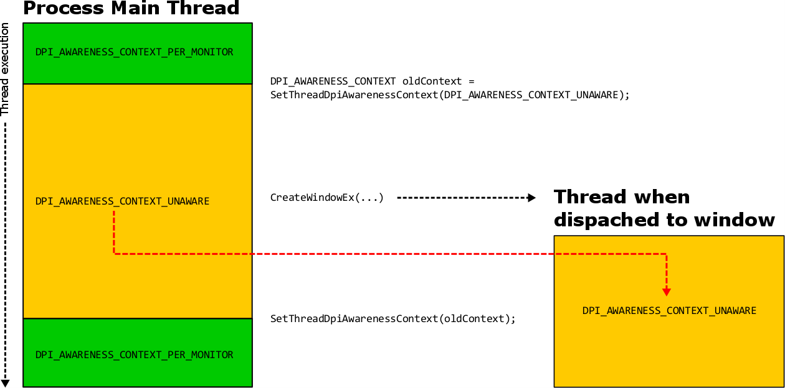

# Mixed-Mode DPI Scaling and DPI-aware APIs

## Sub-Process DPI Awareness Support

[**SetThreadDpiAwarenessContext**](/windows/desktop/api/Winuser/nf-winuser-setthreaddpiawarenesscontext) enables the use of different DPI scaling modes within a single process. Prior to the Windows 10 Anniversary Update, a window s DPI awareness was bound to the process-wide DPI awareness mode (DPI unaware, System DPI aware, or Per-Monitor DPI aware). But now, with **SetThreadDpiAwarenessContext**, top-level windows can have a DPI awareness mode that is different than that of the process-wide DPI awareness mode. This also effects child windows, as they will always have the same DPI awareness mode as their parent window.

The use of **SetThreadDpiAwarenessContext** enables developers to decide where they want to focus their development efforts when defining DPI-specific behavior for desktop applications. For example, an application's primary top-level window could be scaled on a per-monitor basis while secondary top-level windows could be scaled via bitmap-scaling by the operating system.

## The DPI Awareness Context

Prior to the availability of **SetThreadDpiAwarenessContext** the DPI awareness of a process was defined either in the manifest of the application binary or via a call to [**SetProcessDpiAwareness**](/windows/desktop/api/ShellScalingAPI/nf-shellscalingapi-setprocessdpiawareness) during process initialization. With **SetThreadDpiAwarenessContext**, each thread can have an individual DPI awareness context that may be different than that of the process-wide DPI awareness mode. The DPI awareness context of a thread is represented with the [****DPI\_AWARENESS\_CONTEXT****](dpi-awareness-context.md) type, and behaves in the following ways:

-   A thread can have its DPI awareness context changed at any time.
-   Any API calls that are made after the context is changed will run in the corresponding DPI context (and may be virtualized).
-   When a window is created, its DPI awareness is defined as the DPI awareness of the calling thread at that time.
-   When the window procedure for a window is called, the thread is automatically switched to the DPI awareness context that was in use when the window was created.

A common scenario for the use of **SetThreadDpiAwarenessContext** is as follows: Begin with a thread that is running with one context (such as **DPI\_AWARENESS\_CONTEXT\_PER\_MONITOR\_AWARE**) temporarily switch to a different context (**DPI\_AWARENESS\_CONTEXT\_UNAWARE**), create a window, and then immediately switch the thread context back to its previous state. The created window will have a DPI context of **DPI\_AWARENESS\_CONTEXT\_UNAWARE**, while the calling thread s context will be restored to **DPI\_AWARENESS\_CONTEXT\_PER\_MONITOR\_AWARE** with a subsequent call to **SetThreadDpiAwarenessContext**. In this scenario, the window associated with the calling thread would run with a per-monitor context (and therefore not be bitmap-stretched by the operating system) while the newly-created window would not be DPI aware (and therefore would be automatically bitmap stretched on a display set to >100% scaling).

Figure 1 illustrates how the main process thread executes with **DPI\_AWARENESS\_CONTEXT\_PER\_MONITOR**, switches its context to **DPI\_AWARENESS\_CONTEXT\_UNAWARE**, and creates a new window. The newly created window then executes with a DPI awareness context of **DPI\_AWARENESS\_CONTEXT\_UNAWARE** whenever a message is dispatched to it or API calls are made from it. Immediately after creating the new window the main thread is restored to its previous context of **DPI\_AWARENESS\_CONTEXT\_PER\_MONITOR**.

## New DPI-related APIs

In addition to the support for different DPI awareness modes within a single process that **SetThreadDpiAwarenessContext** offers, the following DPI-specific functionality has been added for desktop applications:<dl> <dd>[****EnableNonClientDpiScaling****](/windows/desktop/api/Winuser/nf-winuser-enablenonclientdpiscaling)<dl> <dt>

> [!Note]  
> The **Per Monitor V2** DPI awareness mode automatically enables this functionality, and calling **EnableNonClientDpiScaling** is therefore unnecessary in applications using it.

 

Calling **EnableNonClientDpiScaling** from within a window s **WM\_NCCREATE** handler will result in the non-client area of a top-level window automatically scaling for DPI. If the top-level window is per-monitor DPI-aware (whether because the process itself is per-monitor DPI-aware or because the window was created within a per-monitor DPI-aware thread), the caption bar, scroll bars, menus, and menu bars of these windows will DPI-scale whenever the window s DPI changes.
</dt> <dt>

Note that non-client areas of a child window, such as non-client scroll bars of a child edit control, will not DPI scale automatically when this API is used.
</dt> <dt>

> [!Note]  
> **EnableNonClientDpiScaling** must be called from the **WM\_NCCREATE** handler.

</dt> </dl> </dd> <dd> <b> The *ForDpi APIs </b>

-   Several frequently-used APIs such as [**GetSystemMetrics**](/windows/desktop/api/winuser/nf-winuser-getsystemmetrics) do not have any context of an HWND and therefore have no way of deducing the proper DPI awareness for their return values. Calling these APIs from a thread that is running in a different DPI awareness mode or context may return values that are not scaled for the context of the calling thread. [****GetSystemMetricForDpi****](/windows/desktop/api/Winuser/nf-winuser-getsystemmetricsfordpi), [****SystemParametersInfoForDpi****](/windows/desktop/api/Winuser/nf-winuser-systemparametersinfofordpi), and [****AdjustWindowRectExForDpi****](/windows/desktop/api/Winuser/nf-winuser-adjustwindowrectexfordpi) will perform the same functionality as their DPI unaware counterparts, but take a DPI as an argument and infer the dpi awareness from the current thread's context.
-   **GetSystemMetricForDpi** and **SystemParametersInfoForDpi** will return DPI-scaled system metric values and system parameter values in accordance to this equation:

    
    GetSystemMetrics(...) @ dpi == GetSystemMetricsForDpi(..., dpi)

    

     

    Therefore, calling **GetSystemMetrics** (or **SystemParametersInfoForDpi**), while running on a device with a certain system DPI value will return the same value that their DPI aware variants (**GetSystemMetricsForDpi** and **SystemParametersInfoForDpi**) will, given the same DPI value as input.

-   [**AdjustWindowRectExForDpi**](/windows/desktop/api/Winuser/nf-winuser-adjustwindowrectexfordpi) takes an HWND and will calculate the required size of a window rectangle in a DPI-sensitive way.

</dd> <dd>

</dd> <dd><b><a href="/windows/desktop/api/Winuser/nf-winuser-getdpiforwindow">GetDpiForWindow</a></b><dl> <dt> <b>GetDpiForWindow</b> will return the DPI associated with the HWND provided. The answer will depend on the DPI awareness mode of the HWND:

| DPI Awareness mode of HWND | Return value                                                                                                                                                                                                  |
|----------------------------|---------------------------------------------------------------------------------------------------------------------------------------------------------------------------------------------------------------|
| Unaware                    | 96                                                                                                                                                                                                            |
| System                     | The system DPI                                                                                                                                                                                                |
| Per-Monitor                | The DPI of display that the associated top-level window is primarily located on   (If a child window is provided, the DPI of the corresponding top-level parent window will be returned)  |

</dt> </dl> </dd> <dd><b><a href="/windows/desktop/api/Winuser/nf-winuser-getdpiforsystem">GetDpiForSystem</a></b><dl> <dt>

Calling **GetDpiForSystem** is more efficient than calling [**GetDC**](/windows/desktop/api/winuser/nf-winuser-getdc) and [**GetDeviceCaps**](/windows/desktop/api/wingdi/nf-wingdi-getdevicecaps) to obtain the system DPI.
</dt> <dt>

Any component that could be running in an application that uses sub-process DPI awareness should not assume that the system DPI is static during the lifecycle of the process. For example, if a thread that is running under **DPI\_AWARENESS\_CONTEXT\_UNAWARE** awareness context queries the system DPI, the answer will be 96. However, if that same thread switched to **DPI\_AWARENESS\_CONTEXT\_SYSTEM** awareness context and queried the system DPI again, the answer could be different. To avoid the use of a cached (and possibly stale) system-DPI value, use **GetDpiForSystem** to retrieve the system DPI relative to the DPI awareness mode of the calling thread. 
</dt> </dl> </dd> </dl>
