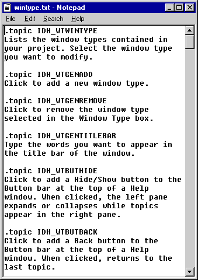

# To create a text file for pop-up help topics

1.  Open HTML Help Workshop.
2.  On the **File** menu, click **New**, and then click **Text**.
3.  Create an entry for each pop-up help topic, using the following format:

    ```
    .topic <i>topic ID</i> 
    <i>help topic</i>
    ```

    

    Where `topic ID`, is the symbolic ID of a specific dialog box control, and `help``topic` is the help text for the control.

4.  Save the text file.

The sample text file, below, is taken from HTML Help Workshop:



## Notes

-   If you use an `IDH` prefix with the topic ID, as shown in the example above, HTML Help Workshop will automatically check that the topics mapped in your project file actually exist in your compiled help (.chm) file, and that your context-sensitive help topics are all mapped in your project file.
-   The topic ID for each entry must be unique.
-   To simplify file management, you can store help topics in multiple text files.
-   You can also use Microsoft Notepad or any other text editor to create this text file.

## Related topics

<dl> <dt>

[Step 2: Create a Header File](to-create-a-header-file.md)
</dt> </dl>

 

 


