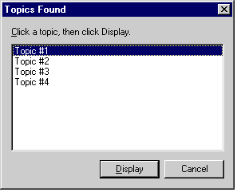

# Topics Found Display Options

When you use the [ALink](alink.md), [KLink](klink.md), and [Related Topics](related-topics.md) commands, you can specify, in the [Command](command-parameter.md) parameter, whether to display the list of topics in a dialog box or on a pop-up menu. Both display options will list up to 127 topics.

The following are examples of each display type:

-   [Dialog box](#dialog-box)
-   [Pop-up menu](#pop-up-menu)

## Dialog box

To specify a dialog box, type **,dialog** after the command name as in the following example:


```
<PARAM name="Command" value="Related Topics, dialog">
```




## Pop-up menu

To specify a pop-up menu, type **menu** after the command name as in the following example:


```
<PARAM name="Command" value="KLink, menu">
```


## Note

If no option is specified in the **Command** parameter, the Topics Found dialog box is used by default.

## Related topics

<dl> <dt>

[About Commands](about-commands.md)
</dt> </dl>

 

 


