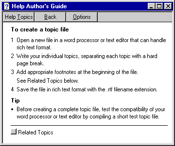
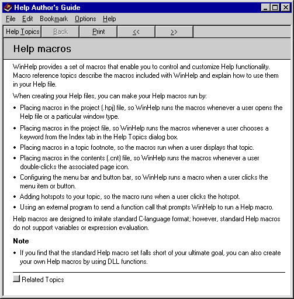

# WinHelp Window Types

When using the [WinHelp](winhelp.md) command, specify one of the following WinHelp window types. Specify a pop-up window in the [Command](command-parameter.md) parameter:

## Pop-up WinHelp window

## Secondary WinHelp window

## Primary WinHelp window (main)

## Notes

-   The specific window attributes, such as size, position, and background color, are based on the definitions in the \[WINDOWS\] section of the specified WinHelp project (.hpj) file.
-   If you do not specify a window type or a window name, the main window is used.

## Related topics

<dl> <dt>

[About Commands](about-commands.md)
</dt> </dl>

 

 

