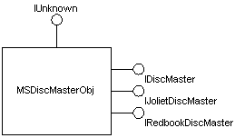

# About the Image Mastering API

This documentation focuses on a description of the Adaptec implementation of IMAPI for Microsoft (IMAPIv1). As such, descriptions of the four main COM objects and their interfaces are included in this document. The four main objects are as follows: **MSDiscMasterObj**, **MSDiscRecorderObj**, **MSDiscStashObj**, and **MSBurnEngineObj**.

There can be multiple **MSDiscMasterObj** objects instantiated on a system, but only one application can access a recorder at a time. The **MSDiscMasterObj** implements multiple interfaces, as shown in the following object diagram.

Applications use the [**IDiscMaster**](/windows/desktop/api/Imapi/nn-imapi-idiscmaster) interface to perform the following tasks:

-   Open IMAPI
-   Enumerate supported formats (Joliet and Redbook)
-   Select a format
-   Get a list of recorders
-   Select a recorder
-   Start a burn

The [**IJolietDiscMaster**](/windows/desktop/api/Imapi/nn-imapi-ijolietdiscmaster) and [**IRedbookDiscMaster**](/windows/desktop/api/Imapi/nn-imapi-iredbookdiscmaster) interfaces are returned to an application through the [**IDiscMaster**](/windows/desktop/api/Imapi/nn-imapi-idiscmaster) interface when a format is selected. These interfaces control the content of a data or audio disc, respectively. It is not expected that every application understand the specific format interfaces. Applications can access generic properties of the **IJolietDiscMaster** interface, such as volume name or legacy file name.

**MSDiscRecorderObj** objects are accessed through the [**IDiscRecorder**](/windows/desktop/api/Imapi/nn-imapi-idiscrecorder) interface. Every CD-R or CD-RW device that is compatible with IMAPI has a corresponding **MSDiscRecorderObj** object. An application uses pointers to the **IDiscRecorder** interface on those objects to select which device will be used by IMAPI to record a CD. In addition, applications can access generic properties of a recorder through **IDiscRecorder**. This includes such properties as writer speed or other burn parameters.

The remaining objects, **MSDiscStashObj** and **MSBurnEngineObj**, are internal objects accessed by IMAPI. They are mentioned here only to clarify the IMAPI architecture. The **MSDiscStashObj** represents (through the **IDiscStash** interface) a raw file up to 800 MB in size that is used by **MSDiscMasterObj** to create audio images or data discs to be burned. The stash is passed to the **MSBurnEngineObj** (through the **IMSBurnEngine** interface) when a burn is requested from the lower-level engine. The **MSBurnEngineObj** object expects the contents of the stash to be in a known format. In this respect, **MSDiscMasterObj** and **MSBurnEngineObj** have a contract regarding the contents of the stash.

 

 

