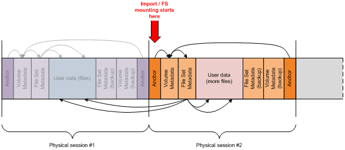
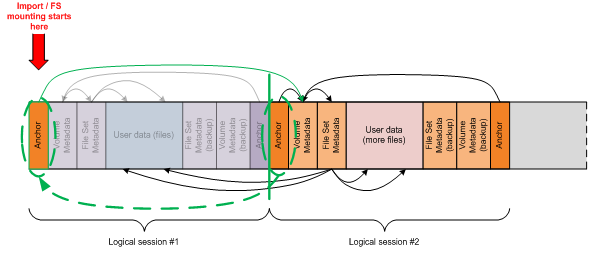

# IMAPI Multisession Layout

IMAPI provides application developers with the ability to create ISO 9660 and UDF file system images and burn them onto CD, DVD and Blu-Ray™ optical media. With Windows 7, IMAPI provides additional support for multisession burning on DVD and Blu-Ray™ rewritable media.

The following documentation details the disc layout that IMAPI utilizes to implement multisession. This information should be used to ensure interoperability between IMAPI and other burning software as well as allow the developers of this software to create IMAPI-compatible multisession disc images.

> [!Note]  
> For an example detailing the creation of a multisession disc, see [Creating a Multisession Disc](creating-a-multisession-disc.md).

 

## Multisession on Sequential Media

The IMAPI implementation of multisession on sequential media is supported for use with CD-R, CD-RW, DVD-R, DVD+R and Blu-Ray™ media. IMAPI uses the Session-At-Once recording mode for CD-RW, and as a result, in this scenario, the format is considered a sequential media type.

In a scenario involving multisession on sequential media using UDF, IMAPI writes out the anchor structures (UDF Anchor Volume Descriptor Pointer - AVDP), volume structures (UDF Volume Descriptor Sequence - VDS) , and the file system metadata structures (UDF File Set Descriptor - FSD) at the start of every new session as outlined in the following diagram:

> [!Note]  
> This figure illustrates the IMAPI disc layout when using UDF 2.50 with redundant metadata.

 

The data stored on sequentially recorded media consists of a number of physical sessions. Each session contains a complete file system representing user data as a set of files organized in directories. The file system metadata consists of a number of hierarchically organized data structures. At the top of the hierarchy reside anchor structures (AVDP) located at pre-defined Logical Block Addresses (LBAs). The anchor structures specify the locations of the next level structures which do not have predefined addresses. The next level of hierarchy after anchor structures contains the volume structures (VDS) that describe the properties of the volume and referencing the file system metadata structures (FSD), which in turn describe individual files and directories.

## Multisession on Rewritable Media

The approach for sequential media outlined in the previous section is incompatible with rewritable (non-sequential) media. These media formats include DVD-RW, DVD+RW, DVD-RAM, Blu-Ray™ rewritable and other random writable media, such as Iomega REV disks. Rewritable media does not support the concept of physical sessions corresponding to logical sessions, which are individual increments committed by a mastering application. Only a single physical session is exposed, which is an area starting at the beginning of the disc representing the entire addressable area that has the potential to contain multiple logical sessions.

> [!Note]  
> While DVD-RW is an exception in that it supports the concept of a physical session in the Sequential mode, this capability is currently not supported by IMAPI.

 

To address the lack of one-to-one mapping between physical and logical sessions on rewritable formats, IMAPI selectively updates the anchor structures (AVDP) in the *first* logical session to point to the new volume structures (VDS) and file system metadata structures (FSD) at the beginning of the *last* logical session as outlined in the following diagram:

> [!Note]  
> This figure illustrates the IMAPI disc layout when using UDF 2.50 with redundant metadata.

 

When adding a new logical session to a rewritable disc, IMAPI first determines the end of the last logical session by analyzing the volume metadata (VDS). IMAPI then adds the new logical session, complete with new anchor (AVDP), volume (VDS) and file system metadata structures (FSD), physically contiguous with the previously recorded logical session. The final step requires that the anchor structures (AVDP) at the beginning of the first logical session are updated to point to the volume structures (VDS) in the *new* logical session. The operational result is the same as with sequential media.

## Additional Recommendations

-   **Partition Layout**

    To achieve IMAPI compatiblity, it is recommended that third-party burning software developers use the disc layouts outlined in this documentation. Developers should avoid layouts with file system partitions occupying the entire disc, as this requires recording applications to locate free space within existing partitions whenever data needs to be appended to the disc. Oftentimes, the recording applications accomplish this by utilizing proprietary markers on the disc to indicate how much space is actually occupied by user data. Such disc layouts are incompatible with IMAPI as the proprietary markers are not recognized outside of the application they were created for.

-   **UDF Partition Type**

    IMAPI uses the **Read-Only** UDF partition type in its implementation of multisession on rewritable media. Developers of third-party burning software should use the **Read-Only** UDF partition type to achieve compatiblity with Windows mastered burning via IMAPI. If another UDF partition type such as **Rewritable** is used, IMAPI cannot provide mastering support.

## Related topics

<dl> <dt>

[Creating a Multisession Disc](creating-a-multisession-disc.md)
</dt> <dt>

[**IMultisessionRandomWrite**](/windows/desktop/api/imapi2/nn-imapi2-imultisessionrandomwrite)
</dt> </dl>

 

 

