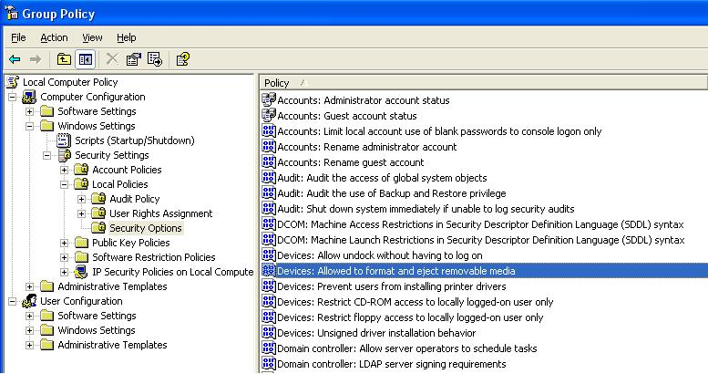

# Providing User Permissions for Media Burning Devices

By default, both Windows Vista and Windows Server 2008 grant read/write access to administrators and users logged directly into the machine (intermediate users). However, in Windows XP and Windows Server 2003 an administrator must grant these device read/write privileges to other user groups.

An administrator may adjust specific device-related permissions for power users and interactive users.

To reach the appropriate group permissions panel in Windows XP, click **Start**, click **Run**, type **gpedit.msc**, and then click **OK**. In the Group Policy interface, expand **Computer Configuration**, expand **Windows Settings**, expand **Security Settings**, expand **Local Policies**, and double-click **Security Options**.

At this panel, an administrator must specify the settings of two device options to provide the required group permissions:

-   Set "Devices: Restrict CD-ROM access to locally logged-on user only" to **Enabled**
-   Set "Devices: Allowed to format and eject removable media" to **Administrators and Power Users**. It is also possible to emulate Windows Vista permissions by setting this option to **Administrators and Interactive Users**.

While a specific UI does not exist in Windows XP or Windows Server 2003 for the use of [**SetSecurityInfo**](/windows/desktop/api/aclapi/nf-aclapi-setsecurityinfo) or [SetupDiSetDeviceRegistryProperty](/windows/win32/api/setupapi/nf-setupapi-setupdisetdeviceregistrypropertya), it is possible to use these APIs to grant custom user groups device permissions. For example, a call to **SetSecurityInfo** will grant permissions to user groups. Permission changes with this API are temporary and will not persist across a reboot. However, calling [SetupDiSetDeviceRegistryProperty](/windows/win32/api/setupapi/nf-setupapi-setupdisetdeviceregistrypropertya) will implement the permission changes in the registry, which will persist across a reboot.

## Related topics

<dl> <dt>

[Using IMAPI](using-imapi.md)
</dt> <dt>

[**SetSecurityInfo**](/windows/desktop/api/aclapi/nf-aclapi-setsecurityinfo)
</dt> <dt>

[SetupDiSetDeviceRegistryProperty](/windows/win32/api/setupapi/nf-setupapi-setupdisetdeviceregistrypropertya)
</dt> </dl>

 

 