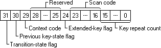

# Keyboard Input Overview

Applications should accept user input from the keyboard as well as from the mouse. An application receives keyboard input in the form of messages posted to its windows.

## Keyboard Input Model

The system provides device-independent keyboard support for applications by installing a keyboard device driver appropriate for the current keyboard. The system provides language-independent keyboard support by using the language-specific keyboard layout currently selected by the user or the application. The keyboard device driver receives scan codes from the keyboard, which are sent to the keyboard layout where they are translated into messages and posted to the appropriate windows in your application.

Assigned to each key on a keyboard is a unique value called a *scan code*, a device-dependent identifier for the key on the keyboard. A keyboard generates two scan codes when the user types a key—one when the user presses the key and another when the user releases the key.

The keyboard device driver interprets a scan code and translates (maps) it to a *virtual-key code*, a device-independent value defined by the system that identifies the purpose of a key. After translating a scan code, the keyboard layout creates a message that includes the scan code, the virtual-key code, and other information about the keystroke, and then places the message in the system message queue. The system removes the message from the system message queue and posts it to the message queue of the appropriate thread. Eventually, the thread's message loop removes the message and passes it to the appropriate window procedure for processing. The following figure illustrates the keyboard input model.


## Keyboard Focus and Activation

The system posts keyboard messages to the message queue of the foreground thread that created the window with the keyboard focus. The *keyboard focus* is a temporary property of a window. The system shares the keyboard among all windows on the display by shifting the keyboard focus, at the user's direction, from one window to another. The window that has the keyboard focus receives (from the message queue of the thread that created it) all keyboard messages until the focus changes to a different window.

A thread can call the [**GetFocus**](/windows/win32/api/winuser/nf-winuser-getfocus) function to determine which of its windows (if any) currently has the keyboard focus. A thread can give the keyboard focus to one of its windows by calling the [**SetFocus**](/windows/win32/api/winuser/nf-winuser-setfocus) function. When the keyboard focus changes from one window to another, the system sends a [**WM\_KILLFOCUS**](wm-killfocus.md) message to the window that has lost the focus, and then sends a [**WM\_SETFOCUS**](wm-setfocus.md) message to the window that has gained the focus.

The concept of keyboard focus is related to that of the active window. The *active window* is the top-level window the user is currently working with. The window with the keyboard focus is either the active window, or a child window of the active window. To help the user identify the active window, the system places it at the top of the Z order and highlights its title bar (if it has one) and border.

The user can activate a top-level window by clicking it, selecting it using the ALT+TAB or ALT+ESC key combination, or selecting it from the Task List. A thread can activate a top-level window by using the [**SetActiveWindow**](/windows/win32/api/winuser/nf-winuser-setactivewindow) function. It can determine whether a top-level window it created is active by using the [**GetActiveWindow**](/windows/win32/api/winuser/nf-winuser-getactivewindow) function.

When one window is deactivated and another activated, the system sends the [**WM\_ACTIVATE**](wm-activate.md) message. The low-order word of the *wParam* parameter is zero if the window is being deactivated and nonzero if it is being activated. When the default window procedure receives the **WM\_ACTIVATE** message, it sets the keyboard focus to the active window.

To block keyboard and mouse input events from reaching applications, use [**BlockInput**](/windows/win32/api/winuser/nf-winuser-blockinput). Note, the **BlockInput** function will not interfere with the asynchronous keyboard input-state table. This means that calling the [**SendInput**](/windows/win32/api/winuser/nf-winuser-sendinput) function while input is blocked will change the asynchronous keyboard input-state table.

## Keystroke Messages

Pressing a key causes a [**WM\_KEYDOWN**](wm-keydown.md) or [**WM\_SYSKEYDOWN**](wm-syskeydown.md) message to be placed in the thread message queue attached to the window that has the keyboard focus. Releasing a key causes a [**WM\_KEYUP**](wm-keyup.md) or [**WM\_SYSKEYUP**](wm-syskeyup.md) message to be placed in the queue.

Key-up and key-down messages typically occur in pairs, but if the user holds down a key long enough to start the keyboard's automatic repeat feature, the system generates a number of [**WM\_KEYDOWN**](wm-keydown.md) or [**WM\_SYSKEYDOWN**](wm-syskeydown.md) messages in a row. It then generates a single [**WM\_KEYUP**](wm-keyup.md) or [**WM\_SYSKEYUP**](wm-syskeyup.md) message when the user releases the key.

This section covers the following topics:

-   [System and Nonsystem Keystrokes](#system-and-nonsystem-keystrokes)
-   [Virtual-Key Codes Described](#virtual-key-codes-described)
-   [Keystroke Message Flags](#keystroke-message-flags)

### System and Nonsystem Keystrokes

The system makes a distinction between system keystrokes and nonsystem keystrokes. System keystrokes produce system keystroke messages, [**WM\_SYSKEYDOWN**](wm-syskeydown.md) and [**WM\_SYSKEYUP**](wm-syskeyup.md). Nonsystem keystrokes produce nonsystem keystroke messages, [**WM\_KEYDOWN**](wm-keydown.md) and [**WM\_KEYUP**](wm-keyup.md).

If your window procedure must process a system keystroke message, make sure that after processing the message the procedure passes it to the [**DefWindowProc**](/windows/desktop/api/winuser/nf-winuser-defwindowproca) function. Otherwise, all system operations involving the ALT key will be disabled whenever the window has the keyboard focus. That is, the user won't be able to access the window's menus or System menu, or use the ALT+ESC or ALT+TAB key combination to activate a different window.

System keystroke messages are primarily for use by the system rather than by an application. The system uses them to provide its built-in keyboard interface to menus and to allow the user to control which window is active. System keystroke messages are generated when the user types a key in combination with the ALT key, or when the user types and no window has the keyboard focus (for example, when the active application is minimized). In this case, the messages are posted to the message queue attached to the active window.

Nonsystem keystroke messages are for use by application windows; the [**DefWindowProc**](/windows/desktop/api/winuser/nf-winuser-defwindowproca) function does nothing with them. A window procedure can discard any nonsystem keystroke messages that it does not need.

### Virtual-Key Codes Described

The **wParam** parameter of a keystroke message contains the [virtual-key code](virtual-key-codes.md) of the key that was pressed or released. A window procedure processes or ignores a keystroke message, depending on the value of the virtual-key code.

A typical window procedure processes only a small subset of the keystroke messages that it receives and ignores the rest. For example, a window procedure might process only [**WM\_KEYDOWN**](wm-keydown.md) keystroke messages, and only those that contain virtual-key codes for the cursor movement keys, shift keys (also called control keys), and function keys. A typical window procedure does not process keystroke messages from character keys. Instead, it uses the [**TranslateMessage**](/windows/desktop/api/winuser/nf-winuser-translatemessage) function to convert the message into character messages. For more information about **TranslateMessage** and character messages, see [Character Messages](#character-messages).

### Keystroke Message Flags

The **lParam** parameter of a keystroke message contains additional information about the keystroke that generated the message. This information includes the [repeat count](#repeat-count), the [scan code](#scan-codes), the [extended-key flag](#extended-key-flag), the [context code](#context-code), the [previous key-state flag](#previous-key-state-flag), and the [transition-state flag](#transition-state-flag). The following illustration shows the locations of these flags and values in the **lParam** parameter.



An application can use the following values to get the keystroke flags from high-order word of the **lParam**.

| Value                       | Description                                                                       |
|-----------------------------|-----------------------------------------------------------------------------------|
| **KF\_EXTENDED**<br/>0x0100 | Manipulates the [extended key flag](#extended-key-flag).                          |
| **KF\_DLGMODE**<br/>0x0800  | Manipulates the dialog mode flag, which indicates whether a dialog box is active. |
| **KF\_MENUMODE**<br/>0x1000 | Manipulates the menu mode flag, which indicates whether a menu is active.         |
| **KF\_ALTDOWN**<br/>0x2000  | Manipulates the [context code flag](#context-code).                               |
| **KF\_REPEAT**<br/>0x4000   | Manipulates the [previous key state flag](#previous-key-state-flag).              |
| **KF\_UP**<br/>0x8000       | Manipulates the [transition state flag](#previous-key-state-flag).                |


Example code:

```cpp
case WM_KEYDOWN:
case WM_KEYUP:
case WM_SYSKEYDOWN:
case WM_SYSKEYUP:
{
    WORD vkCode = LOWORD(wParam);                                 // virtual-key code
    
    WORD keyFlags = HIWORD(lParam);

    WORD scanCode = LOBYTE(keyFlags);                             // scan code
    BOOL isExtendedKey = (keyFlags & KF_EXTENDED) == KF_EXTENDED; // extended-key flag, 1 if scancode has 0xE0 prefix
    
    if (isExtendedKey)
        scanCode = MAKEWORD(scanCode, 0xE0);

    BOOL wasKeyDown = (keyFlags & KF_REPEAT) == KF_REPEAT;        // previous key-state flag, 1 on autorepeat
    WORD repeatCount = LOWORD(lParam);                            // repeat count, > 0 if several keydown messages was combined into one message

    BOOL isKeyReleased = (keyFlags & KF_UP) == KF_UP;             // transition-state flag, 1 on keyup

    // if we want to distinguish these keys:
    switch (vkCode)
    {
    case VK_SHIFT:   // converts to VK_LSHIFT or VK_RSHIFT
    case VK_CONTROL: // converts to VK_LCONTROL or VK_RCONTROL
    case VK_MENU:    // converts to VK_LMENU or VK_RMENU
        vkCode = LOWORD(MapVirtualKeyW(scanCode, MAPVK_VSC_TO_VK_EX));
        break;
    }

    // ...
}
break;
```

### Repeat Count

You can check the repeat count to determine whether a keystroke message represents more than one keystroke. The system increments the count when the keyboard generates [**WM\_KEYDOWN**](wm-keydown.md) or [**WM\_SYSKEYDOWN**](wm-syskeydown.md) messages faster than an application can process them. This often occurs when the user holds down a key long enough to start the keyboard's automatic repeat feature. Instead of filling the system message queue with the resulting key-down messages, the system combines the messages into a single key down message and increments the repeat count. Releasing a key cannot start the automatic repeat feature, so the repeat count for [**WM\_KEYUP**](wm-keyup.md) and [**WM\_SYSKEYUP**](wm-syskeyup.md) messages is always set to 1.

### Scan Codes

:::image type="content" source="images/keyboard-key-locations.png" alt-text="Diagram of a Type 4 keyboard with the key locations for each key.":::

The scan code is the value that the system generates when the user presses a key. It is a value that identifies the key pressed regardless of the active [keyboard layout](/globalization/windows-keyboard-layouts), as opposed to the character represented by the key. An application typically ignores scan codes. Instead, it uses the virtual-key codes to interpret keystroke messages.

Modern keyboards are using [Human Interface Devices (HID)](https://www.usb.org/hid) specification to communicate with a computer. [Keyboard driver](/windows-hardware/drivers/hid/keyboard-and-mouse-class-drivers) converts reported HID Usage values sent from the keyboard to scan сodes and passes them on to applications.

> [!NOTE]
> While virtual key codes are typically more useful to desktop applications, scan codes might be required in specific cases when you need to know which key is pressed regardless of the current [keyboard layout](/globalization/windows-keyboard-layouts). For example, the WASD (W is up, A is left, S is down, and D is right) key bindings for games, which ensure a consistent key formation across [US QWERTY](/globalization/keyboards/kbdus_7) or [French AZERTY](/globalization/keyboards/kbdfr) keyboard layouts.

The following table lists the set of Scan Codes as presently recognized by Windows. **HID Usage Page**/**HID Usage ID**/**HID Usage Name** values reference the [HID Usage Tables](https://www.usb.org/hid) document. The **Key Location** values reference the preceding keyboard image.

The **Scan 1 Make** code is delivered in [**WM\_KEYDOWN**](wm-keydown.md)/[**WM\_KEYUP**](wm-keyup.md)/[**WM\_SYSKEYDOWN**](wm-syskeydown.md)/[**WM\_SYSKEYUP**](wm-syskeyup.md) and [**WM\_INPUT**](wm-input.md) messages.

| HID Usage Page Name | HID Usage Name                    | HID Usage Page | HID Usage ID | Scan 1 Make | Key Location |
|---------------------|-----------------------------------|:--------------:|:------------:|:-----------:|:------------:|
| Generic Desktop     | System Power Down                 | 0x0001         | 0x0081       | 0xE05E      |              |
| Generic Desktop     | System Sleep                      | 0x0001         | 0x0082       | 0xE05F      |              |
| Generic Desktop     | System Wake Up                    | 0x0001         | 0x0083       | 0xE063      |              |
| Keyboard/Keypad     | ErrorRollOver                     | 0x0007         | 0x0001       | 0x00FF      |              |
| Keyboard/Keypad     | Keyboard A                        | 0x0007         | 0x0004       | 0x001E      | 31           |
| Keyboard/Keypad     | Keyboard B                        | 0x0007         | 0x0005       | 0x0030      | 50           |
| Keyboard/Keypad     | Keyboard C                        | 0x0007         | 0x0006       | 0x002E      | 48           |
| Keyboard/Keypad     | Keyboard D                        | 0x0007         | 0x0007       | 0x0020      | 33           |
| Keyboard/Keypad     | Keyboard E                        | 0x0007         | 0x0008       | 0x0012      | 19           |
| Keyboard/Keypad     | Keyboard F                        | 0x0007         | 0x0009       | 0x0021      | 34           |
| Keyboard/Keypad     | Keyboard G                        | 0x0007         | 0x000A       | 0x0022      | 35           |
| Keyboard/Keypad     | Keyboard H                        | 0x0007         | 0x000B       | 0x0023      | 36           |
| Keyboard/Keypad     | Keyboard I                        | 0x0007         | 0x000C       | 0x0017      | 24           |
| Keyboard/Keypad     | Keyboard J                        | 0x0007         | 0x000D       | 0x0024      | 37           |
| Keyboard/Keypad     | Keyboard K                        | 0x0007         | 0x000E       | 0x0025      | 38           |
| Keyboard/Keypad     | Keyboard L                        | 0x0007         | 0x000F       | 0x0026      | 39           |
| Keyboard/Keypad     | Keyboard M                        | 0x0007         | 0x0010       | 0x0032      | 52           |
| Keyboard/Keypad     | Keyboard N                        | 0x0007         | 0x0011       | 0x0031      | 51           |
| Keyboard/Keypad     | Keyboard O                        | 0x0007         | 0x0012       | 0x0018      | 25           |
| Keyboard/Keypad     | Keyboard P                        | 0x0007         | 0x0013       | 0x0019      | 26           |
| Keyboard/Keypad     | Keyboard Q                        | 0x0007         | 0x0014       | 0x0010      | 17           |
| Keyboard/Keypad     | Keyboard R                        | 0x0007         | 0x0015       | 0x0013      | 20           |
| Keyboard/Keypad     | Keyboard S                        | 0x0007         | 0x0016       | 0x001F      | 32           |
| Keyboard/Keypad     | Keyboard T                        | 0x0007         | 0x0017       | 0x0014      | 21           |
| Keyboard/Keypad     | Keyboard U                        | 0x0007         | 0x0018       | 0x0016      | 23           |
| Keyboard/Keypad     | Keyboard V                        | 0x0007         | 0x0019       | 0x002F      | 49           |
| Keyboard/Keypad     | Keyboard W                        | 0x0007         | 0x001A       | 0x0011      | 18           |
| Keyboard/Keypad     | Keyboard X                        | 0x0007         | 0x001B       | 0x002D      | 47           |
| Keyboard/Keypad     | Keyboard Y                        | 0x0007         | 0x001C       | 0x0015      | 22           |
| Keyboard/Keypad     | Keyboard Z                        | 0x0007         | 0x001D       | 0x002C      | 46           |
| Keyboard/Keypad     | Keyboard 1 and Bang               | 0x0007         | 0x001E       | 0x0002      | 2            |
| Keyboard/Keypad     | Keyboard 2 and At                 | 0x0007         | 0x001F       | 0x0003      | 3            |
| Keyboard/Keypad     | Keyboard 3 And Hash               | 0x0007         | 0x0020       | 0x0004      | 4            |
| Keyboard/Keypad     | Keyboard 4 and Dollar             | 0x0007         | 0x0021       | 0x0005      | 5            |
| Keyboard/Keypad     | Keyboard 5 and Percent            | 0x0007         | 0x0022       | 0x0006      | 6            |
| Keyboard/Keypad     | Keyboard 6 and Caret              | 0x0007         | 0x0023       | 0x0007      | 7            |
| Keyboard/Keypad     | Keyboard 7 and Ampersand          | 0x0007         | 0x0024       | 0x0008      | 8            |
| Keyboard/Keypad     | Keyboard 8 and Star               | 0x0007         | 0x0025       | 0x0009      | 9            |
| Keyboard/Keypad     | Keyboard 9 and Left Bracket       | 0x0007         | 0x0026       | 0x000A      | 10           |
| Keyboard/Keypad     | Keyboard 0 and Right Bracket      | 0x0007         | 0x0027       | 0x000B      | 11           |
| Keyboard/Keypad     | Keyboard Return Enter             | 0x0007         | 0x0028       | 0x001C      | 43           |
| Keyboard/Keypad     | Keyboard Escape                   | 0x0007         | 0x0029       | 0x0001      | 110          |
| Keyboard/Keypad     | Keyboard Delete                   | 0x0007         | 0x002A       | 0x000E      | 15           |
| Keyboard/Keypad     | Keyboard Tab                      | 0x0007         | 0x002B       | 0x000F      | 16           |
| Keyboard/Keypad     | Keyboard Spacebar                 | 0x0007         | 0x002C       | 0x0039      | 61           |
| Keyboard/Keypad     | Keyboard Dash and Underscore      | 0x0007         | 0x002D       | 0x000C      | 12           |
| Keyboard/Keypad     | Keyboard Equals and Plus          | 0x0007         | 0x002E       | 0x000D      | 13           |
| Keyboard/Keypad     | Keyboard Left Brace               | 0x0007         | 0x002F       | 0x001A      | 27           |
| Keyboard/Keypad     | Keyboard Right Brace              | 0x0007         | 0x0030       | 0x001B      | 28           |
| Keyboard/Keypad     | Keyboard Pipe and Slash           | 0x0007         | 0x0031       | 0x002B      | 29           |
| Keyboard/Keypad     | Keyboard Non-US                   | 0x0007         | 0x0032       | 0x002B      | 42           |
| Keyboard/Keypad     | Keyboard SemiColon and Colon      | 0x0007         | 0x0033       | 0x0027      | 40           |
| Keyboard/Keypad     | Keyboard Left Apos and Double     | 0x0007         | 0x0034       | 0x0028      | 41           |
| Keyboard/Keypad     | Keyboard Grave Accent and Tilde   | 0x0007         | 0x0035       | 0x0029      | 1            |
| Keyboard/Keypad     | Keyboard Comma                    | 0x0007         | 0x0036       | 0x0033      | 53           |
| Keyboard/Keypad     | Keyboard Period                   | 0x0007         | 0x0037       | 0x0034      | 54           |
| Keyboard/Keypad     | Keyboard QuestionMark             | 0x0007         | 0x0038       | 0x0035      | 55           |
| Keyboard/Keypad     | Keyboard Caps Lock                | 0x0007         | 0x0039       | 0x003A      | 30           |
| Keyboard/Keypad     | Keyboard F1                       | 0x0007         | 0x003A       | 0x003B      | 112          |
| Keyboard/Keypad     | Keyboard F2                       | 0x0007         | 0x003B       | 0x003C      | 113          |
| Keyboard/Keypad     | Keyboard F3                       | 0x0007         | 0x003C       | 0x003D      | 114          |
| Keyboard/Keypad     | Keyboard F4                       | 0x0007         | 0x003D       | 0x003E      | 115          |
| Keyboard/Keypad     | Keyboard F5                       | 0x0007         | 0x003E       | 0x003F      | 116          |
| Keyboard/Keypad     | Keyboard F6                       | 0x0007         | 0x003F       | 0x0040      | 117          |
| Keyboard/Keypad     | Keyboard F7                       | 0x0007         | 0x0040       | 0x0041      | 118          |
| Keyboard/Keypad     | Keyboard F8                       | 0x0007         | 0x0041       | 0x0042      | 119          |
| Keyboard/Keypad     | Keyboard F9                       | 0x0007         | 0x0042       | 0x0043      | 120          |
| Keyboard/Keypad     | Keyboard F10                      | 0x0007         | 0x0043       | 0x0044      | 121          |
| Keyboard/Keypad     | Keyboard F11                      | 0x0007         | 0x0044       | 0x0057      | 122          |
| Keyboard/Keypad     | Keyboard F12                      | 0x0007         | 0x0045       | 0x0058      | 123          |
| Keyboard/Keypad     | Keyboard PrintScreen              | 0x0007         | 0x0046       | 0xE037<br>0x0054 \*Note 1 | 124          |
| Keyboard/Keypad     | Keyboard Scroll Lock              | 0x0007         | 0x0047       | 0x0046      | 125          |
| Keyboard/Keypad     | Keyboard Pause                    | 0x0007         | 0x0048       | 0xE11D45<br>0xE046 \*Note 2<br>0x0045 \*Note 3 | 126          |
| Keyboard/Keypad     | Keyboard Insert                   | 0x0007         | 0x0049       | 0xE052      | 75           |
| Keyboard/Keypad     | Keyboard Home                     | 0x0007         | 0x004A       | 0xE047      | 80           |
| Keyboard/Keypad     | Keyboard PageUp                   | 0x0007         | 0x004B       | 0xE049      | 85           |
| Keyboard/Keypad     | Keyboard Delete Forward           | 0x0007         | 0x004C       | 0xE053      | 76           |
| Keyboard/Keypad     | Keyboard End                      | 0x0007         | 0x004D       | 0xE04F      | 81           |
| Keyboard/Keypad     | Keyboard PageDown                 | 0x0007         | 0x004E       | 0xE051      | 86           |
| Keyboard/Keypad     | Keyboard RightArrow               | 0x0007         | 0x004F       | 0xE04D      | 89           |
| Keyboard/Keypad     | Keyboard LeftArrow                | 0x0007         | 0x0050       | 0xE04B      | 79           |
| Keyboard/Keypad     | Keyboard DownArrow                | 0x0007         | 0x0051       | 0xE050      | 84           |
| Keyboard/Keypad     | Keyboard UpArrow                  | 0x0007         | 0x0052       | 0xE048      | 83           |
| Keyboard/Keypad     | Keypad Num Lock and Clear         | 0x0007         | 0x0053       | 0x0045<br>0xE045 \*Note 3 | 90           |
| Keyboard/Keypad     | Keypad Forward Slash              | 0x0007         | 0x0054       | 0xE035      | 95           |
| Keyboard/Keypad     | Keypad Star                       | 0x0007         | 0x0055       | 0x0037      | 100          |
| Keyboard/Keypad     | Keypad Dash                       | 0x0007         | 0x0056       | 0x004A      | 105          |
| Keyboard/Keypad     | Keypad Plus                       | 0x0007         | 0x0057       | 0x004E      | 106          |
| Keyboard/Keypad     | Keypad ENTER                      | 0x0007         | 0x0058       | 0xE01C      | 108          |
| Keyboard/Keypad     | Keypad 1 and End                  | 0x0007         | 0x0059       | 0x004F      | 93           |
| Keyboard/Keypad     | Keypad 2 and Down Arrow           | 0x0007         | 0x005A       | 0x0050      | 98           |
| Keyboard/Keypad     | Keypad 3 and PageDn               | 0x0007         | 0x005B       | 0x0051      | 103          |
| Keyboard/Keypad     | Keypad 4 and Left Arrow           | 0x0007         | 0x005C       | 0x004B      | 92           |
| Keyboard/Keypad     | Keypad 5                          | 0x0007         | 0x005D       | 0x004C      | 97           |
| Keyboard/Keypad     | Keypad 6 and Right Arrow          | 0x0007         | 0x005E       | 0x004D      | 102          |
| Keyboard/Keypad     | Keypad 7 and Home                 | 0x0007         | 0x005F       | 0x0047      | 91           |
| Keyboard/Keypad     | Keypad 8 and Up Arrow             | 0x0007         | 0x0060       | 0x0048      | 96           |
| Keyboard/Keypad     | Keypad 9 and PageUp               | 0x0007         | 0x0061       | 0x0049      | 101          |
| Keyboard/Keypad     | Keypad 0 and Insert               | 0x0007         | 0x0062       | 0x0052      | 99           |
| Keyboard/Keypad     | Keypad Period                     | 0x0007         | 0x0063       | 0x0053      | 104          |
| Keyboard/Keypad     | Keyboard Non-US Slash Bar         | 0x0007         | 0x0064       | 0x0056      | 45           |
| Keyboard/Keypad     | Keyboard Application              | 0x0007         | 0x0065       | 0xE05D      | 129          |
| Keyboard/Keypad     | Keyboard Power                    | 0x0007         | 0x0066       | 0xE05E      |              |
| Keyboard/Keypad     | Keypad Equals                     | 0x0007         | 0x0067       | 0x0059      |              |
| Keyboard/Keypad     | Keyboard F13                      | 0x0007         | 0x0068       | 0x0064      |              |
| Keyboard/Keypad     | Keyboard F14                      | 0x0007         | 0x0069       | 0x0065      |              |
| Keyboard/Keypad     | Keyboard F15                      | 0x0007         | 0x006A       | 0x0066      |              |
| Keyboard/Keypad     | Keyboard F16                      | 0x0007         | 0x006B       | 0x0067      |              |
| Keyboard/Keypad     | Keyboard F17                      | 0x0007         | 0x006C       | 0x0068      |              |
| Keyboard/Keypad     | Keyboard F18                      | 0x0007         | 0x006D       | 0x0069      |              |
| Keyboard/Keypad     | Keyboard F19                      | 0x0007         | 0x006E       | 0x006A      |              |
| Keyboard/Keypad     | Keyboard F20                      | 0x0007         | 0x006F       | 0x006B      |              |
| Keyboard/Keypad     | Keyboard F21                      | 0x0007         | 0x0070       | 0x006C      |              |
| Keyboard/Keypad     | Keyboard F22                      | 0x0007         | 0x0071       | 0x006D      |              |
| Keyboard/Keypad     | Keyboard F23                      | 0x0007         | 0x0072       | 0x006E      |              |
| Keyboard/Keypad     | Keyboard F24                      | 0x0007         | 0x0073       | 0x0076      |              |
| Keyboard/Keypad     | Keypad Comma                      | 0x0007         | 0x0085       | 0x007E      | 107 \*Note 4  |
| Keyboard/Keypad     | Keyboard International1           | 0x0007         | 0x0087       | 0x0073      | 56 \*Note 4, 5 |
| Keyboard/Keypad     | Keyboard International2           | 0x0007         | 0x0088       | 0x0070      | 133 \*Note 5  |
| Keyboard/Keypad     | Keyboard International3           | 0x0007         | 0x0089       | 0x007D      | 14 \*Note 5   |
| Keyboard/Keypad     | Keyboard International4           | 0x0007         | 0x008A       | 0x0079      | 132 \*Note 5  |
| Keyboard/Keypad     | Keyboard International5           | 0x0007         | 0x008B       | 0x007B      | 131 \*Note 5  |
| Keyboard/Keypad     | Keyboard International6           | 0x0007         | 0x008C       | 0x005C      |              |
| Keyboard/Keypad     | Keyboard LANG1                    | 0x0007         | 0x0090       | 0x0072 \*Note 6<br>0x00F2 \*Note 3, 6 |              |
| Keyboard/Keypad     | Keyboard LANG2                    | 0x0007         | 0x0091       | 0x0071 \*Note 6<br>0x00F1 \*Note 3, 6 |              |
| Keyboard/Keypad     | Keyboard LANG3                    | 0x0007         | 0x0092       | 0x0078      |              |
| Keyboard/Keypad     | Keyboard LANG4                    | 0x0007         | 0x0093       | 0x0077      |              |
| Keyboard/Keypad     | Keyboard LANG5                    | 0x0007         | 0x0094       | 0x0076      |              |
| Keyboard/Keypad     | Keyboard LeftControl              | 0x0007         | 0x00E0       | 0x001D      | 58           |
| Keyboard/Keypad     | Keyboard LeftShift                | 0x0007         | 0x00E1       | 0x002A      | 44           |
| Keyboard/Keypad     | Keyboard LeftAlt                  | 0x0007         | 0x00E2       | 0x0038      | 60           |
| Keyboard/Keypad     | Keyboard Left GUI                 | 0x0007         | 0x00E3       | 0xE05B      | 127          |
| Keyboard/Keypad     | Keyboard RightControl             | 0x0007         | 0x00E4       | 0xE01D      | 64           |
| Keyboard/Keypad     | Keyboard RightShift               | 0x0007         | 0x00E5       | 0x0036      | 57           |
| Keyboard/Keypad     | Keyboard RightAlt                 | 0x0007         | 0x00E6       | 0xE038      | 62           |
| Keyboard/Keypad     | Keyboard Right GUI                | 0x0007         | 0x00E7       | 0xE05C      | 128          |
| Consumer            | Scan Next Track                   | 0x000C         | 0x00B5       | 0xE019      |              |
| Consumer            | Scan Previous Track               | 0x000C         | 0x00B6       | 0xE010      |              |
| Consumer            | Stop                              | 0x000C         | 0x00B7       | 0xE024      |              |
| Consumer            | Play/Pause                        | 0x000C         | 0x00CD       | 0xE022      |              |
| Consumer            | Mute                              | 0x000C         | 0x00E2       | 0xE020      |              |
| Consumer            | Volume Increment                  | 0x000C         | 0x00E9       | 0xE030      |              |
| Consumer            | Volume Decrement                  | 0x000C         | 0x00EA       | 0xE02E      |              |
| Consumer            | AL Consumer Control Configuration | 0x000C         | 0x0183       | 0xE06D      |              |
| Consumer            | AL Email Reader                   | 0x000C         | 0x018A       | 0xE06C      |              |
| Consumer            | AL Calculator                     | 0x000C         | 0x0192       | 0xE021      |              |
| Consumer            | AL Local Machine Browser          | 0x000C         | 0x0194       | 0xE06B      |              |
| Consumer            | AC Search                         | 0x000C         | 0x0221       | 0xE065      |              |
| Consumer            | AC Home                           | 0x000C         | 0x0223       | 0xE032      |              |
| Consumer            | AC Back                           | 0x000C         | 0x0224       | 0xE06A      |              |
| Consumer            | AC Forward                        | 0x000C         | 0x0225       | 0xE069      |              |
| Consumer            | AC Stop                           | 0x000C         | 0x0226       | 0xE068      |              |
| Consumer            | AC Refresh                        | 0x000C         | 0x0227       | 0xE067      |              |
| Consumer            | AC Previous Link                  | 0x000C         | 0x022A       | 0xE066      |              |

Notes:

1. *SysRq* key scan code is emmited on *Alt+Print screen* keystroke
2. *Break* key scan code is emmited on *Control+Pause* keystroke
3. As seen in [legacy keyboard messages](keyboard-input-notifications.md)
4. The key is present on Brazilian keyboards
5. The key is present on Japanese keyboards
5. The scan code is emmited in key release event only

### Extended-Key Flag

The extended-key flag indicates whether the keystroke message originated from one of the additional keys on the Enhanced 101/102-key keyboard. The extended keys consist of the ALT and CTRL keys on the right-hand side of the keyboard; the INS, DEL, HOME, END, PAGE UP, PAGE DOWN, and arrow keys in the clusters to the left of the numeric keypad; the NUM LOCK key; the BREAK (CTRL+PAUSE) key; the PRINT SCRN key; and the divide (/) and ENTER keys in the numeric keypad. The right-hand SHIFT key is not considered an extended-key, it has a separate scan code instead.

If specified, the scan code consists of a sequence of two bytes, where the first byte has a value of 0xE0.

### Context Code

The context code indicates whether the ALT key was down when the keystroke message was generated. The code is 1 if the ALT key was down and 0 if it was up.

### Previous Key-State Flag

The previous key-state flag indicates whether the key that generated the keystroke message was previously up or down. It is 1 if the key was previously down and 0 if the key was previously up. You can use this flag to identify keystroke messages generated by the keyboard's automatic repeat feature. This flag is set to 1 for [**WM\_KEYDOWN**](wm-keydown.md) and [**WM\_SYSKEYDOWN**](wm-syskeydown.md) keystroke messages generated by the automatic repeat feature. It is always set to 1 for [**WM\_KEYUP**](wm-keyup.md) and [**WM\_SYSKEYUP**](wm-syskeyup.md) messages.

### Transition-State Flag

The transition-state flag indicates whether pressing a key or releasing a key generated the keystroke message. This flag is always set to 0 for [**WM\_KEYDOWN**](wm-keydown.md) and [**WM\_SYSKEYDOWN**](wm-syskeydown.md) messages; it is always set to 1 for [**WM\_KEYUP**](wm-keyup.md) and [**WM\_SYSKEYUP**](wm-syskeyup.md) messages.

## Character Messages

Keystroke messages provide a lot of information about keystrokes, but they do not provide character codes for character keystrokes. To retrieve character codes, an application must include the [**TranslateMessage**](/windows/desktop/api/winuser/nf-winuser-translatemessage) function in its thread message loop. **TranslateMessage** passes a [**WM\_KEYDOWN**](wm-keydown.md) or [**WM\_SYSKEYDOWN**](wm-syskeydown.md) message to the keyboard layout. The layout examines the message's virtual-key code and, if it corresponds to a character key, provides the character code equivalent (taking into account the state of the SHIFT and CAPS LOCK keys). It then generates a character message that includes the character code and places the message at the top of the message queue. The next iteration of the message loop removes the character message from the queue and dispatches the message to the appropriate window procedure.

This section covers the following topics:

-   [Nonsystem Character Messages](#nonsystem-character-messages)
-   [Dead-Character Messages](#dead-character-messages)

### Nonsystem Character Messages

A window procedure can receive the following character messages: [**WM\_CHAR**](wm-char.md), [**WM\_DEADCHAR**](wm-deadchar.md), [**WM\_SYSCHAR**](/windows/desktop/menurc/wm-syschar), [**WM\_SYSDEADCHAR**](wm-sysdeadchar.md), and [**WM\_UNICHAR**](wm-unichar.md). The [**TranslateMessage**](/windows/desktop/api/winuser/nf-winuser-translatemessage) function generates a **WM\_CHAR** or **WM\_DEADCHAR** message when it processes a [**WM\_KEYDOWN**](wm-keydown.md) message. Similarly, it generates a **WM\_SYSCHAR** or **WM\_SYSDEADCHAR** message when it processes a [**WM\_SYSKEYDOWN**](wm-syskeydown.md) message.

An application that processes keyboard input typically ignores all but the [**WM\_CHAR**](wm-char.md) and [**WM\_UNICHAR**](wm-unichar.md) messages, passing any other messages to the [**DefWindowProc**](/windows/desktop/api/winuser/nf-winuser-defwindowprocw) function. Note that **WM\_CHAR** uses UTF-16 (16-bit Unicode Transformation Format) or ANSI character set while **WM\_UNICHAR** always uses UTF-32 (32-bit Unicode Transformation Format). The system uses the [**WM\_SYSCHAR**](/windows/desktop/menurc/wm-syschar) and [**WM\_SYSDEADCHAR**](wm-sysdeadchar.md) messages to implement menu mnemonics.

The **wParam** parameter of all character messages contains the character code of the character key that was pressed. The value of the character code depends on the window class of the window receiving the message. If the Unicode version of the [**RegisterClass**](/windows/win32/api/winuser/nf-winuser-registerclassw) function was used to register the window class, the system provides Unicode characters to all windows of that class. Otherwise, the system provides ANSI character codes. For more information, see [Registering Window Classes](/windows/win32/intl/registering-window-classes) and [Use UTF-8 code pages in Windows apps](/windows/apps/design/globalizing/use-utf8-code-page).

The contents of the **lParam** parameter of a character message are identical to the contents of the **lParam** parameter of the key-down message that was translated to produce the character message. For information, see [Keystroke Message Flags](#keystroke-message-flags).

### Dead-Character Messages

Some non-English keyboards contain character keys that are not expected to produce characters by themselves. Instead, they are used to add a diacritic to the character produced by the subsequent keystroke. These keys are called *dead keys*. The circumflex key on a German keyboard is an example of a dead key. To enter the character consisting of an "o" with a circumflex, a German user would type the circumflex key followed by the "o" key. The window with the keyboard focus would receive the following sequence of messages:

1.  [**WM\_KEYDOWN**](wm-keydown.md)
2.  [**WM\_DEADCHAR**](wm-deadchar.md)
3.  [**WM\_KEYUP**](wm-keyup.md)
4.  [**WM\_KEYDOWN**](wm-keydown.md)
5.  [**WM\_CHAR**](wm-char.md)
6.  [**WM\_KEYUP**](wm-keyup.md)

[**TranslateMessage**](/windows/desktop/api/winuser/nf-winuser-translatemessage) generates the [**WM\_DEADCHAR**](wm-deadchar.md) message when it processes the [**WM\_KEYDOWN**](wm-keydown.md) message from a dead key. Although the *wParam* parameter of the **WM\_DEADCHAR** message contains the character code of the diacritic for the dead key, an application typically ignores the message. Instead, it processes the [**WM\_CHAR**](wm-char.md) message generated by the subsequent keystroke. The *wParam* parameter of the **WM\_CHAR** message contains the character code of the letter with the diacritic. If the subsequent keystroke generates a character that cannot be combined with a diacritic, the system generates two **WM\_CHAR** messages. The *wParam* parameter of the first contains the character code of the diacritic; the *wParam* parameter of the second contains the character code of the subsequent character key.

The [**TranslateMessage**](/windows/desktop/api/winuser/nf-winuser-translatemessage) function generates the [**WM\_SYSDEADCHAR**](wm-sysdeadchar.md) message when it processes the [**WM\_SYSKEYDOWN**](wm-syskeydown.md) message from a system dead key (a dead key that is pressed in combination with the ALT key). An application typically ignores the **WM\_SYSDEADCHAR** message.

## Key Status

While processing a keyboard message, an application may need to determine the status of another key besides the one that generated the current message. For example, a word-processing application that allows the user to press SHIFT+END to select a block of text must check the status of the SHIFT key whenever it receives a keystroke message from the END key. The application can use the [**GetKeyState**](/windows/win32/api/winuser/nf-winuser-getkeystate) function to determine the status of a virtual key at the time the current message was generated; it can use the [**GetAsyncKeyState**](/windows/win32/api/winuser/nf-winuser-getasynckeystate) function to retrieve the current status of a virtual key.

The keyboard layout maintains a list of names. The name of a key that produces a single character is the same as the character produced by the key. The name of a noncharacter key such as TAB and ENTER is stored as a character string. An application can retrieve the name of any key from the device driver by calling the [**GetKeyNameText**](/windows/win32/api/winuser/nf-winuser-getkeynametexta) function.

## Keystroke and Character Translations

The system includes several special purpose functions that translate scan codes, character codes, and virtual-key codes provided by various keystroke messages. These functions include [**MapVirtualKey**](/windows/win32/api/winuser/nf-winuser-mapvirtualkeya), [**ToAscii**](/windows/win32/api/winuser/nf-winuser-toascii), [**ToUnicode**](/windows/win32/api/winuser/nf-winuser-tounicode), and [**VkKeyScan**](/windows/win32/api/winuser/nf-winuser-vkkeyscana).

In addition, Microsoft Rich Edit 3.0 supports the [HexToUnicode IME](/windows/desktop/Intl/hextounicode-ime), which allows a user to convert between hexadecimal and Unicode characters by using hot keys. This means that when Microsoft Rich Edit 3.0 is incorporated into an application, the application will inherit the features of the HexToUnicode IME.

## Hot-Key Support

A *hot key* is a key combination that generates a [**WM\_HOTKEY**](wm-hotkey.md) message, a message the system places at the top of a thread's message queue, bypassing any existing messages in the queue. Applications use hot keys to obtain high-priority keyboard input from the user. For example, by defining a hot key consisting of the CTRL+C key combination, an application can allow the user to cancel a lengthy operation.

To define a hot key, an application calls the [**RegisterHotKey**](/windows/win32/api/winuser/nf-winuser-registerhotkey) function, specifying the combination of keys that generates the [**WM\_HOTKEY**](wm-hotkey.md) message, the handle to the window to receive the message, and the identifier of the hot key. When the user presses the hot key, a **WM\_HOTKEY** message is placed in the message queue of the thread that created the window. The *wParam* parameter of the message contains the identifier of the hot key. The application can define multiple hot keys for a thread, but each hot key in the thread must have a unique identifier. Before the application terminates, it should use the [**UnregisterHotKey**](/windows/win32/api/winuser/nf-winuser-unregisterhotkey) function to destroy the hot key.

Applications can use a hot key control to make it easy for the user to choose a hot key. Hot key controls are typically used to define a hot key that activates a window; they do not use the [**RegisterHotKey**](/windows/win32/api/winuser/nf-winuser-registerhotkey) and [**UnregisterHotKey**](/windows/win32/api/winuser/nf-winuser-unregisterhotkey) functions. Instead, an application that uses a hot key control typically sends the [**WM\_SETHOTKEY**](wm-sethotkey.md) message to set the hot key. Whenever the user presses the hot key, the system sends a [**WM\_SYSCOMMAND**](/windows/desktop/menurc/wm-syscommand) message specifying SC\_HOTKEY. For more information about hot key controls, see "Using Hot Key Controls" in [Hot Key Controls](../controls/hot-key-controls.md).

## Keyboard Keys for Browsing and Other Functions

Windows provides support for keyboards with special keys for browser functions, media functions, application launching, and power management. The [**WM\_APPCOMMAND**](wm-appcommand.md) supports the extra keyboard keys. In addition, the [**ShellProc**](../winmsg/shellproc.md) function is modified to support the extra keyboard keys.

It is unlikely that a child window in a component application will be able to directly implement commands for these extra keyboard keys. So when one of these keys is pressed, [**DefWindowProc**](/windows/desktop/api/winuser/nf-winuser-defwindowproca) will send a [**WM\_APPCOMMAND**](wm-appcommand.md) message to a window. **DefWindowProc** will also bubble the **WM\_APPCOMMAND** message to its parent window. This is similar to the way context menus are invoked with the right mouse button, which is that **DefWindowProc** sends a [**WM\_CONTEXTMENU**](/windows/desktop/menurc/wm-contextmenu) message on a right button click, and bubbles it to its parent. Additionally, if **DefWindowProc** receives a **WM\_APPCOMMAND** message for a top-level window, it will call a shell hook with code **HSHELL\_APPCOMMAND**.

Windows also supports the Microsoft IntelliMouse Explorer, which is a mouse with five buttons. The two extra buttons support forward and backward browser navigation. For more information, see [XBUTTONs](about-mouse-input.md).

## Simulating Input

To simulate an uninterrupted series of user input events, use the [**SendInput**](/windows/win32/api/winuser/nf-winuser-sendinput) function. The function accepts three parameters. The first parameter, *cInputs*, indicates the number of input events that will be simulated. The second parameter, *rgInputs*, is an array of [**INPUT**](/windows/win32/api/winuser/ns-winuser-input) structures, each describing a type of input event and additional information about that event. The last parameter, *cbSize*, accepts the size of the **INPUT** structure, in bytes.

The [**SendInput**](/windows/win32/api/winuser/nf-winuser-sendinput) function works by injecting a series of simulated input events into a device's input stream. The effect is similar to calling the [**keybd_event**](/windows/win32/api/winuser/nf-winuser-keybd_event) or [**mouse\_event**](/windows/win32/api/winuser/nf-winuser-mouse_event) function repeatedly, except that the system ensures that no other input events intermingle with the simulated events. When the call completes, the return value indicates the number of input events successfully played. If this value is zero, then input was blocked.

The [**SendInput**](/windows/win32/api/winuser/nf-winuser-sendinput) function does not reset the keyboard's current state. Therefore, if the user has any keys pressed when you call this function, they might interfere with the events that this function generates. If you are concerned about possible interference, check the keyboard's state with the [**GetAsyncKeyState**](/windows/win32/api/winuser/nf-winuser-getasynckeystate) function and correct as necessary.

## Languages, Locales, and Keyboard Layouts

A *language* is a natural language, such as English, French, and Japanese. A *sublanguage* is a variant of a natural language that is spoken in a specific geographical region, such as the English sublanguages spoken in the United Kingdom and the United States. Applications use values, called [language identifiers](/windows/desktop/Intl/language-identifiers), to uniquely identify languages and sublanguages.

Applications typically use *locales* to set the language in which input and output is processed. Setting the locale for the keyboard, for example, affects the character values generated by the keyboard. Setting the locale for the display or printer affects the glyphs displayed or printed. Applications set the locale for a keyboard by loading and using keyboard layouts. They set the locale for a display or printer by selecting a font that supports the specified locale.

A keyboard layout not only specifies the physical position of the keys on the keyboard but also determines the character values generated by pressing those keys. Each layout identifies the current input language and determines which character values are generated by which keys and key combinations.

Every keyboard layout has a corresponding handle that identifies the layout and language. The low word of the handle is a language identifier. The high word is a device handle, specifying the physical layout, or is zero, indicating a default physical layout. The user can associate any input language with a physical layout. For example, an English-speaking user who very occasionally works in French can set the input language of the keyboard to French without changing the physical layout of the keyboard. This means the user can enter text in French using the familiar English layout.

Applications are generally not expected to manipulate input languages directly. Instead, the user sets up language and layout combinations, then switches among them. When the user clicks into text marked with a different language, the application calls the [**ActivateKeyboardLayout**](/windows/win32/api/winuser/nf-winuser-activatekeyboardlayout) function to activate the user's default layout for that language. If the user edits text in a language which is not in the active list, the application can call the [**LoadKeyboardLayout**](/windows/win32/api/winuser/nf-winuser-loadkeyboardlayouta) function with the language to get a layout based on that language.

The [**ActivateKeyboardLayout**](/windows/win32/api/winuser/nf-winuser-activatekeyboardlayout) function sets the input language for the current task. The *hkl* parameter can be either the handle to the keyboard layout or a zero-extended language identifier. Keyboard layout handles can be obtained from the [**LoadKeyboardLayout**](/windows/win32/api/winuser/nf-winuser-loadkeyboardlayouta) or [**GetKeyboardLayoutList**](/windows/win32/api/winuser/nf-winuser-getkeyboardlayoutlist) function. The **HKL\_NEXT** and **HKL\_PREV** values can also be used to select the next or previous keyboard.

The [**GetKeyboardLayoutName**](/windows/win32/api/winuser/nf-winuser-getkeyboardlayoutnamea) function retrieves the name of the active keyboard layout for the calling thread. If an application creates the active layout using the [**LoadKeyboardLayout**](/windows/win32/api/winuser/nf-winuser-loadkeyboardlayouta) function, **GetKeyboardLayoutName** retrieves the same string used to create the layout. Otherwise, the string is the primary language identifier corresponding to the locale of the active layout. This means the function may not necessarily differentiate among different layouts with the same primary language, so cannot return specific information about the input language. The [**GetKeyboardLayout**](/windows/win32/api/winuser/nf-winuser-getkeyboardlayout) function, however, can be used to determine the input language.

The [**LoadKeyboardLayout**](/windows/win32/api/winuser/nf-winuser-loadkeyboardlayouta) function loads a keyboard layout and makes the layout available to the user. Applications can make the layout immediately active for the current thread by using the **KLF\_ACTIVATE** value. An application can use the **KLF\_REORDER** value to reorder the layouts without also specifying the **KLF\_ACTIVATE** value. Applications should always use the **KLF\_SUBSTITUTE\_OK** value when loading keyboard layouts to ensure that the user's preference, if any, is selected.

For multilingual support, the [**LoadKeyboardLayout**](/windows/win32/api/winuser/nf-winuser-loadkeyboardlayouta) function provides the **KLF\_REPLACELANG** and **KLF\_NOTELLSHELL** flags. The **KLF\_REPLACELANG** flag directs the function to replace an existing keyboard layout without changing the language. Attempting to replace an existing layout using the same language identifier but without specifying **KLF\_REPLACELANG** is an error. The **KLF\_NOTELLSHELL** flag prevents the function from notifying the shell when a keyboard layout is added or replaced. This is useful for applications that add multiple layouts in a consecutive series of calls. This flag should be used in all but the last call.

The [**UnloadKeyboardLayout**](/windows/win32/api/winuser/nf-winuser-unloadkeyboardlayout) function is restricted in that it cannot unload the system default input language. This ensures that the user always has one layout available for enter text using the same character set as used by the shell and file system.
