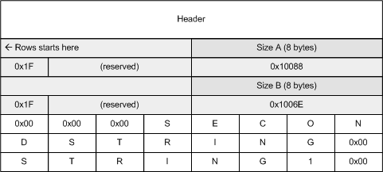
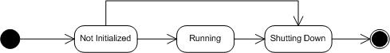

# Content Indexing Services Protocol

> [!NOTE]
> Windows Desktop Search 2.x is an obsolete technology that was originally available as an add-in for Windows XP and Windows Server 2003. On later releases, use [Windows Search](../search/-search-3x-wds-overview.md) instead.

Protocol Specification, Version 0.12

-   [1 Introduction](#1-introduction)
    -   [1.1 Glossary](#11-glossary)
    -   [1.2 References](#12-references)
    -   [1.3 Protocol Overview (Synopsis)](#13-protocol-overview-synopsis)
    -   [1.4 Relationship to Other Protocols](#14-relationship-to-other-protocols)
    -   [1.5 Prerequisites and Preconditions](#15-prerequisites-and-preconditions)
    -   [1.6 Applicability Statement](#16-applicability-statement)
    -   [1.7 Versioning and Capability Negotiation](#17-versioning-and-capability-negotiation)
    -   [1.8 Vendor-Extensible Fields](#18-vendor-extensible-fields)
    -   [1.9 Standards Assignments](#19-standards-assignments)
-   [2 Messages](#2-messages)
    -   [2.1 Transport](#21-transport)
    -   [2.2 Message Syntax](#22-message-syntax)
-   [3 Protocol Details](#3-protocol-details)
    -   [3.1 Server Details](#31-server-details)
    -   [3.2 Client Details](#32-client-details)
-   [4 Protocol Examples](#4-protocol-examples)
    -   [4.1 Example 1](#41-example-1)
    -   [4.2 Example 2](#42-example-2)
-   [5 Security](#5-security)
    -   [5.1 Security Considerations for Implementers](#51-security-considerations-for-implementers)
    -   [5.2 Index of Security Parameters](#52-index-of-security-parameters)
-   [6 Index of Version Specific Behavior](#6-index-of-version-specific-behavior)

This document is a specification of the Content Indexing Service Protocol.

The Workgroup Server Protocol Program (WSPP) documentation is intended for use in conjunction with public standards documentation, network programming art, and Windows workgroup distributed systems concepts, and assumes that the reader either is familiar with the aforementioned material or has immediate access to it.

A WSPP protocol specification does not require the use of Microsoft programming tools or programming environments in order for a Licensee to develop an implementation. Licensees who have access to Microsoft programming tools and environments are free to take advantage of them.

## 1 Introduction

-   [1.1 Glossary](#11-glossary)
-   [1.2 References](#12-references)
-   [1.3 Protocol Overview (Synopsis)](#13-protocol-overview-synopsis)
-   [1.4 Relationship to Other Protocols](#14-relationship-to-other-protocols)
-   [1.5 Prerequisites and Preconditions](#15-prerequisites-and-preconditions)
-   [1.6 Applicability Statement](#16-applicability-statement)
-   [1.7 Versioning and Capability Negotiation](#17-versioning-and-capability-negotiation)
-   [1.8 Vendor-Extensible Fields](#18-vendor-extensible-fields)
-   [1.9 Standards Assignments](#19-standards-assignments)

### 1.1 Glossary

> [!Note]  
> The following terms are defined in the Glossary section of \[MS-SYS\]:
>
> -   GUID
> -   Little Endian
> -   Named Pipe
> -   Path

 

**Binding**: A request to include a particular **column** in a returned **rowset** . The **binding** specifies a property to be included in the search results.

**Bookmark**: A marker that uniquely identifies a row within a set of rows.

**Catalog**: The highest-level unit of organization in the indexing service. It represents a set of indexed documents against which queries can be executed using the Content Indexing Service Protocol.

**Category**: A hierarchical grouping of rows. For example, a query result containing author and title columns can be categorized based on author. Each group of rows containing the same value for author would constitute a category.

**Chapter** : A range of **rows** within a set of **rows** .

**Column**: The container for a single type of information in a **row** . Columns map to property names, and specify which properties are used for the search query's **command** **tree** elements.

**Command Tree**: A combination of **restrictions** , **categories** , and **sort orders** specified for the search query.

**Cursor**: An entity that is used as a mechanism to work with one **row** or a small block of **rows** at a time in a set of data returned in a result set. A **cursor** is positioned on a single **row** within the result set. After the **cursor** is positioned on a row, operations can be performed on that **row** , or on a block of **rows** starting at that position.

**Handle**: A token that can be used to identify and access **cursors** , **chapters** , and **bookmarks** .

**Index**: A persistent structure that contains the text content pulled out of files by an **indexing service** . This includes the list of words, which are stored along with the containing file name, word location, and **locale** .

**Indexing**: The process of extracting text and properties from files and storing the extracted values into the **indexes** (for text), and the **property cache** (for properties).

**Indexing Service**: A service that creates indexed **catalogs** for the contents and properties of file systems. Applications can search the catalogs for information from the files on the indexed file system.

**Locale**: An identifier, as specified in \[MS-GPSI\] Appendix A, that specifies preferences related to language. These preferences indicate how dates and times are to be formatted, items are to be sorted alphabetically, strings are to be compared, and so on.

**Natural Language Query**: A query constructed using human language instead of query syntax.

**Noise word**: A word that is ignored by the indexing service when present in the **restrictions** specified for the search query because it has little discriminatory value. English examples include "a", "and" and "the".

**Property Cache**: A cache of file properties extracted by an **indexing service** .

**Property Indexing**: The process of creating an **index** of **value-type properties** of a document, including author, subject, type, word count, printed page count, and any other properties.

**Restriction**: A set of conditions that a file must meet to be included in the search results returned by the **indexing service** in response to a search query. A **restriction** narrows the focus of a search query, limiting the files that the **indexing service** will include in the search results to only those that match the conditions.

**Row**: The collection of **columns** , containing the property values that describe a single file from the set of files that matched the **restrictions** specified in the search query submitted to the **indexing service** .

**Rowset**: A set of **rows** returned in the search results.

**Sort Order**: The set of rules in a search query that define the ordering of rows in the search result. Each rule consists of a property (name, size, etc.) and a direction for the ordering (ascending or descending). Multiple rules are applied sequentially

**Text-type Property**: A property that describes the content of a document and has only unformatted text associated with its name.

**Value-type Property**: A property that describes a single attribute of an entire document. A value-type property has a data type ID and a value of that data type associated with its name.

**Virtual Root**: An alternate path to a folder. A physical folder can have zero or more virtual roots. Paths beginning with a virtual root are called virtual paths. For example, /server/vanityroot might be a virtual root of C:\\IIS\\web\\folder1. Then the file C:\\IIS\\web\\folder1\\default.htm would have a virtual path of /server/vanityroot/default.htm.

**MAY, SHOULD, MUST, SHOULD NOT, MUST NOT**: These terms (in all caps) are used as described in \[RFC2119\]. All statements of optional behavior use either MAY, SHOULD, or SHOULD NOT.

### 1.2 References

### 1.2.1 Normative References

\[IEEE754\] Institute of Electrical and Electronics Engineers, "Standard for Binary Floating-Point Arithmetic", IEEE 754-1985, October 1985, https://standards.ieee.org/standard/754-1985.html

\[MS-DCOM\] Microsoft Corporation, "Distributed Component Object Model Remote Protocols", June 2006.

\[MS-GPSI\] Microsoft Corporation, "Group Policy Software Installation Extension", June 2006.

\[MS-SMB\] Microsoft Corporation, "Microsoft Server Message Block (SMB) Protocol and Extensions," May 2006.

\[MS-SYS\] Microsoft Corporation, "System Overview v4", July 2006.

\[SALTON\] Salton, G., "Automatic Text Processing: The Transformation Analysis and Retrieval of Information by Computer", 1988, ISBN 0-201-2227-8.

\[UNICODE\] The Unicode Consortium, "The Unicode Standard, Version 2.0", 1996, https://www.unicode.org

### 1.2.2 Informative References

\[MSDN-OLEDB\] Microsoft Corporation, OLE DB, https://msdn.microsoft.com/library/default.asp?url=/library/oledb/htm/dasdkoledboverview.asp.

\[MSDN-QUERYERR\] Microsoft Corporation, Query-Execution Values, https://msdn.microsoft.com/library/default.asp?url=/library/indexsrv/html/ixreferr\_5df7.asp

### 1.3 Protocol Overview (Synopsis)

A content **indexing service** helps efficiently organize the extracted features of a collection of documents. The Content Indexing Service Protocol (CISP) allows a client to communicate with a server hosting an indexing service to issue queries and to allow an administrator to manage the indexing server.

When processing files, an indexing service analyzes a set of documents and reorganizes their content in such a way that **properties** of those documents can be efficiently returned in response to queries. A collection of documents that can be queried comprises a **catalog** . A catalog may contain an **index** (for quick reference to text) and a **property cache** (for quick retrieval of property values).

Conceptually, a catalog consists of a logical "table" of properties with the text or value and corresponding locale stored in **columns** of the table. Each "row" of the table corresponds to a separate document in the scope of the catalog and each "column" of the table corresponds to a property.

The specific tasks performed by CISP are grouped into two functional areas:

-   Remote administration of indexing service catalogs,
-   Remote querying of indexing service catalogs.

### 1.3.1 Remote Administration Tasks

CISP enables the following indexing service catalog management tasks from a client:

-   Query the current state of an indexing service catalog on the server.
-   Update the state of an indexing service catalog.
-   Launch the indexing process for a particular set of files.
-   Initiate optimization of an index in order to improve query performance.

All remote administration tasks follow a simple request/response model. No state is maintained on the client for any administration call and administrative calls can be made in any order.

### 1.3.2 Remote Querying

CISP enables clients to perform search queries against a remote server hosting an indexing service.

Sending a search query is a multi-step process initiated by the client. The steps are as follows:

1.  The client requests a connection to a server hosting an indexing service.
2.  The client sends the parameters for the search query, which include:
    -   The **restrictions** to specify which documents are to be included and/or excluded from the search results.
    -   The order in which the search results are to be returned.
    -   The columns to be returned in the result set.
    -   The maximum number of **rows** that should be returned for the query.
    -   The maximum time for query execution.

        Once the server has acknowledged the client's request to initiate the query, the client can request status information about the query, but this is not a required step.

3.  The client then specifies which properties the server should include in the search results.
4.  The client requests a result set from the server, and the server responds by sending the client the property values for files that were included in the results for the client's search query. If the value of a property is too large to fit in a single response buffer the server will not send the property but instead will set the property status to deferred. The client then requests the property value separately using a series of requests for successive chunks of the value, and then resumes requesting other values.
5.  Once the client is finished with the search query and no longer requires additional results, the client contacts the server to release the query.
6.  Once the server has released the query, the client may send a request to disconnect from the server. The connection is then closed. Alternatively, the client may issue another query and repeat the sequence from the step 2.

Windows Behavior: This protocol is implemented on Windows 2000, Windows XP, Windows Server 2003, and Windows Vista.

### 1.4 Relationship to Other Protocols

The CISP relies on the SMB \[MS-SMB\] protocol for message transport. No other protocol depends directly on the Content Indexing Service Protocol.

*Windows Behavior: Applications typically interact with an OLE DB interface wrapper \[MSDN-OLEDB\] (e.g., a protocol client) and not directly with the protocol.*

### 1.5 Prerequisites and Preconditions

It is assumed that the client has obtained the name of the server and a catalog name before this protocol is invoked. How a client does this is outside of the scope of this specification.

It is also assumed that the client and server have a security association usable with named pipes \[MS-SMB\].

### 1.6 Applicability Statement

CISP is designed for querying and managing catalogs on a remote server from a client. CISP is deprecated on Windows Vista.

### 1.7 Versioning and Capability Negotiation

This protocol has no versioning or capability negotiation mechanisms.

### 1.8 Vendor-Extensible Fields

This protocol uses HRESULTs which are vendor-extensible. Vendors are free to choose their own values for this field, as long as the C bit (0x20000000) is set as specified in Section 4.1.1 of \[MS-SYS\], indicating it is a customer code.

This protocol also uses NTSTATUS values taken from the NTSTATUS number space defined in \[MS-SYS\]. Vendors SHOULD reuse those values with their indicated meaning. Choosing any other value runs the risk of a collision in the future.

*Windows Behavior: Windows only uses the values specified in Section 4.1.3 of \[MS-SYS\].*

### 1.8.1 Property IDs

Properties are represented by IDs known as Property IDs. Each property must have a globally unique identifier. This identifier consists of a **GUID** representing a collection of properties called a property set plus either a string or 32-bit integer to identify the property within the set. If the integer form of ID is used, then the values 0x00000000, 0xFFFFFFFF and 0xFFFFFFFE are considered invalid.

Vendors can guarantee their properties are uniquely defined by placing them in a property set defined by their own GUID.

### 1.9 Standards Assignments

This protocol has no standards assignments, only private assignments made by Microsoft using allocation procedures specified in other protocols.

Microsoft has allocated this protocol a named pipe as specified in \[MS-SMB\]. The assignment is:

| Parameter | Value             | Reference  |
|-----------|-------------------|------------|
| Pipe name | \\pipe\\CI\_SKADS | \[MS-SMB\] |

 

## 2 Messages

-   [2.1 Transport](#21-transport)
-   [2.2 Message Syntax](#22-message-syntax)

### 2.1 Transport

All messages MUST be transported using a named pipe, as specified in \[MS-SMB\]. The following pipe name is used:

-   \\pipe\\CI\_SKADS

This protocol uses the underlying SMB named pipe protocol to retrieve the identity of the caller that made the connection as specified in Section 2.2.8 of \[MS-SMB\]; the client MUST set SECURITY\_IDENTIFICATION as the ImpersonationLevel in the request to open the named pipe.

### 2.2 Message Syntax

Several structures and messages in the following sections refer to chapter or bookmark handles. A handle is a 32-bit long opaque structure which uniquely identifies a chapter or bookmark. Typically, client applications receive handle values via method calls; however there are several well known values which need not be obtained from a server, the meaning of which is specified in the following table:

| Value                         | Meaning                                                                      |
|-------------------------------|------------------------------------------------------------------------------|
| DB\_NULL\_HCHAPTER 0x00000000 | A chapter handle to the unchaptered rowset, containing all query results.    |
| DBBMK\_FIRST 0x00000001       | A bookmark handle to a bookmark that identifies the first row in the rowset. |
| DBBMK\_LAST 0x00000002        | A bookmark handle to a bookmark that identifies the last row in the rowset.  |

 

### 2.2.1 Structures

This section details data structures that are defined and used by CISP.

All 2-, 4- and 8-byte signed and unsigned integers in the following structures MUST be transferred in little-endian byte order.

The following table summarizes the data structures defined in this section.

| Structure                    | Description                                                                                                            |
|------------------------------|------------------------------------------------------------------------------------------------------------------------|
| CBaseStorageVariant          | Contains the value on which to perform a match operation for a property specified in a CPropertyRestriction structure. |
| SAFEARRAY, SAFEARRAY2        | Contains a multidimensional array.                                                                                     |
| SAFEARRAYBOUND               | Represents the bounds for a dimension of an array specified in a SAFEARRAY structure.                                  |
| CFullPropSpec                | Contains a property specification.                                                                                     |
| CContentRestriction          | Contains a string to match for a property value in the property cache.                                                 |
| CKey                         | Contains a property value.                                                                                             |
| CInternalPropertyRestriction | Contains a property value to match with an operation.                                                                  |
| CNatLanguageRestriction      | Contains a natural language query match for a property.                                                                |
| CNodeRestriction             | Contains an array of command tree nodes specifying the restrictions for a query.                                       |
| COccRestriction              | Contains the location of a word in a phrase.                                                                           |
| CPropertyRestriction         | Contains a property value to match with an operation.                                                                  |
| CRangeRestriction            | Contains a restriction on a range of values.                                                                           |
| CScopeRestriction            | Contains a restriction on the files to be searched.                                                                    |
| CSort                        | Identifies a column to sort.                                                                                           |
| CSynRestriction              | Contains a word or its synonyms for a query phrase.                                                                    |
| CVectorRestriction           | Contains a weighted OR operation on a command tree node.                                                               |
| CWordRestriction             | Contains a word for a query phrase.                                                                                    |
| CRestriction                 | Contains a node of a query command tree.                                                                               |
| CColumnSet                   | Indicates the number of columns to return.                                                                             |
| CCategorizationSet           | Contains information about the grouping of a set of query results.                                                     |
| CCategorizationSpec          | Contains a definition of categories into which query results will be categorized.                                      |
| CDbColId                     | Contains a column.                                                                                                     |
| CDbProp                      | Contains a property.                                                                                                   |
| CDbPropSet                   | Contains a set of properties.                                                                                          |
| CPidMapper                   | Contains an array of property IDs specifying the properties to return in a rowset.                                     |
| CRowSeekAt                   | Contains the offset at which to retrieve rows in a CPMGetRowsIn message                                                |
| CRowSeekAtRatio              | Identifies the point at which to begin retrieval for a CPMGetRowsIn message.                                           |
| CRowSeekByBookmark           | Identifies the bookmarks from which to retrieve rows for a CPMGetRowsIn message.                                       |
| CRowSeekNext                 | Contains the number of rows to skip in a CPMGetRowsIn message.                                                         |
| CRowsetProperties            | Contains the configuration information for a query.                                                                    |
| CSortSet                     | Contains the sort order for a query.                                                                                   |
| CTableColumn                 | Contains a column for the CPMSetBindings message.                                                                      |
| SERIALIZEDPROPERTYVALUE      | Contains a serialized value.                                                                                           |

 

### 2.2.1.1 CBaseStorageVariant

The CBaseStorageVariant structure contains the value on which to perform a match operation for a property specified in the CPropertyRestriction structure.

0

1

2

3

4

5

6

7

8

9

1  0 

1

2

3

4

5

6

7

8

9

2  0 

1

2

3

4

5

6

7

8

9

3  0 

1

vType

vData1

vData2

vValue (variable)

 

**vType**: A type indicator, indicating the type of vValue. It MUST be one of the VARENUM values specified in the following table.

| Value                 | Meaning                                                                                                                              |
|-----------------------|--------------------------------------------------------------------------------------------------------------------------------------|
| VT\_EMPTY (0x0000)    | vValue is not present.                                                                                                               |
| VT\_NULL (0x0001)     | vValue is not present.                                                                                                               |
| VT\_I1 (0x0010)       | A 1-byte signed integer.                                                                                                             |
| VT\_UI1 (0x0011)      | A 1-byte unsigned integer.                                                                                                           |
| VT\_I2 (0x0002)       | A 2-byte signed integer.                                                                                                             |
| VT\_UI2 (0x0012)      | A 2-byte unsigned integer.                                                                                                           |
| VT\_BOOL (0x000B)     | A boolean value; a 2-byte integer containing 0x0000 (FALSE) or 0xFFFF (TRUE).                                                        |
| VT\_I4 (0x0003)       | A 4-byte signed integer.                                                                                                             |
| VT\_UI4 (0x0013)      | A 4-byte unsigned integer.                                                                                                           |
| VT\_R4 (0x0004)       | An IEEE 32-bit floating-point number, as defined in \[IEEE754\].                                                                     |
| VT\_INT (0x0016)      | A 4-byte signed integer.                                                                                                             |
| VT\_UINT (0x0017)     | A 4-byte unsigned integer.                                                                                                           |
| VT\_ERROR (0x000A)    | A 4-byte unsigned integer containing an HRESULT, as specified in \[MS-SYS\].                                                         |
| VT\_I8 (0x0014)       | An 8 byte signed integer.                                                                                                            |
| VT\_UI8 (0x0015)      | An 8-byte unsigned integer.                                                                                                          |
| VT\_R8 (0x0005)       | An IEEE 64-bit floating-point number as defined in \[IEEE754\].                                                                      |
| VT\_CY (0x0006)       | An 8-byte two's complement integer (scaled by 10,000).                                                                               |
| VT\_DATE (0x0007)     | A 64-bit floating-point number representing the number of days since 00:00:00 on December 31, 1899 (Coordinated Universal Time).     |
| VT\_FILETIME (0x0040) | A 64-bit integer representing the number of 100-nanosecond intervals since 00:00:00 on January 1, 1601 (Coordinated Universal Time). |
| VT\_DECIMAL (0x000E)  | A DECIMAL structure as specified in section 2.2.1.1.1.1.                                                                             |
| VT\_CLSID (0x0048)    | A 16-byte binary value containing a GUID.                                                                                            |
| VT\_BLOB (0x0041)     | A 4-byte unsigned integer count of bytes in the blob, followed by that many bytes of data.                                           |
| VT\_BSTR (0x0008)     | A 4-byte unsigned integer count of bytes in the string, followed by a string, as specified below under vValue.                       |
| VT\_LPSTR (0x001E)    | A null-terminated ANSI string.                                                                                                       |
| VT\_LPWSTR (0x001F)   | A null-terminated Unicode \[UNICODE\] string.                                                                                        |
| VT\_VARIANT (0x000C)  | CBaseStorageVariant. MUST be combined with a type modifier of VT\_ARRAY or VT\_VECTOR.                                               |

 

The following table specifies the type modifiers for vType. Type modifiers can be binary ORed with vType, to change the meaning of vValue to indicate it is one of two possible array types.

| Value               | Meaning                                                                                                                                                                                                                                                                                                                                                            |
|---------------------|--------------------------------------------------------------------------------------------------------------------------------------------------------------------------------------------------------------------------------------------------------------------------------------------------------------------------------------------------------------------|
| VT\_VECTOR (0x1000) | If the type indicator is combined with VT\_VECTOR by using an OR operator, vValue is a counted array of values of the indicated type. See section 2.2.1.1.1.2 for details.   This type modifier MUST NOT be combined with the following types: VT\_INT, VT\_UINT, VT\_DECIMAL, VT\_BLOB, VT\_BLOB\_OBJECT.                                     |
| VT\_ARRAY (0x2000)  | If the type indicator is combined with VT\_ARRAY by an OR operator, the value is a SAFEARRAY (as specified in section 2.2.1.1.1.3) containing values of the indicated type.   This type modifier MUST NOT be combined with the following types: VT\_I8, VT\_UI8, VT\_FILETIME, VT\_CLSID, VT\_BLOB, VT\_BLOB\_OBJECT, VT\_LPSTR, VT\_LPWSTR.   |

 

**vData1**: When vType is VT\_DECIMAL, the value of this field is specified as the Scale field in section 2.2.1.1.1.1. For all other vTypes, the value MUST be set to 0x00.

**vData2**: When vType is VT\_DECIMAL, the value of this field is specified as the Sign field in section 2.2.1.1.1.1. For all other vTypes, the value MUST be set to 0x00.

**vValue**: The value for the match operation. The syntax MUST be as indicated in the vType field.

The following table summarizes sizes for the vValue field, dependent upon the vType field for fixed-length data types. The size is in bytes.

| vType                                                   | Size |
|---------------------------------------------------------|------|
| VT\_I1, VT,\_UI1                                        | 1    |
| VT\_I2, VT\_UI2, VT\_BOOL                               | 2    |
| VT\_I4, VT\_UI4, VT\_R4, VT\_INT, VT\_UINT, VT\_ERROR   | 4    |
| VT\_I8, VT\_UI8, VT\_R8, VT\_CY, VT\_DATE, VT\_FILETIME | 8    |
| VT\_DECIMAL, VT\_CLSID                                  | 16   |

 

If vType is set to VT\_BLOB, VT\_BSTR or VT\_LPSTR then the structure of vValue is specified in the following diagram:

0

1

2

3

4

5

6

7

8

9

1  0 

1

2

3

4

5

6

7

8

9

2  0 

1

2

3

4

5

6

7

8

9

3  0 

1

cbSize

blobData (variable, optional)

 

**cbSize**: Unsigned 32-bit integer, indicating the size of the blobData field in bytes. If vType is set to VT\_BSTR or VT\_LPSTR, cbSize MUST be set to 0x00000000 when the string represented is an empty string.

**blobData**: MUST be of length cbSize in bytes.

For vType set to VT\_BLOB, this field is opaque binary blob data.

For vType set to VT\_BSTR, this field is a set of characters in an OEM selected character set. The client and server MUST be configured to have interoperable character sets (out of band of the protocol). There is no requirement that it be null-terminated.

For vType set to VT\_LPSTR this field is a null-terminated character string in an OEM selected character set. The client and server MUST be configured to have interoperable character sets (out of band of the protocol).

If vType is set to VT\_LPWSTR then the structure of vValue is specified in the following diagram:

0

1

2

3

4

5

6

7

8

9

1  0 

1

2

3

4

5

6

7

8

9

2  0 

1

2

3

4

5

6

7

8

9

3  0 

1

ccLen

string (variable, optional)

 

**ccLen**: Unsigned 32-bit integer, indicating the size of the string field in Unicode characters. MUST be set to 0x00000000 for an empty string.

**string**: Null-terminated Unicode string.

### 2.2.1.1.1 CBaseStorageVariant Structures

The following structures are used in the CBaseStorageVariant structure.

### 2.2.1.1.1.1 DECIMAL

DECIMAL is used to represent an exact numeric value with a fixed precision and fixed scale.

When vType is set to VT\_DECIMAL (0x0000E), the vData1 and vData2 fields of CBaseStorageVariant MUST be interpreted as follows:

**vData1**: The number of digits to the right of the decimal point. MUST be in the range 0 to 28.

**vData2**: The sign of the numeric value. Set to 0x00 if positive, 0x80 if negative.

The format of the vValue field is:

0

1

2

3

4

5

6

7

8

9

1  0 

1

2

3

4

5

6

7

8

9

2  0 

1

2

3

4

5

6

7

8

9

3  0 

1

Hi32

Lo32

Mid32

 

**Hi32**: The highest 32 bits of the 96 bit integer.

**Lo32**: The lowest 32 bits of the 96 bit integer.

**Mid32**: The middle 32 bits of the 96 bit integer.

### 2.2.1.1.1.2 VT\_VECTOR

VT\_Vector is used to pass one-dimensional arrays.

0

1

2

3

4

5

6

7

8

9

1  0 

1

2

3

4

5

6

7

8

9

2  0 

1

2

3

4

5

6

7

8

9

3  0 

1

vVectorElements

vVectorData

 

**vVectorElements**: Unsigned 32-bit integer, indicating the number of elements in the vVectorData field.

**vVectorData**: An array of items which have a type indicated by vType with the 0x1000 bit cleared. The size of an individual fixed-length item can be obtained from the fixed-length data type table, as specified in Section 2.2.1.1. The length of this field, in bytes, can be calculated by multiplying vVectorElements by the size of individual item.

For variable-length data types vVectorData contains a sequence of consecutively marshaled simple types where the type is indicated by vType with the 0x1000 bit cleared. This includes a special case indicated by vType VT\_ARRAY \| VT\_VARIANT (i.e., 0x100C).

The elements in the vVectorData field MUST be separated by 0 to 3 padding bytes such that each element begins at an offset that is a multiple of 4 bytes from the beginning of the message that contains this array. If padding bytes are present, the value they contain is arbitrary. The content of the padding bytes MUST be ignored by the receiver.

For a vType set to VT\_ARRAY \| VT\_VARIANT, the type for items in this sequence is CBaseStorageVariant.

### 2.2.1.1.1.3 SAFEARRAY

SAFEARRAY is used to pass multidimensional arrays. The structure contains array size information as well as the data in the array.

0

1

2

3

4

5

6

7

8

9

1  0 

1

2

3

4

5

6

7

8

9

2  0 

1

2

3

4

5

6

7

8

9

3  0 

1

cDims

fFeatures

cbElements

Rgsabound (variable)

vData (variable)

 

**cDims**: Unsigned 16-bit integer, indicating the number of dimensions of the multidimensional array.

**fFeatures**: A 16-bit bitfield. The values represent features, defined by upper layer applications and MUST be ignored.

**cbElements**: A 32-bit unsigned integer specifying the size of each element of the array.

**Rgsabound**: An array that contains one SAFEARRAYBOUND structure, as specified in section 2.2.1.1.1.4, per dimension in the SAFEARRAY. This array has left-most dimension first, and right-most dimension last.

**vData**: A vector of marshaled items of a particular type, indicated by the vType of the containing CBaseStorageVariant, with the bit 0x2000 cleared.

vData is marshaled similarly to VT\_VECTOR, as specified in Section 2.2.1.1.1.2, with the difference that the number of items is not stored in front of the vector. Rather the number of items is calculated by multiplying the cElements value with all safe array bounds given in the Rgsabound field. Elements are stored in a vector in order of dimensions, iterating beginning with the right-most dimension.

The following diagram visually represents a sample two-dimensional array. The first dimension has cElements equal to 4 (represented horizontally) and lLbound equal to 0, and the second dimension has cElements equal to 2 (represented vertically) and lLbound equal to 0.

|            |            |            |            |
|------------|------------|------------|------------|
| 0x00000001 | 0x00000002 | 0x00000003 | 0x00000005 |
| 0x00000007 | 0x00000011 | 0x00000013 | 0x00000017 |

 

Using the diagram above, vData will contain the following sequence: 0x00000001, 0x00000007, 0x00000002, 0x00000011, 0x00000003, 0x00000013, 0x00000005, 0x00000017 (iterating through the rightmost dimension first, then incrementing the next dimension). The preceding Rgsabound (which records cElements and Lbound) would be: 0x00000004, 0x00000000, 0x00000002, 0x00000000.

### 2.2.1.1.1.4 SAFEARRAYBOUND

The SAFEARRAYBOUND structure represents the bounds of one dimension of a SAFEARRAY or SAFEARRAY2. Its format is:

0

1

2

3

4

5

6

7

8

9

1  0 

1

2

3

4

5

6

7

8

9

2  0 

1

2

3

4

5

6

7

8

9

3  0 

1

cElements

lLbound

 

**cElements**: A 32-bit unsigned integer, specifying the number of elements in the dimension.

**lLbound**: A 32-bit unsigned integer, specifying the lower bound of the dimension.

### 2.2.1.1.1.5 SAFEARRAY2

SAFEARRAY2 is used to pass multidimensional arrays in SERIALIZEDPROPERTYVALUE. The structure contains boundary information as well as the data.

0

1

2

3

4

5

6

7

8

9

1  0 

1

2

3

4

5

6

7

8

9

2  0 

1

2

3

4

5

6

7

8

9

3  0 

1

cDims

Rgsabound (variable)

vData (variable)

 

**cDims**: Unsigned 32-bit integer, indicating the number of dimensions of the SAFEARRAY2.

**Rgsabound**: An array that contains one SAFEARRAYBOUND structure, as specified in section 2.2.1.1.1.4 per dimension in the SAFEARRAY2. This array has left-most dimension first, and right-most dimension last.

**vData**: A vector of marshaled items of a particular type, indicated by the dwType of the containing SERIALIZEDPROPERTYVALUE, with bit 0x2000 cleared. The format of vData the same as that specified for the vData field of SAFEARRAY in Section 2.2.1.1.1.3.

### 2.2.1.2 CFullPropSpec

The CFullPropSpec structure contains a property set GUID and a property identifier to uniquely identify property.

0

1

2

3

4

5

6

7

8

9

1  0 

1

2

3

4

5

6

7

8

9

2  0 

1

2

3

4

5

6

7

8

9

3  0 

1

\_guidPropSet

...

...

...

ulKind

PrSpec

Property name (variable)

 

**\_guidPropSet**: The GUID of the property set to which the property belongs.

**ulKind**: A 32-bit unsigned integer. One of the following values below, that indicates the contents of PrSpec.

| Value                                            | Meaning                                                                                  |
|--------------------------------------------------|------------------------------------------------------------------------------------------|
| PRSPEC\_ LPWSTR  0x00000000  | The PrSpec field specifies the number of non-NULL characters in the Property name field. |
| PRSPEC\_PROPID  0x00000001   | The PrSpec field specifies the property ID (PROPID).                                     |

 

**PrSpec**: A 32-bit unsigned integer with a meaning as indicated by the ulKind field.

**Property name**: If ulKind is set to PRSPEC\_PROPID, this field MUST NOT be present. If ulKind is set to PRSPEC\_LPWSTR, then this field MUST contain a case-insensitive array of PrSpec non-null Unicode characters, containing the name of the property.

### 2.2.1.3 CContentRestriction

The CContentRestriction structure contains a string to match for a property in the property cache.

0

1

2

3

4

5

6

7

8

9

1  0 

1

2

3

4

5

6

7

8

9

2  0 

1

2

3

4

5

6

7

8

9

3  0 

1

\_Property (variable)

...

Padding1 (variable)

Cc

\_pwcsPhrase (variable)

...

Padding2 (variable)

lcid

\_ulGenerateMethod

 

**\_Property**: A CFullPropSpec structure, as specified in Section 2.2.1.2. This field indicates the property on which to perform a match operation.

**Padding1**: This field MUST be 0 to 3 bytes in length. The length of this field MUST be such that the following field begins at an offset that is a multiple of 4 bytes from the beginning of the message that contains this structure. If this field is present (i.e. length nonzero), the value it contains is arbitrary. The content of this field MUST be ignored by the receiver.

**Cc**: A 32-bit unsigned integer, specifying the number of characters in the \_pwcsPhrase field.

**\_pwcsPhrase**: A non null-terminated Unicode string representing the word or phrase to match for the property. This field MUST NOT be empty. The Cc field contains the length of the string.

**Padding2**: This field MUST be 0 to 3 bytes in length. The length of this field MUST be such that the following field begins at an offset that is a multiple of 4 bytes from the beginning of the message that contains this structure. If this field is present (i.e. length nonzero), the value it contains is arbitrary. The content of this field MUST be ignored by the receiver.

**Lcid**: A 32-bit unsigned integer, indicating the locale of \_pwcsPhrase, as specified in \[MS-GPSI\] Appendix A.

**\_ulGenerateMethod**: A 32-bit unsigned integer, specifying the method to use when generating alternate word forms

| Value                                                       | Meaning                                                                                                                                                                                                                                                                                           |
|-------------------------------------------------------------|---------------------------------------------------------------------------------------------------------------------------------------------------------------------------------------------------------------------------------------------------------------------------------------------------|
| GENERATE\_METHOD\_EXACT  0x00000000     | Exact match.                                                                                                                                                                                                                                                                                      |
| GENERATE\_METHOD\_PREFIX  0x00000001    | Prefix match.                                                                                                                                                                                                                                                                                     |
| GENERATE\_METHOD\_INFLECT   0x00000002  | Matches inflections of a word. An inflection of a word is a variant of the root word in the same part of speech that has been modified according to linguistic rules of a given language. For example, inflections of the verb "swim" in English include "swim", "swims", "swimming", and "swam". |

 

### 2.2.1.4 CKey

The CKey structure contains a property value.

0

1

2

3

4

5

6

7

8

9

1  0 

1

2

3

4

5

6

7

8

9

2  0 

1

2

3

4

5

6

7

8

9

3  0 

1

PROPID

Cb

buf (variable)

 

**PROPID**: A 32-bit unsigned integer, representing the property ID as discussed in section 1.8.1. Well-known values are:

| Value      | Meaning                                                 |
|------------|---------------------------------------------------------|
| 0xFFFFFFFF | Represents an invalid property ID and MUST NOT be used. |
| 0xFFFFFFFE | Represents an invalid property ID and MUST NOT be used. |
| 0x00000000 | Represents any property ID.                             |

 

**Cb**: A 32-bit unsigned integer containing the length of buf, in bytes.

**buf**: A sequence of bytes representing the value of the property.

### 2.2.1.5 CInternalPropertyRestriction

The CInternalPropertyRestriction structure contains a property value to match with an operation.

0

1

2

3

4

5

6

7

8

9

1  0 

1

2

3

4

5

6

7

8

9

2  0 

1

2

3

4

5

6

7

8

9

3  0 

1

\_relop

\_pid

\_prval (variable)

restrictionPresent

nextRestriction (variable)

 

**\_relop**: A 32-bit integer specifying the relation to perform on the property. MUST be one of the following values:

| Value                 | Meaning                                                                                                           |
|-----------------------|-------------------------------------------------------------------------------------------------------------------|
| PRLT 0x00000000       | A less-than comparison.                                                                                           |
| PRLE 0x00000001       | A less-than or equal-to comparison.                                                                               |
| PRGT 0x00000002       | A greater-than comparison.                                                                                        |
| PRGE 0x00000003       | A greater-than or equal-to comparison.                                                                            |
| PREQ 0x00000004       | An equality comparison.                                                                                           |
| PRNE 0x00000005       | A not-equal comparison.                                                                                           |
| PRRE 0x00000006       | A regular expression comparison.                                                                                  |
| PRAllBits 0x00000007  | A bitwise AND that returns the right operand.                                                                     |
| PRSomeBits 0x00000008 | A bitwise AND that returns a nonzero value.                                                                       |
| PRAll 0x00000100      | The operation is to be performed on a column of a rowset, and is only true if the operation is true for all rows. |
| PRAny 0x00000200      | The operation is to be performed on a column of a rowset, and is true if the operation is true for any row.       |

 

**\_pid**: A 32-bit unsigned integer, representing the property ID (see PROPID in section 2.2.1.4).

**\_prval**: A CBaseStorageVariant containing the value to relate to the property.

**restrictionPresent**: A byte value indicating if the nextRestriction field is present. MUST be set to either 0x00 or 0x01. If set to 0x01, restrictionPresent indicates that the nextRestriction field is present. If set to 0x00, restrictionPresent indicates that the nextRestriction field is not present.

**nextRestriction**: A CRestriction structure, as specified in section 2.2.1.16, specifying a further restriction.

### 2.2.1.6 CNatLanguageRestriction

The CNatLanguageRestriction structure contains a **natural language query** match for a property.

0

1

2

3

4

5

6

7

8

9

1  0 

1

2

3

4

5

6

7

8

9

2  0 

1

2

3

4

5

6

7

8

9

3  0 

1

\_Property (variable)

...

\_padding\_cc (variable)

Cc

\_pwcsPhrase (variable)

...

\_padding\_lcid (variable)

Lcid

 

**\_Property**: A CFullPropSpec structure, as specified in Section 2.2.1.3. This field indicates the property on which to perform the match operation.

**\_padding\_cc**: This field MUST be 0 to 3 bytes in length. The length of this field MUST be such that the following field begins at an offset that is a multiple of 4 bytes from the beginning of the message that contains this structure. If this field is present (i.e. length nonzero), the value it contains is arbitrary. The content of this field MUST be ignored by the receiver.

**Cc**: A 32-bit unsigned integer. The number of characters in the \_pwcsPhrase field.

**\_pwcsPhrase**: A non null-terminated Unicode string representing the word or phrase to match for the property. MUST NOT be empty. The Cc field contains the length of the string.

**\_padding\_lcid**: This field MUST be 0 to 3 bytes in length. The length of this field MUST be such that the following field begins at an offset that is a multiple of 4 bytes from the beginning of the message that contains this structure. If this field is present (i.e. length nonzero), the value it contains is arbitrary. The content of this field MUST be ignored by the receiver.

**Lcid**: A 32-bit unsigned integer indicating the locale of \_pwcsPhrase, as specified in \[MS-GPSI\] Appendix A.

### 2.2.1.7 CNodeRestriction

The CNodeRestriction structure contains an array of **command tree** nodes that specify the restrictions for the query.

0

1

2

3

4

5

6

7

8

9

1  0 

1

2

3

4

5

6

7

8

9

2  0 

1

2

3

4

5

6

7

8

9

3  0 

1

\_cNode

\_paNode (variable)

 

**\_cNode**: A 32-bit unsigned integer specifying the number of CRestriction structures contained in the \_paNode field.

**\_paNode**: An array of CRestriction structures. Structures in the array MUST be separated by 0 to 3 padding bytes such that each structure begins at an offset that is a multiple of 4 bytes from the beginning of the message that contains this array. If padding bytes are present, the value they contain is arbitrary. The content of the padding bytes MUST be ignored by the receiver.

### 2.2.1.8 COccRestriction

The COccRestriction structure contains the location of a word in a phrase.

0

1

2

3

4

5

6

7

8

9

1  0 

1

2

3

4

5

6

7

8

9

2  0 

1

2

3

4

5

6

7

8

9

3  0 

1

\_occ

\_cPrevNoiseWords

\_cNextNoiseWords

 

**\_occ**: A 32-bit unsigned integer specifying the offset of the word in a query string, in units of words. A word, as used in this specification, is a unit of language in any locale that carries meaning.

**\_cPrevNoiseWords**: A 32-bit unsigned integer containing the number of **noise words** that occur between this word and the previous word in the phrase.

**\_cNextNoiseWords**: A 32-bit unsigned integer containing the number of noise words that occur between this word and the next word in the phrase.

### 2.2.1.9 CPropertyRestriction

The CPropertyRestriction structure contains a property value to match with an operation.

0

1

2

3

4

5

6

7

8

9

1  0 

1

2

3

4

5

6

7

8

9

2  0 

1

2

3

4

5

6

7

8

9

3  0 

1

\_relop

\_Property (variable)

\_prval (variable)

 

**\_relop**: A 32-bit unsigned integer specifying the relation to perform on the property. MUST be one of the following values.

| Value                 | Meaning                                                                                                           |
|-----------------------|-------------------------------------------------------------------------------------------------------------------|
| PRLT 0x00000000       | A less-than comparison.                                                                                           |
| PRLE 0x00000001       | A less-than or equal-to comparison.                                                                               |
| PRGT 0x00000002       | A greater-than comparison.                                                                                        |
| PRGE 0x00000003       | A greater-than or equal-to comparison.                                                                            |
| PREQ 0x00000004       | An equality comparison.                                                                                           |
| PRNE 0x00000005       | A not-equal comparison.                                                                                           |
| PRRE 0x00000006       | A regular expression comparison.                                                                                  |
| PRAllBits 0x00000007  | A bitwise AND that returns the right operand.                                                                     |
| PRSomeBits 0x00000008 | A bitwise AND that returns a nonzero value.                                                                       |
| PRAll 0x00000100      | The operation is to be performed on a column of a rowset, and is only true if the operation is true for all rows. |
| PRAny 0x00000200      | The operation is to be performed on a column of a rowset, and is true if the operation is true for any row.       |

 

**\_Property**: A CFullPropSpec structure, as specified in Section 2.2.1.2, indicating the property on which to perform a match operation.

**\_prval**: A CBaseStorageVariant structure, as specified in Section 2.2.1.1, containing the value to relate to the property.

### 2.2.1.10 CRangeRestriction

The CRangeRestriction structure contains a restriction on a range of values.

0

1

2

3

4

5

6

7

8

9

1  0 

1

2

3

4

5

6

7

8

9

2  0 

1

2

3

4

5

6

7

8

9

3  0 

1

\_keyStart (variable)

\_keyEnd (variable)

 

**\_keyStart**: A CKey structure, as specified in section 2.2.1.4, containing the beginning of the range.

**\_keyEnd**: A CKey structure containing the end of the range.

### 2.2.1.11 CScopeRestriction

The CScopeRestriction structure contains a restriction on the files to be searched

0

1

2

3

4

5

6

7

8

9

1  0 

1

2

3

4

5

6

7

8

9

2  0 

1

2

3

4

5

6

7

8

9

3  0 

1

CcLowerPath

\_lowerPath (variable)

...

\_padding ( variable)

\_length

\_fRecursive

\_fVirtual

 

**CcLowerPath**: A 32-bit unsigned integer containing the number of Unicode characters in the \_lowerPath field.

**\_lowerPath**: A non null-terminated Unicode string representing the **path** to which the query should be restricted. The CcLowerPath field contains the length of the string.

**\_padding**: This field MUST be 0 to 3 bytes in length. The length of this field MUST be such that the following field begins at an offset that is a multiple of 4 bytes from the beginning of the message that contains this structure. If this field is present (i.e. length nonzero), the value it contains is arbitrary. The content of this field MUST be ignored by the receiver.

**\_length**: A 32-bit unsigned integer containing the length of \_lowerPath, in Unicode characters. This MUST be the same value as CcLowerPath.

**\_fRecursive**: A 32-bit unsigned integer. MUST be set to 0x00000001 or 0x00000000. If set to 0x00000001, the server is to recursively examine all subdirectories of the path. If set to 0x00000000, the server is to not examine any subdirectories.

**\_fVirtual**: A 32-bit unsigned integer. MUST be set to 0x00000001 or 0x00000000. If set to 0x00000001, \_lowerPath is a virtual path (the Uniform Resource Locator (URL) associated with a physical directory on the file system) for a web site. If set to 0x00000000, \_lowerPath is a file system path.

### 2.2.1.12 CSort

The CSort structure identifies a column to sort.

0

1

2

3

4

5

6

7

8

9

1  0 

1

2

3

4

5

6

7

8

9

2  0 

1

2

3

4

5

6

7

8

9

3  0 

1

pidColumn

dwOrder

locale

 

**pidColumn**: A 32-bit unsigned integer. The number of the column to sort by.

**dwOrder**: A 32-bit unsigned integer. MUST be one of the following values, specifying how to sort based on the column.

| Value                        | Meaning                                                                                    |
|------------------------------|--------------------------------------------------------------------------------------------|
| QUERY\_SORTASCEND 0x00000000 | The rows are to be sorted in ascending order based on the values in the column specified.  |
| QUERY\_DESCEND 0x00000001    | The rows are to be sorted in descending order based on the values in the column specified. |

 

**locale**: A 32-bit unsigned integer indicating the locale, as specified in \[MS-GPSI\] Appendix A, of the column.

### 2.2.1.13 CSynRestriction

The CSynRestriction structure contains a word or its synonyms for a query phrase.

0

1

2

3

4

5

6

7

8

9

1  0 

1

2

3

4

5

6

7

8

9

2  0 

1

2

3

4

5

6

7

8

9

3  0 

1

Restriction

...

...

cKey

\_keyArray (variable)

\_isRange

 

**Restriction**: A COccRestriction structure specifying the location of the word.

**cKey**: A 32-bit unsigned integer specifying the number of elements in the \_keyArray array.

**\_keyArray**: An array of CKey structures specifying a word and its synonyms.

**\_isRange**: If set to 0x01, the keys are prefixes to match. If set to 0x00, the keys are exact values to match. \_isRange MUST NOT be set to any other values.

### 2.2.1.14 CVectorRestriction

The CVectorRestriction structure contains a weighted OR operation on a command tree node.

0

1

2

3

4

5

6

7

8

9

1  0 

1

2

3

4

5

6

7

8

9

2  0 

1

2

3

4

5

6

7

8

9

3  0 

1

\_pres (variable)

...

\_padding (variable)

\_ulRankMethod

 

**\_pres**: A CNodeRestriction command tree upon which a ranked OR operation is to be performed.

**\_padding**: This field MUST be 0 to 3 bytes in length. The length of this field MUST be such that the following field begins at an offset that is a multiple of 4 bytes from the beginning of the message that contains this structure. If this field is present (i.e. length nonzero), the value it contains is arbitrary. The content of this field MUST be ignored by the receiver.

**\_ulRankMethod**: A 32-bit unsigned integer specifying a ranking algorithm. MUST be set to one of the following values.

| Value                            | Meaning                                       |
|----------------------------------|-----------------------------------------------|
| VECTOR\_RANK\_MIN 0x00000000     | Use minimum algorithm \[SALTON\].             |
| VECTOR\_RANK\_MAX 0x00000001     | Use maximum algorithm \[SALTON\].             |
| VECTOR\_RANK\_INNER 0x00000002   | Use inner product algorithm \[SALTON\].       |
| VECTOR\_RANK\_DICE 0x00000003    | Use Dice coefficient algorithm \[SALTON\].    |
| VECTOR\_RANK\_JACCARD 0x00000004 | Use Jaccard coefficient algorithm \[SALTON\]. |

 

### 2.2.1.15 CWordRestriction

The CWordRestriction structure contains a word for a query phrase.

0

1

2

3

4

5

6

7

8

9

1  0 

1

2

3

4

5

6

7

8

9

2  0 

1

2

3

4

5

6

7

8

9

3  0 

1

restriction

...

...

\_key (variable)

\_isRange

 

**restriction**: A COccRestriction structure specifying the location of the word.

**\_key**: A CKey structure specifying a word.

**\_isRange**: If set to 0x01, the key is a prefix to match. If set to 0x00, the key is an exact value to match. \_isRange MUST NOT be set to any other value.

### 2.2.1.16 CRestriction

The CRestriction structure contains a node of a query command tree.

0

1

2

3

4

5

6

7

8

9

1  0 

1

2

3

4

5

6

7

8

9

2  0 

1

2

3

4

5

6

7

8

9

3  0 

1

\_ulType

Weight

Restriction

 

**\_ulType**: A 32-bit unsigned integer indicating the restriction type used for the command tree node. MUST be set to one of the following values.

| Value                    | Meaning                                                                                     |
|--------------------------|---------------------------------------------------------------------------------------------|
| RTNone 0x00000000        | The node represents a noise word in a vector query.                                         |
| RTAnd 0x00000001         | The node contains a CNodeRestriction upon which a logical AND operation it to be performed. |
| RTOr 0x00000002          | The node contains a CNodeRestriction upon which a logical OR operation is to be performed.  |
| RTNot 0x00000003         | The node contains a CRestriction upon which a NOT operation is to be performed.             |
| RTContent 0x00000004     | The node contains a CContentRestriction.                                                    |
| RTProperty 0x00000005    | The node contains a CPropertyRestriction.                                                   |
| RTProximity 0x00000006   | The node contains a CNodeRestriction upon which a proximity ranking is to be performed,     |
| RTVector 0x00000007      | The node contains a CVectorRestriction.                                                     |
| RTNatLanguage 0x00000008 | The node contains a CNatLanguageRestriction.                                                |
| RTScope 0x00000009       | The node contains a CScopeRestriction.                                                      |
| PRAny 0xFFFFFFFA         | The node contains a CInternalPropertyRestriction.                                           |
| RTRange 0xFFFFFFFC       | The node contains a CRangeRestriction.                                                      |
| RTPhrase 0xFFFFFFFD      | The node contains a CNodeRestriction upon which a phrase match is to be performed.          |
| RTSynonym 0xFFFFFFFE     | The node contains a CSynRestriction.                                                        |
| RTWord 0xFFFFFFFF        | The node contains a CWordRestriction.                                                       |

 

**Weight**: A 32-bit unsigned integer representing the weight of the node. Weight indicates the node's importance relative to other nodes in the query command tree. Higher weight values are more important.

**Restriction**: The restriction type for the command tree node. The syntax MUST be as indicated by the \_ulType field.

### 2.2.1.17 CColumnSet

The CColumnSet structure specifies the column numbers to be returned. This structure is always used in reference to a specific CPidMapper structure (section 2.2.1.23).

0

1

2

3

4

5

6

7

8

9

1  0 

1

2

3

4

5

6

7

8

9

2  0 

1

2

3

4

5

6

7

8

9

3  0 

1

count

indexes (variable)

 

**count**: A 32-bit unsigned integer specifying the number of elements in the indexes array.

**indexes**: Array of 4-byte unsigned integers representing zero-based indexes into the aPropSpec array in the corresponding CPidMapper structure.

### 2.2.1.18 CCategorizationSet

The CCategorizationSet structure contains information about the grouping of a query result set.

0

1

2

3

4

5

6

7

8

9

1  0 

1

2

3

4

5

6

7

8

9

2  0 

1

2

3

4

5

6

7

8

9

3  0 

1

count

categories (variable)

 

**count**: A 32-bit unsigned integer containing the number of elements in the categories array.

**categories**: Array of CCategorizationSpec structures specifying the grouping of the query.

### 2.2.1.19 CCategorizationSpec

The CCategorizationSpec structure contains a grouping for a query result set.

0

1

2

3

4

5

6

7

8

9

1  0 

1

2

3

4

5

6

7

8

9

2  0 

1

2

3

4

5

6

7

8

9

3  0 

1

\_csColumns (variable)

\_ulCategType

 

**\_csColumns**: A CColumnSet structure indicating the columns by which to group the query.

**\_ulCategType**: A 32-bit unsigned integer. MUST be set to 0x00000000.

### 2.2.1.20 CDbColId

The CDbColId structure contains a column.

0

1

2

3

4

5

6

7

8

9

1  0 

1

2

3

4

5

6

7

8

9

2  0 

1

2

3

4

5

6

7

8

9

3  0 

1

eKind

GUID

...

...

...

ulId

vString (variable)

 

**eKind**: MUST be set to one of the values below that indicates the contents of GUID and vValue.

| Value                            | Meaning                                                                                                         |
|----------------------------------|-----------------------------------------------------------------------------------------------------------------|
| DBKIND\_GUID\_NAME 0x00000000    | vString contains a property name.                                                                               |
| DBKIND\_GUID\_PROPID 0x00000001  | ulId contains a 4-byte integer indicating the property ID.                                                      |
| DBKIND\_PGUID\_NAME 0x00000003   | vString contains a property name. This value MUST be treated the same as DBKIND\_GUID\_NAME.                    |
| DBKIND\_PGUID\_PROPID 0x00000004 | ulId contains a 4-byte integer indicating the property ID. This value MUST be the same as DBKIND\_GUID\_PROPID. |

 

**GUID**: The property GUID.

**ulId**: If eKind is DBKIND\_GUID\_PROPID or DBKIND\_PGUID\_PROPID, this field contains an unsigned integer, specifying the property ID. If eKind is DBKIND\_GUID\_NAME or DBKIND\_PGUID\_NAME, this field contains an unsigned integer specifying the number of Unicode characters contained in the vString field.

**vString**: A non null-terminated Unicode string representing the property name. It MUST be omitted unless the eKind field is set to DBKIND\_GUID\_NAME or DBKIND\_PGUID\_NAME.

### 2.2.1.21 CDbProp

The CDbProp structure contains a property.

0

1

2

3

4

5

6

7

8

9

1  0 

1

2

3

4

5

6

7

8

9

2  0 

1

2

3

4

5

6

7

8

9

3  0 

1

DBPROPID

DBPROPOPTIONS

DBPROPSTATUS

colid (variable)

vValue (variable)

 

**DBPROPID**: A 32-bit unsigned integer, indicating the property ID.

**DBPROPOPTIONS** : MUST be set to 0x00000000.

**DBPROPSTATUS**: MUST be set to 0x00000000.

**colid**: A CDbColId structure, as specified in section 2.2.1.20, indicating the column to which the property applies.

**vValue**: A CBaseStorageVariant containing the property value.

### 2.2.1.21.1 Properties

This section details the properties that are used by CISP. These properties are grouped into three property sets, ident2.2.1.21.1 ified in the guidPropertySet field of the CDbPropSet structure (Section 2.2.1.22).

The following table lists the properties that are part of the DBPROPSET\_FSCIFRMWRK\_EXT property set.

| Value                                  | Meaning                                                                                                                                            |
|----------------------------------------|----------------------------------------------------------------------------------------------------------------------------------------------------|
| DBPROP\_CI\_CATALOG\_NAME 0x00000002   | Specifies the name of the catalog or catalogs to query. Value MUST be a VT\_LPWSTR or a VT\_VECTOR \| VT\_LPWSTR                                   |
| DBPROP\_CI\_INCLUDE\_SCOPES 0x00000003 | Specifies one or more paths to be included in the query. Value MUST be a VT\_LPWSTR or a VT\_VECTOR \| VT\_LPWSTR.                                 |
| DBPROP\_CI\_SCOPE\_FLAGS 0x00000004    | Specifies how the paths specified by the DBPROP\_CI\_INCLUDE\_SCOPES property are to be treated. Value MUST be a VT\_I4 or a VT\_VECTOR \| VT\_I4. |
| DBPROP\_CI\_QUERY\_TYPE 0x00000007     | Specifies the type of query. The CDbColId MUST be set to DB\_NULLID.                                                                               |

 

The following table lists the flags for the DBPROP\_CI\_SCOPE\_FLAGS property:

| Value                     | Meaning                                                                                                                                                                                                                 |
|---------------------------|-------------------------------------------------------------------------------------------------------------------------------------------------------------------------------------------------------------------------|
| QUERY\_DEEP 0x01          | If set, indicates that files in the scope directory and all subdirectories are included in the results. If clear, only files in the scope directory are included in the results. MUST NOT be combined with QUERY\_DEEP. |
| QUERY\_VIRTUAL\_PATH 0x02 | If set, indicates that the scope is a virtual path. If clear, indicates that the scope is a physical directory.                                                                                                         |

 

The following table lists the query types for the DBPROP\_CI\_QUERY\_TYPE property:

| Value                     | Meaning                                                                                                            |
|---------------------------|--------------------------------------------------------------------------------------------------------------------|
| CiNormal 0x00000000       | A regular query.                                                                                                   |
| CiVirtualRoots 0x00000001 | The query is requesting a list of the virtual roots of the catalog. This value requires administrative privileges. |
| CiProperties 0x00000003   | The query is requesting a list of all the properties supported by the indexing service.                            |
| CiAdminOp 0x00000004      | The query is an administrative operation. This value requires administrative privileges.                           |

 

The following table lists the properties that are part of the DBPROPSET\_QUERYEXT property set.

| Value                                      | Meaning                                                                                                                                                                                                                          |
|--------------------------------------------|----------------------------------------------------------------------------------------------------------------------------------------------------------------------------------------------------------------------------------|
| DBPROP\_USECONTENTINDEX 0x00000002         | Specifies how the indexing service is to handle slow queries. Value MUST be a VT\_BOOL. If TRUE, the server is allowed to fail these queries.                                                                                    |
| DBPROP\_DEFERNONINDEXEDTRIMMING 0x00000003 | Indicates whether the indexing service is to perform results trimming. If TRUE, the server is to consider performing results trimming in a way that optimizes response time to the client. Value MUST be a VT\_BOOL.             |
| DBPROP\_USEEXTENDEDDBTYPES 0x00000004      | Indicates whether the client supports VT\_VECTOR data types. If TRUE, then the client supports VT\_VECTOR; if FALSE, then the server is to convert VT\_VECTOR data types to VT\_ARRAY data types.  The value MUST be a VT\_BOOL. |
| DBPROP\_FIRSTROWS 0x00000007               | Indicates the row matches to return. If TRUE, the server is to return the first set of matching rows. If FALSE, the best matching rows should be returned. Value MUST be a VT\_BOOL.                                             |

 

The following table lists the properties that are part of the DBPROPSET\_CIFRMWRKCORE\_EXT property set.

| Value / DBPROPID                 | Meaning                                                                                                                                 |
|----------------------------------|-----------------------------------------------------------------------------------------------------------------------------------------|
| DBPROP\_MACHINE 0x00000002       | Specifies the names of the computer(s) on which a query is to be processed. The value MUST be either VT\_BSTR or VT\_ARRAY \| VT\_BSTR. |
| DBPROP\_CLIENT\_CLSID 0x00000003 | Specifies a connection constant for the indexing service. The value MUST be a VT\_CLSID containing 0x2A4880706FD911D0A80800A0C906241A.  |

 

### 2.2.1.22 CDbPropSet

The CDbPropSet structure contains a set of properties. Note that the first field is fixed-size, but may not be aligned at an offset that is a 4-byte multiple from the start of the message containing this structure. However, the cProperties field is aligned as such, and hence the format is depicted as follows:

0

1

2

3

4

5

6

7

8

9

1  0 

1

2

3

4

5

6

7

8

9

2  0 

1

2

3

4

5

6

7

8

9

3  0 

1

guidPropertySet

...

...

...

...

\_padding (variable)

cProperties

aProps (variable)

 

**guidPropertySet**: A GUID identifying the property set. MUST be set to the binary form corresponding to one of the following values (shown in string representation form), identifying the property set of the properties contained in the aProps field.

| Value / GUID                                                                              | Name                                             |
|-------------------------------------------------------------------------------------------|--------------------------------------------------|
| DBPROPSET\_FSCIFRMWRK\_EXT  {A9BD1526-6A80-11D0-8C9D-0020AF1D740E}    | File System Content Index Framework Property Set |
| DBPROPSET\_QUERYEXT  {A7AC77ED-F8D7-11CE-A798-0020F8008025}           | Query Extension Property Set                     |
| DBPROPSET\_CIFRMWRKCORE\_EXT  {AFAFACA5-B5D1-11D0-8C62-00C04FC2DB8D}  | Content Index Framework Core Property Set        |

 

**\_padding**: This field MUST be 0 to 3 bytes in length. The length of this field MUST be such that the following field begins at an offset that is a multiple of 4 bytes from the beginning of the message that contains this structure. If this field is present (i.e., length nonzero), the value it contains is arbitrary. The content of this field MUST be ignored by the receiver.

**cProperties**: A 32-bit unsigned integer containing the number of elements in the aProps array.

**aProps**: An array of CDbProp structures, as specified in section 0, containing properties. Structures in the array MUST be separated by 0 to 3 padding bytes such that each structure begins at an offset that is a multiple of 4 bytes from the beginning of the message that contains this array. If padding bytes are present, the value they contain is arbitrary. The content of the padding bytes MUST be ignored by the receiver.

### 2.2.1.23 CPidMapper

The CPidMapper structure contains an array of property IDs specifying the properties to return in a rowset.

0

1

2

3

4

5

6

7

8

9

1  0 

1

2

3

4

5

6

7

8

9

2  0 

1

2

3

4

5

6

7

8

9

3  0 

1

count

aPropSpec

... (variable)

 

**count**: A 32-bit unsigned integer containing the number of elements in the aPropSpec array.

**aPropSpec**: Array of CFullPropSpec structures indicating the properties to return. Structures in the array MUST be separated by 0 to 3 padding bytes such that each structure has a 4-byte alignment from the beginning of a message. Such padding bytes can be any arbitrary value, and MUST be ignored on receipt.

### 2.2.1.24 CRowSeekAt

The CRowSeekAt structure contains the offset at which to retrieve rows in a CPMGetRowsIn message.

0

1

2

3

4

5

6

7

8

9

1  0 

1

2

3

4

5

6

7

8

9

2  0 

1

2

3

4

5

6

7

8

9

3  0 

1

\_hRegion

\_cskip

\_bmkOffset

 

**\_hRegion**: MUST be set to 0x00000000, and MUST be ignored.

**\_cskip**: A 32-bit unsigned integer containing the number of rows to skip in the rowset.

**\_bmkOffset**: A 32-bit value representing the handle of the **bookmark** indicating the starting position from which to skip the number of rows specified in \_cskip, before beginning retrieval.

### 2.2.1.25 CRowSeekAtRatio

The CRowSeekAtRatio structure identifies the point at which to begin retrieval for a CPMGetRowsIn message.

0

1

2

3

4

5

6

7

8

9

1  0 

1

2

3

4

5

6

7

8

9

2  0 

1

2

3

4

5

6

7

8

9

3  0 

1

CiTblChapt

\_hRegion

\_ulNumerator

\_ulDenominator

 

**CiTblChapt**: A 32-bit unsigned integer indicating the rowset chapter from which to retrieve rows.

**\_hRegion**: MUST be set to 0x00000000, and MUST be ignored.

**\_ulNumerator**: Unsigned 32-bit integer representing the numerator of the ratio of rows in the chapter at which to begin retrieval.

**\_ulDenominator**: Unsigned 32-bit integer representing the denominator of the ratio of rows in the chapter at which to begin retrieval. MUST be greater than zero.

### 2.2.1.26 CRowSeekByBookmark

The CRowSeekByBookmark structure identifies the bookmarks from which to begin retrieving rows for a CPMGetRowsIn message.

0

1

2

3

4

5

6

7

8

9

1  0 

1

2

3

4

5

6

7

8

9

2  0 

1

2

3

4

5

6

7

8

9

3  0 

1

\_hRegion

\_cBookmarks

\_maxRet

\_cValidRet

\_aBookmarks (variable)

\_ascRet (variable)

 

**\_hRegion**: MUST be set to 0x00000000, and MUST be ignored.

**\_cBookmarks**: Unsigned 32-bit integer representing the number of elements in \_aBookmarks array.

**\_maxRet**: Unsigned 32-bit integer representing the number of elements in \_ascRet array.

**\_cValidRet**: Unsigned 32-bit integer representing the number of elements in the \_ascRet array which are valid. Valid elements have been defined in the array, while invalid elements are undefined.

**\_aBookmarks**: An array of bookmark handles (each represented by 4 bytes), as obtained from a CPMGetRowsOut message.

**\_ascRet**: An array of HRESULT values. When the CRowSeekByBookMark is sent as part of the CPMGetRowsIn request, the number of entries in the array MUST be equal to \_cBookMarks. When sent by the client, the values MUST be set zero, and the server MUST ignore the contents of the array. When sent by the server (as part of the CPMGetRowsOut message), the values in the array indicate the result status for each row retrieval.

### 2.2.1.27 CRowSeekNext

The CRowSeekNext structure contains the number of rows to skip in a CPMGetRowsIn message.

0

1

2

3

4

5

6

7

8

9

1  0 

1

2

3

4

5

6

7

8

9

2  0 

1

2

3

4

5

6

7

8

9

3  0 

1

CiTblChapt

\_hRegion

\_cskip

 

**CiTblChapt**: Unsigned 32-bit integer specifying the rowset chapter from which to retrieve rows.

**\_hRegion**: MUST be set to 0x00000000, and MUST be ignored.

**\_cskip**: Unsigned 32-bit integer representing the number of rows to skip in the rowset.

### 2.2.1.28 CRowsetProperties

The CRowsetProperties structure contains configuration information for a query.

0

1

2

3

4

5

6

7

8

9

1  0 

1

2

3

4

5

6

7

8

9

2  0 

1

2

3

4

5

6

7

8

9

3  0 

1

\_uBooleanOptions

\_ulMaxOpenRows

\_ulMemoryUsage

\_cMaxResults

\_cCmdTimeout

 

**\_uBooleanOptions**: The least significant 3 bits of this field MUST contain one of the following three values:

| Value                  | Meaning                                                             |
|------------------------|---------------------------------------------------------------------|
| eSequential 0x00000001 | The cursor can only be moved forwards.                              |
| eLocatable 0x00000003  | The cursor can be moved to any position.                            |
| eScrollable 0x00000007 | The cursor can be moved to any position and fetch in any direction. |

 

The remaining bits may either be clear, or set to any combination of the following values logically OR'd together:

| Value                     | Meaning                                                                                                     |
|---------------------------|-------------------------------------------------------------------------------------------------------------|
| eAsynchronous 0x00000008  | The client will not wait for execution completion.                                                          |
| eFirstRows 0x00000080     | Return the first rows encountered, not the best matches.                                                    |
| eHoldRows 0x00000200      | The server MUST NOT discard rows until the client is done with a query.                                     |
| eChaptered 0x00000800     | The rowset supports chapters.                                                                               |
| eUseCI 0x00001000         | Only answer the query from the index, not the file system.                                                  |
| eDeferTrimming 0x00002000 | The indexing service is to consider optimizing response time to the client when performing results removal. |

 

**\_ulMaxOpenRows**: Unsigned 32-bit integer. Must be set to 0x00000000. Not used and MUST be ignored.

**\_ulMemoryUsage**: Unsigned 32-bit integer. Must be set to 0x00000000. Not used and MUST be ignored.

**\_cMaxResults**: A 32-bit unsigned integer specifying the maximum number of rows that are to be returned for the query.

**\_cCmdTimeout**: A 32-bit unsigned integer, specifying the number of seconds at which a query is to time out and automatically terminate, counting from the time the query starts executing on the server. A value of 0x00000000 means that the query is not to time out.

### 2.2.1.29 CRowVariant

The CRowVariant structure contains the fixed-size portion of a variable length data type stored in the CPMGetRowsOut message.

0

1

2

3

4

5

6

7

8

9

1  0 

1

2

3

4

5

6

7

8

9

2  0 

1

2

3

4

5

6

7

8

9

3  0 

1

vType

reserved1

reserved2

Offset (optional)

 

**vType**: A type indicator, indicating the type of vValue. It MUST be one of the VARENUM values specified in section 2.2.1.1.

**reserved1**: Not used. The value can be set to any arbitrary value and it MUST be ignored on receipt.

**reserved2**: Not used. The value can be set to any arbitrary value and it MUST be ignored on receipt.

**Offset**: An offset to variable length data (e.g. a string).  This MUST be a 32-bit value (4 bytes long) if 32-bit offsets are being used (per the rules in section 2.2.3.16), or a 64-byte value (8 bytes long) if 64-bit offsets are being used.

### 2.2.1.30 CSortSet

The CSortSet structure contains the sort order of the query.

0

1

2

3

4

5

6

7

8

9

1  0 

1

2

3

4

5

6

7

8

9

2  0 

1

2

3

4

5

6

7

8

9

3  0 

1

Count

sortArray (variable)

 

**count**: A 32-bit unsigned integer specifying number of elements in sortArray.

**sortArray**: An array of CSort structures describing the order in which to sort the results of the query. Structures in the array MUST be separated by 0 to 3 padding bytes such that each structure has a 4-byte alignment from the beginning of a message. Such padding bytes can be any arbitrary value, and MUST be ignored on receipt.

### 2.2.1.31 CTableColumn

The CTableColumn structure contains a column of a CPMSetBindingsIn message

0

1

2

3

4

5

6

7

8

9

1  0 

1

2

3

4

5

6

7

8

9

2  0 

1

2

3

4

5

6

7

8

9

3  0 

1

PropSpec

...(variable)

vType

ValueUsed

\_padding1 (optional)

ValueOffset (optional)

ValueSize (optional)

StatusUsed

\_padding2 (optional)

StatusOffset (optional)

LengthUsed

\_padding3 (optional)

LengthOffset (optional)

 

**PropSpec**: A CFullPropSpec structure as specified in Section 2.2.1.3.

**vType**: Specifies the type of data value contained in the column. See the vType field in Section 2.2.1.1 for the list of values for this field.

**ValueUsed**: A one byte field that MUST be set to 0x01 or 0x00. If set to 0x01, the column is transferred within the fixed size row. If set to 0x00, the value of the column is transferred in the variable-length section at the end of the buffer.

**\_padding1**: A one byte field that MUST be inserted before ValueOffset if, without it, ValueOffset would not begin at an even offset from the beginning of the message. The value of this byte is arbitrary and MUST be ignored. If ValueUsed is set to 0x00, this field MUST NOT be present.

**ValueOffset**: An unsigned 2-byte integer specifying the offset of the column value in the row. If ValueUsed is set to 0x00, this field MUST NOT be present.

**ValueSize**: An unsigned 2-byte integer specifying the size of the column value in bytes. If ValueUsed is set to 0x00, this field MUST NOT be present.

**StatusUsed**: A one byte field that MUST be set to 0x01 or 0x00. If set to 0x01, the status of the column is transferred within the row. If 0x00, the status of the column is not transferred within the row.

**\_padding2**: A one byte field that MUST be inserted before StatusOffset if, without it,the StatusOffset field would not begin at an even offset from the beginning of the message. The value of this byte is arbitrary and MUST be ignored. If StatusUsed is set to 0x00, this field MUST NOT be present.

**StatusOffset**: An unsigned 2-byte integer specifying the offset of the column status in the row. If StatusUsed is set to 0x00, this field MUST NOT be present.

**LengthUsed**: A one byte field that MUST be set to 0x01 or 0x00. If set to 0x01, the length of the column is transferred within the row. If 0x00, the length of the column MUST NOT be transferred within the row.

**\_padding3**: A one byte field which MUST be inserted before LengthOffset if, without it, LengthOffset would not begin at an even offset from the beginning of a message. The value of this byte is arbitrary and MUST be ignored. If LengthUsed is set to 0x00, this field MUST NOT be present.

**LengthOffset**: An unsigned 2-byte integer specifying the offset of the column length in the row. If LengthUsed is set to 0x00, this field MUST NOT be present.

### 2.2.1.32 SERIALIZEDPROPERTYVALUE

The SERIALIZEDPROPERTYVALUE structure contains a serialized value.

0

1

2

3

4

5

6

7

8

9

1  0 

1

2

3

4

5

6

7

8

9

2  0 

1

2

3

4

5

6

7

8

9

3  0 

1

dwType

rgb (variable)

 

**dwType**: One of the variant types, defined in section 2.2.1.1, which can be combined with variant type modifiers. For all variant types, except those combined with VT\_ARRAY, SERIALIZEDPROPERTYVALUE has the same layout as CBaseStorageVariant, as specified in Section 2.2.1.1. If the variant type is combined with the VT\_ARRAY type modifier, then SAFEARRAY2, specified in Section 2.2.1.2.1.1, is used instead of SAFEARRAY in CBaseStorageVariant's vValue field.

**rgb**: Serialized value. See details of serialization for vValue in 2.2.1.1.

### 2.2.2 Message Headers

All Content Indexing Service Protocol messages have a 16 byte header.

Below is a diagram showing the Content Indexing Service Protocol message header format.

0

1

2

3

4

5

6

7

8

9

1  0 

1

2

3

4

5

6

7

8

9

2  0 

1

2

3

4

5

6

7

8

9

3  0 

1

\_msg

\_status

\_ulChecksum

\_ulReserved2

 

\_**msg**: A 32 bit integer that identifies the type of message following the header. The following table lists the Content Indexing Service Protocol messages and the integer values specified for each message. As shown in the table, some values identify 2 messages in the table. In those instances the message following the header can be identified by the direction of the message flow. If the direction is client to server, the message with "In" appended to the message name is indicated. If the direction is server to client, the message with "Out" appended to the message name is indicated.

| Value      | Meaning                                                     |
|------------|-------------------------------------------------------------|
| 0x000000C8 | CPMConnectIn or CPMConnectOut                               |
| 0x000000C9 | CPMDisconnect                                               |
| 0x000000CA | CPMCreateQueryIn or CPMCreateQueryOut                       |
| 0x000000CB | CPMFreeCursorIn or CPMFreeCursorOut                         |
| 0x000000CC | CPMGetRowsIn or CPMGetRowsOut                               |
| 0x000000CD | CPMRatioFinishedIn or CPMRatioFinishedOut                   |
| 0x000000CE | CPMCompareBmkIn or CPMCompareBmkOut                         |
| 0x000000CF | CPMGetApproximatePositionIn or CPMGetApproximatePositionOut |
| 0x000000D0 | CPMSetBindingsIn                                            |
| 0x000000D1 | CPMGetNotify                                                |
| 0x000000D2 | CPMSendNotifyOut                                            |
| 0x000000D7 | CPMGetQueryStatusIn or CPMGetQueryStatusOut                 |
| 0x000000D9 | CPMCiStateInOut                                             |
| 0x000000E1 | CPMForceMergeIn                                             |
| 0x000000E4 | CPMFetchValueIn or CPMFetchValueOut                         |
| 0x000000E6 | CPMUpdateDocumentsIn                                        |
| 0x000000E7 | CPMGetQueryStatusExIn or PMGetQueryStatusExOut              |
| 0x000000E8 | CPMRestartPositionIn                                        |
| 0x000000E9 | CPMStopAsynchIn                                             |
| 0x000000EC | CPMSetCatStateIn or CPMSetCatStateOut                       |

 

\_**status**: An HRESULT \[MS-SYS\], indicating the status of the requested operation.

\* *

*Windows Behavior: The client always sets the \_status field to 0x00000000.*

**\_ulChecksum**: The \_ulChecksum MUST be calculated as specified in Section 3.2.4 for the following messages:

-   CPMConnectIn
-   CPMCreateQueryIn
-   CPMSetBindingsIn
-   CPMGetRowsIn
-   CPMFetchValueIn

For all other messages, \_ulChecksum MUST be set to 0x00000000. A client MUST ignore the\_ulChecksum field.

**\_ulReserved2**: MUST be set to 0, and ignored by the receiver.

### 2.2.3 Messages

### 2.2.3.1 CPMCiStateInOut

The CPMCiStateInOut message contains information about the state of the indexing service. The format of the CPMCiStateInOut message that follows the header is:

0

1

2

3

4

5

6

7

8

9

1  0 

1

2

3

4

5

6

7

8

9

2  0 

1

2

3

4

5

6

7

8

9

3  0 

1

cbStruct

cWordList

cPersistentIndex

cQueries

cDocuments

cFreshTest

dwMergeProgress

eState

cFilteredDocuments

cTotalDocuments

cPendingScans

dwIndexSize

cUniqueKeys

cSecQDocuments

dwPropCacheSize

 

**cbStruct**: A 32-bit unsigned integer. The size in bytes of this message (excluding the common header). MUST be set to 0x0000003C.

**cWordList**: A 32-bit unsigned integer indicating the count of initial indexes created for recently indexed documents.

**cPersistentIndex**: A 32-bit unsigned integer indicating the count of persistent indexes.

**cQueries**: A 32-bit unsigned integer indicating a number of actively running queries.

**cDocuments**: A 32-bit unsigned integer indicating the total number of documents waiting to be indexed.

**cFreshTest**: A 32-bit unsigned integer indicating the number of unique documents with information in indexes that are not fully optimized for performance.

**dwMergeProgress**: Unsigned 32-bit integer specifying the completion percentage of current full optimization of indexes, if optimization is currently in progress. MUST be less than or equal to 100.

**eState**: State of content indexing as given by one or more of the CI\_STATE\_\* constants, defined in the table below.

| Value                                         | Meaning                                                                                                                                                                                                                                                                                                                                                                                                                                                                                       |
|-----------------------------------------------|-----------------------------------------------------------------------------------------------------------------------------------------------------------------------------------------------------------------------------------------------------------------------------------------------------------------------------------------------------------------------------------------------------------------------------------------------------------------------------------------------|
| CI\_STATE\_SHADOW\_MERGE 0x00000001           | The indexing service is in the process of optimizing some of the indexes to reduce memory usage and improve query performance.                                                                                                                                                                                                                                                                                                                                                                |
| CI\_STATE\_MASTER\_MERGE 0x00000002           | The indexing service is in the process of full optimization for all indexes.                                                                                                                                                                                                                                                                                                                                                                                                                  |
| CI\_STATE\_CONTENT\_SCAN\_REQUIRED 0x00000004 | Some documents in the index have changed and the indexing service needs to determine which have been added, changed, or deleted.                                                                                                                                                                                                                                                                                                                                                              |
| CI\_STATE\_ANNEALING\_MERGE 0x00000008        | The indexing service is in the process of optimizing indexes to reduce memory usage and improve query performance. This process is more comprehensive than the one identified by the CI\_STATE\_SHADOW\_MERGE value, but it is not as comprehensive as specified by the CI\_STATE\_MASTER\_MERGE value. Such optimizations are implementation-specific as they depend on the way data is stored internally; the optimizations do not affect the protocol in any way other than response time. |
| CI\_STATE\_SCANNING 0x00000010                | The indexing service is examining a directory or a set of directories to see if any files have been added, deleted, or updated since the last time the directory was indexed.                                                                                                                                                                                                                                                                                                                 |
| CI\_STATE\_RECOVERING 0x00000020              | The service is starting from the last saved state and is in the process of recovering.                                                                                                                                                                                                                                                                                                                                                                                                        |
| CI\_STATE\_LOW\_MEMORY 0x00000080             | Most of the virtual memory of the server is in use.                                                                                                                                                                                                                                                                                                                                                                                                                                           |
| CI\_STATE\_HIGH\_IO 0x00000100                | The level of input/output (I/O) activity on the server is relatively high.                                                                                                                                                                                                                                                                                                                                                                                                                    |
| CI\_STATE\_MASTER\_MERGE\_PAUSED 0x00000200   | The process of full optimization for all indexes that was in progress has been paused. This is given for informative purposes only and does not affect CISP.                                                                                                                                                                                                                                                                                                                                  |
| CI\_STATE\_READ\_ONLY 0x00000400              | The portion of the indexing service that picks up new documents to index has been paused. This is given for informative purposes only and does not affect CISP.                                                                                                                                                                                                                                                                                                                               |
| CI\_STATE\_BATTERY\_POWER 0x00000800          | The portion of the indexing service that picks up new documents to index has been paused to conserve battery lifetime but still replies to the queries. This is given for informative purposes only and does not affect CISP.                                                                                                                                                                                                                                                                 |
| CI\_STATE\_USER\_ACTIVE 0x00001000            | The portion of the indexing service that picks up new documents to index has been paused due to high activity by the user (keyboard or mouse) but still replies to the queries. This is given for informative purposes only and does not affect CISP.                                                                                                                                                                                                                                         |
| CI\_STATE\_STARTING 0x00002000                | The service is starting. Queries can be run, but scanning and notification have not been enabled yet. This is given for informative purposes only and does not affect CISP.                                                                                                                                                                                                                                                                                                                   |
| CI\_STATE\_READING\_USNS 0x00004000           | The service has not read the log kept by the file system to keep track of changes to files or directories in a volume, so the index might not be up to date.                                                                                                                                                                                                                                                                                                                                  |

 

**cFilteredDocuments**: A 32-bit unsigned integer indicating the number of documents indexed since content indexing was begun.

**cTotalDocuments**: A 32-bit unsigned integer indicating the total number of documents in the system.

**cPendingScans**: A 32-bit unsigned integer indicating the number of pending high level indexing operations. The meaning of this value is provider-specific but larger numbers are expected to indicate more indexing remains.

*Windows Behavior*: This value is usually zero, except immediately after indexing has been started or after a notification queue overflows.

**dwIndexSize**: A 32-bit unsigned integer indicating the size, in megabytes, of the index (excluding the property cache).

**cUniqueKeys**: A 32-bit unsigned integer indicating the approximate number of unique keys in the catalog.

**cSecQDocuments**: A 32-bit unsigned integer indicating the number of documents that the indexing service will re-attempt to index because of a failure during the initial indexing attempt.

**dwPropCacheSize**: A 32-bit unsigned integer indicating the size, in megabytes, of the property cache.

### 2.2.3.2 CPMSetCatStateIn

The CPMSetCatStateIn message sets the state of a catalog. The format of the CPMSetCatStateIn message that follows the header is:

0

1

2

3

4

5

6

7

8

9

1  0 

1

2

3

4

5

6

7

8

9

2  0 

1

2

3

4

5

6

7

8

9

3  0 

1

\_partID

\_dwNewState

\_CatName (variable, optional)

 

**\_partID**: MUST be set to 0x00000001.

**\_dwNewState**: MUST be set to one of the following values, indicating the new state of the catalog.

| Value                         | Meaning                                                                                                                                                                 |
|-------------------------------|-------------------------------------------------------------------------------------------------------------------------------------------------------------------------|
| CICAT\_STOPPED 0x00000001     | The catalog is stopped. This state means no new files are to be indexed, and no search queries are to be processed.                                                     |
| CICAT\_READONLY 0x00000002    | The catalog is read-only. No new files are to be indexed.                                                                                                               |
| CICAT\_WRITABLE 0x00000004    | The catalog is writable. New files can be indexed, and search queries are to be processed.                                                                              |
| CICAT\_NO\_QUERY 0x00000008   | The catalog is not available for querying.                                                                                                                              |
| CICAT\_GET\_STATE 0x00000010  | The state of the catalog is not to be changed, only retrieved.                                                                                                          |
| CICAT\_ALL\_OPENED 0x00000020 | A check to see if all of the catalogs have been started. If so, the \_dwOldState field sent in the CPMSetCatStateOut reply to this message will be reported as nonzero. |

 

**\_CatName**: The name of the catalog which is to have its state modified. The name MUST be a null-terminated Unicode string. This field MUST be omitted if \_dwNewState is set to CICAT\_ALL\_OPENED.

### 2.2.3.3 CPMSetCatStateOut

The CPMSetCatStateOut message is a reply to a CPMSetCatStateIn message with the old state of the catalog. The format of the CPMSetCatStateOut message that follows the header is:

0

1

2

3

4

5

6

7

8

9

1  0 

1

2

3

4

5

6

7

8

9

2  0 

1

2

3

4

5

6

7

8

9

3  0 

1

\_dwOldState

 

**\_dwOldState**: One of the following values, indicating the old state of the catalog.

| Value                       | Meaning                                    |
|-----------------------------|--------------------------------------------|
| CICAT\_STOPPED 0x00000001   | The catalog is stopped.                    |
| CICAT\_READONLY 0x00000002  | The catalog is read-only.                  |
| CICAT\_WRITABLE 0x00000004  | The catalog is writable.                   |
| CICAT\_NO\_QUERY 0x00000008 | The catalog is not available for querying. |

 

### 2.2.3.4 CPMUpdateDocumentsIn

The CPMUpdateDocumentsIn message directs the server to index the specified path.

The server will reply with the message header of the CPMUpdateDocumentsOut message, with the results of the request contained in the \_status field of the message header.

The format of the CPMUpdateDocumentsIn message that follows the header is:

0

1

2

3

4

5

6

7

8

9

1  0 

1

2

3

4

5

6

7

8

9

2  0 

1

2

3

4

5

6

7

8

9

3  0 

1

\_flag (optional)

\_fRootPath (optional)

RootPath (variable, optional)

 

**\_flag**: The type of update to be performed. This field MUST be present when the message is sent by the client, and MUST be absent when the message is sent by the server. This field MUST be set to one of the following values:

| Value                  | Meaning                                   |
|------------------------|-------------------------------------------|
| UPD\_INCREM 0x00000000 | An incremental update is to be performed. |
| UPD\_FULL 0x00000001   | A full update is to be performed.         |
| UPD\_INIT 0x00000002   | A new initialization is to be performed.  |

 

**\_fRootPath**: A boolean value indicating if the RootPath field specifies a path on which to perform the update. This field MUST be present when the message is sent by the client, and MUST be absent when the message is sent by the server. This field MUST be set to 0x00000001 or 0x00000000. If set to 0x00000001, then a path on which to perform the update is included in RootPath. If set to 0x00000000, then the update is to be performed on all indexed paths.

**RootPath**: The name of the path to be updated. This field MUST be present when the message is sent by the client, and MUST be absent when the message is sent by the server. The name MUST be a null-terminated Unicode string. This field MUST be omitted if \_fRootPath is set to 0x00000000.

### 2.2.3.5 CPMForceMergeIn

The CPMForceMergeIn message requests a server to perform any maintenance necessary to improve query performance. The server will reply with the message header of the CPMForceMergeIn message, with the results of the request contained in the \_status field.

The format of the CPMForceMergeIn message that follows the header is:

0

1

2

3

4

5

6

7

8

9

1  0 

1

2

3

4

5

6

7

8

9

2  0 

1

2

3

4

5

6

7

8

9

3  0 

1

\_partID (optional)

 

**\_partID**: This field MUST be present when the message is sent by the client, and MUST be absent when the message is sent by the server. When this field is present, it MUST be set to 0x00000001.

### 2.2.3.6 CPMConnectIn

The CPMConnectIn message begins a session between the client and server.

The format of the CPMConnectIn message that follows the header is:

0

1

2

3

4

5

6

7

8

9

1  0 

1

2

3

4

5

6

7

8

9

2  0 

1

2

3

4

5

6

7

8

9

3  0 

1

\_iClientVersion

\_fClientIsRemote

\_cbBlob1

\_cbBlob2

\_padding

...

...

MachineName

... (variable)

UserName

... (variable)

\_paddingcPropSets (optional, variable)

cPropSets

PropertySet1 (variable)

PropertySet2 (variable)

\_paddingExtPropset (optional, variable)

cExtPropSet

aPropertySets (variable)

 

**\_iClientVersion**: A 32-bit integer indicating whether the server is to validate the checksum value specified in the \_ulChecksum field of the message headers for messages sent by the client. If the \_iClientVersion field is set to 0x00000008 or greater, the server MUST validate the \_ulChecksum field value for the following messages:

-   CPMConnectIn
-   CPMCreateQueryIn
-   CPMFetchValueIn
-   CPMGetRowsIn
-   CPMSetBindingsIn

For details about how the server validates the value specified by the client in the ulChecksum field for the messages listed above, see Section 3.2.5.

If the value is greater than 0x00000008 then the client is assumed capable of handling 64-bit offsets in CPMGetRowsOut messages. See section 2.2.3.16 for details.

*Windows Behavior: On Windows clients, the iClientVersion is set as follows*:

| Value      | Meaning                                                              |
|------------|----------------------------------------------------------------------|
| 0x00000005 | Client OS is Windows 2000.                                           |
| 0x00000008 | Client OS is either 32-bit Windows XP or 32-bit Windows Server 2003. |
| 0x00010008 | Client OS is either 64-bit Windows XP or 64-bit Windows Server 2003. |

 

\_**fClientIsRemote**: A boolean value indicating whether the client is running on a different machine than the server. MUST be set to 0x00000001.

\_**cbBlob1**: A 32-bit unsigned integer indicating the size in bytes of cPropSet, PropertySet1, and PropertySet2 fields, combined.

\_**cbBlob2**: A 32-bit unsigned integer indicating the size in bytes of cExPropSet and aPropertySet fields, combined.

\_**padding**: 12 bytes of padding which can contain arbitrary values and MUST be ignored.

**MachineName**: The machine name of the client. The name string MUST be a null-terminated array of less than 512 Unicode characters, including the NULL terminator.

**UserName**: A string that represents the user name of the person who is running the application that invoked this protocol. The name string MUST be a null-terminated array of less than 512 Unicode characters when concatenated with MachineName.

**\_paddingcPropSets**: This field MUST be 0 to 7 bytes in length. The number of bytes MUST be the number required to make the byte offset of the cPropSets field from the beginning of the message which contains this structure be a multiple of 8. The value of the bytes can be any arbitrary value, and MUST be ignored by the receiver.

**cPropSets**: A 32-bit unsigned integer indicating the number of CDbPropSet structures following this field. This value MUST be set to 0x0000002.

**PropertySet1**: A CDbPropSet structure with guidPropertySet containing DBPROPSET\_FSCIFRMWRK\_EXT (see section 2.2.1.22).

**PropertySet2**: A CDbPropSet structure with guidPropertySet containing DBPROPSET\_CIFRMWRKCORE\_EXT (see section 2.2.1.22).

\_**PaddingExtPropset**: This field MUST be 0 to 7 bytes in length. The number of bytes MUST be the number required to make the byte offset of the cExtPropSets field from the beginning of the message which contains this structure be a multiple of 8. The value of the bytes can be any arbitrary value, and MUST be ignored by the receiver.

**cExtPropSet**: A 32-bit unsigned integer indicating the number of CDbPropSet structures following this field.

**aPropertySets**: An array of CDbPropSet structures specifying other properties. The number of elements in this array MUST be equal to cExtPropSet.

### 2.2.3.7 CPMConnectOut

The CPMConnectOut message contains a response to a CPMConnectIn message.

The format of the CPMConnectOut message that follows the header is:

0

1

2

3

4

5

6

7

8

9

1  0 

1

2

3

4

5

6

7

8

9

2  0 

1

2

3

4

5

6

7

8

9

3  0 

1

\_serverVersion

\_reserved (variable)

 

**\_serverVersion**:

A 32-bit integer, indicating whether the server can support 64-bit offsets*.* See section 2.2.3.16 for details.

| Value      | Meaning                                 |
|------------|-----------------------------------------|
| 0x00000007 | Server is can only send 32-bit offsets. |
| 0x00010007 | Server can send 32 or 64-bit offsets.   |

 

**\_reserved**: Reserved. The server MAY send an arbitrary number of arbitrary values and the client MUST ignore these values if present.

### 2.2.3.8 CPMCreateQueryIn

The CPMCreateQueryIn message creates a new query. The format of the CPMCreateQueryIn message that follows the header is:

0

1

2

3

4

5

6

7

8

9

1  0 

1

2

3

4

5

6

7

8

9

2  0 

1

2

3

4

5

6

7

8

9

3  0 

1

Size

CColumnSetPresent

ColumnSet (optional)

... (variable)

CRestrictionPresent.

Restriction (optional)

... (variable)

CSortSetPresent

SortSet (optional)

... (variable)

CCategorizationSetPresent

CategorizationSet (optional)

... (variable)

RowSetProperties

...

...

...

...

PidMapper (variable)

 

**Size**: A 32-bit unsigned integer indicating the number of bytes from the beginning of this field to the end of the message.

**CColumnSetPresent**: A byte field indicating if the ColumnSet field is present. This field MUST be set to 0x01 or 0x00. If set to 0x01 the CColumnSet field MUST be present. If set to 0x00, it MUST be absent.

**ColumnSet**: A CColumnSet structure containing the column numbers in which the properties of CPidMapper is to be returned.

**CRestrictionPresent**: A byte field indicating if the Restriction field is present. If set to any nonzero value, the Restriction field MUST be present. If set to 0x00, Restriction MUST be absent.

**Restriction**: A CRestriction structure containing the command tree of the query.

**CSortSetPresent**: A byte field indicating if the SortSet field is present. If set to any nonzero value, the SortSet field MUST be present. If set to 0x00, SortSet MUST be absent.

**SortSet**: A CSortSet structure indicating the sort order of the query.

**CCategorizationSetPresent**: A byte field indicating if the CCategorizationSet field is present. If set to any nonzero value, the CCategorizationSet field MUST be present. If set to 0x00, CCategorizationSet MUST be absent.

**CCategorizationSet**: A CCategorizationSet structure that contains the groups for the query.

**RowSetProperties**: A CRowsetProperties structure providing configuration information for the query.

**PidMapper**: A CPidMapper structure containing properties to return in a rowset.

### 2.2.3.9 CPMCreateQueryOut

The CPMCreateQueryOut message contains a response to a CPMCreateQueryIn message.

The format of the CPMCreateQueryOut message that follows the header is:

0

1

2

3

4

5

6

7

8

9

1  0 

1

2

3

4

5

6

7

8

9

2  0 

1

2

3

4

5

6

7

8

9

3  0 

1

\_fTrueSequential

\_fWorkIdUnique

aCursors

 

**\_fTrueSequential**: An informative boolean value indicating if the query can be expected to provide results faster. When set to 0x00000001 for the query provided in CPMCreateQueryIn, the server can use the index in such a way that query results will likely be delivered faster. When set to 0x00000000, there would be a bigger latency in delivering query results. MUST not be set to any other value.

**\_fWorkIdUnique**: A boolean value indicating if the document identifiers pointed by the cursors are unique throughout query results. If set to 0x00000001, the identifiers are unique. If set to 0x00000000, they are unique only throughout the rowset.

**aCursors**: An array of 32-bit unsigned integers representing the handles to cursors, with the number of elements equal to the number of categories in the CategorizationSet field of CPMCreateQueryIn message.

### 2.2.3.10 CPMGetQueryStatusIn

The CPMGetQueryStatusIn message requests the status of a query. The format of the CPMGetQueryStatusIn message that follows the header is:

0

1

2

3

4

5

6

7

8

9

1  0 

1

2

3

4

5

6

7

8

9

2  0 

1

2

3

4

5

6

7

8

9

3  0 

1

\_hCursor

 

**\_hCursor**: A 32-bit unsigned integer representing the handle from CPMCreateQueryOut message identifying the query for which to retrieve status information.

### 2.2.3.11 CPMGetQueryStatusOut

The CPMGetQueryStatusOut message replies to a CPMGetQueryStatusIn message with the status of the query. The format of the CPMGetQueryStatusOut message that follows the header is:

0

1

2

3

4

5

6

7

8

9

1  0 

1

2

3

4

5

6

7

8

9

2  0 

1

2

3

4

5

6

7

8

9

3  0 

1

\_Status

 

**\_Status**: A bitmask of values defined in the tables below, that describes the query.

The following table lists STAT\_\* values obtained by performing a bitwise AND operation on \_Status with 0x00000007. The result MUST be one of the following:

| Constant                 | Meaning                                                                           |
|--------------------------|-----------------------------------------------------------------------------------|
| STAT\_BUSY 0x00000000    | The asynchronous query is still running.                                          |
| STAT\_ERROR 0x00000001   | The query is in an error state.                                                   |
| STAT\_DONE 0x00000002    | The query is complete.                                                            |
| STAT\_REFRESH 0x00000003 | The query is complete, but updates are resulting in additional query computation. |

 

The following table lists additional STAT\_\* bits that can be set independently.

| Constant                                    | Meaning                                                                                                                             |
|---------------------------------------------|-------------------------------------------------------------------------------------------------------------------------------------|
| STAT\_NOISE\_WORDS 0x00000010               | Noise words were replaced by wildcard characters in the content query.                                                              |
| STAT\_CONTENT\_OUT\_OF\_DATE 0x00000020     | The results of the query might be incorrect because the query involved modified, but un-indexed, files.                             |
| STAT\_REFRESH\_INCOMPLETE 0x00000040        | The results of the query might be incorrect because the query involved modified and re-indexed files whose content wasn't included. |
| STAT\_CONTENT\_QUERY\_INCOMPLETE 0x00000080 | The content query was too complex to complete or required enumeration instead of use of the content index.                          |
| STAT\_TIME\_LIMIT\_EXCEEDED 0x00000100      | The results of the query might be incorrect because the query execution time reached the maximum allowable time.                    |

 

### 2.2.3.12 CPMGetQueryStatusExIn

The CPMGetQueryStatusExIn message requests the status of a query and additional information, such as the number of documents that have been indexed, the number of documents remaining to be indexed, and so on. The format of the CPMGetQueryStatusExIn message that follows the header is:

0

1

2

3

4

5

6

7

8

9

1  0 

1

2

3

4

5

6

7

8

9

2  0 

1

2

3

4

5

6

7

8

9

3  0 

1

\_hCursor

\_bmk

 

**\_hCursor**: A 32-bit value representing the handle from the CPMCreateQueryOut message identifying the query for which to retrieve status information.

**\_bmk**: A 32-bit value indicating the handle of a bookmark whose position should be retrieved.

### 2.2.3.13 CPMGetQueryStatusExOut

The CPMGetQueryStatusExOut message replies to a CPMGetQueryStatusExIn message with both the status of the query and other status information, as outlined in the diagram below. The format of the CPMGetQueryStatusExOut message that follows the header is:

0

1

2

3

4

5

6

7

8

9

1  0 

1

2

3

4

5

6

7

8

9

2  0 

1

2

3

4

5

6

7

8

9

3  0 

1

\_Status

\_cFilteredDocuments

\_cDocumentsToFilter

\_dwRatioFinishedDenominator

\_dwRatioFinishedNumerator

\_iRowBmk

\_cRowsTotal

 

**\_Status**: One of the STAT\_\* values specified in Section 2.2.3.11.

**\_cFilteredDocuments**: A 32-bit unsigned integer indicating the number of documents that have been indexed

**\_cDocumentsToFilter**: A 32-bit unsigned integer indicating the number of documents that still remain to be indexed.

**\_dwRatioFinishedDenominator**: A 32-bit unsigned integer indicating the denominator of the ratio of documents the query has finished processing.

**\_dwRatioFinishedNumerator**: A 32-bit unsigned integer indicating the numerator of the ratio of documents the query has finished processing.

**\_iRowBmk**: A 32-bit unsigned integer indicating the approximate position of the bookmark in the rowset in terms of rows.

**\_cRowsTotal**: A 32-bit unsigned integer specifying the total number of rows in the rowset.

### 2.2.3.14 CPMSetBindingsIn

The CPMSetBindingsIn message requests the binding of columns to a rowset. The server will reply to the CPMSetBindingsIn request message using the header section of the CPMBindingsIn message with the results of the request contained in the \_status field. The format of the CPMSetBindingsIn message that follows the header is:

0

1

2

3

4

5

6

7

8

9

1  0 

1

2

3

4

5

6

7

8

9

2  0 

1

2

3

4

5

6

7

8

9

3  0 

1

\_hCursor (optional)

\_cbRow (optional)

\_cbBindingDesc (optional)

\_dummy (optional)

cColumns (optional)

aColumns (variable, optional)

 

**\_hCursor**: A 32-bit value representing the handle from the CPMCreateQueryOut message that identifies the row for which to set bindings. This field MUST be present when the message is sent by the client, and MUST be absent when the message is sent by the server.

**\_cbRow**: A 32-bit unsigned integer indicating the size, in bytes, of a row. This field MUST be present when the message is sent by the client, and MUST be absent when the message is sent by the server.

**\_cbBindingDesc**: A 32-bit unsigned integer indicating the length, in bytes, of the fields following the \_dummy field. This field MUST be present when the message is sent by the client, and MUST be absent when the message is sent by the server.

**\_dummy**: This field is unused and MUST be ignored. It can be set to any arbitrary value. This field MUST be present when the message is sent by the client, and MUST be absent when the message is sent by the server.

**cColumns**: A 32-bit unsigned integer indicating the number of elements in the aColumns array. This field MUST be present when the message is sent by the client, and MUST be absent when the message is sent by the server.

**aColumns**: An array of the CTableColumn structures describing the columns of a row in the rowset. This field MUST be present when the message is sent by the client, and MUST be absent when the message is sent by the server. Structures in the array MUST be separated by 0 to 3 padding bytes such that each structure has a 4-byte alignment from the beginning of a message. Such padding bytes can be any arbitrary value, and MUST be ignored on receipt.

### 2.2.3.15 CPMGetRowsIn

The CPMGetRowsIn message requests rows from a query. The format of the CPMGetRowsIn message that follows the header is:

0

1

2

3

4

5

6

7

8

9

1  0 

1

2

3

4

5

6

7

8

9

2  0 

1

2

3

4

5

6

7

8

9

3  0 

1

\_hCursor

\_cRowsToTransfer

\_cbRowWidth

\_cbSeek

\_cbReserved

\_cbReadBuffer

\_ulClientBase

\_fBwdFetch

eType

\_chapt

SeekDescription

...

... (variable)

 

**\_hCursor**: A 32-bit value representing the handle from the CPMCreateQueryOut message identifying the query for which to retrieve rows.

**\_cRowsToTransfer**: A 32-bit unsigned integer indicating the maximum number of rows the client wishes to receive in response to this message.

**\_cbRowWidth**: A 32-bit unsigned integer indicating the length of a row, in bytes.

**\_cbSeek**: A 32-bit unsigned integer indicating the size of the message beginning with eType.

**\_cbReserved**: A 32-bit unsigned integer indicating the size, in bytes, of a CPMGetRowsOut message (without the Rows and SeekDescriptions fields). This value in this field is added to the value of the \_cbSeek field, and then is to be used to calculate the offset of Rows field in CPMGetRowsOut message.

**\_cbReadBuffer**: A 32-bit unsigned integer which MUST be set to the maximum of the value of \_cbRowWidth or 1000 times the value of \_cRowsToTransfer, rounded up to the nearest 512 byte multiple. The value MUST NOT exceed 0x00004000.

**\_ulClientBase**: A 32-bit unsigned integer indicating the base value to use for pointer calculations in the row buffer. If 64-bit offsets are being used, then the reserved2 field of the message header is used as the upper 32-bits and \_ulClientBase as the lower 32-bits of a 64-bit value. See section 2.2.3.16 for details.

**\_fBwdFetch**: A 32-bit unsigned integer indicating the order in which to fetch the rows. If set to 0x00000001, the rows are to be fetched in reverse order. If set to 0x00000000, the rows are to be fetched in forward order. MUST NOT be set to any other values.

**eType**: A 32-bit unsigned integer containing one of the following values to indicate the type of operation to perform.

| Value                         | Meaning                                                  |
|-------------------------------|----------------------------------------------------------|
| eRowSeekNext 0x00000001       | SeekDescription contains a CRowSeekNext structure.       |
| eRowSeekAt 0x00000002         | SeekDescription contains a CRowSeekAt structure.         |
| eRowSeekAtRatio 0x00000003    | SeekDescription contains a CRowSeekAtRatio structure.    |
| eRowSeekByBookmark 0x00000004 | SeekDescription contains a CRowSeekByBookmark structure. |

 

**\_chapt**: A 32-bit value representing the handle of the rowset chapter.

**SeekDescription**: This field MUST contain a structure of the type indicated by the eType value.

### 2.2.3.16 CPMGetRowsOut

The CPMGetRowsOut message replies to a CPMGetRowsIn message with the rows of a query. Servers MUST format offsets to variable length data types in the Rows field as follows:

-   Client indicated it was a 32-bit system (0x00000008 or less in the iClientVersion field of CPMConnectIn): Offsets are 32-bit integers.
-   Client indicated it was a 64-bit system (\_iClientVersion > 0x00000008 in CPMConnectIn) and Server indicated it was a 32-bit system (\_serverVersion set to 0x00000007 in CPMConnectOut): Offsets are 32-bit integers
-   Client indicated it was a 64-bit system (\_iClientVersion > 0x00000008 in CPMConnectIn) and Server indicated it was a 64-bit system (\_serverVersion set to 0x00010007 in CPMConnectOut): Offsets are 64-bit integers

The format of the CPMGetRowsOut message that follows the header is:

0

1

2

3

4

5

6

7

8

9

1  0 

1

2

3

4

5

6

7

8

9

2  0 

1

2

3

4

5

6

7

8

9

3  0 

1

\_cRowsReturned

eType

\_chapt

SeekDescription (optional, variable)

...

...

paddingRows (optional, variable)

Rows

 

**\_cRowsReturned**: A 32-bit unsigned integer indicating the number of rows returned in Rows.

**eType**: A 32-bit unsigned integer containing one of the following values to indicate the type of rowseek operation to perform

| Value                         | Meaning                                                  |
|-------------------------------|----------------------------------------------------------|
| eRowsSeekNone 0x00000000      | No SeekDescription, ignore SeekDescription field.        |
| eRowSeekNext 0x00000001       | SeekDescription contains a CRowSeekNext structure.       |
| eRowSeekAt 0x00000002         | SeekDescription contains a CRowSeekAt structure.         |
| eRowSeekAtRatio 0x00000003    | SeekDescription contains a CRowSeekAtRatio structure.    |
| eRowSeekByBookmark 0x00000004 | SeekDescription contains a CRowSeekByBookmark structure. |

 

**\_chapt**: A 32-bit value representing the handle of the rowset chapter.

**SeekDescription**: This field MUST contain a structure of the type indicated by the eType field.

**paddingRows**: This field MUST be of sufficient length (0 to \_cbReserved-1 bytes) to pad the Rows field to \_cbReserved offset from the beginning of a message, where \_cbReserved is the value in the CPMGetRowsIn message. Padding bytes used in this field can be any arbitrary value. This field MUST be ignored by the receiver.

**Rows**: Row data, is formatted as prescribed by column information in the most recent CPMSetBindingsIn message. Rows MUST be stored in forward order (e.g. row 1 before row 2).

Fixed-sized columns MUST be stored at the offsets specified by the most recent CPMSetBindingsIn message.

Variable-sized columns (e.g., strings) MUST be stored as follows:

-   The variable data itself (e.g. the string) is stored near the end of the buffer in descending order (e.g. the collection of all variable data for row 1 is at the end, row 2 next closest, etc.).
-   The fixed sized area (at the beginning of the row buffer) MUST contain a CRowVariant for each column, stored at the offset specified in the most recent CPMSetBindingsIn message. vType MUST contain the data type (ex: VT\_LPWSTR). If, as determined by the rules at the beginning of section this section, 32-bit offsets are being used then the Offset field in CRowVariant MUST contain a 32-bit value that is the offset of the variable data from the beginning of the CPMGetRowsOut message, plus the value of \_ulClientBase specified in the most recent CPMGetRowsIn message. If 64-bit offsets are being used then the Offset field in CRowVariant MUST contain a 64-bit value that is the offset from the beginning of the CPMGetRowsOut message, added to a 64-bit value composed by using \_ulClientBase as the low 32-bits and \_ulReserved2 as the high 32-bits.

For example, if the CPMSetBindingsIn message specified two columns-Size (VT\_I4) and Title (VT\_LPWSTR)-and \_ulClientBase from CPMGetRowsIn was 0x10000 then two rows would appear as follows. The section marked in grey is the fixed-length part of the buffer.

### 2.2.3.17 CPMRatioFinishedIn

The CPMRatioFinishedIn message requests the completion percentage of a query. The format of the CPMRatioFinishedIn message that follows the header is:

0

1

2

3

4

5

6

7

8

9

1  0 

1

2

3

4

5

6

7

8

9

2  0 

1

2

3

4

5

6

7

8

9

3  0 

1

\_hCursor

\_fQuick

 

**\_hCursor**: The handle from CPMCreateQueryOut message identifying the query for which to request completion information.

**\_fQuick**: MUST be set to 0x00000001. Unused and MUST be ignored by the server.

### 2.2.3.18 CPMRatioFinishedOut

The CPMRatioFinishedOut message replies to a CPMRatioFinishedIn message with the completion ratio of a query. The format of the CPMRatioFinishedOut message that follows the header is:

0

1

2

3

4

5

6

7

8

9

1  0 

1

2

3

4

5

6

7

8

9

2  0 

1

2

3

4

5

6

7

8

9

3  0 

1

\_ ulNumerator

\_ulDenominator

\_cRows

\_fNewRows

 

**\_ulNumerator**: A 32-bit unsigned integer indicating the numerator of the completion ratio in terms of rows.

**\_ulDenominator**: A 32-bit unsigned integer indicating the denominator of the completion ratio in terms of rows. MUST be greater than zero.

**\_cRows**: A 32-bit unsigned integer indicating the total number of rows for the query.

**\_fNewRows**: A boolean value indicating if there are new rows available. A value of 0x00000001 indicates that new rows are available in the rowset. A value of 0x00000000 indicates that the rowset does not contain any new rows. This field MUST NOT be set to any other values.

### 2.2.3.19 CPMFetchValueIn

The CPMFetchValueIn message requests a property value that was too large to return in a rowset. As specified in section 3.2.4.2.5, this message is sent repeatedly to retrieve all bytes of the property, updating \_cbSoFar for each, until the \_fMoreExists field of CPMFetchValueOut message is set to **FALSE**.

The format of the CPMFetchValueIn message that follows the header is:

0

1

2

3

4

5

6

7

8

9

1  0 

1

2

3

4

5

6

7

8

9

2  0 

1

2

3

4

5

6

7

8

9

3  0 

1

\_wid

\_cbSoFar

\_cbPropSpec

\_cbChunk

PropSpec (variable)

...

\_padding (variable)

 

**\_wid**: A 32-bit unsigned integer containing information about the document ID identifying the document for which a property should be fetched.

**\_cbSoFar**: A 32-bit unsigned integer containing the number of bytes previously transferred for this property. MUST be set to 0x00000000 in the first message.

**\_cbPropSpec**: A 32-bit unsigned integer containing the size of the PropSpec field, in bytes.

**\_cbChunk**: A 32-bit unsigned integer containing the maximum number of bytes that the sender can accept in a CPMFetchValueOut message.

*Windows Behavior: This field is set to 0x00004000 for all versions of Windows.*

**PropSpec**: A CFullPropSpec structure specifying the property to retrieve.

**\_padding**: This field MUST be of the length necessary (0 to 3 bytes) to pad the message out to a multiple of 4 bytes in length. The value of the padding bytes can be any arbitrary value. This field MUST be ignored by the receiver.

### 2.2.3.20 CPMFetchValueOut

The CPMFetchValueOut message replies to a CPMFetchValueIn message with a property value from a previous query. As specified in section 3.1.5.2.8, this message is sent after each CPMFetchValueIn message until all bytes of the property are transferred.

The format of the CPMFetchValueOut message that follows the header is:

0

1

2

3

4

5

6

7

8

9

1  0 

1

2

3

4

5

6

7

8

9

2  0 

1

2

3

4

5

6

7

8

9

3  0 

1

\_cbValue

\_fMoreExists

\_fValueExists

vType

vValue (variable)

 

**\_cbValue**: A 32-bit unsigned integer containing the total size, in bytes in vValue.

**\_fMoreExists**: A boolean value indicating whether there are additional CPMFetchValueOut messages available. If set to 0x00000001, then there are additional CPMFetchValueOut messages. If set to 0x00000000, then there are no additional CPMFetchValueOut messages available.

**\_fValueExists**: A boolean value indicating whether there is a value for the property. If set to 0x00000001, a value for the property exists. If set to 0x00000000, a value for the property does not exist.

**vType**: A value from the VARENUM enumeration, see Section 2.2.1.1 for details, describing the type of the property.

**vValue**: A portion of a byte array containing a SERIALIZEDPROPERTYVALUE structure as specified in section 2.2.1.32, where the offset of the beginning of the portion is the value of\_cbSoFar in CPMFetchValueIn. The length of the portion, indicated by the \_cbValue field, MUST be equal to the value of \_cbChunk in CPMFetchValueIn if \_fMoreExists is set to 0x00000001, and MUST be less than or equal to the value of \_cbChunk otherwise.

### 2.2.3.21 CPMGetNotify

The CPMGetNotify message requests that the client wants to be notified of rowset changes.

The message MUST NOT include a body; only the message header, as specified in Section 2.2.2, is to be sent.

### 2.2.3.22 CPMSendNotifyOut

The CPMSendNotifyOut message notifies the client of a change to the results of a query.

This message is only sent when a change occurs. The format of the CPMSendNotifyOut message that follows the header is:

0

1

2

3

4

5

6

7

8

9

1  0 

1

2

3

4

5

6

7

8

9

2  0 

1

2

3

4

5

6

7

8

9

3  0 

1

\_watchNotify

 

**\_watchNotify**: The change to the query. It MUST be one of the following values:

| Value                                     | Meaning                                             |
|-------------------------------------------|-----------------------------------------------------|
| DBWATCHNOTIFY\_ROWSCHANGED 0x00000001     | The number of rows in the query rowset has changed. |
| DBWATCHNOTIFY\_QUERYDONE 0x00000002       | The query has completed.                            |
| DBWATCHNOTIFY\_QUERYREEXECUTED 0x00000003 | The query has been re-executed.                     |

 

### 2.2.3.23 CPMGetApproximatePositionIn

The CPMGetApproximatePositionIn message requests the approximate position of a bookmark in a chapter. The format of the CPMGetApproximatePositionIn message that follows the header is:

0

1

2

3

4

5

6

7

8

9

1  0 

1

2

3

4

5

6

7

8

9

2  0 

1

2

3

4

5

6

7

8

9

3  0 

1

\_hCursor

\_chapt

\_bmk

 

**\_hCursor**: A 32-bit value representing the query cursor obtained from CPMCreateQueryOut for the rowset containing the bookmark.

**\_chapt**: A 32-bit value representing the handle to the chapter containing the bookmark.

**\_bmk**: A 32-bit value representing the handle to the bookmark for which to retrieve the approximate position.

### 2.2.3.24 CPMGetApproximatePositionOut

The CPMGetApproximatePositionOut message replies to a CPMGetApproximatePositionIn message describing the approximate position of the bookmark in the chapter. The format of the CPMGetApproximatePositionOut message that follows the header is:

0

1

2

3

4

5

6

7

8

9

1  0 

1

2

3

4

5

6

7

8

9

2  0 

1

2

3

4

5

6

7

8

9

3  0 

1

\_numerator

\_denominator

 

**\_numerator**: A 32-bit unsigned integer containing the row number of the bookmark in the rowset. If there are no rows, this field MUST be set to 0x00000000.

**\_denominator**: A 32-bit unsigned integer containing the number of rows in the rowset.

### 2.2.3.25 CPMCompareBmkIn

The CPMCompareBmkIn message requests a comparison of two bookmarks in a chapter.

The format of the CPMCompareBmkIn message that follows the header is:

0

1

2

3

4

5

6

7

8

9

1  0 

1

2

3

4

5

6

7

8

9

2  0 

1

2

3

4

5

6

7

8

9

3  0 

1

\_hCursor

\_chapt

\_bmkFirst

\_bmkSecond

 

\_**hCursor**: A 32-bit value representing the handle from CPMCreateQueryOut message for the rowset containing the bookmarks.

\_**chapt**: A 32-bit value representing the handle of the chapter containing the bookmarks to compare.

\_**bmkFirst**: A 32-bit value representing the handle to the first bookmark to compare.

\_**bmkSecond**: A 32-bit value representing the handle to the second bookmark to compare.

### 2.2.3.26 CPMCompareBmkOut

The CPMCompareBmkOut message replies to a CPMCompareBmkIn message with the comparison of the two bookmarks in the chapter. The format of the CPMCompareBmkOut message that follows the header is:

0

1

2

3

4

5

6

7

8

9

1  0 

1

2

3

4

5

6

7

8

9

2  0 

1

2

3

4

5

6

7

8

9

3  0 

1

\_dwComparison

 

\_**dwComparison**: One of the following values, indicating the relative positions of the two bookmarks in the chapter.

| Value                               | Meaning                                                           |
|-------------------------------------|-------------------------------------------------------------------|
| DBCOMPARE\_LT 0x00000000            | The first bookmark is positioned before the second.               |
| DBCOMPARE\_EQ 0x00000001            | The first bookmark has the same position as the second.           |
| DBCOMPARE\_GT 0x00000002            | The first bookmark is positioned after the second.                |
| DBCOMPARE\_NE 0x00000003            | The first bookmark does not have the same position as the second. |
| DBCOMPARE\_NOTCOMPARABLE 0x00000004 | The first bookmark is not comparable to the second.               |

 

### 2.2.3.27 CPMRestartPositionIn

The CPMRestartPositionIn message moves the fetch position for a cursor to the beginning of the chapter. As specified in section 3.1.5.2.12, the server will reply using the same message, with the results of the request contained in the \_status field of the CISP header.

The format of the CPMRestartPositionIn message that follows the header is:

0

1

2

3

4

5

6

7

8

9

1  0 

1

2

3

4

5

6

7

8

9

2  0 

1

2

3

4

5

6

7

8

9

3  0 

1

\_hCursor (optional)

\_chapt (optional)

 

**\_hCursor**: A 32-bit value representing the handle, obtained from a CPMCreateQueryOut message, which identifies the query for which to restart the position. This field MUST be present when the message is sent by the client, and MUST be absent when the message is sent by the server.

**\_chapt**: A 32-bit value representing the handle of a chapter from which to retrieve rows. This field MUST be present when the message is sent by the client, and MUST be absent when the message is sent by the server.

### 2.2.3.28 CPMFreeCursorIn

The CPMFreeCursorIn message requests the release of a cursor. The format of the CPMFreeCursorIn message that follows the header is:

0

1

2

3

4

5

6

7

8

9

1  0 

1

2

3

4

5

6

7

8

9

2  0 

1

2

3

4

5

6

7

8

9

3  0 

1

\_hCursor

 

**\_hCursor**: A 32-bit value representing the handle of the cursor from the CPMCreateQueryOut message to release.

### 2.2.3.29 CPMFreeCursorOut

The CPMFreeCursorOut message replies to a CPMFreeCursorIn message with the results of freeing a cursor. The format of the CPMFreeCursorOut message that follows the header is:

0

1

2

3

4

5

6

7

8

9

1  0 

1

2

3

4

5

6

7

8

9

2  0 

1

2

3

4

5

6

7

8

9

3  0 

1

\_cCursorsRemaining

 

**\_cCursorsRemaining**: A 32-bit unsigned integer indicating the number of cursors still in use for the query.

### 2.2.3.30 CPMDisconnect

The CPMDisconnect message ends the connection with the server

The message MUST NOT include a body; only the message header, as specified in Section 2.2.2 is to be sent.

### 2.2.4 Errors

All Content Indexing Service Protocol messages MUST return 0x00000000 on success; otherwise, they return a 32-bit nonzero error code which can be either an HRESULT or an NTSTATUS value (see section 1.8). If a buffer is too small to fit a result, a status code of STATUS\_INSUFFICIENT\_RESOURCES (0xC0000009A) MUST be returned and the failing operation should be retried with a larger buffer.

All other error values MUST be treated the same.

(Note that currently the HRESULT and NTSTATUS numbering spaces do not overlap except with values of identical meaning, but even if they were to be conflicts in the future, it would not cause any protocol issues as long as the value for STATUS\_INSUFFICIENT\_RESOURCES remains unique, since all other error values are treated the same.)

## 3 Protocol Details

-   [3.1 Server Details](#31-server-details)
-   [3.2 Client Details](#32-client-details)

CISP message requests for remotely querying the indexing service catalogs do not require any particular sequence. It is advised that the higher layer adhere to a meaningful message sequence though, as for messages that are received out of this sequence or with invalid data, the server will respond with an error. Some messages are also dependent on the higher layer providing valid data that was received in messages earlier in the sequence.

A typical message sequence for a simple query from a client to a remote computer is illustrated in the following diagram.

The messages represented in the preceding diagram represent a subset of all of the CISP messages used for querying a remote indexing service catalog.

### 3.1 Server Details

### 3.1.1 Abstract Data Model

The following section specifies data and state maintained by the CISP server. The data provided here is to facilitate the explanation of how the protocol behaves. This section does not mandate that implementations adhere to this model as long as their external behavior is consistent with that described in this document.

An indexing service implementing the CISP MUST maintain the following abstract data elements:

-   The list of clients connected to the server
-   Information about each client, which includes:
-   -   Client's version (as indicated in the CPMConnectIn message specified in section 2.2.3.6)
    -   Catalog associated with the client (by a CPMConnectIn message)
    -   Additional client properties as specified in section 2.2.1.21.1.
    -   Client's search query
    -   List of cursor handles for the query and position in result set for each handle.
    -   Current set of bindings
    -   Current status of the query which includes (for each cursor):
    -   -   Number of rows in query result
        -   Numerator and denominator of query completion
        -   Last number of rows, reported by most recent CPMRatioFinishedOut message for this cursor
        -   Whether the query is monitored by the server for changes in query results and if it is monitored, what changed in the query results since it was last reported to client by CPMSendNotifyOut
        -   List of chapters handles, served by this query to a client.
        -   List of bookmark handles for each cursor, served by this query to a client.

-   The current state of the indexing service, which may be "not initialized", "running", or "shutting down". Note that most of the time server is in "running" state. Following is the state machine diagram for the server:

    

-   Per-catalog information: number of documents indexed, size of index, number of unique keys, etc (see section 2.2.3.1 for complete list), state (which corresponds to the values of dwNewState in section 2.2.3.2).
-   For each language supported, a database of word variations as discussed in section 2.2.1.3.

### 3.1.2 Timers

No protocol timers are required.

### 3.1.3 Initialization

Upon initialization, the server MUST set its state to "not initialized" and start listening for messages on the named pipe specified in section 1.9. After doing any other internal initialization, it MUST transition to the "running" state.

### 3.1.4 Higher-Layer Triggered Events

None.

### 3.1.5 Message Processing and Sequencing Rules

Whenever there is an error occurs during processing of a message sent by a client the server MUST report an error back to the client as follows:

-   Stop processing the message sent by the client
-   Respond with the message header (only) of the message sent by the client, keeping \_msg field intact.
-   Set the \_status field to the error code value.

When a message arrives, the server MUST check the \_msg field value to see if it is a known type (see section 2.2.2). If the type is not known, it MUST report a STATUS\_INVALID\_PARAMETER (0xC000000D) error.

The server MUST then validate the \_ulChecksum field value if the message type is one of the following:

-   CPMConnectIn (0x000000C8)
-   CPMCreateQueryIn (0x000000CA)
-   CPMSetBindingsIn (0x000000D0)
-   CPMGetRowsIn (0x000000CC)
-   CPMFetchValueIn (0x000000E4)

To validate the \_ulChecksum field value, the server MUST check the value the client specified in the \_iClientVersion field in the CPMConnectIn message.

If the \_iClientVersion field is not set to 0x00000008 and the \_ulChecksum field is not set to 0x00000000, the server MUST report a STATUS\_INVALID\_PARAMETER (0xC000000D) error. Server MUST NOT validate the \_ulChecksum field for clients the set the \_iClientVersion field to a value less than 0x00000008.

If the \_iClientVersionfield field value is 0x00000008 or greater, the server MUST validate that the \_ulChecksum field was calculated as specified in section 3.2.4. If the \_ulChecksum value is invalid, the server MUST report a STATUS\_INVALID\_PARAMETER (0xC000000D) error.

Next, the server checks which state is it in. If its state is "not initialized" the server MUST report a CI\_E\_NOT\_INITIALIZED (0x8004180B) error. If the state is "shutting down" the server MUST report a CI\_E\_SHUTDOWN (0x80041812) error.

Once a header has been determined to be valid and the server to be in "running" state, further message-specific processing MUST be done as specified in the subsections below.

### 3.1.5.1 Remote Indexing Service Catalog Management

### 3.1.5.1.1 Receiving a CPMCiStateInOut Request

When the server receives a CPMCIStateInOut message request from the client, the server MUST first check if the client is in a list of connected clients. If client is not in the list, the server MUST report a STATUS\_INVALID\_PARAMETER (0xC000000D) error. Otherwise, it MUST respond to the client with a CPMCIStateInOut message, filling it in with information about the client's associated catalog as specified in Section 2.2.3.1.

### 3.1.5.1.2 Receiving a CPMSetCatStateIn Request

When the server receives a CPMSetCatStateIn message request from the client, the server MUST do the following:

-   Check that client has administrative access. If the client does not have administrative access, the server MUST report a STATUS\_ACCESS\_DENIED (0xC0000022) error.
-   If \_dwNewState is not equal to CICAT\_ALL\_OPENED then change the state of the catalog specified in the CatName field as specified by the \_dwNewState field. See Section 2.2.3.2 for more details. If the server does not locate a catalog with the name specified in the CatName field, the server MUST return a STATUS\_INVALID\_PARAMETER (0xC000000D) error.
-   Respond to the client with a CPMSetCatStateOut message, where \_dwOldState MUST be set to the previous state of the catalog. If \_dwNewState is equal to CICAT\_ALL\_OPENED the server MUST check the status of all catalogs and if all of them are started it MUST set \_dwOldState to 0x00000001, and otherwise set \_dwOldState to 0x00000000.

### 3.1.5.1.3 Receiving a CPMUpdateDocumentsIn Request

When the server receives a CPMUpdateDocumentsIn message request, the server MUST do the following:

-   Check if the client is in a list of connected clients (which have a catalog associated). If client is not in the list, the server MUST report a STATUS\_INVALID\_PARAMETER (0xC000000D) error.
-   Check that client has administrative access. If the client does not have administrative access to the server, the server MUST report a STATUS\_ACCESS\_DENIED (0xC0000022) error.
-   Begin the process of indexing the path specified by the client, doing a full or incremental scan, depending on value of \_flag field in CPMUpdateDocumentsIn message. If the path was not previously indexed, it MUST be added to the collection of indexed locations and a full scan performed. If an illegal value of the \_flag field is specified, the server MUST act as if \_flag was set to UPD\_INIT and perform a full scan. This operation MUST be performed in the catalog associated with the client.
-   Respond to the client with the message header for the CPMUpdateDocumentsIn, and set the \_status field to the results of the request.

### 3.1.5.1.4 Receiving a CPMForceMergeIn Request

When the server receives a CPMForceMergeIn message request, the server MUST do the following:

-   Check if the client is in a list of connected clients (which have a catalog associated). If client is not in the list the server MUST report a STATUS\_INVALID\_PARAMETER (0xC000000D) error.
-   Check that client has administrative access. If the client does not have administrative access, the server MUST report a STATUS\_ACCESS\_DENIED (0xC0000022) error.
-   Begin any process of maintenance necessary to improve query performance on a catalog, associated with the client.
-   Respond to the client with a message header for the CPMForceMergeIn, and set the \_status field to the results of the request.

Note that process of maintenance is asynchronous and can continue after client receives the response message. This process does not directly impact the protocol in any way (other than response time).

### 3.1.5.2 Remote Indexing Service Querying

### 3.1.5.2.1 Receiving a CPMConnectIn Request

When the server receives a CPMConnectIn request from a client, the server MUST do the following:

-   Check if the client is in the list of connected clients. If this is the case, the server MUST report a STATUS\_INVALID\_PARAMETER (0xC000000D) error.
-   Checks if the specified catalog exists and not in the stopped state. If this is not the case then the server MUST a report CI\_E\_NO\_CATALOG (0x8004181D) error.
-   Add the client to the list of connected clients.
-   Associate the catalog with the client.
-   Store the information passed in the CPMConnectIn message (such as catalog name, client version, etc.) in the client state.
-   Respond to the client with a CPMConnectOut message.

### 3.1.5.2.2 Receiving a CPMCreateQueryIn Request

When the server receives a CPMCreateQueryIn message request from a client, the server MUST do the following:

-   Check if the client is in the list of connected clients. If this is not the case, the server MUST report a STATUS\_INVALID\_PARAMETER (0xC000000D) error.
-   Check if the client already has a query associated with it. If this is the case, the server MUST report a STATUS\_INVALID\_PARAMETER (0xC000000D) error.
-   Check if the catalog associated with the client is in state which allows query to be processed (CICAT\_READONLY or CICAT\_WRITABLE). If this is not the case, the server MUST report a QUERY\_S\_NO\_QUERY (0x8004160C) error.
-   Parse the restriction set, sort orders, and groupings specified in the query. If the server encounters an error, it MUST report an appropriate error. If this step fails for any other reason, the server MUST report the error encountered. For information about indexing service query errors, see \[MSDN-QUERYERR\].
-   Save the search query in the state for the client.
-   Make any preparations needed to serve rows to a client and associate the query with appropriate cursor handles (depending on information passed in CPMCreateQueryIn message).
-   Add those handles to client's list of cursor handles, and initialize lists of chapter handles and bookmarks.
-   Initialize list of chapter handles for every cursor in this query to DB\_NULL\_HCHAPTER
-   Initialize list of bookmark handles for every cursor in this query to a set of DBBMK\_FIRST and DBBMK\_LAST.
-   Mark the query as not monitored for changes.
-   Initialize the number of rows to the currently calculated number of rows (which can be 0 if query did not start to execute or some number if query is in a process of execution), and initialize the numerator and denominator of query completion.
-   Respond to the client with a CPMCreateQueryOut message.

### 3.1.5.2.3 Receiving a CPMGetQueryStatusIn Request

When the server receives a CPMGetQueryStatusIn message request from a client, the server MUST do the following:

-   Check if the client has query associated with it. If this is not the case, the server MUST report a STATUS\_INVALID\_PARAMETER (0xC000000D) error.
-   Check if the cursor handle is in a list of client's cursor handles. If this is not the case, the server MUST report an E\_FAIL (0x80004005) error.
-   Prepare a CPMGetQueryStatusOut message. The server MUST retrieve the current query status and set it in the \_QStatus field (see 2.2.3.11 for possible values). If this step fails for any reason, the server MUST report an error.
-   Respond to the client with the CPMGetQueryStatusOut message.

### 3.1.5.2.4 Receiving a CPMGetQueryStatusExIn Request

When the server receives a CPMGetQueryStatusExIn message request from a client, the server MUST do the following:

-   Check if the client has a query associated with it. If this is not the case, the server MUST report a STATUS\_INVALID\_PARAMETER (0xC000000D) error.
-   Check if the cursor handle passed is in a list of client's cursor handles. If this is not the case, the server MUST report an E\_FAIL (0x80004005) error.
-   Prepare a CPMGetQueryStatusExOut message. The server MUST retrieve the current query status and query progress and set QStatus (see 2.2.3.11 for possible values), \_dwRatioFinishedDenominator and \_dwRatioFinishedNumerator respectively. It MUST then set the number of rows in the query results to \_cRowsTotal. If this step fails for any reason server MUST report that an error was encountered.
-   Retrieve information about client's catalog and fill in \_cFilteredDocuments and \_cDocumentsToFilter. If this step fails for any reason, the server MUST report that an error was encountered.
-   Retrieve the position of the bookmark indicated by the handle in the \_bmk field, and fill the remaining \_iRowBmk field in the CPMGetQueryStatusExOut message. If this step fails for any reason server MUST report that an error was encountered.
-   Respond to the client with the CPMGetQueryStatusExOut message.

### 3.1.5.2.5 Receiving a CPMRatioFinishedIn Request

When the server receives a CPMRatioFinishedIn message request from a client, the server MUST do the following:

-   Check if the client has query associated with it. If this is not the case, the server MUST report a STATUS\_INVALID\_PARAMETER (0xC000000D) error.
-   Check if the cursor handle passed is in the list of the client's cursor handles. If this is not the case, the server MUST report an E\_FAIL (0x80004005) error.
-   Prepare a CPMRatioFinishedOut message. The server MUST retrieve the client's query status and fill in \_ulNumerator, \_ulDenominator and \_cRows fields. If this step fails for any reason, the server MUST report that an error was encountered.
-   If \_cRows is equal to the last reported number of rows for this query, then set \_fNewRows to 0x00000000, otherwise set it to 0x00000001.
-   Update the last reported number of rows for this query to the value of \_cRows.
-   Respond to the client with the CPMRatioFinishedOut message.

### 3.1.5.2.6 Receiving a CPMSetBindingsIn Request

When the server receives a CPMSetBindingsIn message request from a client, the server MUST do the following:

-   Check if the client has a query associated with it. If this is not the case, the server MUST report a STATUS\_INVALID\_PARAMETER (0xC000000D) error.
-   Check if the cursor handle passed is in the list of the client's cursor handles. If this is not the case, the server MUST report an E\_FAIL (0x80004005) error.
-   Verify that bindings information is valid (i.e., column at least specifies value, length or status to be returned; no overlap in bindings for value, length or status; and value, length and status fit in the row size specified) and if not report a DB\_E\_BADBINDINFO (0x80040E08) error.
-   Save the binding information associated with the columns specified in the aColumns field. If this step fails for any reason, the server MUST report that an error was encountered.
-   Respond to the client with a message header (only) with \_msg set to CPMSetBindingsIn, and \_status set to the results of the specified binding.

### 3.1.5.2.7 Receiving a CPMGetRowsIn Request

When the server receives a CPMGetRowsIn message request from a client, the server MUST do the following:

-   Check if the client has query associated with it. If this is not the case, the server MUST report a STATUS\_INVALID\_PARAMETER (0xC000000D) error.
-   Check if the cursor handle passed is in athelist of the client's cursor handles. If this is not the case, the server MUST report an E\_FAIL (0x80004005) error.
-   Check if the client has a current set of bindings. If this is not the case, the server MUST report an E\_FAIL (0x80004005) error.
-   Prepare a CPMGetRowsOut message. The server MUST position the cursor in query results as indicated by the seek description. If this step fails for any reason, the server MUST report that an error was encountered.
-   Fetch as many rows as fits in a buffer, the size of which is indicated by \_cbReadBuffer, but not more than indicated by \_cRowsToTransfer. When fetching rows, the server MUST compare each selected column's property value type to the type specified in the Client's current set of bindings (section 3.1.1). If the type in the binding is not VT\_VARIANT, the server MUST attempt to convert the column's property value to that type. Otherwise, if the DBPROP\_USEEXTENDEDDBTYPES flag is set in the client's DBPROPSET\_QUERYEXT property set, or if the column's property value is not a VT\_VECTOR type, then the property value MUST be returned in its normal type. If none of these are the case (i.e., the server has a VT\_VECTOR type, and the client does not support VT\_VECTOR), then the server MUST attempt to convert it to a VT\_ARRAY type as follows: VT\_I8, VT\_UI8, VT\_FILETIME, and VT\_CLSID array elements cannot be converted and instead fail; VT\_LPSTR and VT\_LPWSTR array elements MUST be converted to VT\_BSTR; array elements of all other types MUST remain unchanged. Finally, if row columns contain chapter handles or bookmark handles, the server MUST update the corresponding lists. If this step fails for any reason, the server MUST report that an error was encountered.
-   Store the actual number of rows fetched in \_cRowsReturned.
-   Copy the seek description and chapter field from CPMGetRowsIn to a CPMGetRowsOut message to be sent.
-   Store fetched rows in the Rows field (see note on status byte below and section 2.2.3.16 on the structure of the Rows field).
-   Respond to the client with the CPMGetRowsOut message.

Note on status byte field:

If StatusUsed is set to 0x01 in the CTableColumn of the CPMSetBindingIn message for the column, then the server MUST set the status byte (which is located at StatusOffset from the start of the row) for this column to one of the following values:

| Value | Meaning        |
|-------|----------------|
| 0x00  | StatusOK       |
| 0x01  | StatusDeferred |
| 0x02  | StatusNull     |

 

If the property value is absent for this row, the server MUST set the status byte to StatusNull. If the value is too big to be transferred in the CPMGetRowsOut message, the server MUST set the status byte to StatusDeferred. Otherwise the server MUST set the status byte to StatusOK.

### 3.1.5.2.8 Receiving a CPMFetchValueIn Request

When the server receives a CPMFetchValueIn message request from a client, the server MUST do the following:

-   Check if the client has query associated with it. If this is not the case, the server MUST report a STATUS\_INVALID\_PARAMETER (0xC000000D) error.
-   Prepare a CPMFetchValueOut message. If this step fails for any reason, the server MUST report an error.
-   Find the document indicated by the\_wid field and check if the property ID for this document (later referred to as 'property value') indicated by the PropSpec structure is available for this client. If this value is not available the server MUST set \_fValueExists to 0x00000000, and otherwise set \_fValueExists to 0x00000001. If this step fails for any reason, the server MUST report an error.
-   If \_fValueExists is equal to 0x00000001 the server MUST do the following:
-   -   Serialize the property value to a SERIALIZEDPROPERTYVALUE structure and copy, starting from the \_cbSoFar offset, at most \_cbChunk bytes (but not past the end of the serialized property) to vValue field. If this step fails for any reason server MUST report an error.
    -   Set \_cbValue to the number of bytes copied in previous step.
    -   Set vType to the property type of the property value.
    -   If the length of serialized property is greater than \_cbSoFar added to \_cbValue, then set \_fMoreExists to 0x00000001, otherwise set it to 0x00000000.

-   Respond to the client with the CPMFetchValueOut message

### 3.1.5.2.9 Receiving a CPMGetNotify Request

When the server receives a CPMGetNotify message from a client, the server MUST do the following:

-   Check if the client has query associated with it. If this is not the case, the server MUST report a STATUS\_INVALID\_PARAMETER (0xC000000D) error.
-   If there were no changes in the query result set since the last CPMSendNotifyOut message for this client, or if the query is not currently monitored for changes in the results set, then the server MUST respond with CPMGetNotify message and start to monitor the query for changes in results set. If at a later time there is a change in the query results set then the server MUST send exactly one CPMSendNotifyOut message to the client and MUST specify the change in the \_watchNotify field.
-   If there were changes to the query result set since the last CPMSendNotifyOut message, the server MUST reply with CPMSendNotifyOut and MUST specify the change in the \_watchNotify field. Note, that in the case of many changes to query results, DBWATCHNOTIFY\_ROWSCHANGED takes priority (i.e., if the query was done, re-executed and then the number of rows changed and the query was done again then the event reported would be DBWATCHNOTIFY\_ROWSCHANGED).

### 3.1.5.2.10 Receiving a CPMGetApproximatePositionIn Request

When the server receives a CPMGetApproximatePositionIn message request from the client, the server MUST do the following:

-   Check if the client has a query associated with it. If this is not the case, the server MUST report a STATUS\_INVALID\_PARAMETER (0xC000000D) error.
-   Check if the cursor handle, chapter handle and bookmark handle passed are in corresponding lists. If this is not the case, the server MUST report an E\_FAIL (0x80004005) error.
-   Find a row which is associated with the bookmark handle in the query results and approximate the position of the row in the rowset, referred to by the chapter handle, and determine the numerator and denominator for the position. Note that when the chapter handle is DB\_NULL\_HCHAPTER, the corresponding chapter is the main rowset of the query. If this step fails for any reason, the server MUST report an error.
-   Respond to the client with a CPMFetchValueOut message.

### 3.1.5.2.11 Receiving a CPMCompareBmkIn Request

When the server receives a CPMCompareBmkIn message request from the client, the server MUST do the following:

-   Check if the client has a query associated with it. If this is not the case, the server MUST report a STATUS\_INVALID\_PARAMETER (0xC000000D) error.
-   Check if the cursor handle, chapter handle and bookmark handles passed are in corresponding lists. If this is not the case, the server MUST report an E\_FAIL (0x80004005) error.
-   Prepare a CPMCompareBmkOut message.
-   If bookmark handles are equal, then \_dwComparison MUST be is set to DBCOMPARE\_EQ.
-   Otherwise, if one of bookmarks handles is DBBMK\_FIRST or DBBMK\_LAST then \_dwComparison MUST be set to DBCOMPARE\_NE.
-   Otherwise the server MUST do the following:
-   -   Find rows which are referred to by each bookmark handle in the query results
    -   If any one of the rows is not in the chapter indicated by the chapter handle in CPMCompareBmkIn, then \_dwComparison MUST be set to DBCOMPARE\_NOTCOMPARABLE.
    -   Otherwise, when both rows are in the same chapter, then the server MUST approximate a position of those rows in the rowset referred to by this chapter's handle. It MUST then compare position values and set\_dwComparison to DBCOMPARE\_LT if position of first row is smaller than position of the second row; otherwise \_dwComparison MUST be set to DBCOMPARE\_GT.

-   Respond to the client with filled CPMCompareBmkOut message.

### 3.1.5.2.12 Receiving a CPMRestartPositionIn Request

When the server receives the CPMRestartPositionIn message request from the client, the server MUST do the following:

-   Check if the client has a query associated with it. If this is not the case, the server MUST report a STATUS\_INVALID\_PARAMETER (0xC000000D) error.
-   Check if the cursor handle and chapter handle passed are in corresponding lists. If this is not the case, the server MUST report an E\_FAIL (0x80004005) error.
-   Move the cursor to the beginning of the chapter, identified by the chapter handle. Note that when the chapter handle is DB\_NULL\_HCHAPTER, the corresponding chapter is the main rowset of the query. If this step fails for any reason, the server MUST report an error.
-   Respond to the client with a CPMRestartPositionIn message.

### 3.1.5.2.13 Receiving a CPMFreeCursorIn Request

When the server receives a CPMFreeCursorIn message request from the client, the server MUST do the following:

-   Check if the client has a query associated with it. If this is not the case, the server MUST report a STATUS\_INVALID\_PARAMETER (0xC000000D) error.
-   Check if the cursor handle passed is in the list of the client's cursor handles. If this is not the case, the server MUST report an E\_FAIL (0x80004005) error.
-   Release the cursor and associated resources (see section 3.1.1 for complete list) for this cursor handle.
-   Remove the cursor from the list of cursors for that client.
-   Respond with a CPMFreeCursorOut message, setting the \_cCursorsRemaining field with the number of cursors remaining. in this client's list.
-   If there are no more cursors for this client, the server MUST release the query and associated resources (see section 3.1.1).

### 3.1.5.2.14 Receiving a CPMDisconnect Request

When the server receives a CPMDisconnect message request from the client, the server MUST remove the client from the list of connected clients and release all resources associated with the client.

### 3.1.6 Timer Events

None.

### 3.1.7 Other Local Events

When the server is stopped, it MUST first transition to the "shutting down" state. It MUST then stop listening to the pipe, perform any other implementation-specific shutdown tasks, and then transition into the "stopped" state.

### 3.2 Client Details

### 3.2.1 Abstract Data Model

The following section specifies data and state maintained by the Content Indexing Service Protocol client. The provided data is to facilitate the explanation of how the protocol behaves. This section does not mandate that implementations adhere to this model as long as their external behavior is consistent with that described in this document.

A client has the following abstract state:

-   **Last Message Sent**: A copy of the last message sent to the server.
-   **Current Property Value**: A partial value of a "deferred" property, which is in the process of being retrieved.
-   **Current Bytes Received**: The number of bytes received for Current Property Value so far.
-   **Named pipe connection state**: A connection to the server

### 3.2.2 Timers

No protocol timers are required.

### 3.2.3 Initialization

No actions are taken until a higher layer request is received.

### 3.2.4 Higher-Layer Triggered Events

When a request is received from a higher layer, the client MUST create a named pipe connection to the server, using the details specified in Section 2.1. If it is unable to do so, the higher layer request MUST be failed. That is, in case of a failure to connect, it is the responsibility of the higher level to retry if desired.

A header MUST be pre-pended with fields set as specified in section 2.2.2.

For messages that are specified as requiring a nonzero checksum, the \_ulChecksum value MUST be calculated as follows:

1.  The contents of the message after the \_ulReserved2 field in the message header MUST be interpreted as a sequence of 32 bit integers. The client MUST calculate the sum of the numeric values given by these integers.
2.  Calculate the bitwise XOR of this value with 0x59533959.
3.  Subtract the value given by \_msg from the value that results from the bitwise XOR.

### 3.2.4.1 Remote Indexing Service Catalog Management

Each message is triggered by a request from the higher layer. There is no message sequence enforced by the client for CISP message requests for remotely managing catalogs, but (with the exception of a CPMSetCatStateIn message) the server will only reply with success if the client previously connected by means of a CPMConnectIn message.

### 3.2.4.1.1 Sending a CPMCiStateInOut Request

Typically, the higher layer asks the protocol client to send a CPMCiStateInOut message when it requires information about indexing services on the server.

When requested to send this message, the client MUST do the following:

-   Send a CPMCiStateInOut message as specified in section 2.2.3.1 to the server.
-   Wait to receive CPMCiStateInOut message from the server, silently discarding all other messages.
-   Report the value of the \_status field of the response and, if it was successful, the informational structure back to the higher layer.

### 3.2.4.1.2 Sending a CPMSetCatStateIn Request

Typically, the higher layer asks the protocol client to send a CPMSetCatStateIn message when it requires information about a catalog or all catalog. For this message the higher layer needs to provide the protocol client with a value for \_dwNewState and, if required, the name of the catalog.

When requested to send this message, the client MUST do the following:

-   Send a CPMSetCatStateIn message as specified in 2.2.3.2 to the server.
-   Wait to receive a CPMSetCatStateOut message from the server, silently discarding all other messages.
-   Report the value of the \_status field of the response and, if it was successful, the \_dwOldState back to the higher layer.

### 3.2.4.1.3 Sending a CPMUpdateDocumentsIn Request

The higher layer typically asks to send this message when it needs to either update documents in existing path or add a new file path to the index. Thus the higher layer is to provide the path and type of a scan, which is specified as in section 2.2.3.4 where an incremental or full update is meant for existing paths, and new initialization is meant for new paths.

In order to serve the higher layer request, the client MUST do the following:

-   Send a CPMUpdateDocumentsIn message as specified in section 2.2.3.4 to the server.
-   Wait to receive CPMUpdateDocumentsIn message back from the server, silently discarding all other messages.
-   Report the value of the \_status field of the response back to the higher layer.

### 3.2.4.1.4 Sending a CPMForceMergeIn Request

Typically, the higher layer requests to send this message when there is a need to improve query performance, or it's a part of scheduled indexing service maintenance.

In order to serve the higher layer the client MUST do the following:

-   Send CPMForceMergeIn message as specified by section 2.2.3.5 to the server.
-   Wait to receive a CPMUpdateDocumentsIn message back from the server, silently discarding all other messages.
-   Report the value of the \_status field of the response back to the higher layer.

### 3.2.4.2 Remote Indexing Service Catalog Query Messages

With the exception of CPMGetRowsIn/CPMGetRowsOut, CPMFetchValueIn/CPMFetchValueOut, there is a one-to-one relationship between CISP messages and higher layer requests. For the two exceptions mentioned above, there can be multiple messages generated by the client to either satisfy size requirements, or to retrieve a complete property. The higher layer typically keeps track of all query-specific information (such as cursor handles opened, legal values for bookmark and chapter handles, wid values for deferred property values, etc.) and also tracks if the client is in a connected state, but this is not enforced in any way by the client.

For illustrative purposes the client portion of the diagram in Section 3 illustrates this sequence for a simple Indexing Service query.

### 3.2.4.2.1 Sending a CPMConnectIn Request

This message is typically the very first request from the higher layer (as if the client is not connected, the server will fail most of the messages with exception of CPMSetCatStateIn). The higher level provides the protocol client with information necessary to connect.

In order to serve the higher layer, the client MUST do the following:

-   Fill in the message, using information which the higher layer client provided (see section 2.2.3.6) in \_iClientVersion, MachineName, UserName, PropertySet1, PropertySet2 and aPropertySet.
-   Set \_fClientIsRemote, \_cbBlob, \_cbBlob2, cPropSet and cExtPropSet as specified in 2.2.3.6.
-   Set the checksum in the \_ulChecksum field.
-   Send the CPMConnectIn message to the server.
-   Wait to receive a CPMConnectOut message back from the server, silently discarding all other messages.
-   Report the value of the \_status field of the response and, if it was successful, the \_serverVersion back to the higher layer.

For informative purposes, it is expected that higher layers will typically do the following actions upon successful connection, but these are not enforced by the CISP client:

-   Use remote indexing service catalog management messages for administrative tasks
-   Use a CPMCreateQueryIn request to create a search query with a purpose of retrieving results from the catalog.

### 3.2.4.2.2 Sending a CPMCreateQueryIn Request

The higher layer will typically provide information for the query creation once the protocol client is connected. The higher layer provides the client with a restrictions set, columns set, sort order rules and categorization set (each of them can be omitted), rowset properties and property ID mapper structure.

When this request is received from a higher layer, the client MUST do the following:

-   Prepare a CPMCreateQueryOut as follows.
-   -   If a columns set is present then set CColumnsSetPreset to 0x01 and fill the ColumnsSet field.
    -   If restrictions are present, set CRestrictionPresent to 0x01 and fill the Restriction field.
    -   If a sort set is present, fill the SortSet field.
    -   If a categorization set is present, set CSortSetPresent to 0x01 and fill the CategorizationSet field.
    -   Set the rest of fields as specified in 2.2.3.8

-   Calculate \_ulCheckSum field in the header.
-   Send the CPMCreateQueryIn message to the server.
-   Wait to receive CPMCreateQueryOut message (see details in section 3.2.5.1.1), silently discarding all other messages.
-   Report the value of the \_status field of the response and, if it was successful, the array of cursor handles, and informative Boolean values (as specified in 2.2.3.9) back to the higher layer.

### 3.2.4.2.3 Sending a CPMSetBindingsIn Request

Typically, the higher layer will set bindings for each column to be returned in the rows when it already has valid cursor handle (after successfully receiving CPMCreateQueryOut, see section 3.2.5.1.1). The higher is expected to provide an array of CTableColumn structures, as specified in Section 2.2.4.31, for the aColumns field and a valid cursor handle.

When this request is received from the higher layer, the client MUST do the following:

-   Calculate the number of CTableColumn structures in the aColumns array, and set the cColumns field to this value.
-   Calculate the total size in bytes of the cColumns and aColumns fields, and set the \_cbBindingDesc field to this value.
-   Set specified fields in CPMSetBindingsIn message to the values provided by the higher application layer. Set the \_ulChecksum field to the value calculated as specified in Section 3.2.5.
-   Send the completed CPMSetBindignsIn message to the server.
-   Wait to receive a CPMSetBindingsIn message from server, discarding other messages.
-   Indicate the status from \_status field of the response to the higher layer.

For informative purposes, it is expected that higher layers will typically request a client to send a CPMGetRowsIn message, but this is not enforced by the Content Indexing Service Protocol.

### 3.2.4.2.4 Sending a CPMGetRowsIn Request

When the higher layer is about to receive rows information it will provide protocol client with valid cursor and chapter handle and give appropriate seek description. Typically, a higher layer is expected to do so when it has a valid cursor and/or chapter handle, and the bindings had been set with CPMSetBindingsIn message. To access the rowset in a chapter, the higher layer is to use chapter handle received from the server in a previous CPMGetRowsOut message.

When this request is received from the higher layer, the client MUST do the following:

-   Determine what unsigned integer value to specify for the \_cbReadBuffer field. To determine this value, the client MUST take the maximum value from the following:
-   -   One thousand times the value of the c\_RowsToTransfer field.
    -   Value of \_cbRowWidth, rounded up to the nearest 512 byte multiple.
    -   Take the higher of these two values, up to the 16K limit.
    -   In cases where a single row is larger than 16K, the server cannot return results to this query.

Specify a client base for variable-sized row data in client address space in \_ulClientBase field.

*Windows Behavior: For a 32-bit client talking to a 32-bit server, or a 64 bit client talking to a 64-bit server this value is set to a memory address of the receiving buffer in application process. This allows for pointers, received in Rows field of CPMGetRowsOut to be correct memory pointers in a client application process. Otherwise it is set to 0x00000000.*

-   Calculate the size of seek description and set it in the \_cbSeek field.
-   Set the value of cbReserved (which would act as an offset for Rows start) to the value of \_cbSeek plus 0x14.
-   Send a CPMConnectIn message as specified in 2.2.3.15 to the server.

### 3.2.4.2.5 Sending a CPMFetchValueIn Request

If the client receives a CPMGetRowsOut response from the server with the column's Status field set to StatusDeferred (0x01) it means that the property value was not included in the Rows field of the CPMGetRowsOut message. In this case the higher layer typically asks the protocol client to retrieve the value by means of CPMFetchValueIn message, and provides the PropSpec and \_wid value for a deferred property, which the protocol client MUST use in the first CPMFetchValueIn message.

If this is the first CPMFetchValueIn message the client has sent to request the specified property, the client MUST do the following:

-   Set all the fields in a message as specified in section 2.2.3.19.
-   Set \_cbSoFar to 0x00000000.
-   Set Current Bytes Received to 0.
-   Send the CPMFetchValueIn message to the server.

### 3.2.4.2.6 Sending a CPMFreeCursorIn Request

Once the higher level is no longer using the search query, it can release the resources on the server by asking the client to send a CPMFreeCursorIn message.

When this request is received, the client MUST send a CPMFreeCursorIn message as specified in 2.2.3.28 to the server, containing the handle specified by the upper layer.

### 3.2.4.2.7 Sending a CPMDisconnect Message

If the higher layer has no more queries for the indexing service, to free up more server resources, the application may request that the client send a CPMDisconnect message to the server. When this query is received, the client MUST simply send the message as requested. There is no response to this message from the server.

### 3.2.5 Message Processing and Sequencing Rules

When the client receives a message response from the server, the client MUST use the Last Sent Message to determine if the message received from the server is the one expected by the client. All messages with \_msg field different from the one in Last Send Message MUST be ignored.

### 3.2.5.1 Receiving a CPMCreateQueryOut Response

When the client receives a CPMCreateQueryOut message response from the server, the client MUST return \_status and (if the status is successful) cursor handle values back to higher layer. Any further actions are up to the higher layer.

As the higher layer is aware of query structure it will always expect correct number of cursor handles to be returned in the CPMCreateOueryOut message. The cursor handles are returned in the following order: the first handle is to the unchaptered rowset, the second is to the first chaptered rowset (which is the grouping of results based on the first category specified in the CategorizationSet field of the CPMCreateQueryIn message.)

For informative purposes, it is expected that higher layers can do the following actions, but these are not enforced by the CISP client:

-   Use CPMSetBindingsIn, to set bindings for individual columns and do any subsequent actions on query path
-   Use CPMGetQueryStatusIn, to check on the execution progress of a query.
-   Use CPMRatioFinishedIn, to request the completion percentage of the query.

### 3.2.5.2 Receiving a CPMGetRowsOut Response

When the client receives a CPMGetRowsOut message response from the server, the client MUST do the following:

-   Check if the \_status field in the header indicates success or failure.
-   If the \_status value is STATUS\_BUFFER\_TOO\_SMALL (0xC0000023), the client MUST check the Last Message Sent state. If it does not contain a CPMGetRowsIn message, the received message MUST be silently ignored. Otherwise, the client MUST send to the server a new CPMGetRowsIn message with all fields identical to the stored one, except that the \_cbReadBuffer MUST be increased by 512 (but not greater than 0x4000). If \_status is STATUS\_BUFFER\_TOO\_SMALL (0xC0000023), and Last Message Sent already has \_cbReadBuffer equal to 0x4000 client MUST report the error up to the higher level.
-   If the \_status value is any other error value, the client MUST indicate the failure up to the higher layer.
-   If the \_status value indicates success, the results MUST be indicated up to the higher layer requesting the information, and further actions are up to the higher layer.

For informative purposes, it is expected that higher layers will typically do the following actions, but these are not enforced by the Content Indexing Service Protocol client:

-   If the values in rows represent the document IDs, chapter or bookmark handles the higher layer will typically store them for use in subsequent operations which involve valid document IDs, chapter or bookmark handles.
-   The higher layer will typically store or display or otherwise use the data from row values.
-   For the values which were marked as deferred higher layer will fetch the value using CPMFetchValueIn messages.
-   The seek description is returned back to higher layer as well, and can be reused or examined by the higher layer.

For informative purposes, if the higher layer requested handles to chapters and bookmarks which were received in the rows, it may do the following:

-   Use CPMGetQueryStatusExIn, to check on the execution progress of a query, as well as additional status information, such as the number of filtered documents, documents remaining to be filtered, the ratio of documents processed by the query, the total number of rows in the query, and the position of the bookmark in the rowset.
-   Use CPMGetNotify, to request that the server notify the client of rowset changes.
-   Use CPMGetApproximatePositionIn, to request the approximate position of a bookmark in a chapter.
-   Use CPMCompareBmkIn, to request a comparison of two bookmarks in a chapter.
-   Use CPMRestartPositionIn, to the server to change the location of the cursor to the start of rowset.

### 3.2.5.3 Receiving a CPMFetchValueOut Response

When the client receives a CPMGetRowsOut message response from the server, the client MUST do the following:

-   Check if the \_status field in the header indicates success or failure. In a case of failure notify the higher layer. Otherwise, continue below.
-   Check \_fValueExist, and if set to 0x00000000 notify the higher layer that the value was not found.
-   Otherwise append \_ cbValue bytes from vValue to Current Property Value.
-   If \_\_fMoreExists is set to 0x00000001 then increment \_Current Bytes Received by \_cbValue and send a CPMFetchValueIn message to the server, setting \_cbSoFar to the value of Current Bytes Received, \_cbPropSpec to zero and \_cbChunk to the buffer size desired by the higher layer.
-   If \_fMoreExists is set to 0x00000000 then indicate the property value from Current Property Value to the higher layer.

### 3.2.5.4 Receiving a CPMFreeCursorOut Response

When the client receives a successful CPMFreeCursorOut message response from the server, the client MUST return the \_cCursorsRemaining value to the higher layer.

The following information is given for informative purposes only and is not enforced by the CISP client. The higher layer is expected to keep track of cursor handles and not to use ones which have already been freed. Once the number of \_cCursorsRemaining is equal to 0x00000000, the higher layer can use the connection to specify another query (using a CPMCreateQueryIn message).

### 3.2.6 Timer Events

None.

### 3.2.7 Other Local Events

None.

## 4 Protocol Examples

-   [4.1 Example 1](#41-example-1)
-   [4.2 Example 2](#42-example-2)

### 4.1 Example 1

In the following example, we consider a scenario in which the user JOHN on machine A wants to obtain the sizes of files that contain the word "Microsoft" from the set of documents stored on server X in catalog SYSTEM. Let us assume that machine A is running a 32-bit Windows XP operating system and machine X is running a 32-bit Windows Server 2003 operating system.

1.  The user launches a search application and enters the search query. The application in turn passes the search query to the protocol client.
2.  The protocol client establishes a connection with indexing server X. The protocol client uses the named pipe \\pipe\\CI\_SKADS to connect to the server X over SMB.
3.  The protocol client then prepares a CPMConnectIn message with the following values:

    The header of the message is populated as follows:

    -   **\_msg** is set to 0x000000C8, indicating that this is a CPMConnectIn message.
    -   **\_status** is set to 0x00000000.
    -   **\_ulChecksum** contains the checksum, computed as specified in Section 3.2.4.
    -   **\_ulReserved2** is set to 0x00000000.

    The body of the message is populated as follows:

    -   **\_iClientVersion** is set to 0x00000008, indicating that the server is to validate the checksum field.
    -   **\_fClientIsRemote** is set to 0x00000001, indicating that the server is a remote server.
    -   **\_cbBlob1** is set to the size, in bytes, of the cPropSet, PropertySet1 and PropertySet2 fields combined.
    -   **\_cbBlob2** is set to 0x00000004 (meaning no extra property sets).
    -   **MachineName** is set to A.
    -   **UserName** is set to JOHN.
    -   **cPropSets** is set to 0x00000002.
    -   **PropertySet1** field is of type CDbPropSet. The CDbPropSet structure comprising the PropertySet1 field is populated as follows:
        -   **GuidPropSet** field is set to A9BD1526-6A80-11D0-8C9D-0020AF1D740E (DBPROPSET\_FSCIFRMWRK\_EXT).
        -   **cProperties** field is set to 0x00000004.
        -   **aProps** field is an array of CDbProp structures.

            For the **aProps\[0\]** element:

            -   **PropId** is set to 0x00000002 (DBPROP\_CI\_CATALOG\_NAME).
            -   **DBPROPOPTIONS** is set to 0x0000000.
            -   **DBPROPSTATUS** is set to 0x00000000.
            -   For the **ColId** element:
                -   **eKind** is set to 0x00000001 (DBKIND\_GUID\_PROPID)
                -   **GUID** is null (all zeros), meaning the value applies to the query, not just a single column.
                -   **ulID** is set to 0x00000000.
            -   For the **vValue** element:
                -   **vType** is set to 0x001F (VT\_LPWSTR).
                -   **vValue** is set to "SYSTEM", the name of the desired catalog.

            For the **aProps\[1\]** element:

            -   **PropId** is set to 0x00000007 (DBPROP\_CI\_QUERY\_TYPE)
            -   **DBPROPOPTIONS** is set to 0x0000000.
            -   **DBPROPSTATUS** is set to0x00000000.
            -   For the **ColId** element:
                -   **eKind** is set to 0x00000001 (DBKIND\_GUID\_PROPID).
                -   **GUID** is null (all zeros), meaning the value applies to the query, not just a single column.
                -   **ulID** is set to 0x00000000.
            -   For the **vValue** element:
                -   **vType** is set to 0x0003 (VT\_I4).
                -   **vValue** is set to 0x00000000 (CiNormal), meaning it is a regular query.

            For the **aProps\[2\]** element:

            -   **PropId** is set to 0x00000004 (DBPROP\_CI\_SCOPE\_FLAGS).
            -   **DBPROPOPTIONS** is set to 0x0000000.
            -   **DBPROPSTATUS** is set to 0x00000000.
            -   For the **ColId** element:
                -   **eKind** is set to 0x00000001 (DBKIND\_GUID\_PROPID).
                -   **GUID** is null (all zeros), meaning the value applies to the query, not just a single column.
                -   **ulID** is set to 0x00000000.
            -   For the **vValue** element:
                -   **vType**: 0x1003 (VT\_VECTOR \| VT\_I4)
                -   **vValue**: 0x00000001 / 0x00000001 (one element with value 1), meaning search sub-folders

            For the **aProps\[3\]** element:

            -   **PropId**: 0x00000003 (DBPROP\_CI\_INCLUDE\_SCOPES)
            -   **DBPROPOPTIONS**: 0x0000000
            -   **DBPROPSTATUS**: 0x00000000
            -   For the **ColId** element:
                -   **eKind** is set to 0x00000001 (DBKIND\_GUID\_PROPID).
                -   **GUID** is null (all zeros), meaning the value applies to the query, not just a single column.
                -   **ulID** is set to 0x00000000
            -   For the **vValue** element:
                -   **vType** is set to 0x101F (VT\_VECTOR \| VT\_LPWSTR).
                -   **vValue** is set to 0x00000001 / 0x00000002 / "\\" (one element with a 2 character null-terminated string), meaning the root scope.

    -   The **PropertySet2** field is of type CDbPropSet.

        The CDbPropSet structure comprising the PropertySet1 field is populated as follows:

        -   **GuidPropSet** is set to AFAFACA5-B5D1-11D0-8C62-00C04FC2DB8D (DBPROPSET\_CIFRMWRKCORE\_EXT).
        -   **cProperties** field is set to 0x00000001.
        -   The **aProps** field is an array of CDbProp structures.

            For the **aProps\[0\]** element:

            -   **PropId** is set to 0x00000002 (DBPROP\_MACHINE).
            -   **DBPROPOPTIONS** is set to 0x0000000.
            -   **DBPROPSTATUS** is set to 0x00000000.
            -   For the **ColId** element:
                -   **eKind** is set to 0x00000001 (DBKIND\_GUID\_PROPID),
                -   **GUID** is null (all zeros), meaning the value applies to the query, not just a single column.
                -   **ulID** is set to 0x00000000.
            -   For **vValue** element:
                -   **vType**: 0x0008 (VT\_BSTR)
                -   **vValue**: 0x04 / "X" (4 bytes / null-terminated Unicode string), meaning "X" -name of a server.

    -   **cExtPropSet** field is set to 0x00000000.
    -   **aPropertySets** array does not exist.
    -   Various padding fields are filled in as needed. The message is sent to the server.

4.  The server verifies that the **\_ulChecksum** is correct, verifies that the user is authorized to make this request, and responds with a CPMConnectOut message.

    The header of the message is populated as follows:

    -   **\_msg** is set to 0x000000C8, indicating that this is a CPMConnectOut message.
    -   **\_status** is set to 0x0000000 indicating SUCCESS.
    -   **\_ulChecksum** is set to 0.
    -   **\_ulReserved2** is set to 0x00000000.

    The body of the message is populated as follows:

    -   **\_serverVersion** field is set to 0x00000007 (32-bit Windows XP or 32-bit Windows Server 2003).
    -   **\_reserved** fields are filled with arbitrary data.

5.  The client prepares a CPMCreateQueryIn message.

    The header of the message is populated as follows:

    -   **\_msg** is set to 0x000000CA, indicating that this is a CPMCreateQueryIn message.
    -   **\_status** is set to 0x00000000.
    -   **\_ulChecksum** contains the checksum, computed according to 3.2.5.
    -   **\_ulReserved2** is set to 0x00000000.

    The body of the message is populated as follows:

    -   **Size** field is set to the size of the rest of the message.
    -   **CColumnSetPresent** field is set to 0x01.
    -   **ColumnSet** field is of type CColumnSet. The CColumnSet structure comprising this field is set as follows:
        -   **\_count** field is set to 0x00000001 indicating one column is returned.
        -   **indexes** array is 0x00000000 indicating the first entry in \_aPropSpec.
    -   **CRestrictionPresent** field is set to 0x01 indicating the **Restriction** field is present.
    -   **Restriction** field is of type CRestriction and is set to:
        -   **\_ulType** is set to 0x00000004 (RTContent).
        -   **\_weight** is set to 0x00000000.
    -   The rest of the field contains a CContentRestriction structure:
        -   **\_Property** is set to GUID B725F130-47EF-101A-A5F1-02608c9eebac / 0x00000001 (for PRSPEC\_PROPID) / 0x13 which represents the document body.
        -   **\_Cc** is set to 0x00000009.
        -   **\_pwcsphrase** is set to the string "Microsoft".
        -   **\_lcid** is set to 0x409 (for English).
        -   **\_ulGenerateMethod** is set to 0x00000000 (exact match).
    -   **CSortPresent** is set to 0x00.
    -   **CCategorizationSetPresent** is set to 0x00.
    -   **RowSetProperties** is set as follows:
        -   **\_uBooleanOptions** is set to 0x00000001 (sequential).
        -   **\_ulMaxOpenRows** is set to 0x00000000.
        -   **\_ulMemoryUsage** is set to 0x00000000.
        -   \_**cMaxResults** is set to 0x00000100 (return at most 256 rows).
        -   **\_cCmdTimeOut** is set to 0x00000000 (never timeout).
    -   **PidMapper** is set to:
        -   **\_count** is set to 0x00000001.
        -   **\_aPropSpec** is set to GUID B725F130-47EF-101A-A5-F1-02608C9EEBAC / 0x00000001 (for PRSPEC\_PROPID) / 0x0000000c which represents the Windows file size property.

6.  The server processes it and responds with a CPMCreateQueryOut message.

    The header of the message is populated as follows:

    -   **\_msg** is set to 0x000000CA, indicating that this is a CPMCreateQueryOut message.
    -   **\_status** is set to SUCCESS.
    -   **\_ulChecksum** is set to 0x00000000 (or any other arbitrary value).
    -   **\_ulReserved2** is set to 0x00000000 (or any other arbitrary value).

    The body of the message is populated as follows:

    -   **\_fTrueSeqeuntial** is set to 0x00000000, indicating that the query can use an index.
    -   **\_fWorkIdUnique** is set to 0x00000001.
    -   The **aCursors** array contains only one element, representing a cursor handle to this query. The value depends on the state of the server. Let us assume that the returned value is 0xAAAAAAAA.

7.  The client issues a CPMSetBindingsIn request message to define the format of a row.

    The header of the message is populated as follows:

    -   **\_msg** is set to 0x000000D0, indicating that this is a CPMSetBindingsIn message.
    -   **\_status** is set to SUCCESS.
    -   **\_ulChecksum** is set to 0x00000000 (or any other arbitrary value).
    -   **\_ulReserved2** is set to 0x00000000 (or any other arbitrary value).

    The body of the message is populated as follows:

    -   **\_hCursor** is set to 0xAAAAAAAA.
    -   **\_cbRow** is set to 0x10 (big enough to fit columns).
    -   **\_cbBindingDesc** is set to the size of the **\_cColumns** and **\_aColumns** fields combined.
    -   **\_cColumns** is set to 0x00000001.
    -   **\_aColumns** array is set to contain one CTableColumn structure containing:
    -   -   **\_PropSpec** is set to GUID b725f130-47ef-101a-a5-f1-02608c9eebac / 0x00000001 (for PRSPEC\_PROPID) / 0x0000000c which represents the Windows file size property.
        -   **\_vType** is set to 0x0015 (VT\_UI8).
        -   **\_ValueUsed** is set to 0x01 (column transferred in row).
        -   **\_ValueOffset** is set to 0x0002 (at beginning of row).
        -   **\_ValueSize** is set to 0x08 (size of a VT\_UI8).
        -   **\_StatusUsed** is set to 0x01.
        -   **\_StatusOffset** is set to 0x0A.
        -   **\_LengthUsed** is set to 0x00.

8.  The server processes it and responds with a CPMSetBindingsIn message.

    The header of the message is populated as follows:

    -   **\_msg** is set to 0x000000D0.
    -   **\_status** is set to SUCCESS.
    -   **\_ulChecksum** is set to 0x00000000 (or any other arbitrary value).
    -   **\_ulReserved2** is set to 0x00000000 (or any other arbitrary value).

9.  The client issues a CPMGetRowsIn request message. Let us assume that the client is prepared to accept 100 rows at this point, and wants them in ascending order.

    The header of the message is populated as follows:

    -   **\_msg** is set to 0x000000CC, indicating that this is a CPMGetRowsIn message.
    -   **\_status** is set to 0x00000000
    -   **\_ulChecksum** contains the checksum, computed according to Section 0.
    -   **\_ulReserved2** is set to 0x00000000.

    The body of the message is populated as follows:

    -   **\_hCursor** is set to 0xAAAAAAAA.
    -   **\_cRowsToTransfer** is set to 0x00000064.
    -   **\_cRowWidth** is set to 0x00000010 (from bindings).
    -   **\_cbSeek** is set to 0x14 which is the size of the eType, \_chapt and CRowSeekNext fields combined.
    -   **\_cbReserved** is set to 0x18 (0x14 plus \_cbSeek).
    -   **\_cbReadBuffer** is set to 0x800 (0x64\*0x10 rounded up to the next multiple of 0x200).
    -   **\_ulClientBase** is set to 0x00000000.
    -   **\_fBwdfetch** is set to 0x00000000 indicating that the rows are to be fetched in forward order.
    -   **eType** is set to 0x0000001 indicating that the client wants next rows.
    -   **\_chapt** is set to 0 (not a chaptered result).
    -   **SeekDescription** is set to CRowSeekNext. The CRowSeekNext structure contains the following values:
        -   **CiTblChapt** is set to 0x00000000.
        -   **\_hRegion** is set to 0x00000000.
        -   **\_cSkip** is set to 0 indicating that the client does not want to skip rows.

10. The server processes it and responds with a CPMGetRowsOut message. Let us assume that the server found 100 documents that contain the word "Microsoft".

    The header of the message is populated as follows:

    -   **\_msg** is set to 0x000000CC, indicating that this is a CPMGetRowsOut message.
    -   **\_status** is set to SUCCESS.
    -   **\_ulChecksum** is set to 0x00000000.
    -   **\_ulReserved2** is set to 0x00000000.

    The body of the message is populated as follows:

    -   **\_CRowsReturned** is set to 0x00000064.
    -   **eType** is set to 0x00000001.
    -   **\_chapt** is set to 0x00000000 (not a chaptered result).
    -   **SeekDescription** contains a CRowSeekNext structure, populated as follows:
        -   **CiTblChapt** is set to 0x00000000.
        -   **\_hRegion** is set to 0x00000000.
        -   **\_cSkip** is set to 0 indicating that the client does not want to skip rows.
    -   **Rows** contains the size of the 100 documents that contain the word "Microsoft". Since this is fixed-sized data, it is simply structured as a list of 100, 8-byte unsigned integers.

11. The client sends a CPMDisconnect message to end the connection.

    The header of the message is populated as follows:

    -   **\_msg** is set to 0x000000C9, indicating that this is a CPMDisconnect message.
    -   **\_status** is set to 0x00000000.
    -   **\_ulChecksum** is set to 0x00000000.

12. The server processes the message and removes all client state.

### 4.2 Example 2

In the previous example, the query was quite simple. Let us now consider a slightly more complex query. Let us assume that the user wants to retrieve the size of the documents that contain both the following words: "Microsoft" and "Office". This is specified by changing the Restriction field contained in the CPMCreateQueryIn message sent in step 5 as follows:

The **Restriction** field is of type CRestriction and is set to:

-   -   **\_ulType** is set to 0x00000004 (RTAnd).
    -   **\_weight** is set to 0x00000000.

The rest of the field contains a CNodeRestriction structure:

-   -   **\_cNode** is set to 0x00000002, indicating that there are two nodes in the paNode array.
    -   The **\_paNode** field is an array of two CRestriction structures.

        **\_paNode\[0\]** contains:

        -   -   **\_ulType** is set to 0x00000004 (RTContent).
            -   **\_weight** is set to 0x00000000.
            -   The rest of the field contains a CContentRestriction structure:
                -   **\_Property** is set to GUID b725f130-47ef-101a-a5f1-02608c9eebac / 0x00000001 (for PRSPEC\_PROPID) / 0x13.
                -   **\_Cc** is set to 0x00000009.
                -   **\_pwcsphrase** is set to the string "Microsoft".
                -   **\_lcid** is set to 0x409 (for English).
                -   **\_ulGenerateMethod** is set to 0x00000000 (exact match).

        **\_paNode\[1\]** contains:

        -   -   **\_ulType** is set to 0x00000004 (RTContent).
            -   **\_weight** is set to 0x00000000.
            -   The rest of the field contains a CContentRestriction structure:
                -   **\_Property** is set to GUID b725f130-47ef-101a-a5f1-02608c9eebac / 0x00000001 (for PRSPEC\_PROPID) / 0x13.
                -   **\_Cc** is set to 0x00000006.
                -   **\_pwcsphrase** is set to the string "Office".
                -   **\_lcid** is set to 0x409 (for English).
                -   **\_ulGenerateMethod** is set to 0x00000000 (exact match).

## 5 Security

### 5.1 Security Considerations for Implementers

Indexing implementations which index secure content should consider using the user context provided by SMB \[MS-SMB\] to trim search results and return only those accessible to the caller.

### 5.2 Index of Security Parameters

| Security Parameter  | Section |
|---------------------|---------|
| Impersonation level | 2.1     |

 

## 6 Index of Version Specific Behavior

| Version Specific Behavior                                                                         | Section   | Windows 2000 | Windows XP | Windows Server 2003 |
|---------------------------------------------------------------------------------------------------|-----------|--------------|------------|---------------------|
| This protocol is implemented on Windows 2000, Windows XP, Windows Server 2003, and Windows Vista. | 1.3.2     | X            | X          | X                   |
| Applications typically interact with an OLE DB interface wrapper                                  | 1.4       | X            | X          | X                   |
| NTSTATUS values                                                                                   | 1.8       | X            | X          | X                   |
| The client sets the \_status field in each Message Header.                                        | 2.2.2     | X            | X          | X                   |
| cPendingScans value is usually zero                                                               | 2.2.3.1   | X            | X          | X                   |
| iClientVersion value                                                                              | 2.2.3.6   | X            | X          | X                   |
| \_cbChunk value                                                                                   | 2.2.3.19  | X            | X          | X                   |
| 32-bit and 64-bit memory addresses                                                                | 3.2.4.2.4 | X            | X          | X                   |

 

 

 

