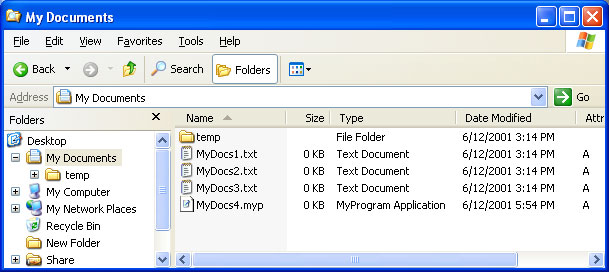
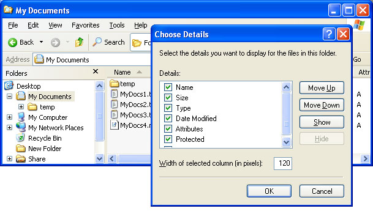

# Creating Column Handlers

\[This feature is supported only under Windows XP or earlier. \]

The Details view in the Windows Windows Explorer normally displays several standard columns. Each column lists information, such as the file size or type, for each file in the current folder. By implementing and registering a column handler, you can make custom columns available for display.

The general procedures for implementing and registering a Shell extension handler are discussed in [Creating Shell Extension Handlers](/windows/desktop/shell/handlers). This document focuses on those aspects of implementation that are specific to column handlers.

The following topics are discussed.

-   [How Column Handlers Work](#how-column-handlers-work)
-   [Registering Column Handlers](#registering-column-handlers)
-   [Implementing Column Handlers](#implementing-column-handlers)
    -   [The Initialize Method](#the-initialize-method)
    -   [The GetColumnInfo Method](#the-getcolumninfo-method)
    -   [The GetItemData Method](#the-getitemdata-method)

## How Column Handlers Work

The following illustration shows Windows Explorer in Details view.



With Windows 2000, the folder can also support a number of columns that, by default, are not displayed. The user can display additional columns by right-clicking one of the column headers and selecting the **More...** command from the menu. A dialog box then appears that lists the available columns for the folder and allows the user to select which columns to display. The following illustration shows this dialog box for the preceding example.



By creating a column handler, you can create custom columns and add them to that list. For example, a collection of files that contain music could use a column handler to display columns listing the artist and piece contained by each file.

A column handler is a global object that is called every time Windows Explorer displays the Details view. However, column handlers are typically used to display custom columns only for members of a particular [file type](/windows/desktop/shell/fa-file-types). Before it displays the Details view, Windows Explorer queries all registered column handlers for their column characteristics. If the user has selected one of the handler's columns, Windows Explorer queries the handler for the associated data. When a column handler receives a request for data, it provides it if the file is a member of its supported type. Otherwise, it ignores the request by returning S\_FALSE.

## Registering Column Handlers

Column handlers are registered under the following subkey.

```
HKEY_CLASSES_ROOT
   Folder
      shellex
         ColumnHandlers
```

Create a subkey of **ColumnHandlers** named with the string form of the handler's class identifier (CLSID) GUID. For a general discussion of how to register Shell extension handlers, see [Creating Shell Extension Handlers](/windows/desktop/shell/handlers). The following example illustrates how to register a column handler.

```
HKEY_CLASSES_ROOT
   Folder
      shellex
         ColumnHandlers
            {My Column Handler CLSID GUID}
```

## Implementing Column Handlers

Like all Shell extension handlers, column handlers are in-process Component Object Model (COM) objects implemented as DLLs. They export the [**IColumnProvider**](/windows/desktop/api/shlobj/nn-shlobj-icolumnprovider) interface in addition to [IUnknown](/windows/win32/api/unknwn/nn-unknwn-iunknown).

Windows Explorer calls the three methods exported by [**IColumnProvider**](/windows/desktop/api/shlobj/nn-shlobj-icolumnprovider) to request the information it needs to display the column. The procedure used by Windows Explorer is:

1.  Call [**IColumnProvider::Initialize**](/windows/desktop/api/shlobj/nf-shlobj-icolumnprovider-initialize) to specify the folder that is about to be displayed.
2.  Call [**IColumnProvider::GetColumnInfo**](/windows/desktop/api/shlobj/nf-shlobj-icolumnprovider-getcolumninfo) to retrieve the column's identifier and characteristics.
3.  If the column has been selected by the user, call [**IColumnProvider::GetItemData**](/windows/desktop/api/shlobj/nf-shlobj-icolumnprovider-getitemdata) for each file in the folder to retrieve the data that belongs in the file's column entry.

### The Initialize Method

Windows Explorer calls [**IColumnProvider::Initialize**](/windows/desktop/api/shlobj/nf-shlobj-icolumnprovider-initialize) to initialize the column handler. The method has three parameters, but only *wszFolder* is currently used. It is set to the folder whose Details view is about to be displayed. Store the folder name for later use and initialize the handler object as needed.

### The GetColumnInfo Method

Windows Explorer next calls [**IColumnProvider::GetColumnInfo**](/windows/desktop/api/shlobj/nf-shlobj-icolumnprovider-getcolumninfo) to request the column's identifier and characteristics. It passes in an index for the column in the *dwIndex* parameter. This index is an arbitrary value that is used to enumerate columns. Windows Explorer also passes in a pointer to an [**SHCOLUMNINFO**](/windows/desktop/api/shlobj/ns-shlobj-shcolumninfo) structure. This structure is used to return the column's identifier and characteristics. **IColumnProvider::GetColumnInfo** should assign appropriate values to the members of the structure and return.

Columns are identified by their OLE property set ID (FMTID) and an associated property ID (PID). The first member of the [**SHCOLUMNINFO**](/windows/desktop/api/shlobj/ns-shlobj-shcolumninfo) structure, **scid**, is a pointer to an [**SHCOLUMNID**](/windows/desktop/shell/objects) structure that is used to identify the column. Its **fmtid** member holds the column's FMTID, and its **pid** member holds the column's PID. For example, a standard FMTID/PID pair that is commonly used to identify columns is the Author PID of the Summary Information property set.

If possible, your handler should use existing FMTIDs and PIDs to identify the column it supports. If you use a custom [**SHCOLUMNID**](/windows/desktop/shell/objects) structure, the column will display data only for those files that are supported by the handler. If the folder contains other files, their entries will be blank. If a folder contains files from more than one file type, using standard FMTID/PID values could make it possible to merge data from different types into the same column.

Set the **vt** member to the [**VARIANT**](/windows/win32/api/oaidl/ns-oaidl-variant) type of the data you want to display in the column. The most commonly used type is VT\_LPSTR, as most columns display their data as character strings. The remaining members of the [**SHCOLUMNINFO**](/windows/desktop/api/shlobj/ns-shlobj-shcolumninfo) structure are used to define the characteristics of the column. Assign values as appropriate.

### The GetItemData Method

If the column handler's column has been selected, Windows Explorer calls [**IColumnProvider::GetItemData**](/windows/desktop/api/shlobj/nf-shlobj-icolumnprovider-getitemdata) for each file in the folder that is to be displayed. The *pscid* parameter is a pointer to an [**SHCOLUMNID**](/windows/desktop/shell/objects) structure that identifies the column. The *pscd* parameter points to an [**SHCOLUMNDATA**](/windows/desktop/api/shlobj/ns-shlobj-shcolumndata) structure that identifies the particular file.

The *pvarData* parameter returns the data that should be displayed in the handler's column for the file specified by *pscd*. If that file is supported by your column handler, assign its data value to *pvarData* and return S\_OK. If the file is not supported by your column handler, return S\_FALSE without assigning a value to *pvarData*.

Many folders will contain a number of files that are not supported by any particular column handler. To improve efficiency, [**IColumnProvider::GetItemData**](/windows/desktop/api/shlobj/nf-shlobj-icolumnprovider-getitemdata) should first check the **pwszExt** member of the structure pointed to by *pscd*. This member holds the file name extension. If the extension indicates that the file is not a member of a file type supported by your handler, avoid unnecessary processing by immediately returning S\_FALSE.

 

 