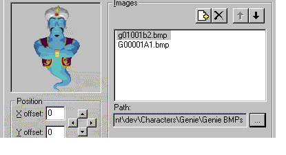
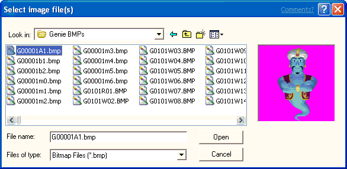
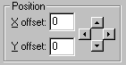
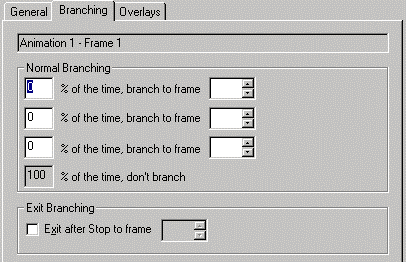
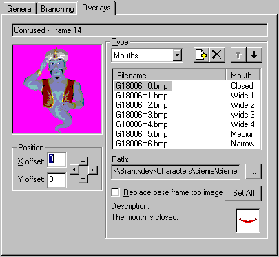
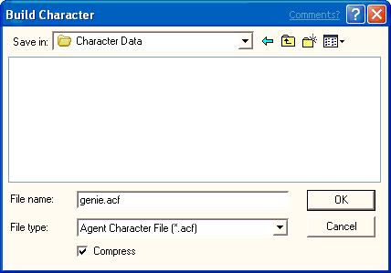

# Creating Animations

\[Microsoft Agent is deprecated as of Windows 7, and may be unavailable in subsequent versions of Windows.\]

To begin creating animations for your character, select the **Animations** icon in the tree. This displays the **Properties** page with the default settings for all animations. You can alter the frame size, the default frame duration, and color palette settings on the **Properties** page.

### Setting Your Character's Frame Size

The animation frame height and width must remain constant throughout the entire character definition (that is, for all of that character's animations). Although you can change the frame size from its default setting (128 x 128 pixels), images displayed in the Editor will be scaled to fit default display size. If you change the default frame setting, you can display the frame's full, non-scaled size by choosing **Open Frame Window** from the **Edit** menu.

### Setting Your Character's Palette

By default, the Editor uses the first bitmap image you load to set your character's default color palette, the colors that determine how the character appears, and sets the color in the 11th palette position as your transparency color. However, you can set the palette and transparency explicitly in the **Palette Information** group. This enables you to specify an image file to use for the palette. You can specify one of the animation image files or any graphic file. The palette file you specify must be an 8-bit (256) color file. After it is loaded, use the **Change Setting** button to change the transparency color.

Your character's color palette must not remap the standard system colors. The Editor will automatically reserve the system's color palette when displaying images. In addition, all your animation images must use the same color palette and transparency color. This is very important. If they do not, you may see color remapping of your images when you load them into the Editor.

While you can set the color palette for the character, on Windows systems where the Display properties are set to an 8-bit (256) color palette, the character's color will be subject to the current system palette. Because applications may change the system palette, the character may not appear with the correct color settings. Although there is no way to prevent this, you can lessen the effect by limiting the numbers of colors you use and setting the character's palette based on the palette used by the application driving the character. For example, if you are developing a character to be used with webpages, you may want set the character's palette using the Microsoft Internet Explorer's halftone palette. You can capture the browser's palette by right-clicking on an image on a webpage and choosing the **Save Picture As** command and choosing **Bitmap** in the **Save As Type** option, then clicking **Save**. To optimize your animation image files to a specific palette file, you might want to use a product like Equilibrium DeBabelizer.

### Creating a New Animation

After you have determined your global animation settings, you can begin creating animations. To create a new animation, choose **New Animation** from the **Edit** menu or the **New Animation** button on the toolbar. This adds a new animation icon in the tree under the **Animations** icon and assigns the new icon a default name. You can rename your animation by typing in the **Animation Name** field. Note that animation names within a character definition must be unique. Also, avoid using characters in the name that are not valid characters for file names.

### Adding Frames

Every animation is composed of frames. To create a new frame for your animation, choose **New Frame** from either the **Edit** menu or the toolbar. This adds a new frame icon to the tree under your animation icon, and displays three tabbed pages. The **General** page includes controls that enable you to load and adjust an image for your frame. It also includes a display area for the frame's appearance.

A frame can contain one or more images. To define an image for a frame, click the **Add Image File** button just above the **Images** list box. The **Select Image Files** dialog box displays, which allows you to select a bitmap image file.

Select the file you want to load, choose **Open**, and the image appears in the frame display on the **General** page. The Editor accepts images stored as 1-bit (monochrome), 4-bit, or 8-bit Windows bitmap format, or as GIF format.

You can use the four arrow buttons beneath the image in the **Position** box to adjust the image's appearance within the frame. If the image is larger than your frame's size, only the portion of the image that appears within the frame will display. If you increase the frame size, the image may be scaled to fit within the display area of the Editor.

You can also display a frame by choosing **Open Frame Window** from the **Edit** menu. This displays the current frame in a separate window without scaling the images loaded into the frame. This window's initial size is based on your frame's height and width settings. You can resize it smaller, but not larger. The Frame Window reflects the changes you make using the controls in the Editor and also allows you view the frame while viewing its other property pages.

You can compose a frame from multiple images. Each time you select the **Add Image** button and choose another image, the image gets added to the list and to the image display area. You can also add multiple images by selecting more than one file. Press SHIFT or CTRL while you click in the **Select Image Files** dialog box, and then choose **Open**. The **Move Up** and **Move Down** buttons above the **Images** list box move a selected image in the display order (z-order) for the frame. You can also move images by dragging them within the list. Selecting an image in the list and clicking the **Delete** button removes an image. To change an image you have loaded to another image file, you can click the filename to edit it directly or use the **...** (ellipsis) button to bring up the **Select Image Files** dialog box and select a different file.

You can use the **Duration** text box to set the duration for the frame; that is, how long the frame will be displayed. If a frame has no image and zero duration, the frame will not be displayed when the animation plays.

You can also specify a sound effect file to play when the frame is displayed. If you plan to load the character from a web server, you may want to compress the sound effect file to minimize load time. You can then specify the compressed sound file in the Agent Character Editor. In addition, avoid using a sound effect with a duration longer than the duration of your animation and especially avoid a sound effect that loops, because the Microsoft Agent animation services do not send an animation complete event until the sound completes. Also avoid specifying a sound effect for any animation you assign to the **Listening** or **Hearing** states, because this interferes with speech input. Finally, while you can include more than one sound effect in an animation, avoid placing them so they overlap, because this may affect the timing of the animation. Also, keep in mind that sound effects may play at different rates based on the user's hardware.

To add frames to your animation, choose the **New Frame** command again and follow the same procedure. As an option, you can also load multiple images and automatically generate new frames for them. To use this feature, choose **New Frames From Images** from the **Edit** menu. The frames will be created in alphabetic order based on the image filenames. When you are finished defining all frames for your animation, you can choose the **New Animation** command again to begin a new animation.

There are other ways to add frames to animations and move frames within or between animations. You can select another frame (from the same or another animation) and choose **Cut** or **Copy**, then select the animation or a frame in that animation and choose **Paste**. You can also drag a frame from one animation to another. If you drag within an animation, the action moves the frame. If you drag to another animation, it copies the frame. Dragging to a preceding frame in the same animation inserts the frame before the frame to which you drag. Dragging to a following frame places it after the frame to which you drag. If you drag a frame using the right mouse button, releasing the button displays a pop-up menu with your transfer choices.

You can also create an animation by copying an existing animation (select the animation and choose **Copy**), and selecting the **Animations** icon or another animation icon and choosing **Paste**. The Editor automatically creates a new name for the animation, although you can change the name.

### Branching

When you create a frame, you can also define which frame plays next. By default, the next frame played in the animation sequence is always the next frame in the z-order. However, by choosing the **Branching** page, you can set the probability for up to three other frames that the server may play. Enter the probability percentage and the target frame number in the appropriate fields. You can specify branching even for frames that don't have images and have their duration set to zero. This enables you to branch without first displaying a particular image.

You can use the branching feature to create animations that will loop indefinitely. However, note that when a looping animation plays, other animations in the character's queue will not play until an event—such as a user pressing the push-to-talk key or the client application calling the [**Stop**](stop-method.md) method—halts the looping animation. Therefore, carefully consider the context in which the animation will be used before creating a looping animation.

The branching page also enables you to create Exit Branching. An exit branch is a branch to a frame that the animation will take when the animation is stopped and before the next animation is played. Defining exit branches will enable you to move smoothly during the transition from one animation to another. Your exit branching must not create a circular loop, but must eventually be able to exit to the last frame of the animation.

You do not have to provide an exit branch for each frame, however, if you don't, the animation will follow the frame's normal branching. If the frame has no explicit branch, then the animation automatically branches to the frame that follows it. For example, if you branch from frame 3 to frame 1 and frame 1 has no other branching (normal or exit branch), frame 1 will branch to frame 2. If frame 2 has no branching, the animation will branch back to frame 3 and you have a circular loop. Instead, you could branch from frame 3 to frame 1 and then set frame 1's exit branch to any frame that is after frame 3 and normally proceeds to the last frame of the animation.

Sometimes you may need to create an explicit final frame of an animation that is not played visibly, but provides an end of the animation. For example, you need to exit the animation, but exiting to the last frame would not be appropriate. You can do this by creating a blank, zero duration frame as the last frame of the animation. This allows the animation to play normally through the last frame of the animation and also enables you to provide a final exit point for your exit branching.

### Previewing an Animation

You can preview your animation in the Agent Character Editor by choosing the **Preview** command on the **Edit** menu or the Preview button on the toolbar. This plays your animation, including any branches and sound effects, starting from the current selected frame. It resets to the current selected frame when the animation completes. To play your entire animation, go to the tree view, select the animation's icon or first frame of the animation, and choose the **Preview** command. The Editor animates your frames on the **General** page. To stop the preview before it ends, choose the **Stop Preview** command. The **Preview** command automatically changes to **Stop Preview** while the preview plays.

You can also preview your exit branching by choosing the **Preview Exit Branching** command on the **Edit** menu or on the toolbar. The enables you to test how the exit branching will appear from any specific frame.

### Assigning Speaking Overlays

You can define a character so that it speaks during the last frame of its animation. On this frame, choose the **Overlay** page. This page enables you to load and assign mouth image files to the standard mouth positions supported by Microsoft Agent. Click the **Add Image** button and select the image from the dialog box. You can also select multiple images, and the Editor will load and assign the images starting with the mouth position you selected. Click the **Move Up** and **Move Down** buttons or drag an entry to change an image assignment in the list. Click the **Delete** button to remove an image. You can also edit the pathname of an assigned file by clicking its entry in the list and retyping its filename, or by choosing the **Ellipsis** button to display the **Select Image Files** dialog box.

Your mouth overlays must fit within the outline of the base frame over which they will appear. If they do not, they will be clipped to the base frame.

If you want to have the character speak with its mouth outside of the base frame--for instance, when the character is to speak facing sideways--first create the base frame with the character's head (or the area that will move as the character speaks) as its top image. Then, define your mouth overlays to replace that image and set the **Replace Base Frame Top Image** option. You can also use the **Set All** button to set this option for all your mouth overlays in the frame.

### Assigning a Return Animation

To create a smooth transition from one animation to the next, design your animation sequences to begin and end with a neutral image. For more information, see [**Designing Characters for Microsoft Agent**](designing-characters-for-microsoft-agent.md). However, this does not mean that every animation must end at the neutral position. You can animate a character through a sequence of frames, have it speak during the last frame, and create a separate, complementary animation that returns the character to the neutral position. This complementary animation is called a Return animation.

You can define a Return animation by creating an explicit animation for this purpose. You can also create a Return animation using the exit branching you define within the animation. To assign a Return animation, select the animation in the tree, and select either the Return animation you created or Use Exit Branching from the Return Animation drop-down list on the Properties page.

Creating and assigning a Return animation has an added benefit: When the server gets a request to play another animation, it will attempt to play the Return animation for the last animation it played, if a Return animation is assigned. This ensures a smooth transition. If an animation begins and ends at the neutral position, you don't need to define a Return animation. Similarly, if you intend to handle transitions from one animation to another yourself, you may not need to assign a Return animation.

### Assigning Animations to States

The Microsoft Agent animation services automatically play animations when the hosting client application uses certain methods. For example, when an application calls the [**MoveTo**](moveto-method.md) and [**GestureAt**](gestureat-method.md) methods, the server automatically determines where the character is displayed and plays an appropriate animation. Similarly, Microsoft Agent automatically plays Idle animations when the user has not interacted with the character for several seconds. These conditions, when the server automatically plays animations on an application's behalf, are called *states*. However, for the server to know which animation to play, you must assign animations to these states.

To assign an animation or animations to a state, create the appropriate animation, expand the States entry in the tree view of the Editor window, and select the State icon. The list of animations you have created appear in a list box on the right side of the window. Check the animation you want to assign to this state. Note that you can assign more than one animation to the same state. This allows the server to randomly select different animations for the state. Assigning an animation to a state does not prevent an animation from playing that animation directly.

You can also assign an animation to a state by selecting the animation's entry in the tree. The **Assign To State** list box on the **Properties** page lists the states. Select the check box of the state to which you're assigning the animation.

The Editor does not support creating additional states because states only apply to situations where the server must play an animation automatically on behalf of the client application. Thus, there is no benefit in defining your own state. If need be, you can play any animation explicitly using the [**Play**](play-method.md) method.

### Saving Your Character Definition

You can save your character's definition file by choosing the **Save** command on the **File** menu or the **Save Character Definition** button on the toolbar. If you want to save the character definition file with a new name, choose the **Save As** command on the **File** menu. The Editor saves a character's editable definition as an Agent Character Definition (.ACD) file. You can also edit this self-documenting text file format with most text editors and word processing applications.

### Printing Your Character Definition

To print your character's definition, choose the **Print** command on the **File** menu or the **Print** button on the toolbar. To set the properties for your printed output, choose the **Page Setup** command and choose your settings before selecting the **Print** command.

### Building a Character

When you are done creating your animations, the character and images must be compiled into a special format that Microsoft Agent uses to load this data. To build a character, select the Build Character command on the **File** menu or from the toolbar. If you have unsaved edits in your character definition file, the Editor saves the definition file before displaying the **Build Character** dialog box.

The Agent Character Editor will automatically propose a filename based on your character definition filename. The Build Character dialog box also includes a drop-down list so you can choose between building the character as a single storage file (.ACS) or as multiple files. If you choose the latter, the Editor builds an .ACF file that includes character's data and an .ACA file for each animation you created. If you plan to install and access a character stored on the same computer as your client application, you would typically choose the single structured file format. This format provides easy and efficient installation and access to the character. However, if the character will be accessed from a web server using the HTTP protocol, build your character using the .ACF (individual) file format. This latter file structure allows a webpage script to load individual animation files, storing the data in the user's browser file cache. It provides more efficient access over the Web because animation data can be downloaded as needed rather than requiring the user to wait for the entire set of animations to download at one time. In addition, because the character's data is stored in the browser cache, the file space can be automatically reclaimed.

Although you can also download character data (either as a single structured file or multiple files) from a web server and install elsewhere on a user's machine, such a method requires security provisions for downloading and installation. As a result, the Microsoft Agent API does not include support for downloadable installation of a character except to the browser's cache. However, you can still support this scenario by creating your own installation control and distribute it following appropriate security conventions. For more information, see the Microsoft Internet Client Software Development Kit.

The Compress option enables you to set whether the character data is compressed. Typically, you will want to set this option to compact your character data, although building a character with the compacted data takes longer.

Once you build a character, subsequent builds will be faster if you build the character to the same directory location. The Character Editor automatically verifies and copies those files that have not changed, and recompiles any data that has been edited.

If the Editor detects any errors in the character file while building the character, it writes the information out to a log file and displays a message box. You can choose to view the log file or ignore it and read it later with a text editor. However, note that the Editor will overwrite the log file the next time you build a character file.

### Editing an Existing Character

To edit an existing character, choose **Open** on the **File** menu, select the character's definition file (.ACD) in the resulting dialog box, and choose Open. The file will load into the Editor. Note that you cannot load compiled character files (.ACS, .ACF, or .ACA) with the Editor.

Because the character's definition file (.ACD) is a text file, you can also edit a character's definition by opening the file with a text editor or word processing program. However, when completing your changes, make sure to save the file in its original format before loading it into the character editor for compilation.

 

 

