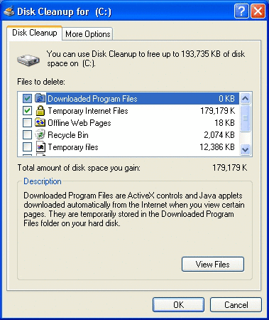

# Creating a Disk Cleanup Handler

One axiom proven time and again in the world of computers is that regardless of the size of your computer's storage capacity, you will eventually fill it up. While the average size of a computer's hard disk has increased dramatically over time, applications have also grown accordingly, leaving users looking for ways to create more free hard disk space. Available space is also reduced by the many temporary files that applications create for backup or performance reasons. When disk space becomes low, it becomes necessary to reduce the amount of space used by applications. Disk space can be freed using a variety of means, including the following:

-   Deleting files.
-   Compressing files.
-   Moving files to a backup medium.
-   Transferring files to a remote server.

Files that are good candidates for cleanup include:

-   Files that the user will never need again.
-   Temporary files that exist only for performance reasons.
-   Files that can be restored, if needed, from an installation CD.
-   Data files that have possibly been superseded by newer versions, such as old backup files.
-   Older files that have not been used in a long time.

Deletion is particularly appropriate for files that the user will never need again for example, files that are temporarily cached for performance reasons. Deletion is also appropriate for files that are easily restored, such as graphics files that can be reloaded from an installation CD. Files that the user might need later or that would be difficult to reconstruct are better candidates for compression or backup.

Expecting a user to manually clean the file system is not a good solution. The user may not know where many of the files are located or how to recognize which ones can be safely removed. In addition, there's the risk that the user might delete essential files.

The following facets of the Disk Cleanup utility are discussed in this topic.

-   [The Windows Disk Cleanup Utility](#the-windows-disk-cleanup-utility)
-   [Implementation Basics](#implementation-basics)
    -   [Initialize/InitializeEx](#initializeinitializeex)
    -   [GetSpaceUsed](#getspaceused)
    -   [ShowProperties](#showproperties)
    -   [Purge](#purge)
    -   [Deactivate](#deactivate)
-   [Registering a Disk Cleanup Handler](#registering-a-disk-cleanup-handler)
    -   [Registering a Handler's CLSID](#registering-a-handlers-clsid)
    -   [Registering a Handler with the Disk Cleanup Manager: General](#registering-a-handler-with-the-disk-cleanup-manager-general)
    -   [Registering a Handler with the Disk Cleanup Manager: Windows 2000 or Later Systems](#registering-a-handler-with-the-disk-cleanup-manager-windows-2000-or-later-systems)
    -   [Using the DataDrivenCleaner Object](#using-the-datadrivencleaner-object)
    -   [Example Registration of a Disk Cleanup Handler](#example-registration-of-a-disk-cleanup-handler)

## The Windows Disk Cleanup Utility

Starting on Windows 98, the Windows operating system includes Disk Cleanup, a utility that makes it much easier for the user to manage available hard disk space. The Disk Cleanup utility is designed to free up as much disk space as possible and decrease the risk that the user will delete essential files accidentally.

Disk cleanup can be initiated in three ways.

-   The user can initiate disk cleanup by clicking **Start**; pointing to **All Programs**, **Accessories**, and **System Tools**; and then clicking **Disk Cleanup**.
-   The system notifies the user with a message box that unused disk space has reached critical mode. The critical mode threshold for a drive larger than 2.25 gigabytes (GB) is 200 megabytes (MB). Subsequent warnings are given at 80, 50, and 1 MB. The user is given the option of freeing disk space manually or starting the Disk Cleanup utility.
-   The user can have the Windows Scheduled Task Wizard (known as the Maintenance Wizard on older systems) run the Disk Cleanup utility automatically at scheduled times.

The basic challenge inherent in disk cleanup is to free as much disk space as possible without deleting essential files. Because there is no standard way to mark files for cleanup, no single application can reliably detect and clean all unessential files. The Disk Cleanup utility addresses this problem by splitting the cleanup operation between a single *disk cleanup manager* and a collection of *disk cleanup handlers*.

When the Disk Cleanup utility is run, the user sees the following dialog box. (If more than one disk or disk partition exists on the computer, the user is first asked to choose a drive before this dialog is displayed.)



The disk cleanup manager is part of the operating system. It displays the dialog box shown in the preceding illustration, handles user input, and manages the cleanup operation. The actual selection and cleanup of unneeded files is done by the individual disk cleanup handlers shown in the disk cleanup manager's list box. The user has the option of enabling or disabling individual handlers by selecting or clearing their check box in the disk cleanup manager's UI.

Each handler is responsible for a well defined set of files. For example, the selected handler in the illustration is responsible for cleaning up downloaded program files. The handler selected in the illustration also provides a **View Files** button. By clicking the button, the user can request that the handler display a UI typically a Windows Explorer window that allows the user to specify which files or classes of files to clean.

Although Windows comes with a number of disk cleanup handlers, they aren't designed to handle files produced by other applications. Instead, the disk cleanup manager is designed to be flexible and extensible by enabling any developer to implement and register their own disk cleanup handler. Any developer can extend the available disk cleanup services by implementing and registering a disk cleanup handler.

All applications that produce temporary files can and should implement and register a disk cleanup handler. Doing so gives users a convenient and reliable way to manage the application's temporary files. When you implement the handler, you can decide which files are affected and determine how the actual cleanup happens.

## Implementation Basics

Cleanup handlers are in-process server Component Object Model (COM) objects. Windows provides an existing handler object called the DataDrivenCleaner for your use. You can also opt to implement a handler yourself for more flexibility. These objects then allow you to specify how to select files, free disk space, and, in the case of an implemented handler, display the optional UI for more granular control. This section addresses the matter of implementing your own handler. For details concerning the use of the DataDrivenCleaner object, see [Using the DataDrivenCleaner Object](#using-the-datadrivencleaner-object).

A disk cleanup handler should perform these five basic tasks.

-   Initialize the handler object.
-   Scan the disk to determine how much disk space can be freed.
-   Display the UI to obtain user feedback about which files to clean. (Optional)
-   Do the cleanup.
-   Shut down.

To allow the disk cleanup manager to manage these tasks, a handler must export either [**IEmptyVolumeCache**](/windows/desktop/api/Emptyvc/nn-emptyvc-iemptyvolumecache) for Windows 98 or [**IEmptyVolumeCache2**](/windows/desktop/api/Emptyvc/nn-emptyvc-iemptyvolumecache2) for Windows Millennium Edition (Windows Me), Windows 2000, and Windows XP. Because **IEmptyVolumeCache2** inherits from **IEmptyVolumeCache**, adding only the additional method **InitializeEx**, relatively little extra work is required to implement both. Unless your handler is intended for only one of these operating systems, it should export both interfaces.

To export these interfaces, you must implement these methods corresponding to the five basic tasks.

-   [Initialize/InitializeEx](#initializeinitializeex)
-   [GetSpaceUsed](#getspaceused)
-   [ShowProperties](#showproperties)
-   [Purge](#purge)
-   [Deactivate](#deactivate)

### Initialize/InitializeEx

The two initialization methods, which are quite similar, are called when the Disk Cleanup utility is run. The Windows 98 disk cleanup manager calls a handler's [**IEmptyVolumeCache::Initialize**](/windows/desktop/api/Emptyvc/nf-emptyvc-iemptyvolumecache-initialize) method. The Windows Millennium Edition (Windows Me), Windows 2000, or Windows XP disk cleanup manager, however, first tries calling [**IEmptyVolumeCache2::InitializeEx**](/windows/desktop/api/Emptyvc/nf-emptyvc-iemptyvolumecache2-initializeex) and only uses **IEmptyVolumeCache::Initialize** if [**IEmptyVolumeCache2**](/windows/desktop/api/Emptyvc/nn-emptyvc-iemptyvolumecache2) is not exposed by the handler. The disk cleanup manager passes information to the method, such as the handler's registry key and the disk volume that is to be cleaned.

Either method can return various display strings and set one or more flags. The primary difference between the two methods is how the text displayed in the disk cleanup manager is handled. The following three strings are affected.


| String       | Purpose                                                                            | Initialize                                                                           | InitializeEx                                                                                     |
|--------------|------------------------------------------------------------------------------------|--------------------------------------------------------------------------------------|--------------------------------------------------------------------------------------------------|
| Display Name | The handler's name displayed in the disk cleanup manager's list box.               | If *ppwszDisplayName* is **NULL**, the default value is retrieved from the registry. | A properly localized string must be specified in *ppwszDisplayName* no registry values are used. |
| Description  | Descriptive text displayed below the list box when the handler's name is selected. | If *ppwszDescription* is **NULL**, the default value is retrieved from the registry. | A properly localized string must be specified in *ppwszDescription* no registry values are used. |
| Button Text  | Text for the optional button that allows users to display the handler's UI.        | No parameter available. Must be specified in the registry.                           | A properly localized string must be specified in *ppwszBtnText* no registry values are used.     |


 

The *pdwFlags* parameter found in both initialization methods recognizes the same set of flags. Two of these flags are passed to the method by the disk cleanup manager.

-   **EVCF\_SETTINGSMODE**

    If the disk cleanup manager is being run on a schedule, it sets the **EVCF\_SETTINGSMODE** flag. If this flag is set, the disk cleanup manager does not call the [GetSpaceUsed](#getspaceused), [Purge](#purge), or [ShowProperties](#showproperties) methods. The handler's [**Initialize**](/windows/desktop/api/Emptyvc/nf-emptyvc-iemptyvolumecache-initialize) or [**InitializeEx**](/windows/desktop/api/Emptyvc/nf-emptyvc-iemptyvolumecache2-initializeex) method must handle all of the tasks normally performed by [**GetSpaceUsed**](/windows/desktop/api/Emptyvc/nf-emptyvc-iemptyvolumecache-getspaceused) and [**Purge**](/windows/desktop/api/Emptyvc/nf-emptyvc-iemptyvolumecache-purge). Because there is no opportunity for user feedback, only those files that are extremely safe to clean up should be touched. You should ignore the initialization method's *pcwszVolume* parameter and clean unneeded files regardless of what drive they are on.

-   **EVCF\_OUTOFDISKSPACE**

    If the **EVCF\_OUTOFDISKSPACE** flag is set, the user's disk drive is critically short of space. The handler should be aggressive about deleting files, even if it results in a performance loss. However, the handler obviously should not delete files that would cause an application to fail or the user to lose data.

The remaining flags are set by the disk cleanup handler and returned to the disk cleanup manager. For more information, see the method reference pages for [**IEmptyVolumeCache::Initialize**](/windows/desktop/api/Emptyvc/nf-emptyvc-iemptyvolumecache-initialize) and [**IEmptyVolumeCache2::InitializeEx**](/windows/desktop/api/Emptyvc/nf-emptyvc-iemptyvolumecache2-initializeex).

-   EVCF\_DONTSHOWIFZERO

    Display the handler in the disk cleanup manager's list box only if the value returned by [**GetSpaceUsed**](/windows/desktop/api/Emptyvc/nf-emptyvc-iemptyvolumecache-getspaceused) indicates that the handler can free some disk space.

-   EVCF\_ENABLEBYDEFAULT

    Specifies that the handler is enabled by default. It will run every time a disk cleanup takes place unless the user disables it by clearing its check box in the disk cleanup manager's list of handlers.

-   EVCF\_ENABLEBYDEFAULT\_AUTO

    Specifies that the handler is automatically enabled to run during scheduled cleanups.

-   EVCF\_HASSETTINGS

    Set this flag if your handler has a UI to display. In response, the disk cleanup manager displays a button when that handler is selected in the list box. If that button is clicked, the disk cleanup manager calls [**ShowProperties**](/windows/desktop/api/Emptyvc/nf-emptyvc-iemptyvolumecache-showproperties).

-   EVCF\_REMOVEFROMLIST

    Delete the handler's name from the list of available handlers after the handler has been run once. The handler's registry information is also deleted.

### GetSpaceUsed

The disk cleanup manager calls this method to determine how much space a disk cleanup handler can potentially free. The disk cleanup manager then displays that value to the right of the handler's name in the list box. This operation is performed on all of the handlers registered with the disk cleanup manager when the manager is launched and before the manager's main UI is displayed. When [**GetSpaceUsed**](/windows/desktop/api/Emptyvc/nf-emptyvc-iemptyvolumecache-getspaceused) is called, the handler should scan the files that it is responsible for, determine which of them are cleanup candidates, and return the amount of disk space that it can free.

Because scanning can be a lengthy process, the disk cleanup manager uses this method's *picb* parameter to pass a pointer to an [**IEmptyVolumeCacheCallBack**](/windows/desktop/api/Emptyvc/nn-emptyvc-iemptyvolumecachecallback) interface. The handler uses the interface periodically during the scan to call [**IEmptyVolumeCacheCallBack::ScanProgress**](/windows/desktop/api/Emptyvc/nf-emptyvc-iemptyvolumecachecallback-scanprogress), which serves two purposes.

-   Allows the disk cleanup manager to update a progress bar, informing the user how the scan is progressing.
-   Notifies the handler to stop the scan in the event that the progress window's **Cancel** button is clicked. That button event is not communicated directly to the handler; instead, the disk cleanup manager returns E\_ABORT the next time [**GetSpaceUsed**](/windows/desktop/api/Emptyvc/nf-emptyvc-iemptyvolumecache-getspaceused) calls [**IEmptyVolumeCacheCallBack::ScanProgress**](/windows/desktop/api/Emptyvc/nf-emptyvc-iemptyvolumecachecallback-scanprogress).

### ShowProperties

Before starting cleanup, the handler can display a UI typically in the form of a Windows Explorer window that allows the user to see a list of files or classes of files selected for cleanup by the handler. If the handler sets the **EVCF\_HASSETTINGS** flag when [**Initialize**](/windows/desktop/api/Emptyvc/nf-emptyvc-iemptyvolumecache-initialize) or [**InitializeEx**](/windows/desktop/api/Emptyvc/nf-emptyvc-iemptyvolumecache2-initializeex) is called, the user can request the UI by clicking the button displayed for that purpose in the disk cleanup manager. The button text varies from handler to handler, but "View Files," "View Pages," and "Options" are common labels.

When the button is clicked, the disk cleanup manager calls [**ShowProperties**](/windows/desktop/api/Emptyvc/nf-emptyvc-iemptyvolumecache-showproperties) to prompt the handler to display the UI. The UI should be created as a child of the window whose handle is passed in the **ShowProperties** method's *hwnd* parameter.

### Purge

The disk cleanup manager calls the handler's [**Purge**](/windows/desktop/api/Emptyvc/nf-emptyvc-iemptyvolumecache-purge) method to set the cleanup in motion. The method's *picb* parameter is a pointer to the disk cleanup manager's [**IEmptyVolumeCacheCallBack**](/windows/desktop/api/Emptyvc/nn-emptyvc-iemptyvolumecachecallback) interface. As with the [**GetSpaceUsed**](/windows/desktop/api/Emptyvc/nf-emptyvc-iemptyvolumecache-getspaceused) method, the handler should use the callback interface periodically to report its progress and query the disk cleanup manager whether the user has clicked **Cancel**. However, note that the **Purge** method must call [**IEmptyVolumeCacheCallBack::PurgeProgress**](/windows/desktop/api/Emptyvc/nf-emptyvc-iemptyvolumecachecallback-purgeprogress), not [**ScanProgress**](/windows/desktop/api/Emptyvc/nf-emptyvc-iemptyvolumecachecallback-scanprogress).

### Deactivate

The [**Deactivate**](/windows/desktop/api/Emptyvc/nf-emptyvc-iemptyvolumecache-deactivate) method is called when the disk cleanup manager is preparing to shut down. The handler should perform any needed cleanup tasks and return. If you don't want the handler to be run again, set the **EVCF\_REMOVEFROMLIST** flag in the initialization method's *pdwFlags* parameter. If this flag is set, the disk cleanup manager removes the handler from its list and deletes the handler's registry entries. You must re-add the registry entries to run the handler again. This flag is typically used for handlers that are run only once.

## Registering a Disk Cleanup Handler

To add a handler to the disk cleanup manager's list, certain keys and values must be added to the Windows registry.

-   [Registering a Handler's CLSID](#registering-a-handlers-clsid)
-   [Registering a Handler with the Disk Cleanup Manager: General](#registering-a-handler-with-the-disk-cleanup-manager-general)
-   [Registering a Handler with the Disk Cleanup Manager: Windows 2000 or Later Systems](#registering-a-handler-with-the-disk-cleanup-manager-windows-2000-or-later-systems)
-   [Using the DataDrivenCleaner Object](#using-the-datadrivencleaner-object)
-   [Example Registration of a Disk Cleanup Handler](#example-registration-of-a-disk-cleanup-handler)

### Registering a Handler's CLSID

As with all COM objects, the handler object's GUID and DLL must be registered under the **CLSID** key in **HKEY\_CLASSES\_ROOT**. You can also register an icon that is displayed next to the handler's name in the disk cleanup manager's list box, but this is optional. The following example shows the keys, values, and data involved.

```
HKEY_CLASSES_ROOT
   CLSID
      Handler's GUID
         DefaultIcon
            (Default) = Handler's Icon Path, Icon Index
         InprocServer32
            (Default) = Handler's DLL path
            ThreadingModel = Apartment
```

### Registering a Handler with the Disk Cleanup Manager: General

To complete the registration, a handler must add a key holding its specifics as shown here. The remainder of this section discusses the contents of this key.

```
HKEY_LOCAL_MACHINE
   Software
      Microsoft
         Windows
            CurrentVersion
               Explorer
                  VolumeCaches
                     Handler's Key
```

In general, the name of the key holding a handler's particulars is named for the type of file that it handles, such as **Downloaded Program Files**, but this is not a requirement. The following table details the possible values found under this key.

> [!Note]  
> Only the Default value specifying the handler's class identifier (CLSID) is required all other values are optional.

 


<table>
<colgroup>
<col  />
<col  />
<col  />
</colgroup>
<thead>
<tr class="header">
<th>Value</th>
<th>Type</th>
<th>Meaning</th>
</tr>
</thead>
<tbody>
<tr class="odd">
<td>Default</td>
<td>REG_SZ</td>
<td>The handler's CLSID as registered under <strong>HKEY_CLASSES_ROOT</strong>\<strong>CLSID</strong>.</td>
</tr>
<tr class="even">
<td>AdvancedButtonText</td>
<td>REG_SZ</td>
<td>Text for the optional button that users can click to display the handler's UI. The & character can be placed before a character to assign a keyboard shortcut for the button. The AdvancedButtonText value is ignored by handlers exposing <a href="/windows/desktop/api/Emptyvc/nf-emptyvc-iemptyvolumecache2-initializeex"><strong>IEmptyVolumeCache2::InitializeEx</strong></a>.</td>
</tr>
<tr class="odd">
<td>CleanupString</td>
<td>REG_SZ</td>
<td>Command line specifying an executable file and optional command line parameters. This command line is run at the completion of the disk cleanup.</td>
</tr>
<tr class="even">
<td>CSIDL</td>
<td>REG_DWORD</td>
<td>A system-independent identifier for a special folder to include in the file search. This value must be entered as a numerical value for instance, 0x0000001c rather than CSIDL_LOCAL_APPDATA. For a list of possible values, see <a href="/windows/desktop/shell/csidl"><strong>CSIDL</strong></a>. Only a single value can be used.<br/> If the Folder value is specified, the location indicated by the CSIDL value is prepended to that information to compose a search path. For instance, consider the following scenario.<br/>
<ul>
<li>The CSIDL value is specified as 0x0000000d (CSIDL_MYMUSIC)</li>
<li>Your My Music folder is located at C:\Documents and Settings\<em>username</em>\My Music</li>
<li>The Folder value contains &quot;Jazz\Singers&quot;</li>
</ul>
The result of that scenario is that the disk cleanup handler searches the C:\Documents and Settings\<em>username</em>\My Music\Jazz\Singers folder. Note that the slash preceding the Folder value is added if it is not present.<br/></td>
</tr>
<tr class="odd">
<td>Description</td>
<td>REG_SZ</td>
<td>Descriptive text displayed below the disk cleanup manager's list box when the handler's name is selected. Here you can explain what the handler does, what files it concerns itself with, and any other information elucidatory to the user. If <a href="/windows/desktop/api/Emptyvc/nf-emptyvc-iemptyvolumecache2-initializeex"><strong>IEmptyVolumeCache2::InitializeEx</strong></a> is not exposed by the handler, this text can be overridden through the handler's <a href="/windows/desktop/api/Emptyvc/nf-emptyvc-iemptyvolumecache-initialize"><strong>IEmptyVolumeCache::Initialize</strong></a> method by specifying an alternate string in the <em>ppwszDescription</em> parameter when the method is called.</td>
</tr>
<tr class="even">
<td>Display</td>
<td>REG_SZ</td>
<td>The handler's name to be displayed in the disk cleanup manager's list box. If <a href="/windows/desktop/api/Emptyvc/nf-emptyvc-iemptyvolumecache2-initializeex"><strong>IEmptyVolumeCache2::InitializeEx</strong></a> is not exposed by the handler, this text can be overridden through the handler's <a href="/windows/desktop/api/Emptyvc/nf-emptyvc-iemptyvolumecache-initialize"><strong>IEmptyVolumeCache::Initialize</strong></a> method by specifying an alternate string in the <em>ppwszDisplayName</em> parameter when the method is called.</td>
</tr>
<tr class="odd">
<td>FileList</td>
<td>REG_SZ or REG_MULTI_SZ</td>
<td>A list of files searched for and cleaned by this handler. You can specify wildcards using the ? or * characters. If the value is of type REG_SZ, multiple extensions are separated using the | or : characters, with no spaces on either side of them.<br/> If the DDEVCF_REMOVEDIRS flag is set in the Flags value, these values can specify directory names as well as files.<br/></td>
</tr>
<tr class="even">
<td>Flags</td>
<td>REG_DWORD or REG_BINARY</td>
<td>Flags controlling elements of the search and cleaning procedure. One or more of the following values.
<ul>
<li>DDEVCF_DOSUBDIRS (0x00000001). Search and remove recursively.</li>
<li>DDEVCF_REMOVEAFTERCLEAN (0x00000002). After the handler is run once, remove it from the registry.</li>
<li>DDEVCF_REMOVEREADONLY (0x00000004). Remove files that meet the search criteria even if they are read-only.</li>
<li>DDEVCF_REMOVESYSTEM (0x00000008). Remove files that meet the search criteria even if they are system files.</li>
<li>DDEVCF_REMOVEHIDDEN (0x00000010). Remove files that meet the search criteria even if they are hidden files.</li>
<li>DDEVCF_DONTSHOWIFZERO (0x00000020). Do not display this handler in the disk cleanup manager if no files match its search criteria.</li>
<li>DDEVCF_REMOVEDIRS (0x00000040). Match the FileList value against directories and remove matches and all of their subdirectories.</li>
<li>DDEVCF_RUNIFOUTOFDISKSPACE (0x00000080). Run this handler only if available disk space has fallen below the critical value, determined by the disk cleanup manager setting the EVCF_OUTOFDISKSPACE flag through <a href="/windows/desktop/api/Emptyvc/nf-emptyvc-iemptyvolumecache-initialize"><strong>IEmptyVolumeCache::Initialize</strong></a> or <a href="/windows/desktop/api/Emptyvc/nf-emptyvc-iemptyvolumecache2-initializeex"><strong>IEmptyVolumeCache2::InitializeEx</strong></a>.</li>
<li>DDEVCF_REMOVEPARENTDIR (0x00000100). Remove the parent directory of the specified files once the cleaner has run.</li>
<li>DDEVCF_PRIVATE_LASTACCESS (0x10000000). Use the LastAccess value, if provided, in ascertaining which files should be cleaned. This flag is ignored when using the <a href="#using-the-datadrivencleaner-object">DataDrivenCleaner</a> any provided LastAccess value is always used.</li>
</ul></td>
</tr>
<tr class="odd">
<td>Folder</td>
<td>REG_SZ, REG_MULTI_SZ, or REG_EXPAND_SZ</td>
<td>A specific folder or folders to search for items matching entries in the FileList value. You can specify wildcards using the ? or * characters. If the value is of type REG_SZ, multiple folder names are separated using the | character, without spaces on either side of it.<br/> If a CSIDL value is present, only one folder can be specified in this value. The location indicated by the CSIDL value is prepended to that folder path to compose a search path. For an example, see the CSIDL value description.<br/> If this value is absent on Windows Vista Service Pack 1 (SP1) and later, the cleanup handler is ignored and it returns S_FALSE on initialization.<br/> If this value is absent on the original release of Windows Vista and earlier, the root folder of the current volume is used. The DDEVCF_DOSUBDIRS flag is needed in that case to search the entire drive. Without it, only the root folder itself is searched.<br/> A drive or drives must be specified. This can be provided through the CSIDL value or through a REG_EXPAND_SZ string. Barring those options, however, the drive to search must be specified in the folder name. Use ?: to search the folder on the current drive.<br/></td>
</tr>
<tr class="even">
<td>IconPath</td>
<td>REG_SZ or REG_EXPAND_SZ</td>
<td>The path to the resource from which to obtain an icon to use in association with the handler.</td>
</tr>
<tr class="odd">
<td>LastAccess</td>
<td>REG_DWORD or REG_BINARY</td>
<td>The number of days that must have elapsed since a file was last accessed or a directory was created for that file or directory to be considered for cleanup.</td>
</tr>
<tr class="even">
<td>Priority</td>
<td>REG_DWORD or REG_BINARY</td>
<td>Determines the order that the handler is run with respect to other handlers. The higher the number, the earlier in the process that the handler runs. There is no defined range any number is acceptable.</td>
</tr>
<tr class="odd">
<td>PropertyBag</td>
<td>REG_SZ</td>
<td>The CLSID of a resource used to provide localized text for the display name, description, and button text. This resource is useful in the situation where a handler does not implement <a href="/windows/desktop/api/Emptyvc/nn-emptyvc-iemptyvolumecache"><strong>IEmptyVolumeCache</strong></a> and the handler is being run under Microsoft Windows NT or Windows XP.<br/> The disk cleanup manager first checks whether the handler's initialization routine returned those strings, as would be the case when <a href="/windows/desktop/api/Emptyvc/nn-emptyvc-iemptyvolumecache2"><strong>IEmptyVolumeCache2</strong></a> is implemented. Failing that, the manager next turns to a property bag named in this value. If none has been provided, it retrieves the text from the registry.<br/></td>
</tr>
<tr class="even">
<td>StateFlags</td>
<td>REG_DWORD</td>
<td>By running the disk cleanup manager's executable file Cleanmgr.exe from a command line, you can declare cleanup <em>profiles</em>. These profiles are composed of a subset of the available handlers and are given a unique numeric label. This allows you to automate the running of different sets of handlers at different times.<br/> The command line &quot;cleanmgr.exe /sageset:<strong>nnnn</strong>&quot;, where <strong>nnnn</strong> is a unique numeric label, displays a UI allowing you to choose the handlers to be included in that profile. As well as defining the profile, the sageset parameter also writes a value named StateFlags<strong>nnnn</strong>, where <strong>nnnn</strong> is the label you used in the parameter, to all of the subkeys under <strong>VolumeCaches</strong>. There are two possible data values for those entries.
<ul>
<li>0: Do not run this handler when this profile is run.</li>
<li>2: Include this handler when this profile is run.</li>
</ul>
<br/> For example, suppose that the command line &quot;cleanmgr.exe /sageset:1234&quot; is run. In the UI that is presented, the user chooses <strong>Downloaded Program Files</strong>, but does not choose <strong>Temporary Internet Files</strong>. The following values are then written to the registry.<br/>
<pre data-space="preserve"><code>HKEY_LOCAL_MACHINE
   Software
      Microsoft
         Windows
            CurrentVersion
               Explorer
                  VolumeCaches
                     Downloaded Program Files
                        StateFlags1234 = 0x00000002
                     Internet Cache Files
                        StateFlags1234 = 0x00000000</code></pre>
<br/> The command line &quot;cleanmgr.exe /sagerun:<strong>nnnn</strong>&quot;, where the value of <strong>nnnn</strong> matches the label declared with the sageset parameter, runs all of the handlers selected in that profile.<br/> A generic StateFlags value is written to the registry when Disk Cleanup is run normally. This value simply stores the state (checked or unchecked) of the handler the last time it was presented as an option to the user. There are two possible data values for those entries.
<ul>
<li>0: The handler was not selected.</li>
<li>1: The handler was selected.</li>
</ul>
<br/></td>
</tr>
</tbody>
</table>


 

### Registering a Handler with the Disk Cleanup Manager: Windows 2000 or Later Systems

Specifying display text in the registry can make it difficult to localize software. For this reason, Windows 2000 and Windows XP support the [**IEmptyVolumeCache2**](/windows/desktop/api/Emptyvc/nn-emptyvc-iemptyvolumecache2) interface with its preferred initialization method [**InitializeEx**](/windows/desktop/api/Emptyvc/nf-emptyvc-iemptyvolumecache2-initializeex). Under Windows 2000 or later, an attempt is always made to call **IEmptyVolumeCache2::InitializeEx** before [**IEmptyVolumeCache::Initialize**](/windows/desktop/api/Emptyvc/nf-emptyvc-iemptyvolumecache-initialize). The system only uses **Initialize** to initialize a handler if **IEmptyVolumeCache2** is not exposed.

In regard to the registry, the only difference under Windows 2000 or later is that you can omit the AdvancedButtonText, Display, and Description values when [**IEmptyVolumeCache2::InitializeEx**](/windows/desktop/api/Emptyvc/nf-emptyvc-iemptyvolumecache2-initializeex) is exposed by the handler. Those values, containing properly localized text, are provided to the disk cleanup manager when it calls **InitializeEx**.

### Using the DataDrivenCleaner Object

A basic disk cleanup handler, called the DataDrivenCleaner, is provided by the operating system. To use this object as a handler rather than implementing your own, use the CLSID {C0E13E61-0CC6-11d1-BBB6-0060978B2AE6} as the Default value for the handler's subkey under **VolumeCaches** as described in [Registering a Handler with the Disk Cleanup Manager: General](#registering-a-handler-with-the-disk-cleanup-manager-general).

The DataDrivenCleaner does not expose [**IEmptyVolumeCache2**](/windows/desktop/api/Emptyvc/nn-emptyvc-iemptyvolumecache2), so the Display and Description values are provided through the registry. When declaring those strings, be aware that this could cause localization issues. Localized text can be provided through the PropertyBag value. The AdvancedButtonText value is ignored since no UI, and thus no button to display it, is available for this handler.

### Example Registration of a Disk Cleanup Handler

The following shows an example registration for a disk cleanup handler implemented by The Phone Company. This handler implements both [**IEmptyVolumeCache**](/windows/desktop/api/Emptyvc/nn-emptyvc-iemptyvolumecache) and [**IEmptyVolumeCache2**](/windows/desktop/api/Emptyvc/nn-emptyvc-iemptyvolumecache2), and so provides AdvancedButtonText, Description, and Display values in case it is used on a computer running Windows 98. The handler combines the CSIDL and Folder values to search for files in the C:\\Program Files\\The Phone Company\\Temp directory, and the DDEVCF\_DOSUBDIRS flag is set so that its subdirectories are also searched. Only those files with .tmp and .tpc extensions are considered for cleanup, and the DDEVCF\_PRIVATE\_LASTACCESS flag is set so that out of those files, only those that have not been accessed for 14 days or more are considered. The DDEVCF\_DONTSHOWIFZERO flag is also set so that the handler does not appear on the list unless it has found cleanup candidates.

```
HKEY_LOCAL_MACHINE
   Software
      Microsoft
         Windows
            CurrentVersion
               Explorer
                  VolumeCaches
                     The Phone Company Files
                        (Default) = {the CLSID GUID}
                        AdvancedButtonText = &View Files
                        CleanupString = c:\tpc.exe
                        CSIDL = 0x00000026
                        Description = Old temporary files.
                        Display = The Phone Company Files
                        FileList = *.tmp|*.tpc
                        Flags = 0x10000021
                        Folder = \The Phone Company\Temp
                        IconPath = c:\Program Files\The Phone Company\tpc.dll,2
                        LastAccess = 0x0000000e
                        Priority = 200
                        PropertyBag = {Property Bag CLSID GUID}
```

 

