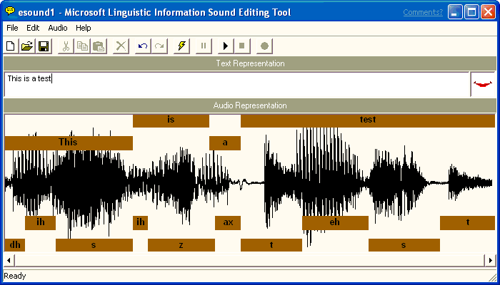
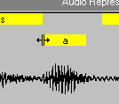
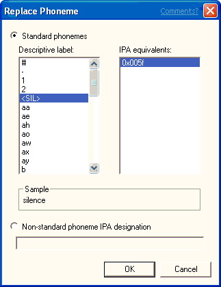
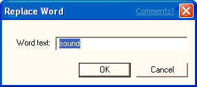

# Generating Linguistic Information

\[Microsoft Agent is deprecated as of Windows 7, and may be unavailable in subsequent versions of Windows.\]

After you have recorded a new sound file, or loaded an existing sound file, you can generate phonetic and word-break information by entering text that corresponds to your sound file in the **Text Representation** box. Then choose the **Generate Linguistic Info** command from the **Edit** menu or from the toolbar. The sound editor displays a progress message and begins processing your sound file. When it finishes generating linguistic information, it displays a mapping of word and phoneme labels for the sound file in boxes in the **Audio Representation** box. Note that the **Generate Linguistic Info** command remains disabled until you enter a text representation for your sound file.

If the editor doesn't produce an acceptable set of word or phoneme labels, choose the **Generate Linguistic Info** command again. If the editor does not generate any linguistic information, check your text representation to ensure that all the words are correctly ordered and spelled, and that you don't have any unnecessary spaces around punctuation. Then choose the **Generate Linguistic Info** command again. You can edit the text representation by selecting text in the **Text Representation** text box and using the **Cut**, **Copy**, and **Paste** commands on the **Edit** menu. If you are uncertain of the words the sound file includes, you can play the sound file by choosing **Play** from the **Edit** menu or the editor's toolbar. If the editor still fails to produce linguistic labels, try recording your sound file again. A poor quality recording, especially with excessive background noise, is likely to reduce the probability of generating reasonable linguistic information.

You can also manually create your own linguistic information by selecting part of the audio representation and choosing **Insert Phoneme** or **Insert Word** from the **Edit** menu. These commands are also available if you right-click within the selection.

To see how the linguistic information could be used for lip-syncing character animation with Microsoft Agent, choose the **Play** button on the toolbar and the editor will play your sound file, animating a sample mouth image based on the generated label information.

You can change the phoneme label display to show the IPA (International Phonetic Alphabet) assignments by choosing the **Phoneme Label Display** command on the **Edit** menu, then the IPA command. This displays the byte value for the phoneme. To change back to the descriptive names, choose the **Phoneme Label Display** command again, then choose **Name**.

### Playing a Sound File

You can play standard Windows sound files or linguistically enhanced sound files by choosing the **Play** command from the **Audio** menu or the editor's toolbar. The **Pause** and **Stop** commands enable you to pause or stop playing the sound file. As you play the file, the sample mouth image animates to show how the lip-sync information could be used by a Microsoft Agent character.

You can also play a selected portion of a sound file by dragging a selection in the **Audio Representation** or clicking a word or phoneme label, then choosing **Play**. You can extend an existing selection by pressing SHIFT and clicking, or pressing SHIFT and dragging to the new location in the **Audio Representation**.

### Editing Linguistic Information

You can edit a file's linguistic information in several ways. For example, you can adjust a word or phoneme label's boundary by moving the pointer to the edge of the box that defines the range of the label. When the pointer changes to the boundary move pointer, drag left or right. The editor automatically adjusts the adjacent word or phoneme boundary as well.

Adjusting a phoneme label's boundary changes the timing of a phoneme when the audio plays. For characters developed for use with Microsoft Agent, changing the phoneme label boundary may change the timing or duration for a mouth image mapped to that phoneme. Changing the boundary of a word label changes the timing of the word's appearance in the character's word balloon.

You can also replace a phoneme assignment by selecting the phoneme label and choosing **Replace Phoneme** from the **Edit** menu, or right-clicking the phoneme label and choosing **Replace Phoneme** from the pop-up menu. The editor displays the **Replace Phoneme** dialog box and highlights the label's current phoneme assignment. You can choose a replacement phoneme by selecting one in the **IPA** list or by choosing another entry in the **Name** list. If more than one IPA translation is available for that name, choose an item in the **IPA** list. To enter an IPA designation for a phoneme that may not be directly included in the language, type in its hex value or multiple hex values, concatenated with a plus (+) character. Once you have selected the replacement phoneme information, choose **OK**, and the editor replaces the phoneme label you selected.

Similarly, you can replace a word label by clicking the label's box and choosing **Replace Word**, or by right-clicking the label's box and choosing **Replace Word** from the pop-up menu. The editor displays the **Replace Word** dialog box. Enter the replacement word and choose **OK**.

For characters developed for use with Microsoft Agent, replacing a phoneme label may change the mouth image displayed when the sound file plays. Replacing a word replaces the text that appears in the character's word balloon when the [**Speak**](speak-method.md) method is called.

You can also insert a new phoneme label or word by making a selection in the **Audio Representation** and choosing **Insert Phoneme** or **Insert Word** from the **Edit** menu, or right-clicking within the selection and choosing the commands from the pop-up menu. These commands bring up dialog boxes similar to the **Replace Phoneme** and **Replace Word** dialog boxes, except that the editor inserts the new word or phoneme rather than replacing the existing information.

Finally, you can delete a phoneme or word by selecting its label and choosing **Delete Phoneme** or **Delete Word**. This removes its linguistic information from the file.

 

 

