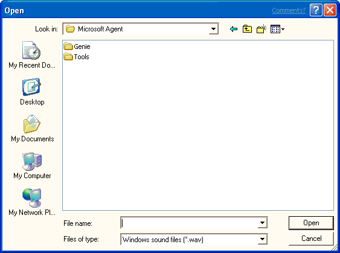

# Loading an Existing Sound File

\[Microsoft Agent is deprecated as of Windows 7, and may be unavailable in subsequent versions of Windows.\]

You can also load an existing Windows sound file (.wav) or linguistically enhanced sound file (.lwv) by choosing the **Open** command from the **File** menu or the toolbar. This displays the **Open** dialog box. Select a file and click **Open** to load the file into the editor.

 

 

