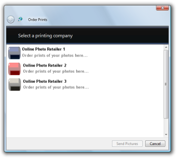

# Online Printing Wizard

The Windows Vista Online Printing Wizard helps users order prints of photos from participating online printing retailers. This wizard is designed so that it can be invoked programmatically by any application that wants to offer users the ability to order prints of photos. The Photo Printing Wizard is available on Windows Vista. PIX for Windows

-   [Features Provided by the Online Print Wizard](#features-provided-by-the-online-print-wizard)
-   [Supported Photo File Formats](#supported-photo-file-formats)
-   [Programmatically Launching the Online Print Wizard](#programmatically-launching-the-online-print-wizard)
-   [Accessing the Online Print Wizard Icon](#accessing-the-online-print-wizard-icon)
-   [Online Print Wizard MRU Properties](#online-print-wizard-mru-properties)

## Features Provided by the Online Print Wizard

The Windows Vista Online Printing Wizard enables users to order prints from a selection of participating online printing retailers. When invoked, the wizard:

1.  Accepts a file or list of files for which prints are to be ordered.
2.  Automatically retrieves the current list of participating online printing retailers, and enables the user to select the retailer from which to purchase the photo prints.
3.  Guides the user through the process or ordering prints.

Any application can benefit from the features offered by the Windows Vista Online Printing Wizard. An application need only pass in the file or files for which prints will be ordered, and the wizard guides the user through the ordering process.

The following figure shows the Windows Vista Online Printing Wizard displaying an example list of participating online printing retailers.



## Supported Photo File Formats

The Windows Vista Online Printing Wizard supports any image file format for which a Windows Imaging Component (WIC) codec is installed. WIC provides several standard codecs, including:

-   Bitmap (BMP)
-   Graphics Interchange Format (GIF)
-   Icon Format (ICO)
-   Joint Photographic Experts Group (JPEG)
-   Portable Network Graphics (PNG)
-   Tagged Image File Format (TIFF)
-   Windows Media Photo format

For more information about WIC and WIC codecs, see [Windows Imaging Component](https://msdn.microsoft.com/library/ms737408(VS.85).aspx).

File formats supported by online printing retailers vary from retailer to retailer; it is possible that a particular retailer may not support all of the file formats supported by the Windows Vista Online Printing Wizard. If the user attempts to order prints in a format that is not supported by the selected retailer, the Windows Vista Online Printing Wizard notifies the user that the selected retailer does not support the submitted file format.

## Programmatically Launching the Online Print Wizard

To invoke the Windows Vista Online Printing Wizard, call the [IDropTarget](/windows/win32/api/oleidl/nn-oleidl-idroptarget) interface with the following class identifier (CLSID):


```
CLSID_PublishDropTarget
```


This CLSID is defined in Shobjidl.h and Shobjidl.idl. The files to be processed by the Windows Vista Online Printing Wizard are specified in an [IDataObject](/windows/win32/api/objidl/nn-objidl-idataobject) object.

The following code example demonstrates how to invoke the Windows Vista Online Printing Wizard.


```
// A data object that contains the list of photos to print.
IDataObject* pDataObject;

// Create the Photo Printing Wizard drop target.
CComPtr<IDropTarget> spDropTarget;
        
hr = CoCreateInstance(CLSID_PublishDropTarget,
                      NULL,
                      CLSCTX_INPROC_SERVER,
                      IID_PPV_ARGS(&spDropTarget));

// Drop the data object onto the drop target.
POINTL pt = {0};
DWORD dwEffect = DROPEFFECT_LINK | DROPEFFECT_MOVE | DROPEFFECT_COPY;

spDropTarget->DragEnter(pDataObject, MK_LBUTTON, pt, &dwEffect);

spDropTarget->Drop(pDataObject, MK_LBUTTON, pt, &dwEffect);}
```


## Accessing the Online Print Wizard Icon

The Windows Vista Online Printing Wizard exports an icon that can be accessed and displayed by applications which call it. The following figure shows the Windows Vista Online Printing Wizard icon.


The following code example demonstrates how to retrieve the index for the Windows Vista Online Printing Wizard icon by reading the **OPWIcon** property.


```
// Create the Online Printing Wizard drop target.
CComPtr<IDropTarget> spDropTarget;
        
HRESULT hr = CoCreateInstance(CLSID_PublishDropTarget,
                              NULL,
                              CLSCTX_INPROC_SERVER,
                              IID_PPV_ARGS(&spDropTarget));

// Get the Online Printing Wizard properties.
CComPtr<IPropertyBag> spPropsBag;

spDropTarget->QueryInterface(IID_PPV_ARGS(&spPropsBag));

// Read the icon index from the properties set. 
CComVariant vtIcon;
int nIndex;
hr = spPropsBag->Read(L"OPWIcon", &vtIcon, NULL);

if SUCCEEDED(hr)
{
    nIndex = vtIcon.lVal;
}
```


## Online Print Wizard MRU Properties

The Windows Vista Online Printing Wizard defines three properties that are related to the most recently used (MRU) online printing retailer.


| Property Name | Property Value/Function                                                                                                                                                                                                                                                   |
|---------------|---------------------------------------------------------------------------------------------------------------------------------------------------------------------------------------------------------------------------------------------------------------------------|
| **MRUIcon**   | The index of the icon for the most recently used online printing retailer can be read from this property.                                                                                                                                                                 |
| **MRUName**   | The name of the most recently used online printing retailer can be read from this property.                                                                                                                                                                               |
| **UseMRU**    | A **VARIANT** **VT\_BOOL** value indicating whether the wizard should skip the online printing retailer selection page, and just use the most recently used online printing retailer instead. Set this property to **VARIANT\_TRUE** to skip the retailer selection page. |


 

The following code example demonstrates how to set the UseMRU property so the Windows Vista Online Printing Wizard bypasses the online printing retailer selection page and automatically selects the most recently used retailer.


```
// A data object that contains the list of photos to order prints for.
IDataObject* pDataObject;

// Create the Online Printing Wizard drop target.
CComPtr<IDropTarget> spDropTarget;
        
HRESULT hr = CoCreateInstance(CLSID_PublishDropTarget,
                              NULL,
                              CLSCTX_INPROC_SERVER,
                              IID_PPV_ARGS(&spDropTarget));

// Set the UserMRU property to true to skip retailer selection and use 
// the MRU retailer instead.    
CComQIPtr<IPropertyBag> spPropsBag(spDropTarget);
if(spPropsBag) 
{
    VARIANT varTrue = {0};
    varTrue.vt = VT_BOOL;
    varTrue.boolVal = VARIANT_TRUE;
    spPropsBag->Write(L"UseMRU", &varTrue);
}

// Drop the data object onto the drop target.
POINTL pt = {0};
DWORD dwEffect = DROPEFFECT_LINK | DROPEFFECT_MOVE | DROPEFFECT_COPY;

spDropTarget->DragEnter(pDataObject, MK_LBUTTON, pt, &dwEffect);

spDropTarget->Drop(pDataObject, MK_LBUTTON, pt, &dwEffect);
```


The following code example demonstrates how to read the MRUName and MRUIcon properties.


```
// Create the Online Printing Wizard drop target.
CComPtr<IDropTarget> spDropTarget;
        
HRESULT hr = CoCreateInstance(CLSID_PublishDropTarget,
                              NULL,
                              CLSCTX_INPROC_SERVER,
                              IID_PPV_ARGS(&spDropTarget));

// Get the Online Printing Wizard properties.
CComPtr<IPropertyBag> spPropsBag;
spDropTarget->QueryInterface(IID_PPV_ARGS(&spPropsBag));

CComVariant vtMRUName, vtMRUIconIndex;
CComBSTR bstrMRUName;
int nMRUIconIndex;

// Get the MRU name value.
hr = spPropsBag->Read(L"MRUName", &vtMRUName, NULL);
if SUCCEEDED(hr) 
{
    bstrMRUName = vtMRUName.bstrVal;
}

// Get the MRU icon index value.
hr = spPropsBag->Read(L"MRUIcon", &vtMRUIconIndex, NULL);
if SUCCEEDED(hr)
{
    nMRUIconIndex = vtMRUIconIndex.lVal;
}
```


 

 