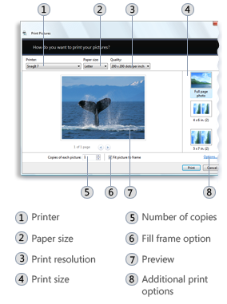
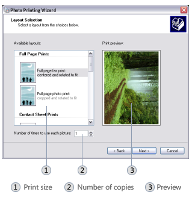

# Photo Printing Wizard

The Photo Printing Wizard helps users print photos by providing an easy-to-use wizard interface. The wizard enables the user to specify photo print sizes and other print options, and then sends the photos to the printer. The wizard is designed so that it can be invoked programmatically by any application that wants to offer users the ability to print photos and specify sizing and other print options. The Photo Printing Wizard is available on Windows XP and Windows Vista.

-   [Features Provided by the Photo Print Wizard](#features-provided-by-the-photo-print-wizard)
-   [Supported Photo File Formats](#supported-photo-file-formats)
-   [Programmatically Launching the Photo Print Wizard](#programmatically-launching-the-photo-print-wizard)

## Features Provided by the Photo Print Wizard

The Photo Printing Wizard offers several options that may not be available on common printer dialogs, such as multi-layout templates with accurate dimensions. The layout templates enable users to make the most efficient use of the space available on photographic printing paper. Other options that can be specified or accessed through the Photo Print Wizard include:

-   Selecting a printer from a list of available printers or virtual printing destinations (for example, Microsoft XPS Document Writer). On Windows Vista, the following options may be available, depending on the capabilities of the printer or virtual printing destination:
    -   Paper size. For example, "Letter", "Legal", "A3".
    -   Print quality, in terms of supported dots per inch (dpi) resolutions.
    -   Paper type. For example, "Plain" or "Glossy".
-   Launching the printing preferences and properties for a particular printer.
-   Setting the **Copies of each picture** (on Windows Vista) or **Number of times to use each picture** (on Windows XP) spin box values.
-   Specifying a print layout template. For example, **Full page photo** or **Wallet prints**.
-   Selecting the **Fit picture to frame** option (available on Windows Vista only).
-   Previewing the printed photo with the currently specified options.
-   Accesssing advanced print options, such as **Sharpen for printing** and **Color management** (available on Windows Vista only).

Any application can benefit from the features and photo printing capability offered by the Photo Printing Wizard. An application can pass in the files to be printed. The Photo Printing Wizard then takes care of preparing the file for printing based on the options specified by the user and sends the prepared files to the printer.

The following figure shows the Photo Printing Wizard interface on Windows Vista



The following figure shows the Photo Printing Wizard interface on Windows XP



## Supported Photo File Formats

On Windows XP, the Photo Print Wizard supports all graphics file formats that are supported by Windows GDI+. Currently, these file formats include:

-   Bitmap (BMP)
-   Graphics Interchange Format (GIF)
-   Joint Photographic Experts Group (JPEG)
-   Exchangeable Image File (EXIF)
-   Portable Network Graphics (PNG)
-   Tagged Image File Format (TIFF)

For more information about graphics file formats supported by GDI+, see [Types of Bitmaps](../gdiplus/-gdiplus-types-of-bitmaps-about.md).

On Windows Vista, the Photo Print Wizard supports any image file format for which a Windows Imaging Component (WIC) codec is installed. WIC provides several standard codecs, including:

-   Bitmap (BMP)
-   GIF
-   Icon Format (ICO)
-   JPEG
-   PNG
-   TIFF
-   Windows Media Photo format

For more information about WIC and WIC codecs, see [Windows Imaging Component](https://msdn.microsoft.com/library/ms737408(VS.85).aspx)

## Programmatically Launching the Photo Print Wizard

To invoke the Photo Printing Wizard, call the [IDropTarget](/windows/win32/api/oleidl/nn-oleidl-idroptarget) interface with the following class identifier (CLSID):


```
static const CLSID CLSID_PrintPhotosDropTarget = 
  {0x60fd46de, 0xf830, 0x4894, {0xa6, 0x28, 0x6f, 0xa8, 0x1b, 0xc0, 0x19, 0x0d}};
```


The files to be processed by the Photo Printing Wizard are specified in an [IDataObject](/windows/win32/api/objidl/nn-objidl-idataobject) object.

The following code example demonstrates how to invoke the Photo Printing Wizard.


```
static const CLSID CLSID_PrintPhotosDropTarget = 
  {0x60fd46de, 0xf830, 0x4894, {0xa6, 0x28, 0x6f, 0xa8, 0x1b, 0xc0, 0x19, 0x0d}};
            
// A data object that contains the list of photos to print.
IDataObject* pDataObject;

// Create the Photo Printing Wizard drop target.
CComPtr<IDropTarget> spDropTarget;
        
hr = CoCreateInstance(CLSID_PrintPhotosDropTarget,
                      NULL,
                      CLSCTX_INPROC_SERVER,
                      IID_PPV_ARGS(&spDropTarget));

// Drop the data object onto the drop target.
POINTL pt = {0};
DWORD dwEffect = DROPEFFECT_LINK | DROPEFFECT_MOVE | DROPEFFECT_COPY;

spDropTarget->DragEnter(pDataObject, MK_LBUTTON, pt, &dwEffect);

spDropTarget->Drop(pDataObject, MK_LBUTTON, pt, &dwEffect);}
```


 

 