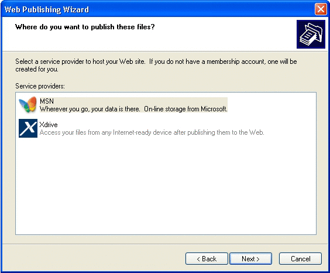

# Publishing Wizards Introduction

Windows XP introduces the Web Publishing Wizard and Online Print Ordering Wizard. Based on the same framework, these wizards provide the user with a simple mechanism for publishing content to a website or for ordering prints made from digital image files. The advantage of these wizards lies in their ability to host HTML content from different providers within their wizard pages so that the look, procedure, and available user options are fully controlled by the provider and may be altered by them at any time without affecting the client wizard that is hosting them. While these existing wizards have been created with digital imaging firmly in mind, the framework and concepts can be used for many other purposes such as a document printing service or as a method of sharing images with friends and family.

-   [How Does It Work?](#how-does-it-work)
-   [Publishing Wizard Documentation](#publishing-wizard-documentation)

## How Does It Work?

The user experience for the Web Publishing Wizard and Online Print Ordering Wizard is similar, but the entry point for each wizard differs. For the Web Publishing Wizard, a task titled **Publish this folder to the Web** is available from the **File and Folder Tasks** list to the left of most folder views. The text for the task varies based on selected content. For instance, if a file is selected, the task reads **Publish this file to the Web** as shown in the following example.

The user clicks the task to launch the wizard. Proceeding into the wizard, the user is presented with a list of providers as shown in the following example. Internet service providers (ISPs) can develop and register their own provider pages to be displayed in this list.

Once a provider is chosen, the wizard connects to that site and the first HTML page downloads for display in the wizard. If users do not have an account with the selected provider, they are given the opportunity to set one up.

Multiple HTML pages are contained within a single page in the wizard; in other words, the handle of the wizard page hosting that procession of HTML pages remains constant. The HTML pages are exposed in the center pane as with any standard wizard page. The provider site provides methods to control where the wizard's **Back**, **Next**, and **Cancel** buttons lead while the HTML pages are being displayed. Within those HTML pages, users might be asked to specify a folder where they can copy files or save the name of a website they wish to create. After a user has completed all the required steps, the site calls a method to begin the upload, returning control to the wizard. The wizard itself handles the upload and any attendant graphics such as a progress indicator. After the upload is completed, the provider site can specify a URL where the user can go once the wizard has been closed.

In the Online Print Ordering Wizard, the task **Order prints online** is seen only in picture folders such as My Pictures, shown in the following example. The process, however, is very similar to the Web Publishing Wizard. The provider site prompts users for options such as image selection, print sizes, number of copies, and payment information.

## Publishing Wizard Documentation

The Web Publishing Wizard and Online Print Ordering Wizard are discussed in detail in the following documents. Also discussed are instructions for developing applications to be hosted by them.

-   [Client-Side Design](pubwiz-client.md)
-   [Server-Side Design](pubwiz-server.md)
-   [Registering a Service](pubwiz-reg.md)
-   [Using the Transfer Manifest](pubwiz-manifest.md)
-   [Transfer Manifest Schema](/windows/desktop/shell/interfaces)

 

 