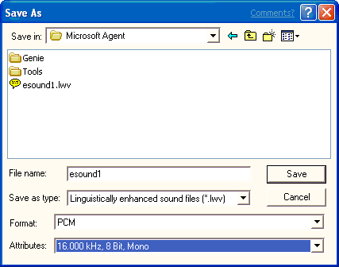

# Saving a Sound File

\[Microsoft Agent is deprecated as of Windows 7, and may be unavailable in subsequent versions of Windows.\]

When you are ready to save your sound file, choose the **Save** command on the **File** menu or on the editor's toolbar. The editor displays the **Save As** dialog box and proposes a name and default file type based on whether you generated linguistic information for the file. If you save the file as a sound file (.wav), the editor saves just the audio data. If you save the file information as a linguistically enhanced sound file (.lwv), the word and phoneme information are automatically included as part of a modified sound file. After you have confirmed or edited the name, location, file type, and format, choose the **Save** button.

If you want to save a sound file with a new name, different location, or different format, choose the **Save As** command on the **File** menu. When the **Save As** dialog box appears, type in the new filename and click the **Save** button.

You can also save a portion of the sound file. For example, you may want to save the file without excessive silence at its beginning or end. In the Audio Representation, select the portion of the file you want to save, and choose **Save Selection As** from the **File** menu. The command is enabled only when you have a selection in the **Audio Representation**.

 

 

