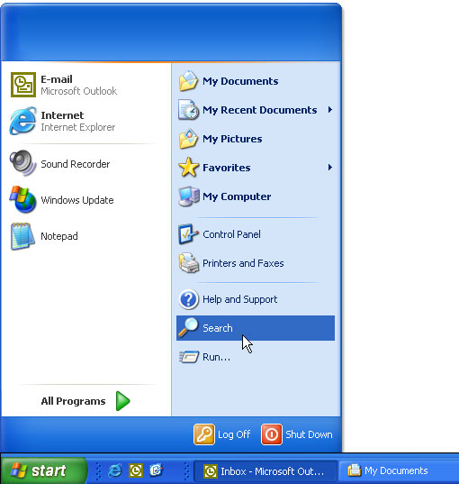
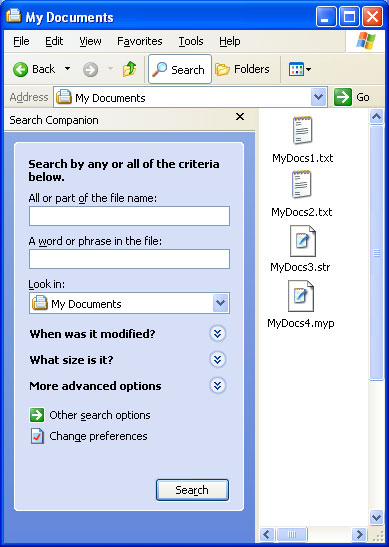

# Creating Search Handlers

\[This feature is supported only under Windows XP or earlier. Use Windows Search instead.\]

The Shell supports several search utilities that allow users to locate namespace objects such as files or printers. You can create a custom search engine and make it available to users by implementing and registering a *search handler*.

The general procedures for implementing and registering a Shell extension handler are discussed in [Creating Shell Extension Handlers](/windows/desktop/shell/handlers). This document focuses on those aspects of implementation that are specific to search handlers.

-   [How Search Handlers Work](#how-search-handlers-work)
-   [Registering Search Handlers](#registering-search-handlers)
    -   [Registering a Static Search Handler](#registering-a-static-search-handler)
    -   [Registering a Dynamic Search Handler](#registering-a-dynamic-search-handler)
-   [Implementing Search Handlers](#implementing-search-handlers)

## How Search Handlers Work

Users have two ways to select a search engine. The first way is from the Start menu. With systems earlier than Windows 2000, selecting the **Find** command on the **Start** menu displays a submenu of the available search engines. With Windows 2000 and later, the **St**art menu's **Find** command is renamed Search. The following illustration shows the **Search** button on a Windows XP system.



Users can also launch a search from Windows Explorer. On systems earlier than Windows 2000, they click the **Find** command on the **Tools** menu to display essentially the same menu as the one associated with the **Start** menu. However, Windows Explorer for Windows 2000 handles search engines in a very different way. Instead of handling search engines as a submenu of the **Tools** menu, there is now a **Search** button on the toolbar. Clicking this button opens the Explorer bar's **Search** pane. The following illustration shows the **Search For Files And Folders** search pane.



There are a number of differences in how Windows 2000 and earlier systems manage search handlers that affect both implementation and registration.


| Pre-Windows 2000                                                                                                                                                                                                       | Windows 2000 and later                                                                                                                                                                                                                                                                                            |
|------------------------------------------------------------------------------------------------------------------------------------------------------------------------------------------------------------------------|-------------------------------------------------------------------------------------------------------------------------------------------------------------------------------------------------------------------------------------------------------------------------------------------------------------------|
| Search handlers are implemented as a type of [shortcut menu handler](/windows/desktop/shell/context-menu-handlers).                                                                                                                     | Search handlers can be implemented as shortcut menu handlers, or as Dynamic HTML (DHTML) documents.                                                                                                                                                                                                               |
| Search handlers can be either static or dynamic. Static handlers are loaded only when they are selected by the user. Dynamic handlers are loaded by the Shell at startup and are not terminated until the Shell exits. | Handlers implemented as shortcut menu handlers can be either static or dynamic. Handlers implemented as DHTML documents must be static.                                                                                                                                                                           |
| Search handlers appear on the **Find** submenu of the **Start** menu and the **Find** submenu of the Windows Explorer **Tools** menu.                                                                                  | Search handlers appear only on the **Search** submenu of the **Start** menu. To make a custom search pane available through the Windows Explorer menu bar, you must implement it as a [band object](/previous-versions/windows/desktop/legacy/cc144099(v=vs.85)). It is then listed on the **Explorer Bar** submenu of the Windows Explorer **View** menu. |


 

## Registering Search Handlers

Search handlers are registered under the file types's **FindExtensions**subkey.

```
HKEY_LOCAL_MACHINE
   Software
      Microsoft
         Windows
            CurrentVersion
               Explorer
                  FindExtensions
```

From this point, the registration procedure depends on whether the handler is to be static or dynamic. For a general discussion of how to register Shell extension handlers, see [Creating Shell Extension Handlers](/windows/desktop/shell/handlers).

### Registering a Static Search Handler

Static search handlers are loaded only when they are launched by the user. This approach works best for DLLs that are small and can be loaded quickly. If you are using DHTML to implement your handler, it must be static. To register a static extension handler, create a subkey named for the handler under the **Static** subkey of the **FindExtensions** subkey. The name is not used by the system, but it must not be identical to other search handler names under the **FindExtensions** subkey.

### Shortcut menu-based search handlers

If your handler is implemented as a [shortcut menu handler](/windows/desktop/shell/context-menu-handlers), set the default value of the handler's name subkey to the object's class identifier (CLSID) GUID. Under the handler's name subkey, create a subkey named **0** (zero) and set its default value to the string that will be displayed in the **Search** or **Find** submenu. You can enable keyboard shortcuts in the usual way, by preceding the shortcut character with an ampersand (&). You can have an optional small icon displayed to the right of the menu text by creating a **DefaultIcon** subkey under the **0** subkey. Set its default value to a string containing the path of the file containing the icon, followed by a comma, followed by the icon's zero-based index.

The following example registers the **MySearchEngine** search handler. The menu text is "My Search Engine", with M specified as the shortcut key. The icon is in C:\\MyDir\\MySearch.dll, with an index of 2.

```
HKEY_LOCAL_MACHINE
   Software
      Microsoft
         Windows
            CurrentVersion
               Explorer
                  FindExtensions
                     Static
                        MySearchEngine
                           (Default) = {MySearchEngine CLSID GUID}
                           0
                              (Default) = &My Search Engine
                              DefaultIcon
                                 (Default) = c:\MyDir\MySearch.dll,2
```

### DHTML-based search handlers

With Windows 2000, you can also implement a search handler as a DHTML document. Its name is listed in the **Search** submenu of the **Start** menu. When the user selects it, it launches Windows Explorer with the Explorer bar opened to the search document. You can also specify a DHTML document to be displayed to the right of the Explorer bar. There is no way to launch a different handler from the default Search pane. Search engines can be launched directly from Windows Explorer, but only if they are implemented as as [band objects](/previous-versions/windows/desktop/legacy/cc144099(v=vs.85)).

To register a DHTML-based search handler, set the handler's name subkey to the string form of CLSID\_ShellSearchExt (currently {169A0691-8DF9-11d1-A1C4-00C04FD75D13}) and create the following subkeys.

1.  Create a **0**(zero) subkey under the handler name subkey and set its default value to the menu text.
2.  To have an icon displayed next to the menu text, create a **DefaultIcon** subkey under **0** and set its default value to the icon's path and index.
3.  Create a **SearchGUID** subkey under **0**. Assign a GUID to the DHTML document and set the default value of **SearchGUID** to its string form. This GUID does not need to be registered under **HKEY\_CLASSES\_ROOT\\CLSID**.
4.  Create a **Url** subkey under **SearchGUID**. Set its default value to the path of the HTML document that will appear in the Explorer bar.
5.  Create a **UrlNavNew** subkey under **SearchGUID**. Set its default value to the path of the HTML document that will appear to the right of the Explorer bar.

The following example registers the **MySearchEngine** search handler implemented as a DHTML document. The menu text is "My Search Engine", with M specified as the shortcut key. The icon is in C:\\MyDir\\MySearch.dll, with an index of 2. The Explorer bar's DHTML document is C:\\MyDir\\MySearch.htm, and the document that will be displayed to the right of the Explorer bar is C:\\MyDir\\MySearchPage.htm.

```
HKEY_LOCAL_MACHINE
   Software
      Microsoft
         Windows
            CurrentVersion
               Explorer
                  FindExtensions
                     Static
                        MySearchEngine
                           (Default) = {169A0691-8DF9-11d1-A1C4-00C04FD75D13}
                           0
                              (Default) = &My Search Engine
                              DefaultIcon
                                 (Default) = c:\MyDir\MySearch.dll,2
                                 SearchGUID
                                    (Default) = {My Search GUID}
                                    Url
                                       (Default) = C:\MyDir\MySearch.htm
                                    UrlNavNew
                                       (Default) = C:\MyDir\MySearchPage.htm
```

### Registering a Dynamic Search Handler

If your handler is implemented as a [shortcut menu handler](/windows/desktop/shell/context-menu-handlers), you can also register it as a dynamic handler. In that case, it will be loaded with the Shell and will terminate only when the Shell exits. Dynamic search handlers respond much more quickly than static handlers when they are launched by the user. This approach works best if your handler's DLL might take a long time to load, or if it is likely to be called frequently.

Dynamic search handlers are registered under the **FindExtensions** subkey.

```
HKEY_LOCAL_MACHINE
   Software
      Microsoft
         Windows
            CurrentVersion
               Explorer
                  FindExtensions
```

Create a subkey of **FindExtensions** named for the handler, and set its default value to the handler's CLSID GUID. Menu icons are not supported for dynamic search handlers. The following example registers MySearchEngine as a dynamic search handler.

```
HKEY_LOCAL_MACHINE
   Software
      Microsoft
         Windows
            CurrentVersion
               Explorer
                  FindExtensions
                     MySearchEngine
                        (Default) = {MySearchEngine CLSID GUID}
                        0
                           (Default) = &My Search Engine
```

Unlike static search handlers, you do not specify the menu text in the registry. When the handler is loaded, the Shell will call the handler's [**IContextMenu::QueryContextMenu**](/windows/desktop/api/shobjidl_core/nf-shobjidl_core-icontextmenu-querycontextmenu) method to add items to the **Find** or **Search** submenu.

## Implementing Search Handlers

Search handlers can be implemented as shortcut menu handlers for all versions of Windows. For Windows 2000, they can also be implemented as DHTML documents.

For a general discussion of how to implement shortcut menu handlers, see [Creating Context Menu Handlers](/windows/desktop/shell/context-menu-handlers). Search handlers differ from standard shortcut menu handlers in only a few ways.

For static menu handlers, the **Find** or **Search** submenu is created from the information in the registry. There is no need to have the handler add a menu item, as a normal shortcut menu handler would. The Shell manages static menu handlers in the following way.

-   When the user launches the handler's menu item, the Shell loads the handler's DLL and calls [**IContextMenu::InvokeCommand**](/windows/desktop/api/shobjidl_core/nf-shobjidl_core-icontextmenu-invokecommand) to notify the handler to launch the search engine. The [**IShellExtInit::Initialize**](/windows/desktop/api/shobjidl_core/nf-shobjidl_core-ishellextinit-initialize) and [**IContextMenu::QueryContextMenu**](/windows/desktop/api/shobjidl_core/nf-shobjidl_core-icontextmenu-querycontextmenu) methods are not called.
-   When [**IContextMenu::InvokeCommand**](/windows/desktop/api/shobjidl_core/nf-shobjidl_core-icontextmenu-invokecommand) is called, the **lpVerb** member of the [**CMINVOKECOMMANDINFO**](/windows/desktop/api/shobjidl_core/ns-shobjidl_core-cminvokecommandinfo) structure that is passed in identifies the command. The low-order word of **lpVerb** is set to the numerical equivalent of the command's subkey name. Since this subkey is normally named **0**, **lpVerb** is usually set to zero. The handler should then launch the search engine.

Dynamic search handlers are implemented in much the same way as normal shortcut menu handlers. The primary exception is that when [**IShellExtInit::Initialize**](/windows/desktop/api/shobjidl_core/nf-shobjidl_core-ishellextinit-initialize) is called, the *pidlFolder* and *lpdobj* arguments are set to **NULL**.

DHTML-based search handlers are implemented as a normal DHTML document. They can include any HTML, DHTML, or scripting technology that is supported by Windows Internet Explorer.

 

 