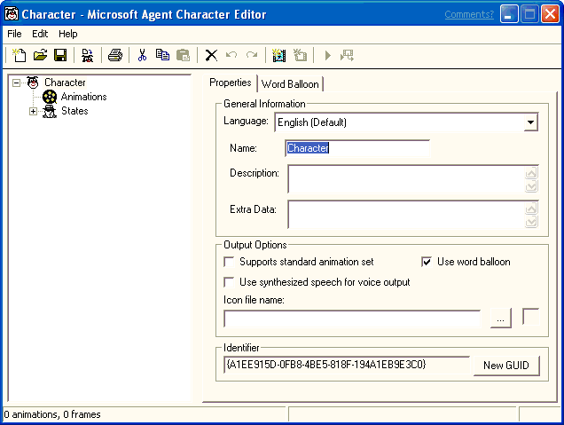

# Starting the Agent Character Editor

\[Microsoft Agent is deprecated as of Windows 7, and may be unavailable in subsequent versions of Windows.\]

To run the Agent Character Editor, choose the **Agent Character Editor** option from the Windows Taskbar's **Start** menu, or double-click the Microsoft **Agent Character Editor** icon on your desktop. The Editor's window will open, displaying its menus, a toolbar with frequently used commands, a tree listing the components that make up a character's definition, and a set of tabbed pages that change based on your selection in the component tree.

To access fields in the window from the keyboard, you can use the TAB key and SHIFT+TAB to navigate between controls, or use the access key (ALT+*underlined letter*) to move to a specific control. After the Editor completes starting up, you can begin creating a new character definition or load an existing character definition.

The status bar displays information about commands or toolbar buttons when you move the pointer over them. It also displays summary information about your character animation data and status information when you build a character.

 

 

