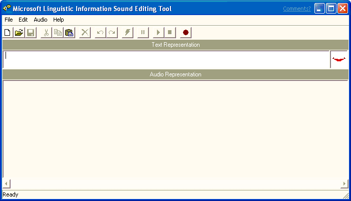

# Starting the Sound Editor

\[Microsoft Agent is deprecated as of Windows 7, and may be unavailable in subsequent versions of Windows.\]

To run the Microsoft Linguistic Information Sound Editing Tool, choose it from the **Start** menu or double-click the sound editor's icon. The sound editor's window will open, displaying its menus, a toolbar for frequently used commands, a text box for entering the words the editor uses to process the sound file, and a display area for viewing and editing the audio and linguistic data.

After the sound editor starts up, you can begin recording a new sound file or load an existing sound file.

 

 

