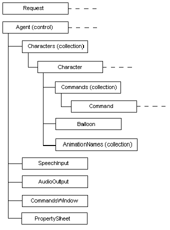

# The Agent Object Model

\[Microsoft Agent is deprecated as of Windows 7, and may be unavailable in subsequent versions of Windows.\]

The Microsoft Agent Object Model consists of the following objects:

-   Request
-   Agent (control)
-   Characters (collection)
-   Character
-   Commands (collection)
-   Command
-   Balloon
-   AnimationNames (collection)
-   SpeechInput
-   AudioOutput
-   CommandsWindow
-   PropertySheet

These objects are organized in the following hierarchy. (The dotted line following an object indicates that multiple objects can exist.)

 

 

