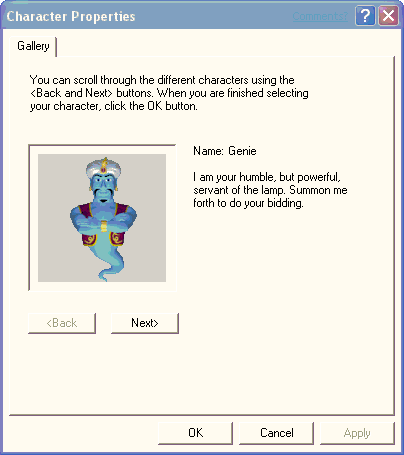

# The Default Character Properties Window

\[Microsoft Agent is deprecated as of Windows 7, and may be unavailable in subsequent versions of Windows.\]

In addition to enabling applications to load a specific character, applications can load a character that is a shared resource for the user, known as the *default character*. The default character is accessible from any application, but the character is only selectable by the user. To facilitate selection of this character, Agent provides a window that provides access to selecting this character, called the default character properties window. Access to this window is supported from the Agent API.

The default character properties window cannot be used to provide character selection other than for the default character.

 

 

