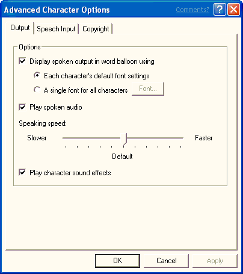

# The Output Page

\[Microsoft Agent is deprecated as of Windows 7, and may be unavailable in subsequent versions of Windows.\]

This page includes properties that control character output. For example, the user can determine whether to display output in the word balloon, determine how balloon output should appear, play spoken output as audio, play character sound effects, display the restart prompt, and adjust the speaking speed.

 

 

