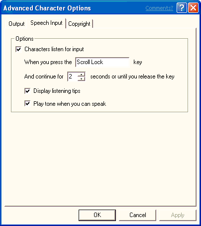

# The Speech Input Page

\[Microsoft Agent is deprecated as of Windows 7, and may be unavailable in subsequent versions of Windows.\]

A user can adjust speech input options on this property page. The user can disable speech input, set the listening input key, choose whether to display the Listening Tip window, and choose to play a MIDI tone to indicate when speech input is available.

 

 

