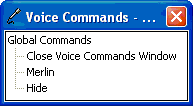

# The Voice Commands Window

\[Microsoft Agent is deprecated as of Windows 7, and may be unavailable in subsequent versions of Windows.\]

If a compatible speech engine is installed, Microsoft Agent supplies a special window called the **Voice Commands Window** that displays the commands that have been voice-enabled for speech recognition. The **Voice Commands Window** serves as a visual prompt for what can be spoken as input (commands cannot be selected with the mouse).

The window appears when a user selects the **Open Voice Commands Window** command, either by speaking the command or right-clicking the character and choosing the command from the character's pop-up menu. However, if the user disables speech input, the **Voice Commands Window** is not accessible.

The **Voice Commands Window** displays voice-enabled commands as a tree. If the current hosting application supplies voice commands, they appear expanded and at the top of the window. Entries also appear for other applications using the character. The window also includes the global voice commands supplied by Microsoft Agent. If the current hosting application has no voice commands, the global voice commands appear expanded and at the top of the window.

The user can size and move the **Voice Commands Window**. Microsoft Agent remembers the last location of the window and redisplays it at that location if the user closes and re-opens the window. If the entries in the window exceed the current display size of the window, scroll bars appear.

## Related topics

<dl> <dt>

[Voice Commands Window](voice-commands-window.md)
</dt> </dl>

 

 

