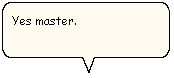

# The Word Balloon

\[Microsoft Agent is deprecated as of Windows 7, and may be unavailable in subsequent versions of Windows.\]

In addition to spoken audio output, the Microsoft Agent interface supports textual captioning in the form of text output in cartoon-style word balloons. Words appear in the balloon as they are spoken. The balloon hides when spoken output is completed. The Advanced Character Options window provides options to disable the balloon's display as well as control attributes related to its appearance.

 

 

