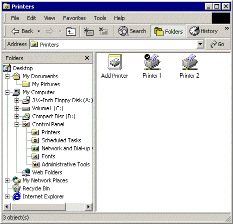
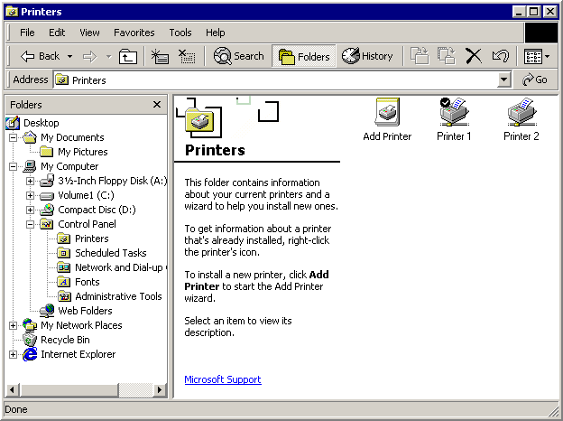

# Customizing a Folder's Web View

\[This feature is supported only under Windows XP or earlier. \]

A Web view is a powerful and flexible way to use the Windows Explorer to display information about the contents of a Shell folder.

-   [Introduction](#introduction)
-   [Using the Web View Template](#using-the-web-view-template)
    -   [The Template Body](#the-template-body)
    -   [The Template Head](#the-template-head)
-   [Summary](#summary)

## Introduction

Windows offers users two primary ways to view and navigate the Shell namespace. The most familiar of these, the Classic style, is similar to the familiar Windows File Manager. The right pane lists the contents of the currently selected folder in one of five formats: Large Icon, Small Icon, List, Details, and Thumbnail. The major difference from Windows File Manager is the left pane, which looks very similar to the Explorer bar of Windows Internet Explorer. It can be resized or removed, and it can display several panes in addition to the familiar file system tree, such as a search pane.

> [!Note]  
> The information in this document does not apply to Windows XP, the techniques discussed apply only to earlier versions of Windows.

 

The following illustration shows the Printers folder in Classic style.



The Classic style works reasonably well for normal file system folders and files. However, with the introduction of Windows 95, the file system has evolved into the namespace. The namespace allows the creation of *virtual folders*, such as Printers or Network Neighborhood, that can represent very different types of information than a normal file system folder.

The Web style, also known as a Web view, offers a more flexible and powerful way of presenting information than Classic style. In a Web view, the user basically views and navigates the namespace using Internet Explorer. The basic layout of a Web view is similar to Classic style. The Explorer bar is unchanged. However, the region that was occupied by the file list becomes a general-purpose display area that is effectively a webpage. A Web view is still used to display information about the contents of a folder, but there are few constraints on what information is displayed, or how. Each folder can have its own Web view, customized to suit its particular features.

The following illustration shows a Web view of the Printers folder (shown previously in Classic style).



Much like conventional webpages, Web views are controlled by an HTML-based template. Authoring a Web view template is nearly identical to authoring a webpage and provides the same degree of flexibility in content and layout of information. Web view templates can use Dynamic HTML (DHTML) and scripting to respond to events, such as a user clicking an item. They can also host objects that allow them to obtain and display information from the folder or its contents.

The user can choose a Web view by starting Windows Explorer, clicking **Folder Options** on the **View** menu, and selecting this option: **Enable Web content in folders**. However, the user can also start Internet Explorer and point the browser at the file system by clicking the **View** menu, pointing to **Explorer Bar**, and clicking **Folders**. In a Web view, there is virtually no difference between Internet Explorer and Windows Explorer.

On the left side of the right pane, the Printers Web view displays a banner with the folder's name and icon, followed by a block of information about the folder. The usual file list occupies the right side of the page.

When a user clicks an item, detailed information about the item appears in the information block. The Printers Web view actually displays much the same information that is available in Classic style, but it does so in a more usable format. However, a Web view is not simply a different way to display Classic style information. For example, a link to a useful website can be displayed below the information block, a feature that is not available in Classic style. If the user clicks the link, the site will be displayed.

The Printers Web view shown in the preceding illustration is similar to the Classic style, because the underlying Web view template (an .htt file) was written that way. The list of files, for instance, is not generated by the Web view template directly. It is created and displayed by a [**WebViewFolderContents**](webviewfoldercontents.md) object hosted by the Web view template. The object's methods and properties allow the Web view to control its layout and obtain information about particular items. The content and layout of the banner and information block is specified in the Web view template.

Because a Web view supports DHTML, the template can also be used to handle user interaction. For instance, when a user clicks one of the printer icons, the **WebViewFolderIcon** object fires a [**SelectionChanged**](/windows/desktop/shell/application-support-bumper) event. The template uses a DHTML event handler written in script to retrieve the requested information and display it in the information block.

This simple example for the Printers folder is by no means the only way to use a Web view. By writing your own template and, if necessary, objects, you can use a Web view to display information and interact with the user in whatever way you find most effective. Note that, at present, Web view templates only display system-defined virtual folders. Although developers can create a virtual folder by implementing a namespace extension, they must use the techniques described in [Namespace Extensions](/windows/desktop/shell/nse-works) to display it.

## Using the Web View Template

The way data is displayed in a Web view can be customized in a limited way by modifying a folder's Desktop.ini file. See [Customizing Folders with Desktop.ini](/windows/desktop/shell/how-to-customize-folders-with-desktop-ini) for details. A much more flexible and powerful way to customize a Web view is to create a custom Web view template.

The Web view template controls what is displayed in a Web view and how. It uses standard HTML, DHTML, and scripting techniques to obtain and display information and interact with the user. This section discusses how to create a Web view by examining a simple template—Generic.htt.


```
<html>
    <style>
    <!-- This section defines a variety of styles that can be used
     when displaying the document -->
        body        {font: 8pt/10pt verdana; margin: 0}
        #Banner     {position: absolute; width: 100%; height: 88px; background: URL(res://webvw.dll/folder.gif) no-repeat top left}
        #MiniBanner {position: absolute; width: 100%; height: 32px; background: window}
        #Icon       {position: absolute; left: 11px; top: 12px; width: 64px; height: 64px}
        #FileList   {position: absolute; left: 30%; top: 88px; width: 1px; height: 1px}
        #Info       {position: absolute; top: 88px; width: 30%; background: window; overflow: auto}
        p       {margin-left: 20px; margin-right: 8px}
        p.Title     {font: 16pt/16pt verdana; font-weight: bold; color: #0099FF}
        a:link      {color: #FF6633}
        a:visited   {color: #0099FF}
        a:active    {color: black}
    </style>

    <head>
        <!-- allow references to any resources you might add to the
         folder -->
        <base href="%THISDIRPATH%\">

        <script language="JavaScript">
        
        <!-- This section defines a number of JavaScript utilities -->
            var L_Intro_Text    = "This folder contains a variety of interesting stuff.<br><br>To get information about any of them, click the items icon.<br><br>";
            var L_Multiple_Text = " objects selected.";

            function FixSize() {
            // this function handles layout issues not covered by the style sheet

                var hideTop = 200;
                var hideLeft    = 400;
                var miniHeight  = 32;

                if (200 > document.body.clientHeight) {
                //A short window. Use the minibanner
                    document.all.Banner.style.visibility = "hidden";
                    document.all.MiniBanner.style.visibility = "visible";
                    document.all.FileList.style.top = 32;
                    document.all.Info.style.top = 32;
                }

                else {
                //A normal window. Use the normal banner
                    document.all.Banner.style.visibility = "visible";
                    document.all.MiniBanner.style.visibility = "hidden";
                    document.all.FileList.style.top = (document.all.Banner.offsetHeight - 32) + "px";
                    document.all.Info.style.top = (document.all.Banner.offsetHeight) + "px";
                    document.all.Rule.style.width = (document.body.clientWidth > 84 ? document.body.clientWidth - 84 : 0) + "px";     
                }
                if (400 > document.body.clientWidth) {
                //A narrow window. Hide the Info region and expand the file list region
                    document.all.Info.style.visibility = "hidden";
                    document.all.FileList.style.pixelLeft = 0;
                    document.all.FileList.style.pixelTop = document.all.Info.style.pixelTop;
                }

                else {
                //Normal width
                    document.all.Info.style.visibility = "visible";
                    document.all.FileList.style.pixelLeft = document.all.Info.style.pixelWidth;
                }
                document.all.FileList.style.pixelWidth = document.body.clientWidth - document.all.FileList.style.pixelLeft;
                document.all.FileList.style.pixelHeight = document.body.clientHeight - document.all.FileList.style.pixelTop;
                document.all.Info.style.pixelHeight = document.body.clientHeight - document.all.Info.style.pixelTop;
            }

            function Init() {
                /* Set the initial layout and have FixSize() called whenever the window is resized*/
                window.onresize = FixSize;
                FixSize();
                TextBlock.innerHTML = L_Intro_Text;
            }
        </script>

        <script language="JavaScript" for="FileList" event="SelectionChanged">
            // Updates the TextBlock region when an item is selected
            var data;
            var text;

            // name
            text = "<b>" + FileList.FocusedItem.Name + "</b>";

            // comment
            data = FileList.Folder.GetDetailsOf(FileList.FocusedItem, 3);
            if (data)
                text += "<br>" + data;

            // documents
            data = FileList.Folder.GetDetailsOf(FileList.FocusedItem, 1);
            if (data)
                text += "<br><br>" + FileList.Folder.GetDetailsOf(null, 1) + ": " + data;

            // status
            data = FileList.Folder.GetDetailsOf(FileList.FocusedItem, 2);
            if (data)
                text += "<br><br><b><font color=red>" + data + "</font></b>";

            // tip?
            data = FileList.Folder.GetDetailsOf(FileList.FocusedItem, -1);
            if (data != "" && data != FileList.FocusedItem.Name)
                text += "<br><br>" + data;

            TextBlock.innerHTML = text;
        </script>
    </head>
<!-- The body of the document controls the actual data display.
 It uses several scripting objects to communicate with the
 namespace folder, and calls on the JavaScript objects defined
 in the header to handle much of the processing -->
    <body scroll=no onload="Init()">

        <!-- The normal banner. This banner displays the folder
         name and icon at the top of the WebView pane. This banner
         is used if the WebView pane is sufficiently large to
         display the icon and still have room for some information -->
        <div id="Banner" style="visibility: hidden">
            <!-- Display the folder name using a table with nowrap
             to prevent word wrapping. Explorer will replace
              %THISDIRNAME% with the current folder name -->
            <table class="clsStd"><tr><td nowrap>
                <p class=Title style="margin-left: 104px; margin-top: 16px">
                %THISDIRNAME% 
            </td></tr></table>
            <!-- this is more efficient than a long graphic, but it has to be adjusted in FixSize() -->
            <hr id="Rule" size=1px color=black style="position: absolute; top: 44px; left: 84px">
            <!-- Load the WebViewFolderIcon object, which extracts the folder's icon -->
            <object id=Icon classid="clsid:e5df9d10-3b52-11d1-83e8-00a0c90dc849">
                <param name="scale" value=200>
            </object>
        </div>

        <!-- The mini banner. This banner is used when the
         WebView pane is too short to display the icon. Instead,
          it displays only the folder name -->
        <div id="MiniBanner" style="visibility: hidden">
            <!-- use a table with nowrap to prevent word wrapping -->
            <table class="clsStd"><tr><td nowrap>
                <p class=Title style="margin-left: 16px; margin-top: 4px">
                %THISDIRNAME%
            </td></tr></table>
        </div>

        <!-- The Info region. This displays the information
         associated with a folder or file. Javascript in the header
         is used to generate the regions contents by by assigning
         a text block to TextBlock.innerHTML -->
        <div id="Info">
            <p style="margin-top: 16px");
            <span id="TextBlock">
            </span>
        </div>
        <!-- end left info panel -->

        <!-- Load the WebViewFolderContents object. This object
         returns information on the contents of the folder that
          can be used in the information display.  -->
        <object id="FileList" border=0 tabindex=1 classid="clsid:1820FED0-473E-11D0-A96C-00C04FD705A2"
        </object>

    </body>
</html>
            
```


A simple way to create your own Web view template is to take Generic.htt and modify it. Because it is rather limited, you should also look at other, more complex examples for additional ideas. You can find them by searching your system for the .htt extension used by all Web view templates. If you want to create a custom template for a folder, you should start with the default Folder.htt template, which is usually stored in either C:\\Winnt\\Web or C:\\Windows\\Web. Note that these files are defined as hidden, so you may need to modify your Windows Explorer settings to view them. Once an .htt file is created, it should be marked as read-only and hidden.

Web view templates use the .htt extension because they differ slightly from conventional .htm documents. The main difference is several special variables in .htt files that the system replaces with the current namespace values. The %THISDIR% and %THISDIRPATH% variables represent the name and path of the currently selected folder. The %TEMPLATEDIR% variable represents the folder where the Web view style sheets are stored.

Like most HTML templates, .htt files have two basic parts: a body and a head. The template body controls the basic layout of the Web view and loads the objects used to communicate with the namespace and display information. The head contains scripts and functions that do tasks such as handling resizing and obtaining information from the folder. Most templates, including Generic.htt, also include a style sheet. In general, it is better to include the style sheet information in your template. Separate style sheets may not work properly when a Web view is used with remote namespaces.

### The Template Body

The body of the template specifies what will be presented by a Web view. It is also where the objects used to display information and communicate with namespace folders are loaded. The layout defined by Generic.htt is similar to that shown in the illustration in the previous section. There are three display regions: the banner and information block on the left side of the view, and the file list on the right.

The regions are all assigned identifiers to be used by the style sheet and DHTML. As discussed in the next section, there are two possible banners, with identifiers of "Banner" and "MiniBanner". The identifier of the information block's region is "Info". The file list object's identifier is "FileList". The details of the region's [layout](#controlling-the-web-view-layout) are handled by the style sheet and a Microsoft JScript function, [FixSize](#adjusting-the-layout-by-using-the-fixsize-function), which is discussed later in the chapter.

### The Banner Region

The banner is located at the top of the display, in the upper-left corner of the Web view. The normal banner displays the name and icon of the folder whose contents are displayed in the file list on the right. However, if the window becomes too short, there may be no room below the icon to display information. For this reason, Generic.htt also defines a minibanner that only displays the folder name. Both banners are initially defined as hidden. [FixSize](#adjusting-the-layout-by-using-the-fixsize-function) chooses which one to display and sets it to "visible".

The normal banner for Generic.htt is defined by:


```
<div id="Banner" style="visibility: hidden">
    <table class="clsStd"><tr><td nowrap>
    <p class=Title style="margin-left: 104px; margin-top: 16px">
        %THISDIRNAME% 
    </td></tr></table>
    <hr id="Rule" size=1px color=black style="position: absolute; top: 44px; left: 84px">
    <object id=Icon classid="clsid:e5df9d10-3b52-11d1-83e8-00a0c90dc849">
        <param name="scale" value=200>
    </object>
</div>
                    
```


The first part of the banner section displays the title with a horizontal rule underneath it. Table tags are used to control its position. The nowrap attribute is set for the <TD> tag to prevent word wrapping. The system will replace %THISDIRNAME% with the name of the current folder. A **WebViewFolderIcon** object, with an identifier of "Icon" for simplicity, is then loaded to extract and display the folder's icon.

The minibanner section is similar to the normal banner. The format of the title is placed slightly higher and does not have a rule. Because there is no icon, the **WebViewFolderIcon** object is not loaded.


```
<div id="MiniBanner" style="visibility: hidden">
    <table class="clsStd"><tr><td nowrap>
        <p class=Title style="margin-left: 16px; margin-top: 4px">
        %THISDIRNAME%
    </td></tr></table>
</div>
                    
```


### The Info Region

The portion of the Web view below the banner is used to present detailed information about the selected item. If no item is selected, a default message is shown. Because Generic.htt only displays a single block of text, this section is quite simple.


```
<div id="Info">
    <p style="margin-top: 16px");
        <span id="TextBlock">
        </span>
</div>
                    
```


Most of the work of collecting the information is handled by a [folder information script](#retrieving-and-displaying-folder-information) that is discussed later in the chapter. It displays the information by assigning the text to [TextBlock.innerHTML](https://msdn.microsoft.com/library/ms533897(VS.85).aspx).

You can easily customize the information display by modifying these elements or including additional ones. Anything that you can put on a webpage can be used. For example, to display a link to your website, you can add an anchor element after the text block in Generic.htt.


```
<div id="Info">
    <p style="margin-top: 16px");
        <span id="TextBlock">
        </span>
        <span>
        <p> Click on <a href="https://your.address"></a>
        </span>
</div>
                    
```


### The FileList Region

Finally, Generic.htt loads a [**WebViewFolderContents**](webviewfoldercontents.md) object for the FileList region. Because its identifier is set to "FileList", it will be referred to as the FileList object from now on.


```
<object id="FileList" border=0 tabindex=1 classid="clsid:1820FED0-473E-11D0-A96C-00C04FD705A2"
        </object>
                    
```


The FileList object is found in most Web views and serves several purposes. FileList displays the list of items contained by the selected folder with the same options and appearance as the file list in Classic style. When an item is selected, FileList notifies the Web view by firing a [SelectionChanged](#retrieving-and-displaying-folder-information) event. FileList also exposes methods and properties that can be used to retrieve information about individual items and control the position and size of its display area.

Although the FileList object is very useful, it only returns standard file system information, such as file size or attributes. To retrieve other kinds of information from a Shell folder, you will have to load and handle additional objects. Any object that can be hosted by a webpage can be used with a Web view.

### The Template Head

The head of the Web view template contains the scripts and functions that do most of the actual work. There are two essential tasks that need to be handled. One is the layout of the Web view display, which needs to be adjusted to accommodate different display regions. The other is retrieving and displaying information from the folder when an item is selected. As with style sheets, it is better to include all scripts and functions in the template instead of referencing them as separate files.

### Controlling the Web View Layout

The area available for a Web view depends on the size of the Web view window and how much of it is taken up by the Windows Explorer bar. This area will change anytime the window or Windows Explorer bar is resized. So the layout needs to be matched to the available area when a Web view is loaded and change appropriately when it is resized. Much of the layout is specified in the style sheet. The Info region, for example, is defined to occupy the leftmost 30 percent of the Web view.


```
#Info       {position: absolute; top: 88px; width: 30%; background: window;
    overflow: auto}
                    
```


As a Web view is resized, the width of the Info region will change to maintain that percentage. [FixSize](#adjusting-the-layout-by-using-the-fixsize-function) manages the layout issues that can't be handled by a style sheet.

### Loading and Initializing the Web View

When a Web view is loaded, the layout needs to be adjusted to fit the available display area. Because no item has been selected yet, Web views normally display some default information that applies to the whole folder. To handle initialization, the &lt;BODY&gt; tag for Generic.htt detects the [onload](/previous-versions//ms531409(v=vs.85)) event and calls the **Init** function.


```
<body scroll=no onload="Init">
                    
```


**Init** is a simple JScript function.


```
function Init() {
    window.onresize = FixSize;
    FixSize();
    TextBlock.innerHTML = L_Intro_Text;
}
                    
```


**Init** binds [FixSize](#adjusting-the-layout-by-using-the-fixsize-function) to the [window.onresize](https://msdn.microsoft.com/library/ms536959(VS.85).aspx) event so that it will be called whenever the Web view display area changes. It then runs FixSize to set the initial layout and assigns L\_Intro\_Text to the Info region. L\_Intro\_Text is a block of introductory text that is defined in the style sheet section.


```
var L_Intro_Text    = "This folder contains a variety of interesting stuff.<br>
<br>To get information about any of them, click the items icon.<br><br>";
                    
```


### Adjusting the Layout by using the FixSize function

The [FixSize](#adjusting-the-layout-by-using-the-fixsize-function) function is used to specify several aspects of the layout that can't be handled by the style sheet.

There are two possible banners that can be used, depending on the height of the Web view.


```
if (200 > document.body.clientHeight) {
    //A short window. Use the minibanner.
    document.all.Banner.style.visibility = "hidden";
    document.all.MiniBanner.style.visibility = "visible";
    document.all.FileList.style.top = 32;
    document.all.Info.style.top = 32;
}
else {
    //A normal window. Use the normal banner.
    document.all.Banner.style.visibility = "visible";
    document.all.MiniBanner.style.visibility = "hidden";
    document.all.FileList.style.top = (document.all.Banner.offsetHeight - 32) + "px";
    document.all.Info.style.top = (document.all.Banner.offsetHeight) + "px";
    document.all.Rule.style.width = (document.body.clientWidth > 84 ?                                    document.body.clientWidth - 84 : 0) + "px";      
}
                    
```


Generic.htt uses a height of 200 pixels as the dividing line between normal and minibanners. It sets the style of the selected banner to visible and the other to hidden. It also sets several layout properties for the Info and FileList regions so that they fit properly with the selected banner.

If a Web view becomes too narrow, [FixSize](#adjusting-the-layout-by-using-the-fixsize-function) uses the full width of the display area for the FileList display.


```
if (400 > document.body.clientWidth) {
    //A narrow window. Hide the Info region, and expand the file list region.
    document.all.Info.style.visibility = "hidden";
    document.all.FileList.style.pixelLeft = 0;
    document.all.FileList.style.pixelTop = document.all.Info.style.pixelTop;
}

else {
    //Normal width.
    document.all.Info.style.visibility = "visible";
    document.all.FileList.style.pixelLeft = document.all.Info.style.pixelWidth;
}
                    
```


Generic.htt uses 400 pixels as the dividing line between narrow and wide displays. If the Web view is too narrow, [FixSize](#adjusting-the-layout-by-using-the-fixsize-function) hides the Info region and modifies the FileList [pixelLeft](https://msdn.microsoft.com/library/ms534336(VS.85).aspx) property so that it fills the entire region below the banner.

The final few lines of [FixSize](#adjusting-the-layout-by-using-the-fixsize-function) adjust several layout properties based on the results of the preceding code. The width of the FileList region is adjusted so that it exactly fills the portion of the Web view not occupied by the Info region. The height of the Info region is sized to fit between the banner and the bottom of the Web view.


```
document.all.FileList.style.pixelWidth = document.body.clientWidth
    document.all.FileList.style.pixelLeft;
document.all.FileList.style.pixelHeight = document.body.clientHeight
    document.all.FileList.style.pixelTop;
document.all.Info.style.pixelHeight = document.body.clientHeight
    document.all.Info.style.pixelTop;
                    
```


### Retrieving and Displaying Folder Information

When a user selects an item, the FileList object fires a [SelectionChanged](#retrieving-and-displaying-folder-information) event. This event is handled by a JScript script. For simplicity, the script found in Generic.htt assumes that only one item can be selected at a time.


```
<script language="JavaScript" for="FileList" event="SelectionChanged">
    // Updates the TextBlock region when an item is selected.
    var data;
    var text;

    // Name
    text = "<b>" + FileList.FocusedItem.Name + "</b>";

    // Comment
    data = FileList.Folder.GetDetailsOf(FileList.FocusedItem, 3);
    if (data)
        text += "<br>" + data;

    // Documents
    data = FileList.Folder.GetDetailsOf(FileList.FocusedItem, 1);
    if (data)
        text += "<br><br>" + FileList.Folder.GetDetailsOf(null, 1) + ": " + data;

    // Status
    data = FileList.Folder.GetDetailsOf(FileList.FocusedItem, 2);
    if (data)
        text += "<br><br><b><font color=red>" + data + "</font></b>";

    // Tip 
    data = FileList.Folder.GetDetailsOf(FileList.FocusedItem, -1);
    if (data != "" && data != FileList.FocusedItem.Name)
        text += "<br><br>" + data;

    TextBlock.innerHTML = text;
</script>
                    
```


The script uses two FileList properties, [**FileList.FocusedItem**](/windows/desktop/shell/shellfolderview-focuseditem)and [**FileList.Folder**](/windows/desktop/shell/shellfolderview-folder) to obtain information about the item. **FileList.FocusedItem** identifies the selected item, with the item's name given by **FileList.FocusedItem.Name**. **FileList.Folder** is actually a pointer to a [**Folder**](../shell/folder.md) object. The Folder object's [**GetDetailsOf**](/windows/desktop/shell/folder-getdetailsof) method is used to retrieve the remaining information about the item.

All the information is concatenated into a single text string, separated by <BR> tags for readability. The text is then displayed by assigning it to [TextBlock.innerHTML](https://msdn.microsoft.com/library/ms533897(VS.85).aspx).

## Summary

This chapter outlines some of the techniques you can use to customize the way the Windows Explorer displays information about Shell folders. Creating a Desktop.ini file allows you to do some simple customization, such as displaying a custom icon in place of the standard folder icon. When a folder appears in a Web view, its layout and display are controlled by an HTML-based template that determines what information is displayed and how. You can exercise a high degree of control over a folder's Web view by using standard HTML, DHTML, and scripting techniques to create a custom template.

 

 
