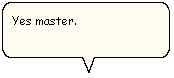

# Word Balloon Support

\[Microsoft Agent is deprecated as of Windows 7, and may be unavailable in subsequent versions of Windows.\]

Spoken output can also appear as textual output in the form of a cartoon word balloon. This can be used to supplement the spoken output of a character or as an alternative to audio output when you use the [**Speak**](speak-method.md) method.

You can also use a word balloon to communicate what a character is "thinking" using the [**Think**](think-method.md) method. This displays the text you supply in a still "thought" balloon. The **Think** method also differs from the [**Speak**](speak-method.md) method in that it produces no audio output.

Word balloons support only captioned communication from the character, not user input. Therefore, the word balloon does not support input controls. However, you can easily provide user input for a character, using interfaces from your programming language or the other input services provided by Microsoft Agent, such as the pop-up menu.

When you define a character, you can specify whether to include word balloon support. However, if you use a character that includes word balloon support, you cannot disable the support.

 

 

