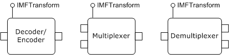
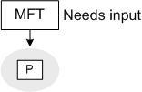
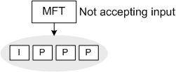

# About MFTs

Media Foundation transforms (MFTs) provide a generic model for processing media data. MFTs are used for decoders, encoders, and digital signal processors (DSPs). In short, anything that sits in the media pipeline between the media source and the media sink is an MFT.

For most applications, the details of MFT data processing are hidden by higher layers of the Media Foundation architecture. Many Media Foundation applications will never make a direct call to an MFT. However, it is certainly possible to host an MFT directly in your application.

MFTs are an evolution of the transform model first introduced with DirectX Media Objects (DMOs). In fact, it is relatively easy to create a transform that supports both models. Compared with DMOs, the required behaviors of MFTs are more clearly specified, which makes it easier to write a correct implementation. In addition, MFTs can support hardware-accelerated video processing.

This topic gives a brief overview of the MFT processing model, focusing on the overall design rather than specific method calls. For a more detailed, step-by-step description, see [Basic MFT Processing Model](basic-mft-processing-model.md).

## Streams

An MFT has input streams and output streams. Input streams receive data, and output streams produce data. For example, a decoder has one input stream, which receives the encoded data, and one output stream, which produces the decoded data.

The streams on an MFT are not represented as distinct COM objects. Instead, each stream has a designated stream identifier, and the methods in the [**IMFTransform**](/windows/desktop/api/mftransform/nn-mftransform-imftransform) interface take stream identifiers as input parameters.

Some MFTs have a fixed number of streams. For example, decoders and encoders normally have exactly one input and one output. Other MFTs have a dynamic number of streams. If an MFT supports dynamic streams, the client can add new input streams. The client cannot add output streams, but the MFT might add or remove output streams during processing. For example, multiplexers typically allow the client to add input streams and have one output for the multiplexed stream. Demultiplexers are the reverse, with one input but a dynamic number of output streams, depending on the contents of the input stream. The following illustration shows the difference between multiplexer and demultiplexer.

## Media Types

When an MFT is first created, none of the streams has an established format. Before the MFT can process data, the client must set the formats for the streams. For example, with a decoder, the input format is the compression format used in the original source file, and the output format is an uncompressed format, such as PCM audio or RGB video. The stream formats are described using [Media Types](media-types.md).

Depending on the internal state of the MFT, it might provide a list of possible media types for each stream. You can use this list as a hint when you set the media types. Setting the media type on one stream can change the list of possible types for a another stream. For example, a decoder typically cannot provide any output types until the client sets the input type. The input type contains the information that the decoder needs to return a list of possible output types.

To set the media type on a stream, call [**IMFTransform::SetInputType**](/windows/desktop/api/mftransform/nf-mftransform-imftransform-setinputtype) or [**IMFTransform::SetOutputType**](/windows/desktop/api/mftransform/nf-mftransform-imftransform-setoutputtype). To get the list of possible media types for a stream, call [**IMFTransform::GetInputAvailableType**](/windows/desktop/api/mftransform/nf-mftransform-imftransform-getinputavailabletype) or [**IMFTransform::GetOutputAvailableType**](/windows/desktop/api/mftransform/nf-mftransform-imftransform-getoutputavailabletype).

## Processing Data

After the client sets the media types on the streams, the MFT is ready to process data. To make this happen, the client alternates between providing input data to the MFT and getting output data from the MFT:

-   To give input data to the MFT, call [**IMFTransform::ProcessInput**](/windows/desktop/api/mftransform/nf-mftransform-imftransform-processinput).
-   To pull output data from the MFT, call [**IMFTransform::ProcessOutput**](/windows/desktop/api/mftransform/nf-mftransform-imftransform-processoutput).

The [**ProcessInput**](/windows/desktop/api/mftransform/nf-mftransform-imftransform-processinput) method takes a pointer to a media sample allocated by the client. The media sample contains one or more buffers, and each buffer contains input data for the MFT to process.

The [**ProcessOutput**](/windows/desktop/api/mftransform/nf-mftransform-imftransform-processoutput) method supports two different allocation models: Either the MFT allocates the output buffers, or the client allocates the output buffers. Some MFTs support both allocation models, but it is not required for an MFT to support both. For example, an MFT might require the client to allocate the output buffers. The [**IMFTransform::GetOutputStreamInfo**](/windows/desktop/api/mftransform/nf-mftransform-imftransform-getoutputstreaminfo) method returns information about an output stream, including which allocation model the MFT supports.

MFTs are designed to buffer as little data as possible, in order to minimize latency in the pipeline. Therefore, at any given time, the MFT can signal one of the following conditions:

-   The MFT requires more input data. In this state, the MFT cannot produce output until the client calls [**ProcessInput**](/windows/desktop/api/mftransform/nf-mftransform-imftransform-processinput) at least once.
-   The MFT will not accept any more input until the client calls [**ProcessOutput**](/windows/desktop/api/mftransform/nf-mftransform-imftransform-processoutput) at least once.

For example, suppose that you are using a video decoder to decode a video stream that contains a mix of key frames and delta frames. Initially, the MFT requires some input before it can decode any frames. The client calls [**ProcessInput**](/windows/desktop/api/mftransform/nf-mftransform-imftransform-processinput) to deliver the first frame. Suppose that the first frame is a delta frame (shown in the following diagram as 'P' for predicted frame). The decoder holds onto this frame, but it cannot produce any output until it gets the next key frame.

The client continues to call [**ProcessInput**](/windows/desktop/api/mftransform/nf-mftransform-imftransform-processinput) and eventually reaches the next key frame (shown in the next diagram as 'I' for intra-coded frame). Now the decoder has enough frames to start decoding. At this point it stops accepting input, and the client must call [**ProcessOutput**](/windows/desktop/api/mftransform/nf-mftransform-imftransform-processoutput) to get the decoded frames.

The simplest approach for the client is simply to alternate calls to [**ProcessInput**](/windows/desktop/api/mftransform/nf-mftransform-imftransform-processinput) and [**ProcessOutput**](/windows/desktop/api/mftransform/nf-mftransform-imftransform-processoutput). A more sophisticated algorithm is described in the topic [Basic MFT Processing Model](basic-mft-processing-model.md).

## Related topics

<dl> <dt>

[Media Foundation Transforms](media-foundation-transforms.md)
</dt> </dl>

 

 

