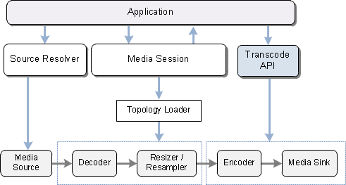

# About the Transcode API

The following diagram shows how the transcode API relates to the rest of the Media Foundation encoding pipeline.

The encoding pipeline contains the following data-processing objects:

-   Media source
-   Decoder
-   Video resizer or audio resampler
-   Encoder
-   Media sink

The video resizer is needed only if the size of the output video differs from the source. The audio resampler is needed only if the audio needs to be resampled before encoding. The decoder/encoder pair is required for transcoding, but not for remuxing.

The encoding *topology* is the set of pipeline objects (source, decoder, resizer, resampler, encoder, and media sink), plus the connection points between them. For more information about topologies, see [Topologies](topologies.md).

Different components are responsible for creating the various pipeline objects:

-   The application typically uses the [Source Resolver](source-resolver.md) to create the media source.
-   The [Media Session](media-session.md) loads and configures the decoder, video resizer, and audio resampler. Internally, it uses the topology loader to do this (see [**IMFTopoLoader**](/windows/desktop/api/mfidl/nn-mfidl-imftopoloader)).
-   The transcode API loads and configures the encoder and the media sink.

Advanced applications can configure the encoder and the media sink directly, rather than using the transcode API.

## Related topics

<dl> <dt>

[Transcode API](transcode-api.md)
</dt> <dt>

[Using the Transcode API](fast-transcode-objects.md)
</dt> </dl>

 

 

