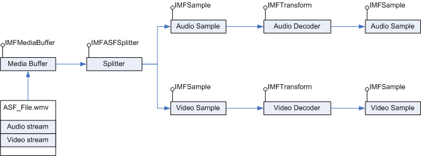

# ASF Splitter

The ASF *splitter* object is a WMContainer layer component that parses the ASF Data Object of an Advanced Systems Format (ASF) file. You can use the splitter to read the data packets in the Data Object and generate stream samples. For information about the structure of an ASF file, see [ASF File Structure](asf-file-structure.md).

The splitter exposes the [**IMFASFSplitter**](/windows/desktop/api/wmcontainer/nn-wmcontainer-imfasfsplitter) interface. The splitter parses ASF data packets for the selected streams and repackages them into individual sample objects that expose the [**IMFSample**](/windows/desktop/api/mfobjects/nn-mfobjects-imfsample) interface. The splitter is one of the platform-level components of Media Foundation. The ASF media source uses the splitter internally to parse ASF files.

The following diagram illustrates sample generation for an ASF file through the splitter.

This section contains the following topics:

| Topic                                                                                                                        | Description                                                             |
|------------------------------------------------------------------------------------------------------------------------------|-------------------------------------------------------------------------|
| [Creating the ASF Splitter Object](creating-the-asf-splitter-object.md)                                                     | How to create and initialize the splitter.                              |
| [Configuring the ASF Splitter Object](configuring-the-asf-splitter-object.md)                                               | Configuration settings for the splitter.                                |
| [Generating Stream Samples from an Existing ASF Data Object](generating-stream-samples-from-an-existing-asf-data-object.md) | How to parse the ASF Data Object and generate packetized steam samples. |

 

The following table shows the relevant Data Object attributes.

| Attribute                                                                                                    | Description                                                                                          |
|--------------------------------------------------------------------------------------------------------------|------------------------------------------------------------------------------------------------------|
| [**MF\_PD\_ASF\_FILEPROPERTIES\_PACKETS**](mf-pd-asf-fileproperties-packets-attribute.md)                   | Number of data packets in the ASF Data Object.                                                       |
| [**MF\_PD\_ASF\_FILEPROPERTIES\_MIN\_PACKET\_SIZE**](mf-pd-asf-fileproperties-min-packet-size-attribute.md) | Minimum size of the data packets in the file, in bytes.                                              |
| [**MF\_PD\_ASF\_FILEPROPERTIES\_MAX\_PACKET\_SIZE**](mf-pd-asf-fileproperties-max-packet-size-attribute.md) | Maximum size of the data packets in the file, in bytes                                               |
| [**MF\_PD\_ASF\_DATA\_LENGTH**](mf-pd-asf-data-length-attribute.md)                                         | Size of the ASF Data Object, in bytes.                                                               |
| [**MF\_PD\_ASF\_DATA\_START\_OFFSET**](mf-pd-asf-data-start-offset-attribute.md)                            | Offset, in bytes, to the first data packet in the ASF Data Object relative to the start of the file. |

 

## Related topics

<dl> <dt>

[WMContainer ASF Components](wmcontainer-asf-components.md)
</dt> <dt>

[Tutorial: Reading an ASF File](tutorial--reading-an-asf-file.md)
</dt> <dt>

[ASF Support in Media Foundation](asf-support-in-media-foundation.md)
</dt> </dl>

 

 

