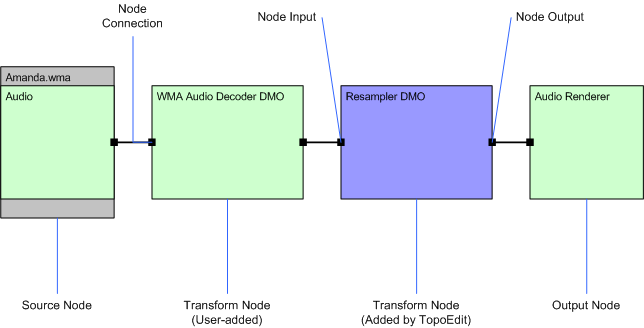

# Building Topologies by Using TopoEdit

A topology must have the following three nodes:

-   Source node: The streams from a media file, which are used as a source for the topology.
-   Transform node: A Media Foundation transform (MFT). These nodes are usually encoders, decoders, and effects for the topology.
-   Output node: The stream sink that passes the media data, video frames, or audio streams to the Media Session for playback.

For information about topology structure, see [About Topologies](about-topologies.md).

To build a topology, you must add the nodes, connect the nodes, and resolve the topology so that it can be played.

Topology nodes are displayed as boxes, with text showing the name of the node. Green boxes represent the nodes that are added by the user. When a topology is resolved, TopoEdit can add transform nodes to the topology automatically. These appear as blue boxes on the **Topology Pane**.

Topology inputs and outputs are represented by as black squares along the edge of the node. The *node input* is shown on the left side of the node, and the *node output* is on the right side of the node.

The topology nodes are connected through a *node connection* that appears as a black line connecting the node input of one node to the node output of another node.

The following illustration shows a connected topology for an audio source.

This section contains the following topics:

| Topic                                                                                          | Description                                                    |
|------------------------------------------------------------------------------------------------|----------------------------------------------------------------|
| [Adding Source Nodes with TopoEdit](adding-source-nodes-with-topoedit.md)                     | Describes the process of adding source nodes to a topology.    |
| [Adding Transform Nodes with TopoEdit](adding-transform-nodes-with-topoedit.md)               | Describes the process of adding transform nodes to a topology. |
| [Adding Output Nodes with TopoEdit](adding-output-nodes-with-topoedit.md)                     | Describes the process of adding output nodes to a topology.    |
| [Connecting and Disconnecting Topology Nodes](connecting-and-disconnecting-topology-nodes.md) | Describes the process of connecting two nodes.                 |
| [Resolving a Topology with TopoEdit](resolving-a-topology-with-topoedit.md)                   | Describes the process of topology resolution.                  |

 

## Related topics

<dl> <dt>

[TopoEdit](topoedit.md)
</dt> </dl>

 

 

